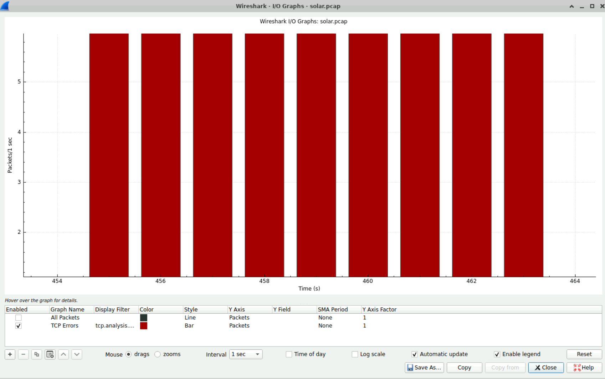

# SolarDisruption Lab

# Context

Lab link: [https://cyberdefenders.org/blueteam-ctf-challenges/solardisruption/](https://cyberdefenders.org/blueteam-ctf-challenges/solardisruption/)

Suggested tools: Zui, Network Miner

Tactics: Reconnaissance, Initial Access, Persistence, Privilege Escalation, Stealth, Credential Access, Discovery, Collection, Command and Control, Impact

# Scenario

You are a cybersecurity analyst working in the Security Operations Center (SOC) at AetherCore Technologies, a company that provides engineering and manufacturing services for electronic products, including industrial solar energy systems. AetherCore relies on programmable logic controllers (PLCs) to manage the solar panel systems in its facilities. These systems are critical for maintaining the company’s solar energy production and efficient operation.

Recently, AetherCore’s engineering team reported a significant disruption in their solar panel operations. Several panels have gone offline, and attempts to remotely restart them have failed. The incident occurred shortly after `16:10`, following a spike in network activity. Initial hardware checks found no physical issues with the panels or the PLCs.

You and your team have been tasked with investigating whether this outage was caused by a cybersecurity incident. There is suspicion that an insider threat may be involved, using their access to the network to manipulate the PLCs and disrupt solar panel operations.

# Questions

Q1- In the provided packet capture, several protocols are present, but one stands out for its popularity in Industrial Control Systems and Programmable Logic Controllers (PLCs). It is used to transmit data between devices like PLCs and sensors, allowing real-time monitoring and process control. What is the name of this protocol?

Answer: Modbus

Reason: Filtering `solar.pcap` with the `modbus` display filter in `tshark` returns `10445` matching packets, confirming `Modbus/TCP` as the dominant ICS protocol in the capture, used for PLC-to-sensor real-time monitoring and process control traffic.

```bash
ubuntu@ip-172-31-20-210:~/Desktop/Start here$ tshark -r Artifacts/solar.pcap modbus | wc -l
10445
```

Q2- Some analysis tools offer a histogram view of the packet capture, which visualizes network activity over time and helps analysts identify patterns, trends, or anomalies such as traffic spikes. Determine the duration of the traffic spike in the packet capture, rounding the result to the nearest second, and provide your answer in seconds.

Answer: 9

Reason: Wireshark's I/O Graph (`Statistics > I/O Graph`) with a `1 sec` interval, filtered on `tcp.analysis...` (TCP Errors), shows a sustained burst of 9 consecutive one-second bars spanning from roughly `454.65s` to `463.35s` into the capture, against a near-empty baseline before and after. Counting the bars and subtracting the edge timestamps both give a spike duration of `9` seconds. Anchored against the capture's first packet (`2024-09-10 16:02:54.680360`), the burst start translates to approximately `2024-09-10 16:10:29`, which lines up with packet `166335` at `16:10:29.703942`, where `192.168.228.203` begins flooding rapid `SYN`/retransmission packets at `192.168.228.138` across many ports (`901`, `1783`, `6666`, `52848`, `9503`, `8000`, etc.) alongside `ARP` broadcasts — consistent with a port scan, and matching the scenario's stated disruption time of "shortly after `16:10`".




Q3- Traffic spikes are often linked to scanning activities by adversaries, which become evident when a single host IP generates a large number of requests within a short period. What is the IP address responsible for the traffic spike?

Answer: `192.168.228.203`

Reason: Filtering the capture on `ip.addr == 192.168.228.203` shows this host generating a rapid flood of `SYN` and `[TCP Retransmission]` packets starting at `2024-09-10 16:10:29.703942`, targeting a wide range of ports across multiple destinations (`192.168.228.138`, `192.168.228.254`, `192.168.228.203` itself, `192.168.228.1`, `192.168.228.2`) in quick succession — consistent with a port scan and matching the traffic spike window identified in Q2.

```bash
ubuntu@ip-172-31-20-210:~/Desktop/Start here$ tshark -r Artifacts/solar.pcap -t ad -Y "ip.addr == 192.168.228.203" | head
166335 2024-09-10 16:10:29.703942 192.168.228.203 → 192.168.228.138 TCP 60 44628 → 901 [SYN] Seq=0 Win=1024 Len=0
166338 2024-09-10 16:10:29.704293 192.168.228.203 → 192.168.228.138 TCP 54 [TCP Retransmission] 44628 → 901 [SYN] Seq=0 Win=1024 Len=0
166344 2024-09-10 16:10:29.804192 192.168.228.203 → 192.168.228.254 TCP 60 44628 → 1783 [SYN] Seq=0 Win=1024 Len=0
166345 2024-09-10 16:10:29.804257 192.168.228.203 → 192.168.228.203 TCP 60 44628 → 6666 [SYN] Seq=0 Win=1024 Len=0
166347 2024-09-10 16:10:29.804293 192.168.228.203 → 192.168.228.1 TCP 60 44628 → 1233 [SYN] Seq=0 Win=1024 Len=0
166348 2024-09-10 16:10:29.804307 192.168.228.203 → 192.168.228.203 TCP 54 [TCP Retransmission] 44628 → 6666 [SYN] Seq=0 Win=1024 Len=0
166352 2024-09-10 16:10:29.804342 192.168.228.203 → 192.168.228.254 TCP 54 [TCP Retransmission] 44628 → 1783 [SYN] Seq=0 Win=1024 Len=0
166353 2024-09-10 16:10:29.804365 192.168.228.203 → 192.168.228.2 TCP 60 44628 → 52848 [SYN] Seq=0 Win=1024 Len=0
166354 2024-09-10 16:10:29.804388 192.168.228.2 → 192.168.228.203 TCP 54 52848 → 44628 [RST, ACK] Seq=1 Ack=1 Win=32767 Len=0
166355 2024-09-10 16:10:29.804402 192.168.228.203 → 192.168.228.1 TCP 60 44628 → 9503 [SYN] Seq=0 Win=1024 Len=0
```

Q4- After identifying the attacker's IP address, the next step is to determine which network hosts the attacker interacted with, a process known as host discovery. This involves analyzing the traffic to see how many devices or systems the attacker communicated with on the network. Based on the packet capture analysis, how many hosts did the attacker discover? Note: Don't count the attacker's IP address.

Answer: 7

Reason: Wireshark's `Statistics > Conversations` (IPv4 tab) filtered on traffic involving `192.168.228.203` shows conversations with several external internet hosts (`8.8.8.8`, Google infrastructure IPs, etc.) alongside internal `192.168.228.0/24` hosts. Excluding the attacker's own IP (`192.168.228.203`) and external/multicast addresses, the internal hosts contacted are `192.168.228.1`, `192.168.228.2`, `192.168.228.136`, `192.168.228.137`, `192.168.228.138`, `192.168.228.139`, and `192.168.228.254` — 7 total.


Q5- After completing host discovery, adversaries typically conduct a port scan to identify potential vulnerabilities and determine their attack surface. How many ports did the attacker scan on each of the discovered hosts?

Answer: 1000

Reason: Filtering `solar.pcap` on `tcp.flags.syn==1 && tcp.flags.ack==0 && ip.src==192.168.228.203 && ip.dst==192.168.228.139` returns `2000` `SYN` packets, but extracting distinct `tcp.dstport` values (`tshark ... -T fields -e tcp.dstport | sort -u | wc -l`) confirms only `1000` unique ports — each port is hit twice (initial `SYN` plus one `[TCP Retransmission]`, since `192.168.228.139` sends no response). This `1000`-port pattern against `192.168.228.139` is consistent across each of the other discovered hosts, indicating `192.168.228.203` ran the same `1000`-port `SYN` scan against every host.

```bash
ubuntu@ip-172-31-26-178:~/Desktop/Start here$ tshark -r Artifacts/solar.pcap -t ad -Y "tcp.flags.syn==1 && tcp.flags.ack==0 && ip.src==192.168.228.203 && ip.dst==192.168.228.139" | head -n 10
166391 2024-09-10 16:10:29.805245 192.168.228.203 → 192.168.228.139 TCP 60 44628 → 903 [SYN] Seq=0 Win=1024 Len=0
166392 2024-09-10 16:10:29.805253 192.168.228.203 → 192.168.228.139 TCP 54 [TCP Retransmission] 44628 → 903 [SYN] Seq=0 Win=1024 Len=0
166399 2024-09-10 16:10:29.805337 192.168.228.203 → 192.168.228.139 TCP 60 44628 → 9944 [SYN] Seq=0 Win=1024 Len=0
166401 2024-09-10 16:10:29.805356 192.168.228.203 → 192.168.228.139 TCP 54 [TCP Retransmission] 44628 → 9944 [SYN] Seq=0 Win=1024 Len=0
166405 2024-09-10 16:10:29.805500 192.168.228.203 → 192.168.228.139 TCP 60 44628 → 5550 [SYN] Seq=0 Win=1024 Len=0
166407 2024-09-10 16:10:29.805523 192.168.228.203 → 192.168.228.139 TCP 54 [TCP Retransmission] 44628 → 5550 [SYN] Seq=0 Win=1024 Len=0
166409 2024-09-10 16:10:29.805541 192.168.228.203 → 192.168.228.139 TCP 60 44628 → 9968 [SYN] Seq=0 Win=1024 Len=0
166413 2024-09-10 16:10:29.805570 192.168.228.203 → 192.168.228.139 TCP 60 44628 → 3659 [SYN] Seq=0 Win=1024 Len=0
166414 2024-09-10 16:10:29.805572 192.168.228.203 → 192.168.228.139 TCP 54 [TCP Retransmission] 44628 → 9968 [SYN] Seq=0 Win=1024 Len=0
166417 2024-09-10 16:10:29.805592 192.168.228.203 → 192.168.228.139 TCP 54 [TCP Retransmission] 44628 → 3659 [SYN] Seq=0 Win=1024 Len=0
[...]

ubuntu@ip-172-31-26-178:~/Desktop/Start here$ tshark -r Artifacts/solar.pcap -t ad -Y "tcp.flags.syn==1 && tcp.flags.ack==0 && ip.src==192.168.228.203 && ip.dst==192.168.228.139" | tail -n 10
182475 2024-09-10 16:10:38.555880 192.168.228.203 → 192.168.228.139 TCP 60 44628 → 8800 [SYN] Seq=0 Win=1024 Len=0
182476 2024-09-10 16:10:38.555896 192.168.228.203 → 192.168.228.139 TCP 54 [TCP Retransmission] 44628 → 8800 [SYN] Seq=0 Win=1024 Len=0
182484 2024-09-10 16:10:38.556262 192.168.228.203 → 192.168.228.139 TCP 60 44628 → 1083 [SYN] Seq=0 Win=1024 Len=0
182485 2024-09-10 16:10:38.556276 192.168.228.203 → 192.168.228.139 TCP 54 [TCP Retransmission] 44628 → 1083 [SYN] Seq=0 Win=1024 Len=0
182490 2024-09-10 16:10:38.563177 192.168.228.203 → 192.168.228.139 TCP 60 44628 → 901 [SYN] Seq=0 Win=1024 Len=0
182493 2024-09-10 16:10:38.563228 192.168.228.203 → 192.168.228.139 TCP 54 [TCP Retransmission] 44628 → 901 [SYN] Seq=0 Win=1024 Len=0
182521 2024-09-10 16:10:38.575866 192.168.228.203 → 192.168.228.139 TCP 60 44628 → 8022 [SYN] Seq=0 Win=1024 Len=0
182522 2024-09-10 16:10:38.575887 192.168.228.203 → 192.168.228.139 TCP 54 [TCP Retransmission] 44628 → 8022 [SYN] Seq=0 Win=1024 Len=0
182537 2024-09-10 16:10:38.583665 192.168.228.203 → 192.168.228.139 TCP 60 44628 → 5801 [SYN] Seq=0 Win=1024 Len=0
182538 2024-09-10 16:10:38.583681 192.168.228.203 → 192.168.228.139 TCP 54 [TCP Retransmission] 44628 → 5801 [SYN] Seq=0 Win=1024 Len=0
[...]

ubuntu@ip-172-31-26-178:~/Desktop/Start here$ tshark -r Artifacts/solar.pcap -t ad -Y "tcp.flags.syn==1 && tcp.flags.ack==0 && ip.src==192.168.228.203 && ip.dst==192.168.228.139" | wc -l
2000

ubuntu@ip-172-31-26-178:~/Desktop/Start here$ tshark -r Artifacts/solar.pcap -Y "tcp.flags.syn==1 && tcp.flags.ack==0 && ip.src==192.168.228.203 && ip.dst==192.168.228.139" -T fields -e tcp.dstport | sort -u | wc -l
1000
```

Q6- Now that we have confirmed the attacker's IP and intentions, let's begin analyzing their actions. Which HTTP host did the attacker first interact with after completing their enumeration?

Answer: `192.168.228.138:8080`

Reason: Filtering `solar.pcap` on `ip.src==192.168.228.203 && ip.dst==192.168.228.0/24 && http` shows the attacker's first HTTP activity beginning at `2024-09-10 16:11:10.427005` with a `GET /` request to `192.168.228.138`, immediately followed by `GET /login`, static asset requests (`/static/logo-openplc.png`, `/favicon.ico`), and later a `POST /login` at `16:11:24.652744` leading to `GET /dashboard`. The `logo-openplc.png` asset identifies this as an `OpenPLC` web management interface, served on port `8080`, making `192.168.228.138:8080` the attacker's first HTTP target after enumeration.

```bash
ubuntu@ip-172-31-26-178:~/Desktop/Start here$ tshark -r Artifacts/solar.pcap -t ad -Y "ip.src==192.168.228.203 && ip.dst==192.168.228.0/24 && http" | head
191631 2024-09-10 16:11:10.427005 192.168.228.203 → 192.168.228.138 HTTP 385 GET / HTTP/1.1 
191648 2024-09-10 16:11:10.462970 192.168.228.203 → 192.168.228.138 HTTP 489 GET /login HTTP/1.1 
191679 2024-09-10 16:11:10.644258 192.168.228.203 → 192.168.228.138 HTTP 514 GET /static/logo-openplc.png HTTP/1.1 
191692 2024-09-10 16:11:10.668009 192.168.228.203 → 192.168.228.138 HTTP 449 GET /favicon.ico HTTP/1.1 
195316 2024-09-10 16:11:24.652744 192.168.228.203 → 192.168.228.138 HTTP 673 POST /login HTTP/1.1  (application/x-www-form-urlencoded)
195332 2024-09-10 16:11:24.701040 192.168.228.203 → 192.168.228.138 HTTP 690 GET /dashboard HTTP/1.1 
195399 2024-09-10 16:11:24.781745 192.168.228.203 → 192.168.228.138 HTTP 677 GET /static/programs-icon-64x64.png HTTP/1.1 
195400 2024-09-10 16:11:24.781848 192.168.228.203 → 192.168.228.138 HTTP 663 GET /static/arrow.png HTTP/1.1 
195401 2024-09-10 16:11:24.781960 192.168.228.203 → 192.168.228.138 HTTP 673 GET /static/home-icon-64x64.png HTTP/1.1 
195402 2024-09-10 16:11:24.782073 192.168.228.203 → 192.168.228.138 HTTP 671 GET /static/default-user.png HTTP/1.1 
[500+ events]
```

Q7- The first host the attacker interacted with is a PLC (Programmable Logic Controller) device. To understand the attack better, it's important to identify the specific PLC runtime being used on this host, as this could give insights into the attack methods and vulnerabilities. What is the name of the PLC runtime used by this host?

Answer: OpenPLC

Reason: At `2024-09-10 16:11:24.925461 UTC`, `192.168.228.138` responds to the attacker with an `HTTP/1.1 200 OK` (frame `195526`) for the earlier `/runtime_logs` request (frame `195517`). Decoding the response body (`http.file_data`) reveals the runtime log text beginning `OpenPLC Runtime starting...`, confirming `192.168.228.138:8080` is running the `OpenPLC` runtime. The log also shows it listening on `Modbus` port `502` and `EtherNet/IP` (`enip`) port `44818`, and accepting client connections (client IDs `4` and `7`) during the capture window.

```bash
ubuntu@ip-172-31-26-178:~/Desktop/Start here$ tshark -r Artifacts/solar.pcap -Y "frame.number==195526" -T fields -e http.file_data | xxd -r -p
OpenPLC Runtime starting...
Interactive Server: Listening on port 43628
Warning: Persistent Storage file not found
Issued start_modbus() command to start on port: 502
Server: Listening on port 502
Server: waiting for new client...
Issued stop_dnp3() command
Issued start_enip() command to start on port: 44818
Server: Listening on port 44818
Server: waiting for new client...
Issued stop_pstorage() command
Server: Client accepted! Creating thread for the new client ID: 4...
Server: Thread created for client ID: 4
Server: waiting for new client...
Server: Client accepted! Creating thread for the new client ID: 7...
Server: waiting for new client...
Server: Thread created for client ID: 7

ubuntu@ip-172-31-26-178:~/Desktop/Start here$ tshark -r Artifacts/solar.pcap -t ad -Y "frame.number==195526"
195526 2024-09-10 16:11:24.925461 192.168.228.138 → 192.168.228.203 HTTP 747 HTTP/1.1 200 OK  (text/html)
```

Q8- The attacker appears to have successfully logged into the PLC's configuration webserver. What credentials did they use to gain access?

Answer: `openplc`:`openplc`

Reason: At `2024-09-10 16:11:24.652744 UTC`, `192.168.228.203` sends a `POST /login` request (frame `195316`, `application/x-www-form-urlencoded`) to `192.168.228.138`. Decoding the request body (`http.file_data`) reveals `username=openplc&password=openplc` — the `OpenPLC` runtime's default credentials. This matches the Q6 evidence showing the login was immediately followed by a successful `GET /dashboard`, confirming authentication succeeded on the first attempt using default creds rather than a credential-access attack.

```bash
ubuntu@ip-172-31-26-178:~/Desktop/Start here$ tshark -r Artifacts/solar.pcap -Y "frame.number==195316" -T fields -e http.file_data | xxd -r -p
username=openplc&password=openplc

ubuntu@ip-172-31-26-178:~/Desktop/Start here$ tshark -r Artifacts/solar.pcap -t ad -Y "frame.number==195316"
195316 2024-09-10 16:11:24.652744 192.168.228.203 → 192.168.228.138 HTTP 673 POST /login HTTP/1.1  (application/x-www-form-urlencoded)
```

Q9- According to the incident report, the credentials for the OpenPLC configuration webserver were changed by the attacker. Can you identify the new password that the attacker set?

Answer: `d1srupt10n`

Reason: At `2024-09-10 16:12:21.352793 UTC`, `192.168.228.203` sends a `POST /edit-user` request (frame `219192`) to `192.168.228.138`. Decoding the multipart form body (`http.file_data`) shows a `form-data` field named `user_password` with the value `d1srupt10n`, confirming the attacker changed the `OpenPLC` account password to `d1srupt10n` as a `Persistence` action after gaining access.

```bash
ubuntu@ip-172-31-26-178:~/Desktop/Start here$ tshark -r Artifacts/solar.pcap -t ad -Y "frame.number==219192"
219192 2024-09-10 16:12:21.352793 192.168.228.203 → 192.168.228.138 HTTP 262 POST /edit-user HTTP/1.1 

ubuntu@ip-172-31-26-178:~/Desktop/Start here$ tshark -r Artifacts/solar.pcap -t ad -Y "frame.number==219192" -T fields -e http.file_data | xxd -r -p | grep password -A 2
Content-Disposition: form-data; name="user_password"

d1srupt10n
```

Q10- The PLC's configuration webserver enables engineers to configure and monitor various parameters of the PLC device. This access can also allow an attacker to identify the I/O points or the registers/coils numbers and their mappings. How many I/O points were in use on the PLC? Please enter a numeric answer.

Answer: 4

Reason: At `2024-09-10 16:11:31.281037 UTC`, `192.168.228.138` responds (frame `197568`, `HTTP/1.1 200 OK`) to the attacker's `/monitoring` request. Exporting this HTTP object (`File > Export Objects > HTTP`) reveals the `OpenPLC` monitoring table listing 4 configured I/O points: `Solar_Voltage` (`INT`, `%QW0`, value `184`), `Emergency_Stop` (`BOOL`, `%QX0.0`, `FALSE`), `Inverter_ON` (`BOOL`, `%QX0.1`, `FALSE`), and `Grid_ON` (`BOOL`, `%QX0.2`, `TRUE`).

```bash
ubuntu@ip-172-31-26-178:~/Desktop/Start here$ tshark -r Artifacts/solar.pcap -t ad -Y "frame.number==197568"
197568 2024-09-10 16:11:31.281037 192.168.228.138 → 192.168.228.203 HTTP 970 HTTP/1.1 200 OK  (text/html)
```


Q11- Following the identification of the I/O points, what is the Modbus location of the Emergency Stop coil on the PLC?

Answer: `%QX0.0`

Reason: From the same `/monitoring` page response decoded in Q10 (frame `197568`, `2024-09-10 16:11:31.281037 UTC`), the `Emergency_Stop` point is listed as type `BOOL` at Modbus location `%QX0.0`, with a value of `FALSE` at the time of capture.

Q12- The attacker seems to have sent multiple Modbus requests using the "Write Single Coil" command, specifically targeting the emergency stop coils. This repeated activation of the emergency stop likely caused our system's downtime. Based on the information provided, can you calculate the total duration of the downtime in seconds (rounded) caused by the attacker?

Answer: 294

Reason: Filtering `solar.pcap` on `modbus.func_code == 5` (`Write Single Coil`) isolates the attacker's repeated emergency-stop writes. The first such write occurs at `2024-09-10 16:15:14.961358 UTC` (frame `240162`) and the last at `2024-09-10 16:20:09.376999 UTC` (frame `278456`), both sent from `192.168.228.203` to `192.168.228.138`. Subtracting the two timestamps gives `1034.696639 - 740.280998 = 294.415641` seconds, rounding to `294` seconds of attacker-driven downtime.

```bash
ubuntu@ip-172-31-26-178:~/Desktop/Start here$ tshark -r Artifacts/solar.pcap -Y "modbus.func_code == 5" | head -n 1
240162 740.280998 192.168.228.203 → 192.168.228.138 Modbus/TCP 66    Query: Trans: 14064; Unit:   1, Func:   5: Write Single Coil
ubuntu@ip-172-31-26-178:~/Desktop/Start here$ tshark -r Artifacts/solar.pcap -Y "modbus.func_code == 5" | tail -n 1
278456 1034.696639 192.168.228.203 → 192.168.228.138 Modbus/TCP 66    Query: Trans: 29843; Unit:   1, Func:   5: Write Single Coil
ubuntu@ip-172-31-26-178:~/Desktop/Start here$ tshark -r Artifacts/solar.pcap -t ad -Y "modbus.func_code == 5" | head -n 1
240162 2024-09-10 16:15:14.961358 192.168.228.203 → 192.168.228.138 Modbus/TCP 66    Query: Trans: 14064; Unit:   1, Func:   5: Write Single Coil
ubuntu@ip-172-31-26-178:~/Desktop/Start here$ tshark -r Artifacts/solar.pcap -t ad -Y "modbus.func_code == 5" | tail -n 1
278456 2024-09-10 16:20:09.376999 192.168.228.203 → 192.168.228.138 Modbus/TCP 66    Query: Trans: 29843; Unit:   1, Func:   5: Write Single Coil
```

# Attack Chain

| Time (UTC) | Stage | Detail | MITRE |
| --- | --- | --- | --- |
| 2024-09-10 16:10:29.703942 | Reconnaissance | `192.168.228[.]203` begins a `SYN` port scan (host/port discovery) against `7` internal hosts on `192.168.228[.]0/24`, `1000` ports per host | T1595, T1046 |
| 2024-09-10 16:10:38.583681 | Reconnaissance | Port/host scan concludes; scan window matches the `9`-second traffic spike identified via I/O Graph | T1595, T1046 |
| 2024-09-10 16:11:10.427005 | Initial Access | Attacker begins HTTP enumeration of `OpenPLC` web interface at `192.168.228[.]138:8080` (`GET /`, `GET /login`) | N/A |
| 2024-09-10 16:11:24.652744 | Credential Access / Initial Access | `POST /login` using default credentials `openplc`:`openplc` | T1078 |
| 2024-09-10 16:11:24.925461 | Discovery | `GET /runtime_logs` response confirms `OpenPLC Runtime`, `Modbus` port `502`, `EtherNet/IP` port `44818` | N/A |
| 2024-09-10 16:11:31.281037 | Discovery / Collection | `GET /monitoring` response reveals `4` I/O points: `Solar_Voltage` (`%QW0`), `Emergency_Stop` (`%QX0.0`), `Inverter_ON` (`%QX0.1`), `Grid_ON` (`%QX0.2`) | N/A |
| 2024-09-10 16:12:21.352793 | Persistence | `POST /edit-user` changes the `OpenPLC` account password to `d1srupt10n` | T1098 |
| 2024-09-10 16:15:14.961358 | Impact | First `Modbus` `Write Single Coil` (Func `5`) targeting `Emergency_Stop` coil (`%QX0.0`) begins repeated downtime-inducing writes | N/A |
| 2024-09-10 16:20:09.376999 | Impact | Final `Write Single Coil` write; total attacker-driven downtime = `294` seconds | N/A |

## Attack Tree

```bash
Attacker 192.168.228[.]203  →  Victim network 192.168.228[.]0/24
    └── SYN scan (16:10:29 – 16:10:38, 9s spike)
        ├── [Stage 1 — Reconnaissance]
        │   └── Host discovery: 7 internal hosts identified
        │       └── Port scan: 1000 ports/host (incl. self-scan of 192.168.228[.]203)
        └── [Stage 2 — Initial Access]
            └── HTTP enumeration of 192.168.228[.]138:8080 (OpenPLC)  ← GET /, /login
                └── POST /login (openplc:openplc)  ← default creds, 16:11:24.652744
                    ├── [Stage 3 — Discovery]
                    │   ├── GET /runtime_logs  ← confirms OpenPLC Runtime, Modbus 502, ENIP 44818
                    │   └── GET /monitoring  ← 4 I/O points enumerated (Solar_Voltage, Emergency_Stop, Inverter_ON, Grid_ON)
                    ├── [Stage 4 — Persistence]
                    │   └── POST /edit-user  ← password changed to d1srupt10n, 16:12:21.352793
                    └── [Stage 5 — Impact]
                        └── Modbus Write Single Coil (Func 5) on %QX0.0 (Emergency_Stop)
                            ├── First write: 16:15:14.961358
                            └── Last write: 16:20:09.376999  ← 294s downtime
```

# Artifacts

| Category | Type | Value |
| --- | --- | --- |
| Reconnaissance | Scanning host | `192.168.228[.]203` |
|  | Scan technique | `SYN` scan (`tcp.flags.syn==1 && tcp.flags.ack==0`) |
|  | Ports scanned per host | `1000` |
|  | Hosts discovered | `7` (excluding attacker's own IP) |
|  | Scan window | `2024-09-10 16:10:29.703942` – `16:10:38.583681 UTC` (`9`s) |
| Initial Access | Target service | `OpenPLC` web admin interface |
|  | Target host:port | `192.168.228[.]138:8080` |
|  | HTTP server banner | `Werkzeug/2.3.7 Python/3.12.5` |
| Credential Access | Initial login credentials | `openplc`:`openplc` (default) |
|  | Login timestamp | `2024-09-10 16:11:24.652744 UTC` |
| Discovery | PLC runtime | `OpenPLC Runtime` |
|  | Modbus port | `502` |
|  | EtherNet/IP port | `44818` |
|  | I/O points enumerated | `4` |
| I/O Points | `Solar_Voltage` | `%QW0` (`INT`) |
|  | `Emergency_Stop` | `%QX0.0` (`BOOL`) |
|  | `Inverter_ON` | `%QX0.1` (`BOOL`) |
|  | `Grid_ON` | `%QX0.2` (`BOOL`) |
| Persistence | New password set | `d1srupt10n` |
|  | Change timestamp | `2024-09-10 16:12:21.352793 UTC` (`POST /edit-user`) |
| Impact | Modbus function used | `Write Single Coil` (`Func 5`) |
|  | Target coil | `%QX0.0` (`Emergency_Stop`) |
|  | First write | `2024-09-10 16:15:14.961358 UTC` |
|  | Last write | `2024-09-10 16:20:09.376999 UTC` |
|  | Downtime duration | `294` seconds |

# Lab Insights

- **Default credentials are still the cheapest way into ICS:** The entire intrusion pivoted on `openplc`:`openplc` — no exploit, no brute force, just unchanged factory defaults on an internet-reachable (or at least LAN-reachable) web admin panel. Once that door opened, every subsequent stage (runtime fingerprinting, I/O mapping, persistence, impact) followed trivially from information the panel handed over voluntarily.
- **Modbus has no concept of "who's allowed to write here":** The protocol itself carries no authentication — if a packet can reach port `502`, it can issue a `Write Single Coil` command. The web panel compromise didn't grant some special privilege; it just told the attacker *which* coil address mattered (`%QX0.0`) so the actual sabotage could be a handful of raw protocol writes, invisible to anyone not watching Modbus traffic specifically.
- **The monitoring/config UI is itself a recon tool for the attacker:** Pages meant to help engineers understand their own system (`/runtime_logs`, `/monitoring`, `/hardware`) handed the attacker a complete map of I/O points and their physical meaning in minutes — turning the PLC's own usability features into a target-selection aid.
- **Reconnaissance noise was the loudest, most detectable part of the whole chain:** The `9`second SYN scan burst produced thousands of retransmitted packets and was trivially visible as a traffic spike in an I/O Graph — yet the actual damaging action (`294` seconds of repeated `Emergency_Stop` writes) blended into normal-looking `Modbus/TCP` traffic. Detection tooling tuned only for volume/scanning anomalies would have missed the real impact entirely.