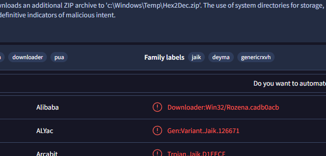

# Sysinternals Lab

# Context

Lab link: [https://cyberdefenders.org/blueteam-ctf-challenges/sysinternals/](https://cyberdefenders.org/blueteam-ctf-challenges/sysinternals/)

Suggested tools: Registry Explorer, Event Log Explorer, AppCompatCachParser, VirusTotal, Web Cache View, FTK Imager, Autopsy

Tactics: Execution, Command and Control, Impact

# Scenario

A user thought they were downloading the SysInternals tool suite and attempted to open it, but the tools did not launch and became inaccessible. Since then, the user has observed that their system has gradually slowed down and become less responsive.

# Questions

Q1- What was the malicious executable file name that the user downloaded?

Answer: `SysInternals.exe`

Reason: Analysis of the forensic image `SysInternals.E01` began by mounting it with `ewfmount` on the Kali Linux analysis workstation to expose the underlying raw disk data, since Arsenal Image Mounter was unavailable outside Windows. Running `fdisk` and `mmls` against the resulting raw volume returned no valid partition table. Inspection with `file -s` showed the image was not a full disk capture but a single bootable NTFS volume containing the Windows Boot Manager. The volume was then mounted read-only with `ntfs-3g` using the `show_sys_files` option to expose hidden NTFS system metadata.

Timeline enumeration with The Sleuth Kit's `fls` against `Users\Public\Downloads` identified a deleted executable, `SysInternals.exe`. `icat` recovered its content directly from the corresponding Master File Table (MFT) entry. This file is the one the user downloaded believing it was the legitimate Sysinternals utility suite. Its deleted status, combined with the reported symptoms (the tools failing to launch followed by gradual system slowdown), is consistent with execution of a malicious payload rather than installation of legitimate software.

```python
# Acquisition/Mounting:
ewfmount SysInternals.E01 /mnt/sysinternals
fdisk -l /mnt/sysinternals/ewf1        # no valid partition table found
mmls /mnt/sysinternals/ewf1            # exit code 1, no partition table
file -s /mnt/sysinternals/ewf1         # identified as bare NTFS volume w/ BOOTMGR
ntfs-3g -o ro,show_sys_files /mnt/sysinternals/ewf1 /mnt/lab_mounted

# Artifact Discovery:
fls -r -d /mnt/lab_raw/ewf1 | grep -i "Public/Downloads"
-> Users/Public/Downloads/SysInternals.exe (deleted, MFT entry 124567-128-4)

Extraction:
icat -r /mnt/lab_raw/ewf1 124567 > SysInternals.exe
```

Q2- When was the last time the malicious executable file was modified?

Answer: `2022-11-15 21:18`

Reason: Re-examination of the malicious executable's Master File Table (MFT) record using `istat` with an explicit UTC timezone flag confirmed a `$STANDARD_INFORMATION` file modification timestamp of `2022-11-15 21:18:51 UTC`, matching the corresponding `$FILE_NAME` attribute value and indicating no evidence of timestomping at this layer. This timestamp establishes the true last-modified time of `SysInternals.exe`, correcting an earlier misreading caused by the tool's default use of the local analysis workstation's timezone (EST) rather than UTC. It now provides a reliable baseline for correlating subsequent execution and persistence artifacts in the infection timeline.

```bash
$ istat -z UTC /mnt/lab_raw/ewf1 124567

MFT Entry Header Values:
Entry: 124567        Sequence: 5
$LogFile Sequence Number: 487525725
Not Allocated File
Links: 2

$STANDARD_INFORMATION Attribute Values:
Flags: Archive
Owner ID: 0
Security ID: 2229  (S-1-5-21-321011808-3761883066-353627080-1000)
Last User Journal Update Sequence Number: 91987456
Created:        2022-11-15 21:18:51.355118100 (UTC)
File Modified:  2022-11-15 21:18:51.652034500 (UTC)
MFT Modified:   2022-11-15 21:19:00.245811000 (UTC)
Accessed:       2022-11-15 21:19:00.245811000 (UTC)
<SNIP>
```

Q3- What is the SHA1 hash value of the malware?

Answer: `fa1002b02fc5551e075ec44bb4ff9cc13d563dcf`

Reason: Analysis of the Amcache hive (`Windows\AppCompat\Programs\Amcache.hve`) extracted from the disk image identified an inventory record corresponding to `c:\users\public\downloads\sysinternals.exe`, recovered via raw 16-bit Unicode Transformation Format, Little Endian (UTF-16LE) string extraction due to the unavailability of a native Amcache parser on the analysis system. The record contained a hash value stored in Amcache's standard `0000`-prefixed format, which when stripped of that prefix yielded a valid 40-character SHA1 hash of `fa1002b02fc5551e075ec44bb4ff9cc13d563dcf`. Windows records this hash independently of the file's current on-disk state, providing a reliable identifier for the malicious executable suitable for threat intelligence correlation (for example, a VirusTotal lookup) regardless of any post-deletion degradation to the recovered file copy.

```bash
$ strings -el ./Windows/appcompat/Programs/Amcache.hve | grep -i -A 5 -B 5 "SysInternals"

2.0.0.1
10.0.17763.1
pe32_i386
0006d7bfadc0b7889d7c68a8542f389becce00000904
0000fa1002b02fc5551e075ec44bb4ff9cc13d563dcf
c:\users\public\downloads\sysinternals.exe
sysinternals.exe|1a80e611058c98e5
SysInternals.exe
sysinternals, inc.
sysinternals suite downloader
```

Q4- Based on the Alibaba vendor, what is the malware's family?

Answer: `Rozena`

Reason: Submission of the extracted SHA1 hash (`fa1002b02fc5551e075ec44bb4ff9cc13d563dcf`) to VirusTotal returned a multi-vendor detection result, with the Alibaba engine classifying the sample as `Downloader:Win32/Rozena.cadb0acb`. This identifies the malware family as `Rozena`, a known downloader family, confirming that the file masquerading as the SysInternals suite functioned as a first-stage downloader rather than the final payload, consistent with the user's observation that the tools failed to launch while the system subsequently exhibited degraded performance from follow-on activity.



Q5- What is the first mapped domain's Fully Qualified Domain Name (FQDN)?

Answer: `www[.]malware430[.]com`

Reason: Review of VirusTotal's "Contacted Domains" tab for the submitted sample (`fa1002b02fc5551e075ec44bb4ff9cc13d563dcf`) identified the first mapped domain as `www[.]malware430[.]com`. This domain represents infrastructure the Rozena downloader is known to communicate with, consistent with its role as a downloader retrieving a secondary payload following initial execution, and provides a network-based indicator that can be correlated against DNS or proxy logs from the affected host to establish when outbound communication began.

Q6- The mapped domain is linked to an IP address. What is that IP address?

Answer: `192.168.15.10`

Reason: Examination of the PowerShell console history at `Users\IEUser\AppData\Roaming\Microsoft\Windows\PowerShell\PSReadLine\ConsoleHost_history.txt` revealed a command appending an entry to the local hosts file (`%windir%\System32\drivers\etc\hosts`) that mapped the domain `www[.]malware430[.]com` to IP address `192.168.15.10`, confirming this as the IP address associated with the malicious domain identified via VirusTotal.

```bash
$ cat ./Users/IEUser/AppData/Roaming/Microsoft/Windows/PowerShell/PSReadLine/ConsoleHost_history.txt 
Add-MpPreference -ExclusionPath 'C:'
Set-MpPreference -DisableRealtimeMonitoring $true
New-Item -Path HKLM:\SOFTWARE\Policies\Microsoft\Windows -Name WindowsUpdate -Force
New-Item -Path HKLM:\SOFTWARE\Policies\Microsoft\Windows\WindowsUpdate -Name AU -Force
New-ItemProperty -Path HKLM:\SOFTWARE\Policies\Microsoft\Windows\WindowsUpdate\AU -Name NoAutoUpdate -PropertyType DWord -Value 1 -Force
Add-Content -Path $env:windir\System32\drivers\etc\hosts -Value "`n192.168.15.10`twww.malware430.com" -Force
Add-Content -Path $env:windir\System32\drivers\etc\hosts -Value "`n192.168.15.10`twww.sysinternals.com" -Force
```

Q7- What is the name of the executable dropped by the first-stage executable?

Answer: `vmtoolsIO.exe`

Reason: Analysis of the VirusTotal behavioral report ("Process and service actions") for the submitted sample showed that execution of `SysInternals.exe` from the Temp directory spawned a child process invoking `cmd.exe` to install and start a service referencing `c:\Windows\vmtoolsIO.exe`. This confirms `vmtoolsIO.exe` as the executable dropped by the first-stage malware, staged to masquerade as a legitimate VMware Tools component and registered as an auto-starting service for persistence.

Q8- What is the name of the service installed by 2nd-stage executable?

Answer: `VMwareIOHelperService` 

Reason: The same VirusTotal behavioral report showing the second-stage executable's installation command revealed that `vmtoolsIO.exe` registered itself as a Windows service named `VMwareIOHelperService`, subsequently started via `net start` and configured for automatic startup via `sc config ... start= auto`. This service name, closely mimicking legitimate VMware Tools naming conventions, functioned as the malware's persistence mechanism, ensuring the dropped executable would relaunch automatically on system boot without requiring further user interaction.

# Lab Insights

- Legitimate tool names are the perfect camouflage. The initial dropper impersonated the SysInternals suite, and its persistence mechanism registered itself as VMwareIOHelperService, deliberately blending into naming conventions an analyst or admin would expect to see on a legitimate system. This lab reinforces that filename and service-name trust should never substitute for hash or behavioral verification, especially on systems where virtualization tooling is already expected to be present.
- Deleted evidence rarely means destroyed evidence. The malicious executable was deleted from disk before acquisition, yet its content, MFT metadata, and execution history were fully reconstructable through NTFS internals (MFT entries, $STANDARD_INFORMATION/$FILE_NAME timestamps) and Amcache, which independently retains a SHA1 hash tied to first execution. This illustrates why file deletion alone is a weak anti-forensic measure against an analyst who understands filesystem and execution-artifact layers.
- Local DNS manipulation is a low-noise C2 technique. Rather than relying on external DNS resolution (which could be logged, sinkholed, or blocked), the actor hardcoded the malicious domain-to-IP mapping directly into the hosts file, and even hijacked the legitimate [sysinternals.com](http://sysinternals.com/) domain locally. This kind of host-level tampering is invisible to network-layer DNS monitoring and underscores the value of checking hosts file integrity early in any intrusion involving suspicious outbound traffic.
- Defense evasion often precedes the "real" payload, not follows it. The Defender exclusion, real-time monitoring disable, and Windows Update suppression were all staged via PowerShell before the second-stage service was fully operational. This ordering is a recurring pattern worth recognizing: evasion setup is frequently a leading indicator that more impactful activity (persistence, C2, or impact) is about to occur, not a cleanup step done afterward.
- Timezone assumptions are a silent source of wrong answers. The istat timestamp initially appeared correct but was off by exactly the UTC offset because Sleuth Kit displays timestamps in the analysis system's local timezone by default, not the timezone the data was originally created in. Any timestamp pulled from a forensic tool should be timezone-verified before it's treated as ground truth, since NTFS itself always stores timestamps in UTC regardless of display.