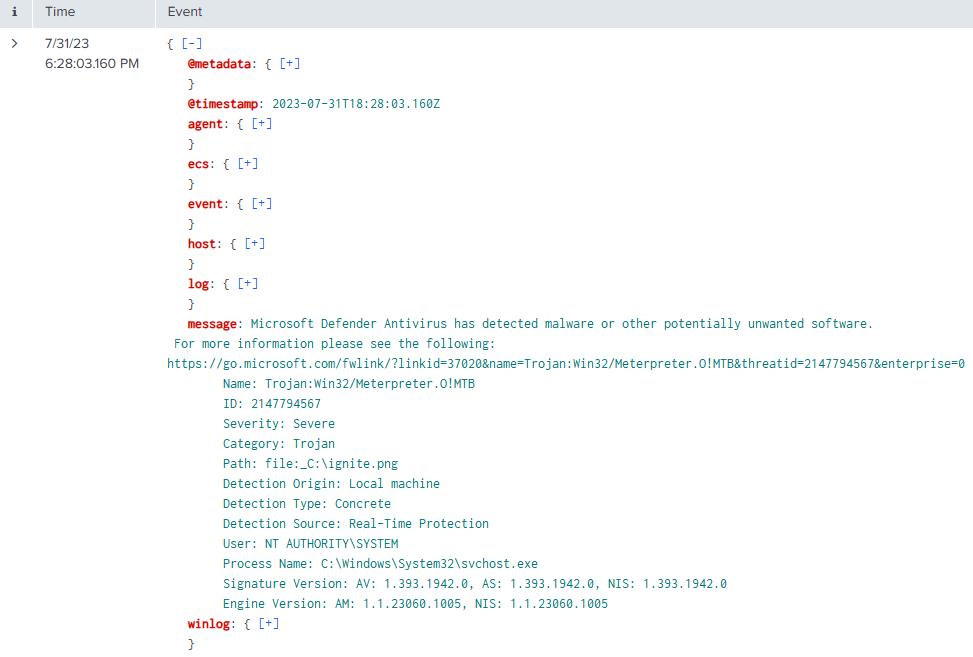

# T1197 Lab

# Table of Contents
- [Context](#context)
- [Scenario](#scenario)
- [Questions](#questions)
- [Attack Chain](#attack-chain)
  * [Attack Tree](#attack-tree)
- [Artifacts](#artifacts)
- [Lab Insights](#lab-insights)

# Context

Lab link: [https://cyberdefenders.org/blueteam-ctf-challenges/t1197/](https://cyberdefenders.org/blueteam-ctf-challenges/t1197/)

Suggested tools: Splunk, ELK

Tactics: Execution, Persistence, Privilege Escalation, Defense Evasion

# Scenario

Adversaries can exploit BITS (Background Intelligent Transfer Service) jobs to persistently execute code and carry out various background tasks. BITS is a COM-exposed, low-bandwidth file transfer mechanism used by applications such as updaters and messengers, allowing them to operate in the background without interfering with other networked applications.

In this incident, an employee received multiple alerts from Windows Defender indicating the presence of malicious files on their PC. As you arrive at the scene, your goal is to use SIEM to analyze the event logs from the suspicious machine and determine the nature of the events.

# Questions

Q1- What is the framework used to create the backdoors?

Answer: Metasploit

Reason: Microsoft Defender's Real-Time Protection generated a detection event (`event.code=1116`) identifying `C:\ignite.png` as `Trojan:Win32/Meterpreter.O!MTB` at `2023-07-31 18:28:03 UTC`, a signature associated with the Metasploit Framework's Meterpreter payload. The detection occurred in the context of `svchost.exe` running as `NT AUTHORITY\SYSTEM`, indicating the flagged file was present or executing during system-level process activity at the time Defender's engine scanned it. The `.png` extension on a file flagged as executable malware suggests possible file masquerading (MITRE ATT&CK `T1036`), a technique used to disguise malicious binaries as benign file types to evade cursory inspection.

```sql
index="mitre-t1197" "event.code"=1116
```



Q2- What is the name of the scheduled task that the attacker tried to create?

Answer: `eviltask`

Reason: Pivoting on the timeline anchor near `2023-07-31 18:28:03.160Z`, a search for Windows Security event ID `4698` (Scheduled Task Creation) in the `mitre-t1197` index surfaced an entry at `2023-07-31 18:23:20.437` with `winlog.event_data.TaskName` set to `\eviltask`. This confirms creation of a scheduled task named `eviltask`, consistent with the persistence technique MITRE ATT&CK `T1053.005` (Scheduled Task/Job). Linking this task to Background Intelligent Transfer Service (BITS)-based delivery (`T1197`) would require corroborating evidence, such as `bitsadmin.exe` execution or BITS job logs, rather than being inferred from the task creation alone.

```sql
index="mitre-t1197" "event.code"=4698
| table _time, winlog.event_data.TaskName, winlog.event_data.SubjectUserName
```


Q3- What is the **`LOLBAS`** used by the malicious actor to move the backdoors to the targeted machine?

Answer: `bitsadmin.exe`

Reason: A process creation search (event ID `4688`) in the `mitre-t1197` index, aggregated by parent/child process pairs, revealed `powershell.exe` spawning `bitsadmin.exe` 32 times, alongside separate spawns of `schtasks.exe` tying back to the `eviltask` persistence identified previously. `bitsadmin.exe` is a legitimate, Microsoft-signed command-line tool for managing Background Intelligent Transfer Service (BITS) jobs, making it a classic Living Off the Land Binary (LOLBAS), a legitimate system binary abused to perform malicious actions while evading detection. The repeated invocation pattern indicates `bitsadmin.exe` was used to transfer the malicious backdoor files onto the host, blending the activity with normal Windows update or transfer traffic. This corroborates `bitsadmin.exe` as the LOLBAS used for payload delivery, and, combined with the `schtasks.exe` activity tied to `eviltask`, supports linking the BITS-based transfer to the scheduled task persistence mechanism, MITRE ATT&CK `T1053.005` and `T1197`.

```sql
index="mitre-t1197" AND winlog.event_id= 4688 
| stats count by winlog.event_data.ParentProcessName winlog.event_data.NewProcessName
```


Q4- When was the first attempt made by the attacker to execute the **`LOLBAS`**?

Answer: `2023-07-31 17:39`

Reason: Filtering event ID `4688` for `bitsadmin.exe` as the new process name and sorting by `_time` showed the earliest execution at `2023-07-31 17:39:45.935`, all under the `SubjectUserName` value `IEUser`. This establishes `2023-07-31 17:39:45.935` as the first observed invocation of the `bitsadmin.exe` Living Off the Land Binary (LOLBAS), occurring roughly 44 minutes before the scheduled task creation identified previously.

```sql
index="mitre-t1197" AND winlog.event_id=4688 "winlog.event_data.NewProcessName"="C:\\Windows\\System32\\bitsadmin.exe"
| table _time, winlog.event_data.SubjectUserName
```


Q5- What is the IP address of the attacker?

Answer: `192.168.190.136`

Reason: Querying event ID `60` (BITS operational log, tracking BITS transfer job status) in the `mitre-t1197` index revealed multiple stopped transfer jobs named `BITS Transfer`, `hacking`, and `MyDownloadFile`, all retrieving payloads (`test.exe`, `R4n50m.exe`) from a common source. This ties the BITS abuse observed via `bitsadmin.exe` to a single staging point for payload delivery. The address `192.168.190.136` is a private (RFC 1918) IP range, indicating the source is internal to the network segment rather than an external internet-hosted server.

```sql
index="mitre-t1197" AND winlog.event_id=60
| table _time, winlog.event_data.url, message
```


Q6- When was the most recent file downloaded by the attacker to the targeted machine?

Answer: `2023-07-31 18:16`

Reason: Searching the `mitre-t1197` index for activity tied to `192.168.190.136` and sorting by `_time` showed recurring downloads of `test.exe` across multiple timestamps, with the most recent occurring at `2023-07-31 18:16:48.207`. This establishes `2023-07-31 18:16:48.207` as the latest observed file download associated with this host, aligning roughly with the tail end of the Background Intelligent Transfer Service (BITS) transfer activity identified previously. The recurrence of `test.exe` downloads across separate timestamps suggests repeated retrieval attempts, possibly indicating retries, payload refreshes, or execution failures prompting the source host to re-stage the file.

```sql
index="mitre-t1197" "192.168.190.136"
| table _time, winlog.event_data.url
```


# Attack Chain

| Time (UTC) | Stage | Detail | MITRE |
| --- | --- | --- | --- |
| 2023-07-31 17:39:45 | Execution | Attacker (as IEUser) first invokes `bitsadmin.exe` to interact with BITS | T1197 |
| 2023-07-31 17:44:29 | Discovery/Execution | mmc.exe launched amid repeated `bitsadmin.exe` invocations | T1197 |
| 2023-07-31 17:39–17:51 | Command and Control | Repeated `bitsadmin.exe` executions creating/managing BITS transfer jobs | T1197 |
| 2023-07-31 18:01:20 | Command and Control | BITS job `MyDownloadFile` downloads R4n50m.exe from `hxxp://192[.]168.190.136/R4n50m.exe` | T1197, T1105 |
| 2023-07-31 18:12:31 | Command and Control | BITS job hacking downloads test.exe from hxxp://192[.]168.190.136/test.exe | T1197, T1105 |
| 2023-07-31 18:16:48 | Command and Control | BITS job BITS Transfer downloads test.exe (final/most recent transfer) from `hxxp://192[.]168.190.136/test.exe` | T1197, T1105 |
| 2023-07-31 (Defender alert) | Execution | svchost.exe context triggers Defender detection of `C:\ignite.png` as Trojan:Win32/Meterpreter.O!MTB | T1055, T1105 |
| 2023-07-31 16:57:31 | Persistence | Scheduled task `\eviltask` created by `IEUser` | T1053.005 |

## Attack Tree

```powershell
[Initial Access — attacker 192[.]168.190.136 → victim host]  ← IEUser session
    └── bitsadmin.exe invoked (T1197)  ← LOLBAS abuse begins @ 2023-07-31 17:39:45
        ├── [Stage 1 — BITS Job Staging]
        │   └── repeated bitsadmin.exe executions (17:39–17:51)
        │       └── mmc.exe launched @ 17:44:29  ← possible task/service config check
        ├── [Stage 2 — Payload Retrieval via BITS (T1105)]
        │   ├── job "MyDownloadFile" → hxxp://192[.]168.190.136/R4n50m.exe  ← @ 18:01
        │   ├── job "hacking" → hxxp://192[.]168.190.136/test.exe  ← @ 18:12
        │   └── job "BITS Transfer" → hxxp://192[.]168.190.136/test.exe  ← @ 18:16 (most recent)
        ├── [Stage 3 — Defense Evasion / Detection]
        │   └── C:\ignite.png flagged as Trojan:Win32/Meterpreter.O!MTB
        │       └── Metasploit-generated backdoor confirmed  ← svchost.exe context
        └── [Stage 4 — Persistence]
            └── scheduled task "\eviltask" created  ← T1053.005, @ 16:57:31
                └── Event ID 60 shows SYSTEM as logging context, not IEUser  ← forensic gotcha (see memory)
```

# Artifacts

| Category | Type | Value |
| --- | --- | --- |
| Malware Detection | Signature | Trojan:Win32/Meterpreter.O!MTB |
| Dropped File | Path | `C:\ignite.png` |
|  | Path | `C:\test.exe` |
|  | Path | `C:\R4n50m.exe` |
| Persistence | Scheduled Task | \eviltask |
| Execution | LOLBAS | bitsadmin.exe |
|  | Parent Process | powershell.exe |
|  | Detection Context Process | svchost.exe |
| Network | Attacker IP | `192.168.190.136` |
|  | URL | hxxp://192[.]168[.]190[.]136/test.exe |
|  | URL | hxxp://192[.]168[.]190[.]136/R4n50m.exe |
| BITS Jobs | Job Name | MyDownloadFile |
|  | Job Name | hacking |
|  | Job Name | BITS Transfer |
| Accounts | Initiating User | IEUser |

# Lab Insights

- BITS is a dual-use blind spot in most SIEM baselines. bitsadmin.exe is Microsoft-signed and routinely used for legitimate application updates, so its process creation events blend into normal noise unless an analyst specifically pivots on the BITS operational log (Event ID 60) or correlates it against outbound HTTP destinations. This lab shows that the "living off the land" advantage isn't just evading antivirus signatures — it's evading the analyst's own mental model of what's worth alerting on.
- Log source choice changes who appears to be "responsible." The same activity looked completely different depending on which log we queried: Security log events (4688, 4698) correctly attributed actions to IEUser, while the BITS operational log attributed the same activity to SYSTEM. Cross-referencing multiple log sources for the same event isn't redundant — it's often the only way to avoid misattributing an incident to privilege escalation that never happened.
- Persistence and payload delivery were staged in parallel, not sequentially. The scheduled task \eviltask was created before the bulk of the BITS transfer activity, suggesting the attacker front-loaded persistence early in the session rather than treating it as a final step. This is a reminder that kill-chain stages in practice often overlap rather than following a clean linear order, and timeline analysis should watch for staging behavior rather than assuming strict phase sequencing.
- A single infrastructure IP tied every stage together. The delivery URL, the payload names, and the detected trojan all resolved back to one attacker-controlled host (192.168.190.136), which made IP-based pivoting the fastest path to reconstructing the full chain once discovered — reinforcing that in small/medium incidents, anchoring on infrastructure indicators early can shortcut a lot of log-by-log correlation work.