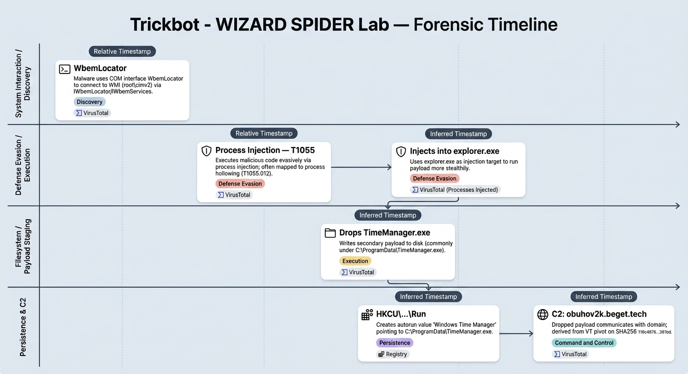

# Trickbot - WIZARD SPIDER Lab

# Context

**Lab link**: [https://cyberdefenders.org/blueteam-ctf-challenges/trickbot-wizard-spider/](https://cyberdefenders.org/blueteam-ctf-challenges/trickbot-wizard-spider/)

**Suggested tools**: VirusTotal

# Scenario

A financial organization has discovered suspicious activity indicating a possible malware infection targeting sensitive data. This discovery was made after noticing unauthorized access attempts to financial records. As part of the threat intelligence team, your task is to analyze available intelligence to identify the malware’s persistence techniques, evasion methods, and command-and-control infrastructure. Gather key indicators to support threat hunting and incident response efforts.

Malware SHA256 hash: `3BF0F489250EAAA99100AF4FD9CCE3A23ACF2B633C25F4571FB8078D4CB7C64D` 

# Questions

Q1- During the analysis of the malware's interaction with system components, a crucial aspect is identifying its method of accessing system resources. Utilizing VirusTotal, identify how this malware connects with Windows Management Instrumentation (WMI). Specifically, which component does it utilize for this purpose?

Answer: `WbemLocator`

Explanation: Malware analysis shows the malware uses the Component Object Model (COM) interface `WbemLocator` to obtain an initial `IWbemLocator` object and connect into Windows Management Instrumentation (WMI) through `root\cimv2` or another namespace, which then enables subsequent queries and method execution via `IWbemServices` to access system data.

Q2- What is the MITRE ATT&CK technique ID used by the malware author to execute malicious code evasively?

Answer: T1055

Explanation: The MITRE ATT&CK technique is `Process Injection (T1055)`. In TrickBot reporting, this behavior is often mapped more specifically to `Process Hollowing (T1055.012)` when the malware runs its payload from within the memory space of a legitimate process to reduce visibility.

Q3- Based on the understanding of the technique used by the malware from the previous question, what is the process name used by the malware to execute malicious code evasively?

Answer: `explorer.exe`

Explanation: The malware injects code into `explorer.exe` to execute malicious code more evasively and reduce visibility in process-based monitoring. The `Processes Injected` section in VirusTotal supports this conclusion by listing `explorer.exe` as an injection target.

Q4- Analyzing the malware's behavior can reveal its file-dropping activities. What is the executable file name that the malware drops during its operation?

Answer: `TimeManager.exe`

Explanation: The malware exhibits file-dropper behavior by writing additional executables to disk during runtime (e.g., `TimeManager.exe`). This is commonly used to stage secondary modules/payloads outside of the initial loader so they can be executed later (sometimes by a different process or after a delay), and it can also support persistence if the dropped binary is later referenced by an autostart mechanism (Registry run keys, scheduled tasks, services, etc.). From an IR/threat-hunting perspective, the key takeaway is that a single initial execution can result in multiple new on-disk artifacts, so defenders should pivot from the parent process to file creation events, dropped file paths, hashes, and any subsequent process executions of those new binaries.

Q5- Investigating the malware's persistence tactics can help us understand how it maintains its active presence within our system. Which specific registry key is abused by the malware to ensure its continued operation after a system reboot or logoff?

Answer: `HKEY_CURRENT_USER\Software\Microsoft\Windows\CurrentVersion\Run`

Explanation: The malware establishes persistence by creating an autorun entry under `HKEY_CURRENT_USER\Software\Microsoft\Windows\CurrentVersion\Run` named `Windows Time Manager` and setting it to `C:\ProgramData\TimeManager.exe`, which causes Windows to launch the binary at user logon after a reboot or logoff.

Q6- Examining the malware's network activity can uncover its command and control (C2) infrastructure. What is the malicious domain it communicates with?

Answer: `obuhov2k.beget.tech`

Explanation: The primary payload dropped the secondary payload `TimeManager.exe`, as shown above. The dropped payload has the Secure Hash Algorithm 256 (SHA256) value `116c48764034521b71d068d3a414b23d573aa195237ae87224a73e69a31381bd`, and a VirusTotal search on this hash identifies the command and control (C2) domain the malware contacted: `obuhov2k[.]beget[.]tech`.

# Lab Insights

<aside>
💡

**Key takeaways**

- **Persistence:** HKCU Run key via `Windows Time Manager` pointing to `C:\ProgramData\TimeManager.exe`.
- **Evasion / execution:** `Process Injection (T1055)` targeting `explorer.exe`.
- **System interaction:** WMI access via COM `WbemLocator`.
- **Dropping behavior:** Writes `TimeManager.exe` (secondary payload) to disk.
- **C2:** `obuhov2k.beget.tech`.
</aside>

### Pivot ideas for threat hunting

- **Endpoint artifacts**
    - Look for file creation and execution of `C:\ProgramData\TimeManager.exe`.
    - Search for the Run key value name `Windows Time Manager` under `HKEY_CURRENT_USER\Software\Microsoft\Windows\CurrentVersion\Run`.
    - Hunt for injection indicators involving `explorer.exe` (suspicious remote thread creation, RWX memory, or unsigned modules).
- **Network indicators**
    - DNS and proxy logs for `obuhov2k.beget.tech`.
    - Pivot from the domain to resolved IPs and any adjacent infrastructure.

### Open questions to validate in IR

- Exact dropped file path and any additional dropped modules beyond `TimeManager.exe`.
- Whether persistence is per-user (HKCU) only or if there are additional mechanisms (scheduled task, service, WMI event subscription).
- Additional C2 endpoints (IPs, URLs, user agents) and whether TLS SNI matches the domain.

# Forensic Timeline

