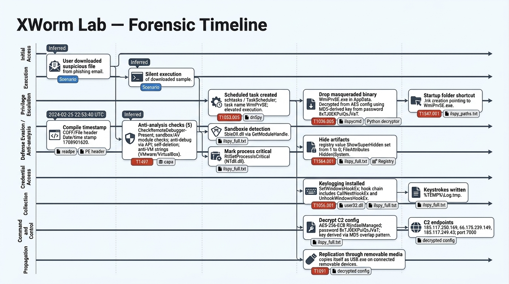

# XWorm Lab


# Context

**Lab link**: [https://cyberdefenders.org/blueteam-ctf-challenges/xworm/](https://cyberdefenders.org/blueteam-ctf-challenges/xworm/)

**Suggested tools**: Detect It Easy, CFF Explorer, PEStudio, dnSpy, ProcMon, RegShot, Python3

**Tactics**: Execution, Persistence, Privilege Escalation, Defense Evasion, Credential Access, Discovery, Collection

# Scenario

Analyze malware behavior to identify persistence methods, evasion techniques, and C2 infrastructure by extracting artifacts and configuration data from static and dynamic analysis.

An employee accidentally downloaded a suspicious file from a phishing email. The file executed silently, triggering unusual system behavior. As a malware analyst, your task is to analyze the sample to uncover its behavior, persistence mechanisms, communication with Command and Control (C2) servers, and potential data exfiltration or system compromise.

# Questions

Q1- What is the compile timestamp (UTC) of the sample?

Answer: `2024-02-25 22:53`

Explanation: Use a Windows Portable Executable (PE) analysis tool such as `readpe` from `pev` to extract the `COFF/File header` `Date/time stamp` value, then convert it to Coordinated Universal Time (UTC) to confirm the sample compile timestamp.

```bash
$ readpe XWorm.malware 
DOS Header
<SNIP>
PE header
    Signature:                       0x00004550 (PE)
COFF/File header
    Machine:                         0x14c IMAGE_FILE_MACHINE_I386
    Number of sections:              3
    Date/time stamp:                 1708901620 (Sun, 25 Feb 2024 22:53:40 UTC)
    Symbol Table offset:             0
<SNIP>
```

Q2- Which legitimate company does the malware impersonate in an attempt to appear trustworthy?

Answer: Adobe

Explanation: Use `strings` output to identify branding text that indicates which legitimate company the malware impersonates to appear trustworthy.

```bash
$ strings XWorm.malware | grep -i "adobe"
Adobe Installer
 2015-2023 Adobe. All rights reserved.
Adobe Inc.
```

Q3- How many anti-analysis checks does the malware perform to detect/evade sandboxes and debugging environments?

Answer: 5

Explanation: Use `capa` to analyze the malware binary and count the anti-analysis checks it performs. The matches indicate debugger detection via `CheckRemoteDebuggerPresent`, sandbox or anti-virus (AV) module checks, anti-debugging checks via application programming interface (API) calls, self-deletion for anti-forensics, and anti-virtual machine (VM) string references for `VMware` and `VirtualBox`.

```bash
$ capa XWorm.malware | grep -i "anti"        
│ ANTI-BEHAVIORAL ANALYSIS │ Debugger Detection::CheckRemoteDebuggerPresent [B0001.002]               │
│ check for sandbox and av modules                                  │ anti-analysis/anti-av                           │
│ check for debugger via API                                        │ anti-analysis/anti-debugging/debugger-detection │
│ self delete (2 matches)                                           │ anti-analysis/anti-forensic/self-deletion       │
│ reference anti-VM strings targeting VMWare                        │ anti-analysis/anti-vm/vm-detection              │
│ reference anti-VM strings targeting VirtualBox                    │ anti-analysis/anti-vm/vm-detection              │
```

Q4- What is the name of the scheduled task created by the malware to achieve execution with elevated privileges?

Answer: `WmiPrvSE`

Explanation: For .NET (pronounced dot net) malware analysis, `dnSpy` on Windows provides the fastest path to confirm scheduled task creation and the task name. Linux static analysis can work, but `dnSpy` can reveal relevant decrypted strings during debugging and reduce time spent reversing obfuscation.

- Open `XWorm.malware` in `dnSpy`
- Review the decompiled class and method tree to identify persistence-related logic (MITRE ATT&CK `T1053.005`, Scheduled Task)
- Search (`Ctrl+F`) for `schtasks` or `TaskScheduler`
- If needed, debug the sample to observe decrypted strings at runtime
- Confirm the scheduled task name and related artifact values, such as `WmiPrvSE.exe`, without manually decrypting Advanced Encryption Standard (AES) data

Q5- What is the filename of the malware binary that is dropped in the AppData directory?

Answer: `WmiPrvSE.exe`

Explanation: The filename was encrypted with Advanced Encryption Standard (AES) in the malware config, so a simple `strings` grep for `AppData` and file extensions returned no useful results beyond red herrings such as `xWmDDA.exe`. The analysis pivoted to static .NET decompilation using `ilspycmd`, dumping the full 4465-line decompiled source to `ilspy_full.txt`. Searching for `AppData` and `Environment` references showed that the dropped filename came from an obfuscated config field, `EB5J4sIzfH74BwfgRjacCtnEuNWFxu93z57nr4HrttTW5asXOhadv7pC7YFu`, which was initialized to the Base64 ciphertext `sJHKF5x7kjxy85oLMym05A==` and passed at runtime through the decryption function `f5Mo9y1FK1yJy4poW9CE()`. Tracing that function showed AES Electronic Codebook (ECB) decryption using a 32-byte key derived by Message Digest 5 (MD5) hashing a hardcoded password, `8xTJ0EKPuiQsJVaT`, stored in a separate config field that also served as the malware mutex name. The key derivation and decryption were replicated in Python using `pycryptodome`, decrypting the blob to reveal `WmiPrvSE.exe`, which impersonates the legitimate Windows Windows Management Instrumentation (WMI) Provider Host process `WmiPrvSE.exe`, consistent with MITRE ATT&CK `T1036.005` (Masquerading: Match Legitimate Name or Location). The same decryptor can unlock other encrypted config fields in the binary.

## Generic XWorm Config Decryptor

```python
cat << 'EOF' > xworm_decryptor.py
import hashlib
import base64
import sys
from Crypto.Cipher import AES

# ── Configuration ────────────────────────────────────────────────────────────
# Only this value is hardcoded — change it per sample
AES_PASSWORD = "8xTJ0EKPuiQsJVaT"

# ── Key Derivation ────────────────────────────────────────────────────────────
# XWorm derives a 32-byte AES key by:
# 1. MD5-hashing the password (produces 16 bytes)
# 2. Copying those 16 bytes into positions 0-15 of a 32-byte array
# 3. Copying them again into positions 15-30 (overlapping at index 15)
def derive_key(password):
    md5 = hashlib.md5(password.encode("utf-8")).digest()
    key = bytearray(32)
    for i in range(16):
        key[i] = md5[i]
    for i in range(16):
        key[15 + i] = md5[i]
    return bytes(key)

# ── Decryption ────────────────────────────────────────────────────────────────
# Each config value is: AES-256-ECB encrypted, then Base64-encoded
# PKCS7 padding is stripped by reading the value of the last byte
def decrypt(b64_ciphertext, key):
    raw = base64.b64decode(b64_ciphertext)
    cipher = AES.new(key, AES.MODE_ECB)
    decrypted = cipher.decrypt(raw)
    # Last byte tells us how many padding bytes to strip
    padding = decrypted[-1]
    return decrypted[:-padding].decode("utf-8", errors="replace")

# ── Input Handling ────────────────────────────────────────────────────────────
# Accepts blobs two ways:
# 1. Hardcoded dict below — edit labels and values as needed
# 2. Command-line: python3 xworm_decryptor.py "base64blob1" "base64blob2" ...
def main():
    key = derive_key(AES_PASSWORD)

    # Add or remove entries as new blobs are discovered
    # Format: "descriptive label": "Base64EncodedCiphertext"
    blobs = {
        "blob_1": "PASTE_BASE64_HERE",
    }

    # If blobs passed as CLI args, override the dict above
    if len(sys.argv) > 1:
        blobs = {f"arg_{i+1}": v for i, v in enumerate(sys.argv[1:])}

    print(f"[*] AES password : {AES_PASSWORD}")
    print(f"[*] Derived key  : {derive_key(AES_PASSWORD).hex()}")
    print("-" * 60)

    for label, blob in blobs.items():
        if "PASTE_BASE64_HERE" in blob:
            print(f"[!] {label}: skipped (placeholder not replaced)")
            continue
        try:
            result = decrypt(blob, key)
            print(f"[+] {label}: {result}")
        except Exception as e:
            print(f"[-] {label}: ERROR — {e}")

if __name__ == "__main__":
    main()
EOF
echo "[*] Decryptor written"

# With the hardcoded dict — edit the blobs dict and run:
$ python3 xworm_decryptor.py

# With CLI args on the fly — no editing needed:
python3 xworm_decryptor.py "t9jQo4UCbK2ZCYwUUSBf2oYT7q1ogMGVrgjUqWnzqLxMXw3GIeVZpids5gIz2YZu" "3qBjH4yDUHjhZBxWK56eYw==" "P/4B29PWaJ6Raw+51xox2A==" "fwWlqX1XMU7EFmHRUHk3Jw=="
```

Q6- Which cryptographic algorithm does the malware use to encrypt or obfuscate its configuration data?

Answer: AES

Explanation: `ilspycmd` output shows the decryption routine directly. The function `f5Mo9y1FK1yJy4poW9CE()` creates a `RijndaelManaged` object, which implements the Rijndael cipher and corresponds to Advanced Encryption Standard (AES). The code configures Electronic Codebook (ECB) mode and uses a 32-byte (256-bit) key derived by hashing the hardcoded password `8xTJ0EKPuiQsJVaT` with Message Digest 5 (MD5). The routine does not use an initialization vector (IV) because ECB encrypts each 16-byte block independently with only the key.

Q7- To derive the parameters for its encryption algorithm (such as the key and initialization vector), the malware uses a hardcoded string as input. What is the value of this hardcoded string?

Answer: `8xTJ0EKPuiQsJVaT`

Explanation: Static analysis of the decompiled config class at line 289 of `ilspy_full.txt` shows the field `DhMybcleyUJ8bZbaqtAkL3FTz6SQ840xELBsFWt9yekNCVYQ1WgRtjL1bTF3` initialized to the plaintext string `8xTJ0EKPuiQsJVaT`, which functions as the master password for configuration decryption. At runtime, the malware hashes this string with Message Digest 5 (MD5), copies the resulting 16-byte digest into a 32-byte array using an overlapping pattern, and uses the array as the Advanced Encryption Standard (AES) `256-bit` Electronic Codebook (ECB) key. The decompiled source at line 4160 also shows the same string used as the malware mutex name.

Q8- What are the Command and Control (C2) IP addresses obtained after the malware decrypts them?

Answer: `185.117.250.169`, `66.175.239.149`, `185.117.249.43`

Explanation: All XWorm configuration values are Advanced Encryption Standard (AES) encrypted at rest in the binary. Using a generic decryptor against the configuration class blobs extracted from `ilspy_full.txt`, static analysis decrypted field `ZIDZvDLA` (line `269`), a single encrypted blob containing three comma-separated Command and Control (C2) IP addresses: `185.117.250.169`, `66.175.239.149`, and `185.117.249.43`. The same decryption pass also revealed the bot identifier tag `<123456789>` and mutex `<Xwormmm`, confirming full configuration extraction from static analysis without executing the sample.

Q9- What port number does the malware use for communication with its Command and Control (C2) server?

Answer: `7000`

Explanation: The same Advanced Encryption Standard (AES) decryption pass used in Q8 recovered the port number. Config field `PjOzPaAZ` (line `273`) decrypted to `7000`, and XWorm uses this port for Command and Control (C2) communication with the three C2 IP addresses identified in Q8.

Q10- The malware spreads by copying itself to every connected removable device. What is the name of the new copy created on each infected device?

Answer: `USB.exe`

Explanation: Static analysis recovered this value via the same bulk decryption pass against the config class in `ilspy_full.txt`. Config field `s6qNUlBh` (line `283`) decrypted to `USB.exe`, the filename XWorm uses when copying itself to removable devices, consistent with MITRE ATT&CK (Adversarial Tactics, Techniques, and Common Knowledge) `T1091` (Replication Through Removable Media). The operator configured this name, and the binary stores it as Advanced Encryption Standard (AES) encrypted configuration data that static analysis revealed without executing the sample.

Q11- To ensure its execution, the malware creates specific types of files. What is the file extension of these created files?

Answer: `lnk`

Explanation: Instead of searching blindly, the analysis focused on the logical code block that contains file creation logic, the persistence block, already anchored from earlier analysis around lines `380` to `430` in `ilspy_full.txt`. The `ilspy_paths.txt` output from Step `5` already exposed the relevant line:

```csharp
Environment.GetFolderPath(Environment.SpecialFolder.Startup) + "\\" + 
Path.GetFileNameWithoutExtension(...) + ".lnk"
```

The malware creates `.lnk` files, which are Windows shortcut files, in the Startup folder. Each `.lnk` file points to the dropped `WmiPrvSE.exe` binary. This behavior matches MITRE ATT&CK (Adversarial Tactics, Techniques, and Common Knowledge) `T1547.001` (Boot or Logon Autostart Execution: Registry Run Keys, Startup Folder) and ensures the malware executes on each user login without relying only on registry modifications.

Q12- What is the name of the DLL the malware uses to detect if it is running in a sandbox environment?

Answer: **`SbieDll.dll`**

Explanation: Initial triage with `capa` flagged the rule `check for sandbox and av modules` under `anti-analysis/anti-av`, confirming sandbox detection behavior but not naming the specific artifact. To identify the exact dynamic-link library (DLL), the analysis pivoted to the decompiled source in `ilspy_full.txt` and ran `grep dll` across the output. Unlike other DLL references that appear as static `DllImport` declarations for legitimate functionality, `SbieDll.dll` appeared as a runtime dynamic load. The code checked for `SbieDll.dll` with `GetModuleHandle`, and a non-zero return value indicated the module was already present in the process.

`SbieDll.dll` is a legitimate Sandboxie component. Sandboxie injects `SbieDll.dll` into processes running inside its sandbox to intercept and virtualize system calls, so its presence provides a reliable indicator of an analysis environment. XWorm does not load `SbieDll.dll` to use it. XWorm checks whether the DLL is already loaded to infer that execution occurs in a sandbox. If XWorm detects this condition, XWorm can exit silently or behave benignly to evade analysis, consistent with the broader anti-analysis posture identified in Q3, alongside `VMware` and `VirtualBox` string checks that serve the same purpose.

Q13- What is the name of the registry key manipulated by the malware to control the visibility of hidden items in Windows Explorer?

Answer: `ShowSuperHidden`

Explanation: Confirmed via `grep -i hidden ilspy_full.txt` against the decompiled source. The malware checks the Windows Explorer advanced settings registry value `ShowSuperHidden`, and if it equals `1` (hidden files visible), it sets it to `0` (hidden files concealed). The malware also calls `File.SetAttributes` to mark dropped files as `Hidden` and `System`, which hides artifacts at the filesystem level and reduces visibility in Explorer. This behavior aligns with MITRE ATT&CK `T1564.001` (Hide Artifacts: Hidden Files and Directories).

```csharp
<SNIP>
if (Operators.ConditionalCompareObjectEqual(registryKey.GetValue("ShowSuperHidden"), (object)1, false))
    registryKey.SetValue("ShowSuperHidden", 0);
File.SetAttributes(name + <SNIP>, FileAttributes.Hidden | FileAttributes.System);
File.SetAttributes(text2, FileAttributes.Hidden | FileAttributes.System);
File.SetAttributes(text, FileAttributes.Hidden | FileAttributes.System);
<SNIP>
```

Q14- Which API does the malware use to mark its process as critical in order to prevent termination or interference?

Answer: `RtlSetProcessIsCritical`

Explanation: Identified via `grep -i critical ilspy_full.txt -C 5`, which revealed the relevant class and its dynamic-link library (DLL) import declaration. The malware calls `RtlSetProcessIsCritical`, an undocumented Windows NT kernel application programming interface (API) exported from `NTdll.dll`, to mark its own process as critical. On Windows, termination of a critical process triggers a Blue Screen of Death (BSOD), which discourages analysts and defensive tools from stopping the process because doing so can crash the system. The code imports the API via `DllImport` under an obfuscated wrapper class `ke48iewt5U3eoIMbjLCt`, and aliases the function as `H8daqEsgsEVBpFZFnlWT`, which obscures intent during static review:

```csharp
<SNIP>
public class ke48iewt5U3eoIMbjLCt
{
    [DllImport("NTdll.dll", EntryPoint = "RtlSetProcessIsCritical", SetLastError = true)]
    public static extern void H8daqEsgsEVBpFZFnlWT(
        [MarshalAs(UnmanagedType.Bool)] bool tW8JLDDvidchK66hQUnZ,
        [MarshalAs(UnmanagedType.Bool)] ref bool IgYCKHiXpqcNX0SKbJFS,
        [MarshalAs(UnmanagedType.Bool)] bool tZzpk5hGM0iIAqJM0bgw);
<SNIP>
```

Q15- Which API does the malware use to insert keyboard hooks into running processes in order to monitor or capture user input?

Answer: `SetWindowsHookEx`

Explanation: Identified via `grep -i hook ilspy_full.txt -C 10`, which exposed the full keylogging implementation block. The malware uses `SetWindowsHookEx`, a legitimate Windows application programming interface (API) from `user32.dll`, to install a low-level keyboard hook that intercepts keystrokes system-wide across all running processes. The full hook chain is present: `SetWindowsHookEx` to install the hook, `CallNextHookEx` to pass keystrokes down the hook chain, and `UnhookWindowsHookEx` to remove it cleanly, which indicates a fully implemented keylogger rather than a proof of concept. This behavior aligns with MITRE ATT&CK `T1056.001` (Input Capture: Keylogging). All three APIs are imported under heavily obfuscated wrapper names to obscure their purpose during static analysis, and `SetWindowsHookEx` is aliased to `v2H7UaTp8QLeiqSYflzi3sclFElatUojEHCwvOIoXHXii3FlZocIVLQx9c8vO5vW9iL6KiRzIfUyn`:

```csharp
<SNIP>
[DllImport("user32.dll", CharSet = CharSet.Auto, EntryPoint = "SetWindowsHookEx", SetLastError = true)]
private static extern IntPtr v2H7UaTp8QLeiqSYflzi3sclFElatUojEHCwvOIoXHXii3FlZocIVLQx9c8vO5vW9iL6KiRzIfUyn
    (int HJGWSXzau5VpUb17pSP7, LowLevelKeyboardProc fzzzTQONszicgX9qy6tZ, IntPtr fcrkLT3TAwBUsJYmnrnB, uint 7SEYzvzMbKuiACze3Kwz);

[DllImport("user32.dll", CharSet = CharSet.Auto, EntryPoint = "UnhookWindowsHookEx", SetLastError = true)]
private static extern bool APdkp7NR04594a8EiuKc(IntPtr optqMgMd3ysZwMZwg1oV);

[DllImport("user32.dll", CharSet = CharSet.Auto, EntryPoint = "CallNextHookEx", SetLastError = true)]
private static extern IntPtr B4qKxfck2L7xA8QlrpiC(IntPtr Npce0KfPWmV3T7xkzlRw, int mjJyZg83duVhl7YzhHdf, IntPtr PtVR3d5Qdb3svWYZF3BW, IntPtr FT8RhXMqss6r0tLnFZtd);
<SNIP>
```

Q16- Given the malware’s ability to insert keyboard hooks into running processes, what is its primary functionality or objective?

Answer: keylogger

Explanation: The malware’s primary data collection capability is keylogging, confirmed at three independent levels of analysis. First, `capa` flagged `Keylogging::Polling [F0002.002]` during initial triage in Q3. Second, static decompilation in Q15 revealed a fully implemented hook chain using `SetWindowsHookEx` with a `LowLevelKeyboardProc` callback, capturing raw keystrokes system-wide across all running processes, consistent with MITRE ATT&CK `T1056.001` (Input Capture: Keylogging). Third, the config class exposed the log destination, `%TEMP%\Log.tmp`, where captured keystrokes are written for later exfiltration to the Command and Control (C2) infrastructure identified in Q8. All three layers corroborate the same conclusion without requiring dynamic execution of the sample.

# Lab Insights

### Key takeaways from the sample

- **Persistence**: Scheduled task `WmiPrvSE` and Startup-folder `.lnk` creation.
- **Masquerading**: Drops `WmiPrvSE.exe` to blend in with the legitimate WMI Provider Host.
- **Anti-analysis**: Checks for debuggers, AV or sandbox modules, self-deletion, and VM indicators. `SbieDll.dll` is used as a Sandboxie tell.
- **Data collection**: Implements system-wide keylogging via `SetWindowsHookEx` and writes keystrokes to `%TEMP%\Log.tmp`.
- **C2**: AES-encrypted config reveals multiple C2 IPs and port `7000`.

# Forensic Timeline

