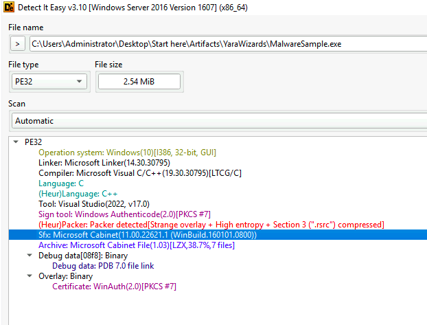

# Yara Wizards Lab

# Table of Contents
- [Context](#context)
- [Scenario](#scenario)
- [Questions](#questions)
- [YARA Rules File](#yara-rules-file)

# Context

Lab link: [https://cyberdefenders.org/blueteam-ctf-challenges/yara-wizards/](https://cyberdefenders.org/blueteam-ctf-challenges/yara-wizards/)

Suggested tools: Detect It Easy, Yara, FLOSS/Strings, Notepad++, ProcMon, Process Explorer, Process Hacker, YaraValidator

Tactics: Execution, Persistence, Privilege Escalation, Defense Evasion, Discovery, Collection, Command and Control, Impact

# Scenario

As a detection engineer at IResponse, your daily duties include analyzing malware samples, identifying key characteristics, and developing Yara rules for detection. In this task, you're provided with a specific malware sample to analyze, and your goal is to create and test a detection rule to ensure it effectively identifies threats.

**Suggested resources :**

- [How to Write Simple but Sound Yara Rules - Part 1](https://www.nextron-systems.com/2015/02/16/write-simple-sound-yara-rules/)
- [How to Write Simple but Sound Yara Rules - Part 2](https://www.nextron-systems.com/2015/10/17/how-to-write-simple-but-sound-yara-rules-part-2/)
- [How to Write Simple but Sound Yara Rules - Part 3](https://www.nextron-systems.com/2016/04/15/how-to-write-simple-but-sound-yara-rules-part-3/)

# Questions

**Q1**- Understanding how the malware extracts itself is crucial for analyzing its real-time functionality and behavior. What packer does this malware use to unpack and install itself without requiring a separate extraction program, specifically utilizing the Microsoft Cabinet (.cab) format?

Answer: SFX

Reason: The malware employs a Self-Extracting (SFX) archive mechanism to unpack and install itself without relying on a separate extraction utility. This SFX implementation uses the Microsoft Cabinet (`.cab`) format as its underlying container, allowing the payload to decompress and execute directly from within the executable itself. Detect It Easy (DIE) identified this packer signature during static analysis of the sample, confirming the specific build version tied to the Windows Cabinet library used to construct the archive.



**Q2**- Determining the file entropy helps in assessing the level of compression or encryption applied to the file. What is the entropy level of the file?

Answer: 7.98

Reason: Entropy measures the randomness of byte values within a file or file section, expressed on a scale from 0 (highly ordered, repetitive data) to 8 (maximum randomness, where byte values are effectively indistinguishable from random noise). Detect It Easy (DIE) calculates entropy per section and for the file as a whole to flag regions that show compression or encryption, since both processes produce output that closely resembles random data. Standard, uncompressed code and data sections typically fall in the 4 to 6 range, while packed, encrypted, or compressed regions push close to the 8.0 ceiling, which is why DIE's built in threshold flags anything above roughly 7.0 as `packed` in its status column.

The overall file entropy measures `7.98612`, which DIE reports as `packed(99%)` at the total file level. Breaking this down by section confirms the pattern: the `.rsrc` section shows an entropy of `7.99102` and is flagged `packed`, the `Overlay` region shows `7.63005` and is also flagged `packed`, while the `PE Header`, `.text`, `.data`, `.idata`, and `.reloc` sections all remain in the `not packed` range between `2.56673` and `6.26978`. This distribution is consistent with a Self-Extracting (SFX) archive structure, where the legitimate PE sections (code, data, imports, relocations) remain in their normal, low-entropy state while the packed payload sits concentrated in the resource section and the overlay appended after the formal PE structure.

**Q3**- Understanding the batch file used in the execution process is crucial for tracing the malware's behavior. What is the .bat file used to create the final .exe file?

Answer: `bqwybceocy.bat`

Reason: The Fireeye Labs Obfuscated String Solver (FLOSS) tool was used to extract and decode obfuscated strings from the sample, revealing the command line invocation responsible for creating the final executable. The decoded string shows `cmd.exe` launching the batch file directly with the `/d /c` flags, where `/d` disables execution of any `AutoRun` commands from the registry and `/c` instructs the command shell to carry out the specified command and then terminate. The batch file `bqwybceocy.bat` is passed a numeric argument, `3991425476`, alongside a secondary string, `ncllyfumxwi`, both of which appear on adjacent lines in the decoded output and are likely parameters consumed by the batch script itself, such as a decryption key, seed value, or target file name used during the final `.exe` assembly stage.

```powershell

<SNIP>
....
<None>
cmd.exe /d /c bqwybceocy.bat 3991425476
ncllyfumxwi
<None>
```

**Q4**- Knowing the command line used to run the batch file assists in recreating the execution flow for analysis. What is the command line used to run this .bat file?

Answer: `cmd.exe /d /c bqwybceocy.bat 3991425476`

Reason: `cmd.exe` invokes the batch file with the `/d` flag, which disables execution of any `AutoRun` commands from the registry, and the `/c` flag, which carries out the specified command and then terminates the shell. The numeric argument `3991425476` is passed to `bqwybceocy.bat` as a parameter.

**Q5**- Identifying the final executable file is crucial for understanding the main payload delivered by the malware. What is the name of the final .exe file that the malware executes?

Answer: `fjlpexyjauf.exe`

Reason: Process Monitor capture of the extracted batch file, `C:\Users\Administrator\AppData\Local\Temp\2\IXP001.TMP\bqwybceocy.bat`, reveals the final assembly and execution logic. The `copy /b` command concatenates four binary fragments, `eqnyiodbs.dat`, `eqnyiodbs.dat.1`, `eqnyiodbs.dat.2`, and `eqnyiodbs.dat.3`, in binary mode (the `/b` flag prevents `copy` from treating an embedded `0x1A` byte as an end-of-file marker, which would otherwise truncate a binary concatenation) into a single output file, `fjlpexyjauf.exe`. The batch file then immediately executes this newly assembled binary, passing `lknidtnqmg.dat` and the original numeric argument `%1%` as parameters. Splitting the payload across multiple innocuously named `.dat` fragments and reassembling them only at runtime is a defense evasion technique intended to prevent static detection of the complete malicious binary on disk prior to execution.

**Q6**- Identifying the path where the final executable is dropped is essential for understanding its execution context. What is the typical path used for dropping the final executable?

Answer: `C:\Users\Administrator\AppData\Local\Temp\2\IXP000.TMP`

Reason: Process Monitor traced this directory as the drop location for the malware's staged components. IExpress-based Self-Extracting (SFX) archives typically generate a randomly incremented `IXP0nn.TMP` folder under the user's temp directory during extraction, and the directory listing confirms this pattern, containing the batch file, the four `eqnyiodbs.dat` fragments later concatenated into `fjlpexyjauf.exe`, the assembled executable itself, and the auxiliary `lknidtnqmg.dat` and `gyvdcniwvlu.dat` payloads referenced during execution.

**Q7**- Creating YARA rules based on identified patterns is key to detecting variants of the given malware sample. What is the flag you get when your rule successfully matches multiple variants of the same malware?

Answer: `Lu0Bot_Detected`

Reason: The YaraValidator tool executed the rule against the lab's full sample set, returning `28` samples detected against `10` false positives. Beyond confirming a successful multi-sample match, the flag itself also reveals the malware family name for the first time: `Lu0Bot`, tying the entropy, SFX, and fragmented `.dat` reassembly patterns identified throughout this analysis to a known malware family rather than a generic unnamed dropper.

# YARA Rules File

```json
rule SFX_Fragmented_Dropper_Pattern
{
    meta:
        description = "Detects IExpress SFX droppers using fragmented .dat reassembly (Lu0Bot family)"
        reference   = "CyberDefenders - YARA Wizards Lab"
    strings:
        // IExpress SFX archives extract to a randomly-numbered IXP0nn.TMP
        // staging folder under %TEMP%. The folder name itself is randomized
        // per run, but the "IXP0" + 2 digits + ".TMP" structure is a stable
        // artifact of the IExpress extraction stub across variants.
        // ascii/wide covers both single-byte and UTF-16 string encodings.
        $sfx_stage = /IXP0[0-9]{2}\.TMP/ ascii wide

        // Lu0Bot splits its payload across multiple .dat fragments
        // (e.g. eqnyiodbs.dat, .dat.1, .dat.2, .dat.3) which get
        // concatenated at runtime. The base filename is randomized,
        // but the ".dat.1" / ".dat.2" / ".dat.3" suffix pattern recurs.
        $frag_pattern = /\.dat\.[1-3]/ ascii

        // The batch file uses "copy /b" to concatenate the .dat
        // fragments in binary mode (the /b flag prevents the copy
        // command from treating an embedded 0x1A byte as EOF, which
        // would otherwise truncate the reassembled binary).
        // nocase since batch scripts are case-insensitive.
        $copy_cmd = "copy /b" ascii nocase

        // The dropper invokes the batch file via cmd.exe with /d
        // (disable AutoRun registry commands) and /c (run command
        // then terminate). This launch pattern is consistent across
        // the observed samples even though the .bat filename itself
        // is randomized per build.
        $cmd_invoke = /cmd\.exe \/d \/c/ ascii nocase

    condition:
        // uint16(0) == 0x5A4D checks the first 2 bytes equal "MZ",
        // confirming this is a valid PE file before evaluating
        // the string-based indicators below.
        uint16(0) == 0x5A4D
        and
        // Requiring 2 of 4 strings balances catching variants that
        // may not exhibit every artifact (e.g. a sample where the
        // .dat fragment naming changed) against full false-positive
        // exposure from any single generic string alone.
        2 of them
}
```
