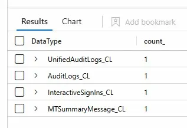

# DynamicEscalate Lab

**CCD Lab Link**: [https://cyberdefenders.org/blueteam-ctf-challenges/dynamicescalate/](https://cyberdefenders.org/blueteam-ctf-challenges/dynamicescalate/)

**Suggested Tools**: Microsoft Sentinel, Azure Monitor, Azure AD Sign-in Logs, Azure AD Workbooks

# Table of Contents
- [Scenario](#scenario)
- [Initial Access](#initial-access)
- [Persistence](#persistence)
- [Privilege Escalation](#privilege-escalation)

# Scenario

Theme: Reconstruct a Microsoft Entra ID privilege escalation chain by correlating Exchange message traces, Azure AD telemetry, and unified audit logs using KQL.

Something feels off. A few users in your organization have recently gained access to sensitive resources through what appears to be legitimate Azure AD group membership. The security team flagged an anomaly: a dynamic group seems to have been quietly reconfigured. There's no clear breach, but the group membership rules don’t match what they used to be.

Using Azure AD logs, Microsoft Sentinel, and Graph API traces, your task is to piece together the timeline, identify what changed, who made it, and determine whether this was an administrative misstep or a calculated privilege escalation attempt using dynamic groups. First, check which Azure Sentinel data sources have actual data in them:

```powershell
Usage
| summarize count() by DataType
| order by count_ desc
```



# Initial Access

- While reviewing Microsoft Sentinel logs during an investigation into suspicious changes, you pivot to Exchange message-trace for the lure. Which email Subject line confirmed the phishing message that kicked off the attack?
    - Query `MTSummaryMessage_CL`, then review the returned message trace fields (especially `Subject`) for the suspicious/lure email that aligns with the first related identity events.
    - **Answer**: Security code
    
    ```powershell
    MTSummaryMessage_CL
    | take 100
    ```
    


- Correlating mail delivery with Azure AD logs, you isolate the first attacker log-on. List the **authentication protocol** and client application that reveal abuse of the device-code flow:
    - Filter `InteractiveSignIns_CL` for device-code related auth by matching `AuthenticationProtocol` on `"code"`, then project the fields that directly describe the flow and client (`AuthenticationProtocol`, `Clientapp`) for the suspicious user session.
    - **Answer**: deviceCode, Mobile Apps and Desktop clients
    
    ```powershell
    InteractiveSignIns_CL
    | take 10
    | project AuthenticationProtocol, Clientapp, User
    | where AuthenticationProtocol contains "code"
    ```
    


- Geo-enrichment shows the sign-in came from an unfamiliar location. What **public IP address** presented the stolen token?
    - From the same suspicious `InteractiveSignIns_CL` event(s), read the IP field associated with the device-code sign-in (the client’s source IP). Confirm it matches the anomalous geo context.
    - **Answer**: 18.194.240.33
    
    
    
- Precise timing is critical for scoping the blast radius. What **UTC timestamp** marks the attacker’s first successful device-code sign-in?
    - Use the device-code filtered `InteractiveSignIns_CL` results, then sort/identify the earliest successful authentication for the attacker session and take its timestamp (Sentinel stores it in UTC).
    - **Answer**: 2025-07-11 16:50 (same query above)

# Persistence

- Minutes later, logs show a new external identity being invited. What **guest UPN** did the attacker create for persistence?
    - In `UnifiedAuditLogs_CL`, filter on the user-creation operation (`Operation` contains `"Add user"`) and extract the guest account identifier from the event details (look for the `UPN` / `UserPrincipalName` field).
    - **Answer**: [nilafe8896_hosintoy.com#EXT#@cydefstg.onmicrosoft.com](mailto:nilafe8896_hosintoy.com#EXT#@cydefstg.onmicrosoft.com)
    
    ```powershell
    UnifiedAuditLogs_CL
    | where * has "upn" and Operation contains "Add user"
    ```
    


## Side Note: Classic Guest Invite Abuse attack

**Guest UPN Breakdown:**

```
nilafe8896_hosintoy.com#EXT#@cydefstg.onmicrosoft.com
```

| Part | Value | Meaning |
| --- | --- | --- |
| `nilafe8896` | username | Guest's local identifier |
| `hosintoy.com` | external domain | Attacker's external/throwaway domain |
| `#EXT#` | marker | Flags this as an **external/guest account** in Azure AD |
| `cydefstg.onmicrosoft.com` | tenant | The **target tenant** they were invited into |

---

**In a higher context — this is a classic Guest Invite Abuse attack:**

1. **Attacker creates or controls** `nilafe8896@hosintoy.com` externally
2. **Invites it as a guest** into the target tenant (`cydefstg`)
3. Guest account gets **added to a dynamic group** — possibly via a manipulated membership rule
4. That group grants access to **sensitive resources** (SharePoint, Teams, Azure subscriptions)
5. Attacker now has **legitimate-looking access** with no malware, no exploit — just identity abuse

---

The dynamic group membership rule was likely reconfigured to include external guests matching a certain pattern, quietly pulling the attacker's guest account in and escalating privileges through the backdoor.


# Privilege Escalation

- Still tracking the guest’s lifecycle, you notice it being ‘groomed’ to satisfy a dynamic-group rule. List the **two attributes and their new values** set on the guest account.
    - Filter `UnifiedAuditLogs_CL` for profile changes (`Operation` contains `"Update user"`), then inspect the modified properties in the audit record (the “changed properties” / new values) for that guest UPN.
    - **Answer**: country=US, department=Operations
    
    ```powershell
    UnifiedAuditLogs_CL
    | where Operation contains "Update user"
    ```
    


- Seconds later, the dynamic-group engine fires. Provide the **group name** that auto-enrolled the guest and **the application identity** recorded as the actor.
    - Filter `UnifiedAuditLogs_CL` for group membership additions (`Operation` contains `"Add member"`). In the matching event, read (1) the target group object/name and (2) the “actor” identity—often an application/service principal—recorded as performing the change.
    - **Answer**: Operations, Microsoft Approval Management
    
    ```powershell
    UnifiedAuditLogs_CL
    | where Operation contains "Add member"
    ```
    


