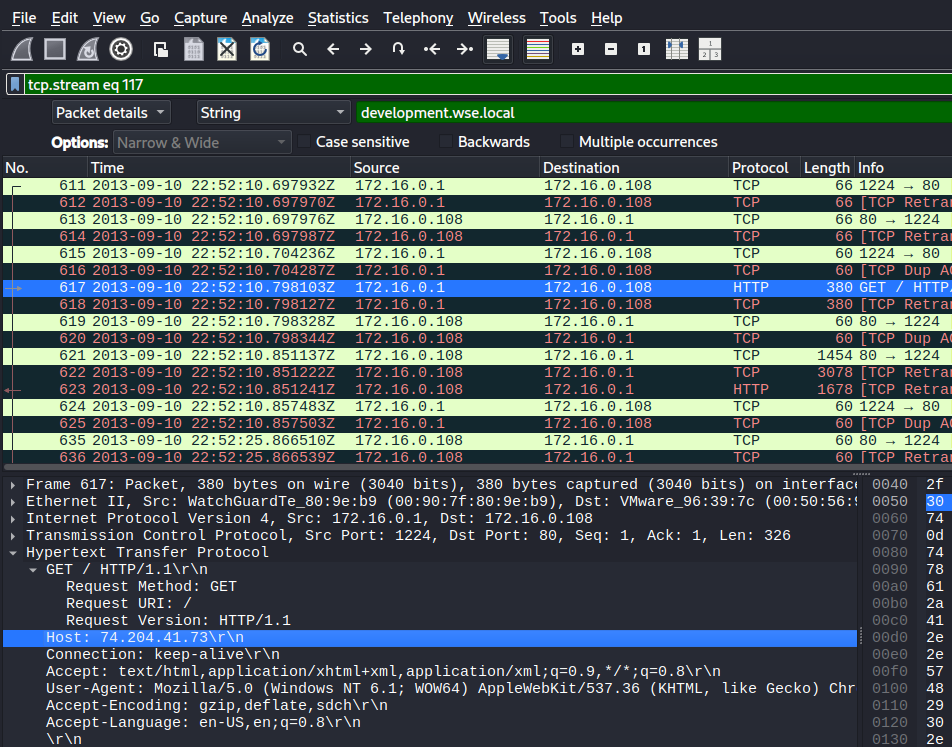

# l337 S4uc3 Lab

# Table of Contents
- [Context](#context)
- [Scenario](#scenario)
- [Questions](#questions)
- [Attack Chain](#attack-chain)
  * [Attack Tree](#attack-tree)
- [Artifacts](#artifacts)
- [Lab Insights](#lab-insights)

# Context

Lab link: [https://cyberdefenders.org/blueteam-ctf-challenges/l337-s4uc3/](https://cyberdefenders.org/blueteam-ctf-challenges/l337-s4uc3/)

Suggested tools: Volatility, Wireshark, NetworkMiner, `Brim`

Tactics: Initial Access, Execution, Defense Evasion, Discovery, Collection

# Scenario

Everyone has heard of targeted attacks. Detecting these can be challenging, responding to these can be even more challenging. This scenario will test your network and host-based analysis skills as a soc analyst to figure out the who, what, where, when, and how of this incident. There is sure to be something for all skill levels and the only thing you need to solve the challenge is some l337 S4uc3!

# Questions

Q1- PCAP: `Development.wse.local` is a critical asset for the Wayne and Stark Enterprises, where the company stores new top-secret designs on weapons. Jon Smith has access to the website and we believe it may have been compromised, according to the IDS alert we received earlier today. First, determine the Public IP Address of the webserver?

Answer: `74.204.41.73`

Reason: Analysis of `GrrCON.pcapng` packet 617 (HTTP GET request timestamped `2013-09-10 22:52:11 UTC` per the server's response `Date` header) identified the public IP address of the Wayne and Stark Enterprises webserver as `74[.]204[.]41[.]73`. This was derived from the HTTP `Host:` header in the client request (`Host: 74.204.41.73`) and corroborated by the server's response headers, `Server: Apache/2.2.14 (Ubuntu)`, `X-Powered-By: PHP/5.3.2-1ubuntu4.20`, and `X-Pingback: <http://development.wse.local/xmlrpc.php`>, which confirm the target as the `development.wse.local` asset. At the IP layer the same packet shows only the internal conversation `172.16.0.1` to `172.16.0.108`, reflecting a capture point located inside the network perimeter, behind a WatchGuard UTM appliance performing destination NAT (port forwarding) from its public interface `74[.]204[.]41[.]73` to the webserver's private address `172.16.0.108`. Because NAT translation rewrites only the IP-layer addressing and leaves the application-layer `Host` header intact as sent by the original external client, the `Host` header remains the reliable indicator of the server's true public IP.

```bash
Packet 617 - GrrCON.pcapng
IP layer: 172.16.0.1 -> 172.16.0.108

GET / HTTP/1.1
Host: 74.204.41.73
Connection: keep-alive
User-Agent: Mozilla/5.0 (Windows NT 6.1; WOW64) AppleWebKit/537.36 (KHTML, like Gecko) Chrome/28.0.1500.95 Safari/537.36

HTTP/1.1 200 OK
Date: Tue, 10 Sep 2013 22:52:11 GMT
Server: Apache/2.2.14 (Ubuntu)
X-Powered-By: PHP/5.3.2-1ubuntu4.20
X-Pingback: http://development.wse.local/xmlrpc.php
```



Q2- PCAP: Alright, now we need you to determine a starting point for the timeline that will be useful in mapping out the incident. Please determine the arrival time of frame 1 in the "GrrCON.pcapng" evidence file.

Answer: `22:51:07 UTC`

Reason: The earliest frame in `GrrCON.pcapng` (frame 1) arrived at `2013-09-10 22:51:07.894237 UTC`, establishing the starting point for the incident timeline. This frame is an ARP request from the WatchGuard appliance (`WatchGuardTe_80:9e:b9`, source `172.16.0.1`) broadcasting `Who has 172.16.0.108? Tell 172.16.0.1`, consistent with the WatchGuard UTM device (identified as the network's edge gateway in Q1) resolving the MAC address of the internal webserver `172.16.0.108` prior to forwarding NAT-translated traffic to it. This timestamp precedes the first observed HTTP request to the webserver by roughly one minute and four seconds, and anchors all subsequent timeline reconstruction for this capture.

```bash
1	2013-09-10 22:51:07.894237Z	WatchGuardTe_80:9e:b9	Broadcast	ARP	60	Who has 172.16.0.108? Tell 172.16.0.1
```

Q3- PCAP: What version number of PHP is the development.wse.local server running?

Answer: `5.3.2`

Reason: The `development.wse.local` webserver discloses its PHP version as `5.3.2` via the `X-Powered-By` response header, observed in Frame 296 at `2013-09-10 22:51:28 UTC`. The full header value `X-Powered-By: PHP/5.3.2-1ubuntu4.20` also confirms this is the Ubuntu-packaged build, consistent with the `Server: Apache/2.2.14 (Ubuntu)` header in the same response. PHP `5.3.2` is significantly outdated relative to the September 2013 capture date.

```bash
HTTP/1.1 200 OK
Date: Tue, 10 Sep 2013 22:51:28 GMT
Server: Apache/2.2.14 (Ubuntu)
X-Powered-By: PHP/5.3.2-1ubuntu4.20
X-Pingback: http://development.wse.local/xmlrpc.php
Vary: Accept-Encoding
Content-Length: 7174
Connection: close
Content-Type: text/html; charset=UTF-8
```

Q4- PCAP: What version number of Apache is the development.wse.local web server using?

Answer: `2.2.14`

Reason: The `development.wse.local` webserver discloses its Apache version as `2.2.14` via the `Server` response header, observed in Frame 296 at `2013-09-10 22:51:28 UTC` (`Server: Apache/2.2.14 (Ubuntu)`). Apache `2.2.14` is an Ubuntu-packaged build, consistent with the underlying `PHP/5.3.2-1ubuntu4.20` version identified in Q3, and its disclosure in an unmodified banner header confirms the server has not been hardened to suppress version fingerprinting, further widening the reconnaissance surface available to an external attacker probing this host.

Q5- IR: What is the common name of the malware reported by the IDS alert provided?

Answer: `zeus`

Reason: The IDS alert (`IR-Alert.png`) reports the malware as `Zeus`, flagged via Suricata/Emerging Threats signature `2013076`, `ET TROJAN Zeus Bot GET to Google checking Internet connectivity`, category `trojan-activity`. The alert captured traffic from `172.16.0.109` to `74.125.225.112:80` with a `GET /webhp HTTP/1.1` request and `Host: <http://www.google.com>`, a pattern consistent with Zeus's known behavior of beaconing to Google as a benign-looking connectivity check before contacting its actual command-and-control infrastructure. Zeus is a well-documented banking trojan and botnet malware family designed to harvest credentials (particularly banking and financial credentials) via browser injection and form-grabbing, and to receive remote commands from its operators, making `172.16.0.109` a second host of interest in this incident distinct from the `development.wse.local` webserver.


Q6- PCAP: Please identify the Gateway IP address of the LAN because the infrastructure team reported a potential problem with the IDS server that could have corrupted the PCAP

Answer: `172.16.0.1`

Reason: The gateway IP address for the LAN was confirmed as `172.16.0.1` by correlating destination MAC addresses across two independent frames rather than relying on the single ARP broadcast alone. Frame 3651, timestamped `2013-09-10 22:54:08.316793 UTC`, shows internal host `172.16.0.109` sending outbound TCP traffic to the external IP `74.125.225.112` (the Zeus connectivity-check destination identified in Q5); its Ethernet II header lists the destination MAC as `WatchGuardTe_80:9e:b9 (00:90:7f:80:9e:b9)`, proving this MAC address is the next-hop device used to route traffic off the local subnet, the functional definition of a gateway. Frame 1, timestamped `2013-09-10 22:51:07.894237 UTC` (the timeline start point established in Q2), shows that same MAC address `WatchGuardTe_80:9e:b9 (00:90:7f:80:9e:b9)` as the source of an ARP broadcast asking `Who has 172.16.0.108? Tell 172.16.0.1`, which resolves that MAC to the IP address `172.16.0.1`. Together these two frames independently corroborate that `172.16.0.1` is the LAN's default gateway, addressing the scenario's concern that a single artifact from a potentially corrupted IDS-server capture should not be trusted in isolation.


Q7- IR: According to the IDS alert, the Zeus bot attempted to ping an external website to verify connectivity. What was the IP address of the website pinged?

Answer: `74.125.225.112`

Reason: Per the IDS alert (`IR-Alert.png`) and corroborated in the pcap (Frame 3651, `2013-09-10 22:54:08.316793 UTC`), the Zeus bot on host `172.16.0.109` attempted to verify Internet connectivity by pinging the external IP address `74.125.225.112`, resolved to `http://www.google.com` in the HTTP `Host` header of the `GET /webhp` request. This IP is Google infrastructure and not attacker-controlled command-and-control (C2) infrastructure; its role is limited to a benign uptime/reachability check that Zeus performs before contacting its actual C2 server, consistent with signature `2013076`, `ET TROJAN Zeus Bot GET to Google checking Internet connectivity`.

Q8- PCAP: It's critical to the infrastructure team to identify the Zeus Bot CNC server IP address so they can block communication in the firewall as soon as possible. Please provide the IP address?

Answer: `88.198.6.20`

Reason: The Zeus bot's command-and-control (C2) server IP address was identified as `88.198.6.20` using Zui, which parsed `GrrCON.pcapng` through Zeek and matched traffic against Suricata-style signatures, generating an `alert`-type record for host `172.16.0.109` with signature `ET MALWARE Zbot POST Request to C2`, first observed at `2013-09-10 22:57:09.7777852 UTC` on source port `49497` to destination port `80`. This is distinct from the `74.125.225.112` Google IP identified in Q7, which served only as a benign connectivity check; `88.198.6.20` is the actual attacker-controlled infrastructure the Zeus bot beacons to via HTTP POST requests, consistent with Zeus's typical behavior of exfiltrating stolen credentials and receiving configuration updates/commands over outbound POST traffic to its C2. This IP should be prioritized for firewall blocking as requested by the infrastructure team.


Q9- PCAP: The infrastructure team also requests that you identify the filename of the ".bin" configuration file that the Zeus bot downloaded right after the infection. Please provide the file name?

Answer: `cf.bin`

Reason: The Zeus bot downloaded its configuration file as `cf.bin` from its C2 server `88.198.6.20`, observed in Frame 3610 at `2013-09-10 22:53:39 UTC` (per the server's `Date` header), retrieved via the request in Frame 3609 to `http://88.198.6.20/cf.bin`. The response was served by `Apache/2.4.4 (Win32) OpenSSL/1.0.1e PHP/5.5.0` with `Content-Type: application/octet-stream` and a `Content-Length` of `446` bytes over TCP source port `80` to destination port `49481` on host `172.16.0.109`, consistent with Zeus's typical post-infection behavior of pulling down a binary configuration file containing its C2 communication parameters, web inject targets, and update instructions immediately after initial compromise.

```bash
Frame 3610: Packet, 786 bytes on wire (6288 bits), 786 bytes captured (6288 bits) on interface eth0, id 0
Ethernet II, Src: WatchGuardTe_80:9e:b9 (00:90:7f:80:9e:b9), Dst: VMware_96:79:d6 (00:50:56:96:79:d6)
    Destination: VMware_96:79:d6 (00:50:56:96:79:d6)
        .... ..0. .... .... .... .... = LG bit: Globally unique address (factory default)
        .... ...0 .... .... .... .... = IG bit: Individual address (unicast)
    Source: WatchGuardTe_80:9e:b9 (00:90:7f:80:9e:b9)
        .... ..0. .... .... .... .... = LG bit: Globally unique address (factory default)
        .... ...0 .... .... .... .... = IG bit: Individual address (unicast)
    Type: IPv4 (0x0800)
    [Stream index: 2]
Internet Protocol Version 4, Src: 88.198.6.20, Dst: 172.16.0.109
Transmission Control Protocol, Src Port: 80, Dst Port: 49481, Seq: 1, Ack: 266, Len: 732
Hypertext Transfer Protocol
    HTTP/1.1 200 OK\r\n
        Response Version: HTTP/1.1
        Status Code: 200
        [Status Code Description: OK]
        Response Phrase: OK
    Date: Tue, 10 Sep 2013 22:53:39 GMT\r\n
    Server: Apache/2.4.4 (Win32) OpenSSL/1.0.1e PHP/5.5.0\r\n
    Last-Modified: Fri, 06 Sep 2013 01:57:44 GMT\r\n
    ETag: "1be-4e5ad5d523745"\r\n
    Accept-Ranges: bytes\r\n
    Content-Length: 446\r\n
    Connection: close\r\n
    Content-Type: application/octet-stream\r\n
    \r\n
    [Request in frame: 3609]
    [Time since request: 3.410000 milliseconds]
    [Request URI: /cf.bin]
    [Full request URI: http://88.198.6.20/cf.bin]
    File Data: 446 bytes
Data (446 bytes)
```

Q10- PCAP: No other users accessed the `development.wse.local` WordPress site during the timeline of the incident and the reports indicate that an account successfully logged in from the external interface. Please provide the password they used to log in to the WordPress page around 6:59 PM EST?

Answer: `wM812ugu`

Reason: The WordPress account credentials used to log in to `development.wse.local` were captured in Frame 4282, timestamped `2013-09-10 22:56:29.854676 UTC` (approximately 6:56 PM EST), where source host `172.16.0.109` sent a `POST /wp-login.php` request to `172.16.0.108` containing the URL-encoded form fields `log=Jsmith` and `pwd=wM812ugu`. This request originated from `172.16.0.109`, the same host previously identified as infected with the Zeus bot (Q5, Q7-Q9), meaning the login did not originate from a genuine external client but from the already-compromised internal workstation pivoting directly to the WordPress login page on the LAN; this also definitively confirms `development.wse.local` as a WordPress deployment via the explicit `/wp-login.php` path, corroborating the earlier `X-Pingback`/`xmlrpc.php` inference from Q1. The captured credentials, username `Jsmith` (matching the "Jon Smith" user referenced in the incident scenario) and password `wM812ugu`, represent the account compromise used to gain authenticated access to the WordPress admin interface.

```bash
4282	2013-09-10 22:56:29.854676Z	172.16.0.109	172.16.0.108	HTTP	696	POST /wp-login.php HTTP/1.1  (application/x-www-form-urlencoded)

Frame 4282: Packet, 696 bytes on wire (5568 bits), 696 bytes captured (5568 bits) on interface eth0, id 0
[...]
Internet Protocol Version 4, Src: 172.16.0.109, Dst: 172.16.0.108
Transmission Control Protocol, Src Port: 49492, Dst Port: 80, Seq: 1, Ack: 1, Len: 642
Hypertext Transfer Protocol
    POST /wp-login.php HTTP/1.1\r\n
        Request Method: POST
        Request URI: /wp-login.php
        Request Version: HTTP/1.1
    Accept: image/jpeg, application/x-ms-application, image/gif, application/xaml+xml, image/pjpeg, application/x-ms-xbap, */*\r\n
    Referer: http://development.wse.local/wp-login.php\r\n
    Accept-Language: en-US\r\n
    User-Agent: Mozilla/4.0 (compatible; MSIE 8.0; Windows NT 6.1; Trident/4.0; SLCC2; .NET CLR 2.0.50727; .NET CLR 3.5.30729; .NET CLR 3.0.30729; Media Center PC 6.0)\r\n
    Content-Type: application/x-www-form-urlencoded\r\n
    Accept-Encoding: gzip, deflate\r\n
    Host: development.wse.local\r\n
    Content-Length: 67\r\n
    Connection: Keep-Alive\r\n
    Cache-Control: no-cache\r\n
    \r\n
    [Response in frame: 4284]
    [Full request URI: http://development.wse.local/wp-login.php]
    File Data: 67 bytes
HTML Form URL Encoded: application/x-www-form-urlencoded
    Form item: "log" = "Jsmith"
    Form item: "pwd" = "wM812ugu"
    Form item: "submit" = "Login »"
    Form item: "redirect_to" = "wp-admin/"

```

Q11- PCAP: After reporting that the WordPress page was indeed accessed from an external connection, your boss comes to you in a rage over the potential loss of confidential top-secret documents. He calms down enough to admit that the design's page has a separate access code outside to ensure the security of their information. Before storming off he provided the password to the designs page "1qBeJ2Az" and told you to find a timestamp of the access time or you will be fired. Please provide the time of the accessed Designs page?

Answer: `23:04:04 UTC`

Reason: The Designs page was accessed at `23:04:04 UTC` on `2013-09-10`, captured in Frame 5769 as a `GET /R03/JM04/sy_0142.jpg` request to `development.wse.local` (`172.16.0.108`), sent with an authenticated `Cookie` header (`wordpressuser_a5577c39a5e03f6773efea4725288325=Jsmith; wordpresspass_a5577c39a5e03f6773efea4725288325=d1a75ce7d9745ad470720f0bd68ea02d`) and a `Referer` of `http://development.wse.local/wp/blog/?p=3`, indicating the attacker navigated from a WordPress blog post into the restricted `/R03/JM04/` designs directory using the already-authenticated `Jsmith` session established in Q10. Notably, the source IP for this request is `172.16.0.1`, the WatchGuard gateway identified in Q6, rather than an internal LAN host or the previously-seen `172.16.0.109`; this is consistent with NAT hairpinning, where the WatchGuard rewrites the source address of a genuinely external client's traffic to its own internal interface IP when routing it to an internal server, confirming the boss's report that the Designs page was accessed from an external connection rather than the internal pivot host used for the initial WordPress login.

```bash
5769	2013-09-10 23:04:04.102699Z	172.16.0.1	172.16.0.108	HTTP	562	GET /R03/JM04/sy_0142.jpg HTTP/1.1 

Frame 5769: Packet, 562 bytes on wire (4496 bits), 562 bytes captured (4496 bits) on interface eth0, id 0
Ethernet II, Src: WatchGuardTe_80:9e:b9 (00:90:7f:80:9e:b9), Dst: VMware_96:39:7c (00:50:56:96:39:7c)
[...]
Internet Protocol Version 4, Src: 172.16.0.1, Dst: 172.16.0.108
Transmission Control Protocol, Src Port: 1319, Dst Port: 80, Seq: 4554, Ack: 5957, Len: 508
Hypertext Transfer Protocol
    GET /R03/JM04/sy_0142.jpg HTTP/1.1\r\n
        Request Method: GET
        Request URI: /R03/JM04/sy_0142.jpg
        Request Version: HTTP/1.1
    Host: development.wse.local\r\n
    Connection: keep-alive\r\n
    Accept: image/webp,*/*;q=0.8\r\n
    User-Agent: Mozilla/5.0 (Windows NT 6.1; WOW64) AppleWebKit/537.36 (KHTML, like Gecko) Chrome/28.0.1500.95 Safari/537.36\r\n
    Referer: http://development.wse.local/wp/blog/?p=3\r\n
```

Q12- PCAP: What is the source port number in the shellcode exploit? Dest Port was 31708 IDS Signature GPL SHELLCODE x86 inc ebx NOOP

Answer: `39709`

Reason: The source port used in the shellcode exploit against `development.wse.local` was `39709`, observed in Frame 468 at `2013-09-10 22:51:34.757114 UTC`, a `UDP` packet from `172.16.0.1` (the WatchGuard gateway, consistent with NAT hairpinning of an external source as established in Q11) to `172.16.0.108` on destination port `31708`, carrying a `300`-byte payload matching IDS signature `GPL SHELLCODE x86 inc ebx NOOP`. This exploit attempt occurred just `27` seconds after the capture's start (Frame 1, `22:51:07.894237 UTC`, Q2), placing it as one of the earliest events in the timeline, well before both the `cf.bin` Zeus configuration download (`22:53:39 UTC`, Q9) and the WordPress credential theft (`22:56:29 UTC`, Q10); this early UDP-based shellcode delivery on port `31708` may represent a separate or preceding exploitation attempt against the webserver distinct from the WordPress-focused access chain, warranting further correlation once the memory image is analyzed.

```bash
468	2013-09-10 22:51:34.757114Z	172.16.0.1	172.16.0.108	UDP	342	39709 → 31708 Len=300

Frame 468: Packet, 342 bytes on wire (2736 bits), 342 bytes captured (2736 bits) on interface eth0, id 0
Ethernet II, Src: WatchGuardTe_80:9e:b9 (00:90:7f:80:9e:b9), Dst: VMware_96:39:7c (00:50:56:96:39:7c)
[...]
Internet Protocol Version 4, Src: 172.16.0.1, Dst: 172.16.0.108
User Datagram Protocol, Src Port: 39709, Dst Port: 31708
Data (300 bytes)
    Data […]: 43434343434343434[...]
```


Q13- PCAP: What was the Linux kernel version returned from the meterpreter `sysinfo` command run by the attacker?

Answer: `2.6.32-38-server`

Reason: The Linux kernel version returned by the attacker's Meterpreter `sysinfo` command was `2.6.32-38-server`, observed in Frame 4039 at `2013-09-10 22:55:09.787787 UTC` within TCP stream `155` between `172.16.0.108` and `172.16.0.1` on port `4444`, the default Metasploit Meterpreter handler port; Wireshark's protocol column mislabels this traffic as `SMPP` due to a coincidental structural match between Meterpreter's binary TLV framing and the SMPP PDU format, but the payload's `System ID: stdapi_sys_config_sysinfo` field and ASCII-decoded string `Linux WWW01 2.6.32-38-server #83-Ubuntu SMP Wed Jan 4 11:26:59 UTC 2012 x86_64` confirm this is genuine Meterpreter `sysinfo` output. This kernel version directly matches the `System.map-2.6.32-38-server` symbol file provided alongside the `webserver.vmss` memory image, confirming the correct Volatility profile artifacts have already been supplied for later memory analysis of this same host.


Q14- PCAP: What is the value of the token passed in frame 3897?

Answer: `b7aad621db97d56771d6316a6d0b71e9`

Reason: The CSRF token value passed in Frame 3897 was `b7aad621db97d56771d6316a6d0b71e9`, submitted at `2013-09-10 22:55:08.280787 UTC` in a `POST /pma/index.php` request from `172.16.0.1` (NAT-hairpinned external client, consistent with Q11) to `172.16.0.108` (via `Host: 74.204.41.73`), targeting an exposed `phpMyAdmin` login interface at `/pma/`. The same form submission also carried the credentials `pma_username=root` and `pma_password=66Hx8jjG`, indicating a successful or attempted authentication against the database's `root` account through this web-exposed phpMyAdmin instance; this event occurred roughly one second before the first observed Meterpreter `sysinfo` traffic on port `4444` (`22:55:09.787787 UTC`, Q13), suggesting the exposed phpMyAdmin panel was the entry point leveraged to achieve remote code execution and establish the Meterpreter session on `172.16.0.108`.

```bash
3897	2013-09-10 22:55:08.280787Z	172.16.0.1	172.16.0.108	HTTP	333	POST /pma/index.php HTTP/1.1  (application/x-www-form-urlencoded)

Frame 3897: Packet, 333 bytes on wire (2664 bits), 333 bytes captured (2664 bits) on interface eth0, id 0
Ethernet II, Src: WatchGuardTe_80:9e:b9 (00:90:7f:80:9e:b9), Dst: VMware_96:39:7c (00:50:56:96:39:7c)
[...]
Internet Protocol Version 4, Src: 172.16.0.1, Dst: 172.16.0.108
Transmission Control Protocol, Src Port: 37445, Dst Port: 80, Seq: 1, Ack: 1, Len: 267
Hypertext Transfer Protocol
    POST /pma/index.php HTTP/1.1\r\n
        Request Method: POST
        Request URI: /pma/index.php
        Request Version: HTTP/1.1
    Host: 74.204.41.73\r\n
    User-Agent: Mozilla/4.0 (compatible; MSIE 6.0; Windows NT 5.1)\r\n
    Content-Type: application/x-www-form-urlencoded\r\n
    Content-Length: 82\r\n
    \r\n
    [Response in frame: 3906]
    [Full request URI: http://74.204.41.73/pma/index.php]
    File Data: 82 bytes
HTML Form URL Encoded: application/x-www-form-urlencoded
    Form item: "token" = "b7aad621db97d56771d6316a6d0b71e9"
        Key: token
        Value: b7aad621db97d56771d6316a6d0b71e9
    Form item: "pma_username" = "root"
        Key: pma_username
        Value: root
    Form item: "pma_password" = "66Hx8jjG"
        Key: pma_password
        Value: 66Hx8jjG
```

Q15- PCAP: What was the tool that was used to download a compressed file from the webserver?

Answer: `wget`

Reason: The tool used to download a compressed file from the webserver was `wget` (version `1.13.4`, Linux build), identified via the `User-Agent: Wget/1.13.4 (linux-gnu)` header on an HTTP `GET /unimportant.tar.gz` request, captured at `2013-09-10 22:58:39.560351 UTC` with a `200 OK` response of `38145` bytes. The Linux-specific user-agent string indicates this download was executed directly from the compromised `development.wse.local` webserver itself, consistent with the attacker having already obtained Meterpreter shell access (Q13-Q14) and using it to package and stage `unimportant.tar.gz`, a deliberately innocuous-sounding filename likely used to archive and exfiltrate the top-secret design files referenced in the incident scenario.


Q16- PCAP: What is the download file name the user launched the Zeus bot?

Answer: `bt.exe`

Reason: The file name of the download the user launched to execute the Zeus bot was `bt.exe`, retrieved via a `GET /bt.exe` request from the infected workstation `172.16.0.109` to the Zeus C2 server `88.198.6.20` (Q8), captured in Frame 3510 at `2013-09-10 22:53:06.781610 UTC` over TCP source port `49480` to destination port `80`. This download preceded the `cf.bin` Zeus configuration file retrieval by roughly `33` seconds (`22:53:39 UTC`, Q9), consistent with `bt.exe` serving as the Zeus bot executable itself, downloaded and launched on `172.16.0.109` before the bot proceeded to pull down its configuration and begin C2 communication.

```bash
3510	2013-09-10 22:53:06.781610Z	172.16.0.109	88.198.6.20	HTTP	466	GET /bt.exe HTTP/1.1 

Frame 3510: Packet, 466 bytes on wire (3728 bits), 466 bytes captured (3728 bits) on interface eth0, id 0
Ethernet II, Src: VMware_96:79:d6 (00:50:56:96:79:d6), Dst: WatchGuardTe_80:9e:b9 (00:90:7f:80:9e:b9)
[...]
Internet Protocol Version 4, Src: 172.16.0.109, Dst: 88.198.6.20
Transmission Control Protocol, Src Port: 49480, Dst Port: 80, Seq: 1, Ack: 1, Len: 412
Hypertext Transfer Protocol
    GET /bt.exe HTTP/1.1\r\n
        Request Method: GET
        Request URI: /bt.exe
        Request Version: HTTP/1.1
    Accept: image/jpeg, application/x-ms-application, image/gif, application/xaml+xml, image/pjpeg, application/x-ms-xbap, */*\r\n
    Accept-Language: en-US\r\n
    User-Agent: Mozilla/4.0 (compatible; MSIE 8.0; Windows NT 6.1; Trident/4.0; SLCC2; .NET CLR 2.0.50727; .NET CLR 3.5.30729; .NET CLR 3.0.30729; Media Center PC 6.0)\r\n
    Accept-Encoding: gzip, deflate\r\n
    Host: 88.198.6.20\r\n
```

Q17- Memory: What is the full file path of the system shell spawned through the attacker's meterpreter session?

Answer: `/bin/sh`

Reason: The system shell spawned through the attacker's Meterpreter session on `development.wse.local` was `/bin/sh`, identified via `linux_psaux` against the `webserver.vmss` memory image (Volatility2 profile `LinuxUbuntu1004x64x64`, kernel `2.6.32-38-server`), showing process `PID 1275` (`/bin/sh`, parent `PID 1274`, running as `UID/GID 33`, the `www-data` web server user) spawned via an intermediate `sh -c /bin/sh` invocation at `PID 1274`. Running as `www-data` (`UID 33`) rather than `root` confirms the shell was spawned in the context of the Apache web server process, consistent with the phpMyAdmin-based remote code execution vector identified in Q14 as the attacker's entry point rather than a privilege-escalated root shell.

```bash
$ python2.7 /opt/volatility2/vol.py --plugins=/tmp/claude-1000/-home-kali-ctf-stuff-defsec/90d66997-73c8-4b7a-b2e1-177d336426b4/scratchpad/vol2_plugins --profile=LinuxUbuntu1004x64x64 -f /home/kali/ctf_stuff/defsec/ccd_l337-S4uc3/Ubuntu10-4/webserver.vmss linux_psaux | grep -i "sh"
Volatility Foundation Volatility Framework 2.6.1
736    0      0      /usr/sbin/sshd -D                                               
1110   113    121    /usr/bin/gnome-session --autostart=/usr/share/gdm/autostart/LoginWindow/
1268   0      0      [flush-8:0]                                                     
1274   33     33     sh -c /bin/sh                                                   
1275   33     33     /bin/sh
```

Q18- Memory: What is the Parent Process ID of the two `sh` sessions?

Answer: `1042`

Reason: The Parent Process ID of both `sh` sessions is `1042`, an `apache2` worker process running as `UID 33` (`www-data`), identified via `linux_pstree` against `webserver.vmss`. The process tree shows `apache2` (`PID 1042`) as a child of another `apache2` process (`PID 1040`), itself a child of the master `apache2` process (`PID 1032`), directly spawning `sh` (`PID 1274`) which in turn spawned the nested `sh` (`PID 1275`, the shell identified in Q17). This parent-child lineage confirms the attacker's shell was spawned directly from an Apache worker process rather than through a legitimate administrative login, corroborating the phpMyAdmin RCE vector (Q14) as the mechanism by which the web server process itself was made to execute a shell.

```bash
$ python2.7 /opt/volatility2/vol.py --plugins=/tmp/claude-1000/-home-kali-ctf-stuff-defsec/90d66997-73c8-4b7a-b2e1-177d336426b4/scratchpad/vol2_plugins --profile=LinuxUbuntu1004x64x64 -f /home/kali/ctf_stuff/defsec/ccd_l337-S4uc3/Ubuntu10-4/webserver.vmss linux_pstree | grep "\.sh" -B 3
Volatility Foundation Volatility Framework 2.6.1
.apache2             1032                           
..apache2            1040            33             
..apache2            1042            33             
...sh                1274            33             
....sh               1275            33
```

Q19- Memory: What is the `latency_record_count` for PID 1274?

Answer: 0

Reason: The `latency_record_count` for `PID 1274` (`sh`, started `2013-09-10 22:55:40 UTC` per `linux_pslist`) is `0`, retrieved by instantiating the process's raw `task_struct` kernel object at its physical offset (`0xffff880006dd8000`) via Volatility's `linux_volshell` interactive shell against `webserver.vmss` and directly querying the `latency_record_count` member. This field is part of the Linux kernel's scheduler latency-tracing subsystem, incremented each time the process experiences a recorded scheduling-latency event; a value of `0` indicates no latency events were recorded for this shell process at time of memory acquisition, consistent with it being a short-lived, newly-spawned process rather than one that had been running and scheduled over an extended period.

```bash
$ python2.7 /opt/volatility2/vol.py --plugins=/tmp/claude-1000/-home-kali-ctf-stuff-defsec/90d66997-73c8-4b7a-b2e1-177d336426b4/scratchpad/vol2_plugins --profile=LinuxUbuntu1004x64x64 -f /home/kali/ctf_stuff/defsec/ccd_l337-S4uc3/Ubuntu10-4/webserver.vmss linux_pslist | grep 1274
Volatility Foundation Volatility Framework 2.6.1
0xffff880006dd8000 sh                   1274            1042            33              33     0x0000000006d94000 2013-09-10 22:55:40 UTC+0000

>>> task = obj.Object("task_struct", offset=0xffff880006dd8000, vm=addrspace())
>>> task.latency_record_count
 [int]: 0
```

Q20- Memory: For the PID 1274, what is the first mapped file path?

Answer: `/bin/dash`

Reason: The first mapped file path for `PID 1274` is `/bin/dash`, identified via `linux_proc_maps` against `webserver.vmss`, showing the executable's read-execute (`r-x`) code segment mapped at virtual address `0x400000-0x418000` and a corresponding read-only (`r--`) data segment at `0x617000-0x618000`, both backed by `inode 651536` on `/bin/dash`. This confirms that `/bin/sh` (Q17) is, as is standard on Debian/Ubuntu systems, a symlink to `dash` (the Debian Almquist Shell) rather than `bash`, meaning the attacker's Meterpreter-spawned shell on `development.wse.local` was actually executing the lightweight `dash` interpreter under the `/bin/sh` invocation path.

```bash
$ python2.7 /opt/volatility2/vol.py --plugins=/tmp/claude-1000/-home-kali-ctf-stuff-defsec/90d66997-73c8-4b7a-b2e1-177d336426b4/scratchpad/vol2_plugins --profile=LinuxUbuntu1004x64x64 -f /home/kali/ctf_stuff/defsec/ccd_l337-S4uc3/Ubuntu10-4/webserver.vmss linux_proc_maps | grep 1274 | head -n 2
Volatility Foundation Volatility Framework 2.6.1
0xffff880006dd8000     1274 sh                   0x0000000000400000 0x0000000000418000 r-x                   0x0      8      1     651536 /bin/dash
0xffff880006dd8000     1274 sh                   0x0000000000617000 0x0000000000618000 r--               0x17000      8      1     651536 /bin/dash
```

Q21- Memory: What is the md5hash of the `receive.1105.3` file out of the per-process packet queue?

Answer: `184c8748cfcfe8c0e24d7d80cac6e9bd`

Reason: 

```bash
$ python2.7 /opt/volatility2/vol.py --plugins=/tmp/claude-1000/-home-kali-ctf-stuff-defsec/90d66997-73c8-4b7a-b2e1-177d336426b4/scratchpad/vol2_plugins --profile=LinuxUbuntu1004x64x64 -f /home/kali/ctf_stuff/defsec/ccd_l337-S4uc3/Ubuntu10-4/webserver.vmss help linux_pkt_queues -D packet_queue 
Volatility Foundation Volatility Framework 2.6.1
Wrote 32 bytes to receive.930.10
Wrote 32 bytes to receive.1105.3

$ ls packet_queue 
receive.1105.3  receive.930.10

$ md5sum packet_queue/receive.1105.3 
184c8748cfcfe8c0e24d7d80cac6e9bd  packet_queue/receive.1105.3
```

# Attack Chain

| Time (UTC) | Stage | Detail | MITRE |
| --- | --- | --- | --- |
| 2013-09-10 22:51:34 | Initial Access | Failed UDP shellcode exploit (GPL `SHELLCODE` x86 inc ebx NOOP, NOP-sled evasion via repeated 0x43 bytes) from external client to `172.16.0.108`:31708; rejected with ICMP Port Unreachable | T1190 |
| 2013-09-10 22:52:11 | Discovery | Zeus bot on `172.16.0.109` performs Internet connectivity check via GET `/webhp` to Google (`74.125.225.112`) prior to C2 contact | T1016.001 |
| 2013-09-10 22:53:06 | Command and Control | Zeus bot downloads its executable bt.exe from C2 `88.198.6.20` | T1105 |
| 2013-09-10 22:53:39 | Command and Control | Zeus bot downloads configuration file cf.bin from the same C2 | T1105, T1071.001 |
| 2013-09-10 22:55:08 | Initial Access | Successful POST `/pma/index.php` authentication to phpMyAdmin using root:66Hx8jjG against `172.16.0.108` | T1190, T1078 |
| 2013-09-10 22:55:09 | Execution | Meterpreter session established over TCP/4444 (mislabeled SMPP by Wireshark); sysinfo confirms Linux 2.6.32-38-server | T1059, T1082 |
| 2013-09-10 22:55:40 | Execution | phpMyAdmin RCE spawns `/bin/dash` shell (PID 1274/1275) as www-data via Apache worker chain (apache2 1032→1040→1042) | T1059.004 |
| 2013-09-10 22:56:29 | Credential Access | `172.16.0.109` (Zeus-infected host) submits stolen/valid WordPress credentials Jsmith:wM812ugu via POST `/wp-login.php` | T1078 |
| 2013-09-10 22:57:09 | Command and Control | Zeus bot beacons stolen data to C2 `88.198.6.20` via repeated HTTP POST (ET MALWARE Zbot POST Request to C2, sid 2019141) | T1071.001, T1041 |
| 2013-09-10 22:58:39 | Collection | wget run directly on compromised `172.16.0.108` stages archive unimportant.tar.gz (38145 bytes) for exfiltration | T1560, T1005 |
| 2013-09-10 23:04:04 | Collection | External client reuses stolen WordPress session cookie to access restricted Designs directory (`/R03/JM04/`), retrieving top-secret weapon design image files | T1213 |

## Attack Tree

```bash
[Entry Point 1] Failed exploit attempt ← external client (gateway-hairpinned) → 172.16.0.108 (development.wse[.]local)
    └── UDP/31708 GPL SHELLCODE x86 inc ebx NOOP  ← ICMP Port Unreachable, exploit failed

[Entry Point 2] phpMyAdmin RCE ← external client (gateway-hairpinned) → 172.16.0.108
    └── POST /pma/index.php (root:66Hx8jjG)  ← successful auth, 22:55:08 UTC
        └── Meterpreter session (TCP/4444, mislabeled SMPP)  ← 22:55:09 UTC
            ├── [Stage 1 — Execution]
            │   └── apache2 (1032) → apache2 (1040) → apache2 (1042)
            │       └── sh -c /bin/sh (1274, resolves to /bin/dash)
            │           └── /bin/sh (1275)  ← attacker interactive shell as www-data
            └── [Stage 2 — Collection & Staging]
                └── wget (Linux) archives site as unimportant.tar[.]gz (38145 bytes)  ← 22:58:39 UTC

[Parallel Chain] Zeus Bot ← 172.16.0.109 (internal workstation, pre-infected)
    └── GET hxxp://88[.]198.6.20/webhp (www.google.com)  ← connectivity check, 22:52:11 UTC
        └── GET hxxp://88[.]198.6.20/bt.exe  ← Zeus bot binary, 22:53:06 UTC
            └── GET hxxp://88[.]198.6.20/cf.bin  ← Zeus config, 22:53:39 UTC
                ├── [Stage 3 — C2 Beaconing]
                │   └── repeated POST hxxp://88[.]198.6.20/*.php  ← Zbot C2 beacon, 22:57:09 UTC
                └── [Stage 4 — Credential Theft & Lateral Movement]
                    └── POST development.wse[.]local/wp-login.php (Jsmith:wM812ugu)  ← 22:56:29 UTC
                        └── authenticated WordPress session cookie issued
                            └── GET /R03/JM04/sy_0142.jpg  ← external client reuses stolen session, 23:04:04 UTC, top-secret design files accessed
```

# Artifacts

| Category | Type | Value |
| --- | --- | --- |
| Network | Webserver public IP | `74.204.41.73` |
|  | Webserver internal IP | `172.16.0.108` (`development.wse.local`) |
|  | Zeus-infected workstation IP | `172.16.0.109` |
|  | LAN gateway IP | `172.16.0.1` (WatchGuard UTM) |
|  | Gateway MAC | `WatchGuardTe_80:9e:b9` (`00:90:7f:80:9e:b9`) |
|  | Zeus C2 IP | `88.198.6.20` |
|  | Connectivity-check IP (benign) | `74.125.225.112` (`http://www.google.com`) |
|  | Meterpreter handler port | `TCP/4444` (mislabeled `SMPP` by Wireshark) |
| Credentials | phpMyAdmin | `root` : `66Hx8jjG` |
|  | WordPress | `Jsmith` : `wM812ugu` |
|  | Designs page access code | `1qBeJ2Az` |
|  | phpMyAdmin CSRF token | `b7aad621db97d56771d6316a6d0b71e9` |
| Dropped File / Tool | Zeus bot executable | `bt.exe` |
|  | Zeus configuration file | `cf.bin` |
|  | Exfiltration archive | `unimportant.tar.gz` (`38145` bytes) |
|  | Staging tool | `Wget/1.13.4 (linux-gnu)` |
| Host Indicators | OS / kernel | `Linux 2.6.32-38-server` |
|  | PHP version | `5.3.2-1ubuntu4.20` |
|  | Apache version | `2.2.14 (Ubuntu)` |
|  | Attacker shell | `/bin/sh` (resolves to `/bin/dash`) |
|  | Shell PIDs | `1274` / `1275` (parent `1042`) |
|  | CMS | WordPress |
| IDS Detections | Connectivity check | `ET TROJAN Zeus Bot GET to Google checking Internet connectivity` (sid `2013076`) |
|  | C2 beacon | `ET MALWARE Zbot POST Request to C2` (sid `2019141`) |
|  | Exploit attempt | `GPL SHELLCODE x86 inc ebx NOOP` |
| Memory Forensics | Packet queue MD5 (`receive.1105.3`) | `184c8748cfcfe8c0e24d7d80cac6e9bd` |
|  | PID 1274 `latency_record_count` | `0` |

# Lab Insights

- NAT hairpinning turns "external" into a misleading label at the packet level. Multiple times in this lab, genuinely external attacker traffic showed up in the IP layer as coming from the gateway (`172.16.0.1`) rather than a real internet-routable source, because the WatchGuard rewrote source addressing when routing inbound traffic to an internal host. Any analyst treating "internal-looking source IP" as proof of an internal actor in a NAT'd environment will misattribute activity — the application-layer artifacts (HTTP `Host` headers, session cookies) were consistently more reliable than the IP layer for establishing true origin.
- Protocol dissectors are heuristics, not ground truth. Wireshark confidently labeled live Meterpreter TLV traffic as `SMPP` purely because the byte framing coincidentally resembled an SMS protocol's PDU structure. Trusting a protocol column label without inspecting the underlying payload would have caused this C2 channel to be dismissed as unrelated telecom noise — a reminder that automated classification in any tool (IDS, Wireshark, EDR) is a starting hypothesis to verify, not a conclusion.
- Compromise chains rarely have one root cause. This incident had at least three semi-independent entry vectors converging on the same two hosts: a failed UDP shellcode probe, a successful phpMyAdmin RCE, and a pre-existing Zeus infection on an unrelated workstation that was later used to steal WordPress credentials. Attributing "the" initial access vector to a single exploit would have missed that the Zeus-infected workstation and the webserver compromise were two separate incidents that only later intersected through credential reuse.
- Detection labels are human-authored, and worth reading literally. Every signature name in this lab (`ET MALWARE Zbot POST Request to C2`, `GPL SHELLCODE x86 inc ebx NOOP`) turned out to be a precise, checkable description of the actual detection logic once traced back to its rule file — not an arbitrary tag. Reading a signature's actual match conditions, rather than treating its name as a black box, both confirmed the finding and explained the underlying technique (e.g., the `inc ebx` NOP-sled substitution as an IDS evasion trick).
- File names are deliberately mundane where they matter most. The exfiltration archive was staged as `unimportant.tar.gz` — a naming choice clearly intended to blend into routine directory listings or logs. Combined with a legitimate admin utility (`wget`) rather than custom malware for the actual staging step, this stage of the intrusion was built to look unremarkable to anyone doing a casual review, underscoring why timeline correlation (not just static IOC matching) was necessary to flag it.