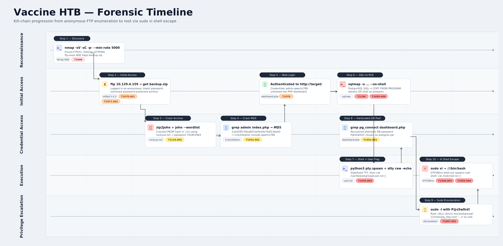

# Vaccine


# Context

Lab link: [https://app.hackthebox.com/machines/Vaccine](https://app.hackthebox.com/machines/Vaccine)

Suggested tools: `nmap`, `ftp`, `zip2john`, `john`, `unzip`, `grep`, `CrackStation`, `sqlmap`, `python3`, `stty`, `sudo`, `vi`, `cat`

# Scenario

Vaccine is a very easy Linux machine that emphasizes enumeration and password cracking. Anonymous FTP access exposes a password-protected backup archive which can be cracked to recover web application credentials. These credentials grant access to a PHP application vulnerable to SQL injection which leads to command execution and an initial shell as the postgres user. Finally, privilege escalation can be achieved by abusing misconfigured sudo permissions on vi.

# Tasks

Q1- Besides SSH and HTTP, what other service is hosted on this box?

Answer: FTP

Reason: The Nmap command `nmap -sV -sC -p- --min-rate 5000 10.129.4.159` performed a full Transmission Control Protocol (TCP) port scan with service version detection and default Nmap Scripting Engine (NSE) scripts against the target. The scan revealed three open ports: `21` running File Transfer Protocol (FTP), `22` running Secure Shell (SSH), and `80` running Hypertext Transfer Protocol (HTTP). The answer is FTP, the third service hosted on this box alongside SSH and HTTP. The `-sC` flag is particularly useful here because the default NSE scripts automatically check whether FTP permits anonymous login, which becomes the next avenue of investigation. This reconnaissance phase maps to MITRE ATT&CK technique `T1046` (Network Service Discovery).

Key findings from the scan: port `21` runs `vsftpd 3.0.3` with anonymous login enabled, and the `-sC` default Nmap Scripting Engine (NSE) scripts immediately identified a file named `backup.zip` in the File Transfer Protocol (FTP) root directory. Ports `22` (`OpenSSH 8.0p1`) and `80` (`Apache 2.4.41`) are also open. The next target is `backup.zip` because FTP allows anonymous retrieval without credentials.

```bash
$ nmap -sV -sC -p- --min-rate 5000 10.129.4.159
```

Q2- This service can be configured to allow login with any password for specific username. What is that username?

Answer: `anonymous`

Reason: File Transfer Protocol (FTP) servers running `Very Secure FTP Daemon (vsftpd)` and other FTP daemons can allow unauthenticated access using the username `anonymous`, and the password is typically blank or any string. `Network Mapper (Nmap)`'s `ftp-anon` script confirmed that anonymous login is enabled and enumerated the directory listing, which revealed `backup.zip` in the FTP root directory, and that archive is the next artifact to retrieve.

Q3- What is the name of the file downloaded over this service?

Answer: `backup.zip`

Reason: Log in to File Transfer Protocol (FTP) using the username `anonymous` and a blank password, then run `ls` to confirm a single file in the root directory, `backup.zip`. Download the file with `get backup.zip`, then exit with `bye`. The `backup.zip` archive is password-protected, so the next step is to crack the archive password.

Q4- What script comes with the John The Ripper toolset and generates a hash from a password protected zip archive in a format to allow for cracking attempts?

Answer: `zip2john`

Reason: `zip2john`, included with the John the Ripper toolset, converts `backup.zip` encryption metadata into a cracking-compatible hash and writes it to `htb_vaccine/backup.zip.hash` using `zip2john backup.zip > htb_vaccine/backup.zip.hash`.

Q5- What is the password for the `admin` user on the website?

Answer: `qwerty789`

Reason: After downloading `backup.zip` via anonymous File Transfer Protocol (FTP), `zip2john` extracted the PKZIP encryption metadata into `backup.hash`, then `john --wordlist=/usr/share/wordlists/rockyou.txt backup.hash` cracked the archive password `741852963` in under a second. Unzipping `backup.zip` revealed `index.php` and `style.css`. Searching `index.php` for `admin` exposed a hardcoded credential check, with username `admin` and a Message Digest 5 (MD5) hash of `2cb42f8734ea607eefed3b70af13bbd3`. Since MD5 is a weak, unsalted hash, an offline hash lookup recovered the plaintext password `qwerty789`, which provided valid credentials for the web application on port `80`.

Q6- What option can be passed to sqlmap to try to get command execution via the sql injection?

Answer: `--os-shell`

Reason: The option used to attempt command execution via Structured Query Language (SQL) injection in `sqlmap` is `--os-shell`. This flag instructs `sqlmap` to attempt to obtain an operating system (OS) shell by leveraging the injection point, typically by attempting to upload or execute a web shell. Another related option is `--os-cmd`, which executes specific OS commands through the injection point.

Q7- What program can the `postgres` user run as root using sudo?

Answer: `vi`

Reason: As noted in the machine description, the `postgres` user has a misconfigured `sudo` rule that allows running `vi` as `root`. This misconfiguration provides a clear privilege escalation path after obtaining the initial shell and maps to MITRE ATT&CK technique `T1548.003` (Sudo and Sudo Caching).

# User Flag

1. Ran `nmap -sV -sC -p- --min-rate 5000 10.129.4.159` against the target, which revealed File Transfer Protocol (FTP) on port `21`, Secure Shell (SSH) on port `22`, and Hypertext Transfer Protocol (HTTP) on port `80`. The `ftp-anon` Nmap Scripting Engine (NSE) script confirmed anonymous login was permitted and spotted `backup.zip` sitting in the FTP root directory. This maps to MITRE ATT&CK techniques `T1046` (Network Service Discovery) and `T1078.001` (Valid Accounts: Default Accounts).
2. Connected to the FTP service via `ftp 10.129.4.159` using the username `anonymous` with a blank password, then downloaded the archive with `get backup.zip`. Anonymous FTP access aligns with `T1071.002` (Application Layer Protocol: File Transfer Protocols) for data retrieval over a standard protocol.
3. Ran `zip2john backup.zip > backup.hash` to extract the PKZIP encryption hash from the archive header, then cracked it with `john --wordlist=/usr/share/wordlists/rockyou.txt backup.hash`, recovering the password `741852963`. This corresponds to `T1110.002` (Brute Force: Password Cracking) performed offline against the captured hash.
4. Unzipped the archive with `unzip -P 741852963 backup.zip`, which revealed `index.php` and `style.css`. Grepping the source for the string `admin` exposed a hardcoded Message Digest 5 (MD5) hash: `2cb42f8734ea607eefed3b70af13bbd3`. Hardcoded credentials in source code fall under `T1552.001` (Unsecured Credentials: Credentials In Files).
5. Cracked the MD5 hash via CrackStation, which returned the plaintext `qwerty789`. Authenticated to `http://10.129.4.159` using the credentials `admin:qwerty789`, completing the initial application login.
6. Ran `sqlmap -u "http://10.129.4.159/dashboard.php?search=test" --cookie="PHPSESSID=<session>" --os-shell`, which confirmed a PostgreSQL Structured Query Language injection (SQLi) vulnerability and obtained an operating system shell through the `COPY FROM PROGRAM` functionality. This abuse path maps to `T1190` (Exploit Public-Facing Application) and `T1059.004` (Command and Scripting Interpreter: Unix Shell).
7. Caught a reverse bash shell on the listener, then stabilized the session by running `python3 -c 'import pty;pty.spawn("/bin/bash")'` followed by `stty raw -echo` on the local terminal to enable full Pseudo-Terminal (PTY) features like job control, tab completion, and arrow-key history.
8. Read the user flag from `/var/lib/postgresql/user.txt`, completing the user-level objective. The flag location under the `postgresql` home directory confirms that command execution inherited the privileges of the PostgreSQL service account.
    
    ```bash
    $ nmap -sV -sC -p- --min-rate 5000 10.129.4.159
    $ ftp 10.129.4.159
    ftp> get backup.zip
    $ zip2john backup.zip > backup.hash
    $ john --wordlist=/usr/share/wordlists/rockyou.txt backup.hash
    $ unzip -P 741852963 backup.zip
    $ grep -i admin index.php
    $ sqlmap -u "http://10.129.4.159/dashboard.php?search=test" --cookie="PHPSESSID=<session>" --os-shell
    $ python3 -c 'import pty;pty.spawn("/bin/bash")'
    $ stty raw -echo
    $ cat /var/lib/postgresql/user.txt
    ```
    

# Root Flag

1. Found the PostgreSQL database password `P@s5w0rd!` hardcoded in `/var/www/html/dashboard.php` inside the `pg_connect()` connection string. Hardcoded service credentials inside application source code map to MITRE ATT&CK technique `T1552.001` (Unsecured Credentials: Credentials In Files).
2. Ran `sudo -l` using `P@s5w0rd!` as the `postgres` system password, which revealed the sudo rule `(ALL) /bin/vi /etc/postgresql/11/main/pg_hba.conf`. The credential reused across the database and the local account corresponds to `T1078` (Valid Accounts) combined with `T1087.001` (Account Discovery: Local Account) through the `sudo -l` enumeration.
3. Launched the Visual Editor (`vi`) with elevated privileges using `sudo /bin/vi /etc/postgresql/11/main/pg_hba.conf`. The sudo rule permits running `vi` as root against this specific PostgreSQL Host-Based Authentication (HBA) configuration file, which is the misconfiguration being abused.
4. Inside vi, used the built-in shell escape `:!/bin/bash` to break out of the editor into an interactive shell. This technique is documented in GTFOBins as a known privilege escalation vector for any binary that offers a shell-out feature when invoked through sudo.
5. The escape spawns a child shell that inherits vi's root privileges, dropping directly into a root shell. This behavior maps to `T1548.003` (Abuse Elevation Control Mechanism: Sudo and Sudo Caching) and `T1059.004` (Command and Scripting Interpreter: Unix Shell).
6. Read the root flag using `cat /root/root.txt`, completing the privilege escalation and the full compromise of the target host.

```bash
$ grep pg_connect /var/www/html/dashboard.php
$ sudo -l
$ sudo /bin/vi /etc/postgresql/11/main/pg_hba.conf
:!/bin/bash
# cat /root/root.txt
```

# Lab Insights

- Anonymous FTP is a critical misconfiguration. Exposing sensitive files, even password-protected archives, through anonymous File Transfer Protocol (FTP) is a common real-world mistake. Always audit FTP servers for anonymous access during enumeration, since the issue maps to MITRE ATT&CK technique `T1078.001` (Valid Accounts: Default Accounts).
- Nmap default scripts (`sC`) do heavy lifting. The `ftp-anon` Nmap Scripting Engine (NSE) script automatically identified anonymous access and listed directory contents, saving a manual enumeration step. Always run `sC` alongside `sV` so service version detection and credentialed checks happen in a single pass.
- Weak archive encryption is trivially crackable. PKZIP encryption is legacy and broken; the `zip2john` plus `rockyou.txt` workflow cracked it in under a second. Never rely on Zip password protection to secure sensitive files, and prefer Advanced Encryption Standard (AES) based formats such as `7z` or `age` for confidential archives.
- Message Digest 5 (MD5) is not a password hashing function. Hardcoding an unsalted MD5 hash as a credential check is insecure, since rainbow tables and online lookups like CrackStation break these instantly. Use modern adaptive functions such as `bcrypt`, `argon2`, or `scrypt` with a unique per-user salt.
- Credentials get reused across layers. The web application password led to the database connection string, which led to the system account. Credential reuse across application, database, and Operating System (OS) layers is a systemic risk and maps to `T1078` (Valid Accounts) when the same secret unlocks multiple tiers.
- Database connection strings expose passwords in plaintext. Hardcoding credentials in PHP Hypertext Preprocessor (PHP) source files is dangerous, so use environment variables or a dedicated secrets manager. This weakness corresponds to `T1552.001` (Unsecured Credentials: Credentials In Files).
- Structured Query Language injection (SQLi) in a privileged database context escalates to Remote Code Execution (RCE). PostgreSQL's `COPY FROM PROGRAM` permits OS command execution when the session runs as a Database Administrator (DBA). Applying least privilege on database accounts limits this blast radius, since a read-only role cannot reach `COPY FROM PROGRAM`.
- Sudo on text editors equals root. Granting sudo on any editor such as `vi`, `nano`, `less`, or `more` is effectively granting a root shell because of built-in shell escapes. Audit sudo rules carefully, as the GTFOBins project documents hundreds of such bypasses, all of which fall under `T1548.003` (Abuse Elevation Control Mechanism: Sudo and Sudo Caching).
- Shell stability matters. An unstable reverse shell without a Pseudo-Terminal (PTY) blocks interactive commands like `sudo`. Always stabilize the session with `python3 -c 'import pty;pty.spawn("/bin/bash")'` before attempting privilege escalation, since a missing PTY also breaks `su`, full-screen editors, and tab completion.

# Attack Timeline

